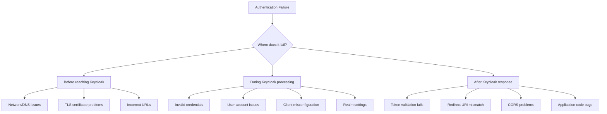
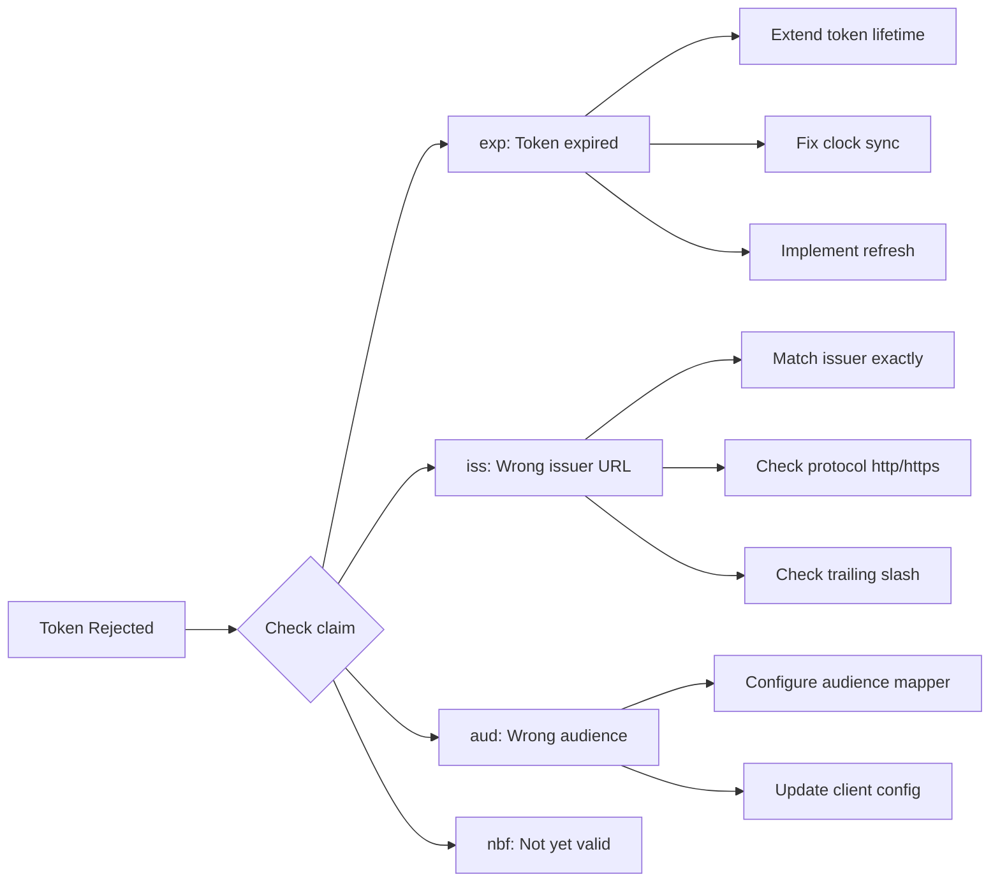

# How to Debug Keycloak Authentication Issues

Author: [nawazdhandala](https://www.github.com/nawazdhandala)

Tags: Keycloak, Authentication, Debugging, Security, Troubleshooting

Description: A practical troubleshooting guide for diagnosing and resolving common Keycloak authentication problems including token issues, OIDC errors, SAML failures, and configuration mistakes.

---

Authentication failures are frustrating for both users and developers. When Keycloak is in the mix, the number of moving parts - clients, realms, identity providers, tokens, and sessions - can make troubleshooting feel overwhelming. The good news is that most authentication issues fall into predictable categories with well-defined debugging approaches.

This guide provides a systematic approach to diagnosing Keycloak authentication problems, covering the most common failure modes and how to resolve them.

---

## The debugging mindset

Before diving into specific issues, establish a systematic approach:



Always ask: Is the problem happening before, during, or after Keycloak processes the request?

---

## Enable and analyze Keycloak logs

The first step in any debugging session is getting visibility into what Keycloak is doing.

### Enable debug logging

For development, start Keycloak with verbose logging:

```bash
# Start with debug logging enabled
./kc.sh start-dev --log-level=DEBUG
```

For production, enable logging for specific categories:

```bash
# Enable debug for auth-related packages only
./kc.sh start \
  --log-level=INFO \
  --log-level=org.keycloak.authentication:DEBUG \
  --log-level=org.keycloak.protocol:DEBUG \
  --log-level=org.keycloak.services:DEBUG
```

### Key log categories

Different packages reveal different information:

```properties
# Authentication flow processing
org.keycloak.authentication=DEBUG

# OIDC/OAuth protocol handling
org.keycloak.protocol.oidc=DEBUG

# SAML protocol handling
org.keycloak.protocol.saml=DEBUG

# Token creation and validation
org.keycloak.services.managers=DEBUG

# Identity provider brokering
org.keycloak.broker=DEBUG

# Event logging (login success/failure)
org.keycloak.events=DEBUG
```

### Reading log patterns

Look for these indicators in logs:

```
# Successful authentication
INFO  [org.keycloak.events] type=LOGIN, realmId=myrealm, clientId=my-app, userId=abc123

# Failed login - wrong password
WARN  [org.keycloak.events] type=LOGIN_ERROR, realmId=myrealm, clientId=my-app, error=invalid_user_credentials

# Client authentication failure
ERROR [org.keycloak.events] type=CLIENT_LOGIN_ERROR, realmId=myrealm, clientId=my-app, error=invalid_client_credentials

# Token validation failure
DEBUG [org.keycloak.services] validateToken failed: Token is not active
```

---

## Common issue 1: Redirect URI mismatch

This is the most frequent OIDC error. Keycloak strictly validates that the redirect URI in the authorization request matches one of the configured URIs.

### Symptoms

```
error=invalid_redirect_uri
error_description=Invalid redirect uri
```

### Debugging steps

1. Check the exact URI in the authorization request:

```bash
# Decode the authorization URL your app generates
# Look for the redirect_uri parameter
https://keycloak.example.com/realms/myrealm/protocol/openid-connect/auth?
  client_id=my-app&
  redirect_uri=https%3A%2F%2Fmyapp.com%2Fcallback&  # <- This must match exactly
  response_type=code&
  scope=openid
```

2. Compare with the configured URIs in Keycloak:

```bash
# Using the admin CLI
./kcadm.sh get clients -r myrealm -q clientId=my-app --fields redirectUris
```

3. Common mismatches to check:

```
# These are ALL different URIs:
https://myapp.com/callback
https://myapp.com/callback/
http://myapp.com/callback
https://www.myapp.com/callback
https://myapp.com:443/callback
```

### Resolution

In the Keycloak admin console, go to **Clients > your-client > Settings** and add all valid redirect URIs. For development, you can use wildcards:

```
# Development only - not for production
https://localhost:*/*
http://localhost:*/*
```

For production, always specify exact URIs without wildcards.

---

## Common issue 2: Invalid client credentials

Client authentication failures happen when the client ID or secret is wrong.

### Symptoms

```json
{
  "error": "unauthorized_client",
  "error_description": "Invalid client or Invalid client credentials"
}
```

### Debugging steps

1. Verify the client ID exists:

```bash
# Check if client exists
./kcadm.sh get clients -r myrealm -q clientId=my-app
```

2. Verify the client secret (for confidential clients):

```bash
# Get the current secret
./kcadm.sh get clients -r myrealm -q clientId=my-app --fields secret
```

3. Test authentication directly:

```bash
# Test client credentials grant
curl -X POST \
  "https://keycloak.example.com/realms/myrealm/protocol/openid-connect/token" \
  -H "Content-Type: application/x-www-form-urlencoded" \
  -d "grant_type=client_credentials" \
  -d "client_id=my-app" \
  -d "client_secret=your-secret-here"
```

### Resolution

If the secret changed or was regenerated, update it in your application. For confidential clients, you can regenerate the secret in **Clients > your-client > Credentials**.

---

## Common issue 3: Token validation failures

Tokens can fail validation for several reasons even after successful authentication.

### Symptoms

Your application receives a token but rejects it during validation.

### Debugging steps

1. Decode the token to inspect claims:

```bash
# Decode a JWT (base64 decode the middle section)
echo "eyJhbGciOiJSUzI1NiIs..." | cut -d'.' -f2 | base64 -d | jq .
```

2. Check common claim issues:

```javascript
// Token debugging script
const jwt = require('jsonwebtoken');

function debugToken(token) {
  const decoded = jwt.decode(token, { complete: true });

  console.log('Header:', decoded.header);
  console.log('Payload:', decoded.payload);

  // Check expiration
  const now = Math.floor(Date.now() / 1000);
  const exp = decoded.payload.exp;
  const iat = decoded.payload.iat;

  console.log('Current time:', now);
  console.log('Issued at:', iat, '- Age:', now - iat, 'seconds');
  console.log('Expires at:', exp, '- In:', exp - now, 'seconds');

  if (now > exp) {
    console.log('ERROR: Token has expired');
  }

  // Check issuer
  console.log('Issuer:', decoded.payload.iss);

  // Check audience
  console.log('Audience:', decoded.payload.aud);
  console.log('Authorized party:', decoded.payload.azp);
}
```

3. Verify the issuer URL matches exactly:

```bash
# Get the issuer from Keycloak's discovery endpoint
curl -s "https://keycloak.example.com/realms/myrealm/.well-known/openid-configuration" | jq .issuer
```

### Common token issues



### Resolution for issuer mismatch

The issuer must match exactly. Common issues:

```
# These are different issuers:
https://keycloak.example.com/realms/myrealm
https://keycloak.example.com/realms/myrealm/
http://keycloak.example.com/realms/myrealm
https://auth.example.com/realms/myrealm  # (if using a reverse proxy)
```

Configure your application to use the same issuer URL that Keycloak reports.

---

## Common issue 4: CORS errors

CORS issues appear when browser-based applications cannot communicate with Keycloak.

### Symptoms

Browser console shows:

```
Access to fetch at 'https://keycloak.example.com/...' from origin 'https://myapp.com'
has been blocked by CORS policy
```

### Debugging steps

1. Check browser developer tools Network tab for the failed request
2. Look for missing CORS headers in the response
3. Verify Keycloak's Web Origins configuration

### Resolution

In Keycloak admin console, go to **Clients > your-client > Settings** and configure Web Origins:

```
# Add your application's origin
https://myapp.com

# Or use '+' to automatically allow all redirect URIs as origins
+
```

---

## Common issue 5: Session and cookie problems

Session issues often manifest as users being unexpectedly logged out or unable to maintain authentication state.

### Symptoms

- User logs in successfully but is immediately logged out
- "Session expired" errors
- Cookie warnings in browser console

### Debugging steps

1. Check browser cookies for Keycloak session:

```javascript
// In browser console
document.cookie.split(';').filter(c => c.includes('KC_'))
```

2. Verify cookie settings match your deployment:

```bash
# Check Keycloak's cookie settings
./kcadm.sh get realms/myrealm --fields ssoSessionIdleTimeout,ssoSessionMaxLifespan
```

3. Look for SameSite cookie issues:

```
# Modern browsers require SameSite=None for cross-site cookies
# This requires HTTPS
Set-Cookie: KC_RESTART=...; SameSite=None; Secure
```

### Resolution

For cross-origin scenarios, ensure:

```bash
# Start Keycloak with proper cookie settings
./kc.sh start \
  --hostname=keycloak.example.com \
  --https-certificate-file=/path/to/cert.pem \
  --https-certificate-key-file=/path/to/key.pem \
  --spi-cookie-default-same-site-attribute=None
```

---

## Common issue 6: SAML authentication failures

SAML issues often involve certificate or configuration mismatches between Keycloak and the service provider.

### Symptoms

```
SAML Response signature validation failed
Invalid SAML response
Unexpected SAML response status
```

### Debugging steps

1. Enable SAML debug logging:

```bash
./kc.sh start-dev --log-level=org.keycloak.protocol.saml:DEBUG
```

2. Capture and decode the SAML response:

```bash
# Decode base64-encoded SAML response
echo "PHNhbWxwOlJlc3Bvbn..." | base64 -d | xmllint --format -
```

3. Validate certificates:

```bash
# Check Keycloak's signing certificate
./kcadm.sh get keys -r myrealm | jq '.keys[] | select(.use=="SIG")'
```

### Common SAML issues

- **Certificate mismatch**: SP has old certificate after Keycloak key rotation
- **Clock skew**: SAML assertions have strict time validity windows
- **Assertion Consumer Service URL mismatch**: Similar to redirect URI issues in OIDC
- **NameID format mismatch**: SP expects email but Keycloak sends username

---

## Using Keycloak's built-in tools

### Admin events

Enable admin events to track configuration changes:

1. Go to **Realm Settings > Events**
2. Enable **Admin Events**
3. Configure **Admin Events Settings** to save events

### User events

Track authentication events:

1. Go to **Realm Settings > Events**
2. Enable **User Events**
3. Select event types to record (LOGIN, LOGIN_ERROR, LOGOUT, etc.)

Query events via admin console or API:

```bash
# Get recent login errors
./kcadm.sh get events -r myrealm -q type=LOGIN_ERROR --first 0 --max 20
```

### Sessions management

View active sessions:

```bash
# List active sessions for a user
./kcadm.sh get users/{user-id}/sessions -r myrealm
```

---

## Debugging checklist

When facing authentication issues, work through this checklist:

```markdown
## Pre-flight checks
- [ ] Keycloak is running and accessible
- [ ] Correct realm is being used
- [ ] Client exists and is enabled
- [ ] User exists and is enabled

## OIDC checks
- [ ] Client ID matches exactly
- [ ] Client secret is correct (confidential clients)
- [ ] Redirect URI matches exactly (no trailing slash differences)
- [ ] Response type is allowed (code, token, etc.)
- [ ] Required scopes are available

## Token checks
- [ ] Token has not expired
- [ ] Issuer URL matches expected value exactly
- [ ] Audience includes your client
- [ ] Clock sync between Keycloak and application servers

## Network checks
- [ ] No firewall blocking requests
- [ ] TLS certificates are valid
- [ ] DNS resolves correctly
- [ ] CORS is configured for browser apps

## Session checks
- [ ] Cookies are being set correctly
- [ ] SameSite cookie policy is appropriate
- [ ] Session timeout is reasonable
```

---

Debugging Keycloak authentication requires methodical investigation across multiple layers. Start by enabling appropriate logging, identify whether the failure occurs before, during, or after Keycloak processing, and work through the common issues systematically. Most problems fall into a handful of categories: URL mismatches, credential errors, token validation failures, or session/cookie issues. With the right logs and a structured approach, even complex authentication failures become diagnosable and fixable.
