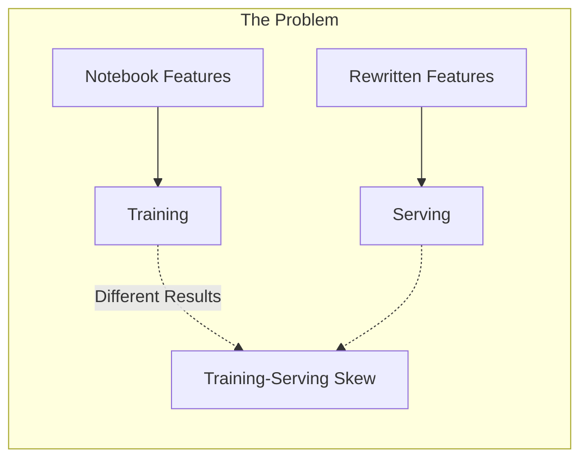
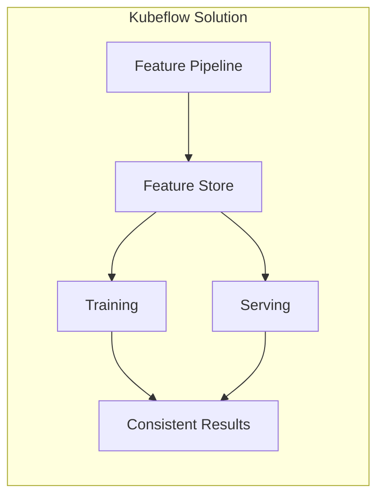
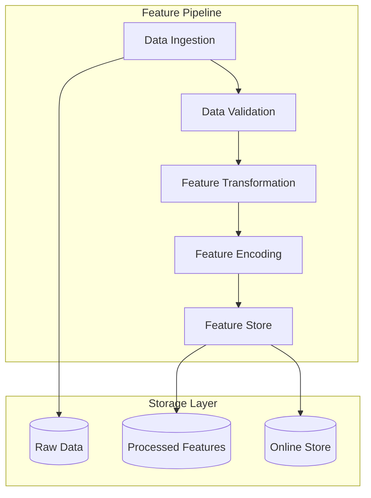

# How to Use Kubeflow for Feature Engineering

Author: [nawazdhandala](https://www.github.com/nawazdhandala)

Tags: Kubeflow, Feature Engineering, ML Ops, Data Processing, Machine Learning

Description: Learn how to build scalable feature engineering pipelines with Kubeflow, from data ingestion to feature stores and real-time feature serving.

---

Feature engineering is where most ML projects succeed or fail. Raw data rarely feeds directly into models - it needs transformation, aggregation, encoding, and validation. Kubeflow provides the infrastructure to build feature engineering pipelines that scale from experimentation to production without rewriting code.

## The Feature Engineering Challenge

Data scientists often build features in notebooks, then struggle to reproduce them in production. This leads to training-serving skew and bugs that only appear at inference time.





## Setting Up the Feature Engineering Environment

### Install Required Components

```bash
# Install Kubeflow Pipelines SDK
pip install kfp==2.4.0

# Install feature engineering libraries
pip install feast==0.34.0 great-expectations==0.18.0 pandas==2.1.0

# Verify connection to Kubeflow
kubectl get pods -n kubeflow | grep ml-pipeline
```

### Create a Dedicated Namespace

```yaml
apiVersion: v1
kind: Namespace
metadata:
  name: feature-engineering
  labels:
    app.kubernetes.io/part-of: kubeflow
---
apiVersion: v1
kind: ServiceAccount
metadata:
  name: feature-pipeline
  namespace: feature-engineering
---
apiVersion: rbac.authorization.k8s.io/v1
kind: RoleBinding
metadata:
  name: feature-pipeline-binding
  namespace: feature-engineering
roleRef:
  apiGroup: rbac.authorization.k8s.io
  kind: ClusterRole
  name: kubeflow-edit
subjects:
  - kind: ServiceAccount
    name: feature-pipeline
    namespace: feature-engineering
```

## Building Feature Engineering Components

### Component Architecture

Each feature engineering step runs as a containerized component:



### Data Ingestion Component

```python
"""data_ingestion.py - Component for loading raw data."""

from kfp import dsl
from kfp.dsl import Dataset, Output

@dsl.component(
    base_image="python:3.10",
    packages_to_install=["pandas", "pyarrow", "boto3"]
)
def ingest_data(
    source_path: str,
    output_data: Output[Dataset],
    start_date: str = None,
    end_date: str = None
):
    """
    Ingest raw data from source storage.

    Args:
        source_path: S3 or GCS path to raw data
        output_data: Output dataset artifact
        start_date: Filter data from this date
        end_date: Filter data until this date
    """
    import pandas as pd
    import os

    # Read data from cloud storage
    df = pd.read_parquet(source_path)

    # Apply date filters if provided
    if start_date and end_date:
        df = df[
            (df['timestamp'] >= start_date) &
            (df['timestamp'] <= end_date)
        ]

    # Log basic statistics
    print(f"Loaded {len(df)} records")
    print(f"Columns: {list(df.columns)}")
    print(f"Date range: {df['timestamp'].min()} to {df['timestamp'].max()}")

    # Save to output path
    df.to_parquet(output_data.path)
```

### Data Validation Component

Validate data quality before feature engineering:

```python
"""data_validation.py - Component for validating data quality."""

from kfp import dsl
from kfp.dsl import Dataset, Input, Output, Artifact

@dsl.component(
    base_image="python:3.10",
    packages_to_install=["pandas", "great-expectations", "pyarrow"]
)
def validate_data(
    input_data: Input[Dataset],
    validated_data: Output[Dataset],
    validation_report: Output[Artifact],
    fail_on_error: bool = True
):
    """
    Validate data quality using Great Expectations.

    Args:
        input_data: Input dataset to validate
        validated_data: Output validated dataset
        validation_report: Validation results artifact
        fail_on_error: Whether to fail pipeline on validation errors
    """
    import pandas as pd
    import great_expectations as gx
    import json

    # Load data
    df = pd.read_parquet(input_data.path)

    # Create Great Expectations context
    context = gx.get_context()

    # Define expectations
    validator = context.sources.pandas_default.read_dataframe(df)

    # Column existence checks
    validator.expect_column_to_exist("user_id")
    validator.expect_column_to_exist("timestamp")
    validator.expect_column_to_exist("amount")

    # Data type checks
    validator.expect_column_values_to_be_of_type("user_id", "int64")
    validator.expect_column_values_to_be_of_type("amount", "float64")

    # Value range checks
    validator.expect_column_values_to_be_between("amount", min_value=0)
    validator.expect_column_values_to_not_be_null("user_id")

    # Uniqueness checks
    validator.expect_compound_columns_to_be_unique(["user_id", "timestamp"])

    # Run validation
    results = validator.validate()

    # Save validation report
    report = {
        "success": results.success,
        "statistics": results.statistics,
        "results": [
            {
                "expectation": r.expectation_config.expectation_type,
                "success": r.success,
                "result": str(r.result)
            }
            for r in results.results
        ]
    }

    with open(validation_report.path, 'w') as f:
        json.dump(report, f, indent=2)

    # Handle failures
    if not results.success and fail_on_error:
        failed = [r for r in results.results if not r.success]
        raise ValueError(f"Data validation failed: {len(failed)} expectations failed")

    # Pass through data
    df.to_parquet(validated_data.path)
    print(f"Validation passed: {results.success}")
```

### Feature Transformation Component

Transform raw data into features:

```python
"""feature_transformation.py - Component for creating features."""

from kfp import dsl
from kfp.dsl import Dataset, Input, Output

@dsl.component(
    base_image="python:3.10",
    packages_to_install=["pandas", "numpy", "pyarrow"]
)
def transform_features(
    input_data: Input[Dataset],
    output_features: Output[Dataset],
    feature_config: dict
):
    """
    Transform raw data into ML features.

    Args:
        input_data: Validated input dataset
        output_features: Transformed features dataset
        feature_config: Configuration for feature transformations
    """
    import pandas as pd
    import numpy as np

    df = pd.read_parquet(input_data.path)

    # Time-based features
    df['timestamp'] = pd.to_datetime(df['timestamp'])
    df['hour_of_day'] = df['timestamp'].dt.hour
    df['day_of_week'] = df['timestamp'].dt.dayofweek
    df['is_weekend'] = df['day_of_week'].isin([5, 6]).astype(int)
    df['month'] = df['timestamp'].dt.month

    # User aggregation features
    user_stats = df.groupby('user_id').agg({
        'amount': ['mean', 'std', 'min', 'max', 'count'],
        'timestamp': ['min', 'max']
    }).reset_index()

    # Flatten column names
    user_stats.columns = [
        'user_id', 'user_avg_amount', 'user_std_amount',
        'user_min_amount', 'user_max_amount', 'user_transaction_count',
        'user_first_transaction', 'user_last_transaction'
    ]

    # Calculate user tenure
    user_stats['user_tenure_days'] = (
        user_stats['user_last_transaction'] -
        user_stats['user_first_transaction']
    ).dt.days

    # Merge back to main dataframe
    df = df.merge(user_stats[['user_id', 'user_avg_amount', 'user_std_amount',
                               'user_transaction_count', 'user_tenure_days']],
                  on='user_id')

    # Amount deviation from user average
    df['amount_deviation'] = (df['amount'] - df['user_avg_amount']) / (df['user_std_amount'] + 1e-6)

    # Rolling window features (last 7 transactions)
    df = df.sort_values(['user_id', 'timestamp'])
    df['rolling_avg_amount'] = df.groupby('user_id')['amount'].transform(
        lambda x: x.rolling(window=7, min_periods=1).mean()
    )
    df['rolling_std_amount'] = df.groupby('user_id')['amount'].transform(
        lambda x: x.rolling(window=7, min_periods=1).std().fillna(0)
    )

    # Log transform for skewed features
    df['log_amount'] = np.log1p(df['amount'])

    # Drop intermediate columns
    columns_to_keep = [
        'user_id', 'timestamp', 'amount', 'hour_of_day', 'day_of_week',
        'is_weekend', 'month', 'user_avg_amount', 'user_transaction_count',
        'user_tenure_days', 'amount_deviation', 'rolling_avg_amount',
        'rolling_std_amount', 'log_amount'
    ]

    df = df[columns_to_keep]

    print(f"Created {len(columns_to_keep)} features for {len(df)} records")
    df.to_parquet(output_features.path)
```

### Feature Encoding Component

Encode categorical features and normalize numerics:

```python
"""feature_encoding.py - Component for encoding features."""

from kfp import dsl
from kfp.dsl import Dataset, Input, Output, Model

@dsl.component(
    base_image="python:3.10",
    packages_to_install=["pandas", "scikit-learn", "pyarrow", "joblib"]
)
def encode_features(
    input_features: Input[Dataset],
    encoded_features: Output[Dataset],
    encoder_artifact: Output[Model],
    categorical_columns: list = None,
    numeric_columns: list = None
):
    """
    Encode categorical features and normalize numeric features.

    Args:
        input_features: Transformed features dataset
        encoded_features: Encoded features dataset
        encoder_artifact: Fitted encoder for serving
        categorical_columns: List of categorical column names
        numeric_columns: List of numeric column names to normalize
    """
    import pandas as pd
    import joblib
    from sklearn.preprocessing import StandardScaler, LabelEncoder
    from sklearn.compose import ColumnTransformer
    from sklearn.pipeline import Pipeline

    df = pd.read_parquet(input_features.path)

    # Default columns if not provided
    if categorical_columns is None:
        categorical_columns = ['day_of_week', 'month']

    if numeric_columns is None:
        numeric_columns = [
            'amount', 'hour_of_day', 'user_avg_amount',
            'user_transaction_count', 'user_tenure_days',
            'amount_deviation', 'rolling_avg_amount',
            'rolling_std_amount', 'log_amount'
        ]

    # Create encoders
    encoders = {}

    # One-hot encode categorical columns
    for col in categorical_columns:
        if col in df.columns:
            dummies = pd.get_dummies(df[col], prefix=col)
            df = pd.concat([df.drop(col, axis=1), dummies], axis=1)
            encoders[col] = list(dummies.columns)

    # Normalize numeric columns
    scaler = StandardScaler()
    df[numeric_columns] = scaler.fit_transform(df[numeric_columns])
    encoders['scaler'] = scaler
    encoders['numeric_columns'] = numeric_columns

    # Save encoder for serving
    joblib.dump(encoders, encoder_artifact.path)

    # Save encoded features
    df.to_parquet(encoded_features.path)

    print(f"Encoded features shape: {df.shape}")
    print(f"Final columns: {list(df.columns)}")
```

## Building the Complete Pipeline

Assemble components into a pipeline:

```python
"""feature_pipeline.py - Complete feature engineering pipeline."""

from kfp import dsl
from kfp import compiler
from kfp.client import Client

# Import components
from data_ingestion import ingest_data
from data_validation import validate_data
from feature_transformation import transform_features
from feature_encoding import encode_features

@dsl.pipeline(
    name="feature-engineering-pipeline",
    description="End-to-end feature engineering pipeline"
)
def feature_engineering_pipeline(
    source_path: str,
    start_date: str = "2024-01-01",
    end_date: str = "2024-12-31",
    fail_on_validation_error: bool = True
):
    """
    Feature engineering pipeline for ML training.

    Args:
        source_path: Path to raw data in cloud storage
        start_date: Start date for data filtering
        end_date: End date for data filtering
        fail_on_validation_error: Whether to fail on data quality issues
    """

    # Step 1: Ingest raw data
    ingest_task = ingest_data(
        source_path=source_path,
        start_date=start_date,
        end_date=end_date
    )
    ingest_task.set_cpu_limit("2")
    ingest_task.set_memory_limit("4Gi")

    # Step 2: Validate data quality
    validate_task = validate_data(
        input_data=ingest_task.outputs["output_data"],
        fail_on_error=fail_on_validation_error
    )
    validate_task.set_cpu_limit("2")
    validate_task.set_memory_limit("4Gi")

    # Step 3: Transform features
    transform_task = transform_features(
        input_data=validate_task.outputs["validated_data"],
        feature_config={}
    )
    transform_task.set_cpu_limit("4")
    transform_task.set_memory_limit("8Gi")

    # Step 4: Encode features
    encode_task = encode_features(
        input_features=transform_task.outputs["output_features"]
    )
    encode_task.set_cpu_limit("2")
    encode_task.set_memory_limit("4Gi")

    return encode_task.outputs

# Compile pipeline
if __name__ == "__main__":
    compiler.Compiler().compile(
        pipeline_func=feature_engineering_pipeline,
        package_path="feature_pipeline.yaml"
    )

    # Submit to Kubeflow
    client = Client()
    run = client.create_run_from_pipeline_func(
        feature_engineering_pipeline,
        arguments={
            "source_path": "s3://my-bucket/raw-data/",
            "start_date": "2024-01-01",
            "end_date": "2024-06-30"
        },
        experiment_name="feature-engineering"
    )
    print(f"Run ID: {run.run_id}")
```

## Integrating with Feast Feature Store

For production feature serving, integrate with Feast:

```python
"""feast_integration.py - Push features to Feast feature store."""

from kfp import dsl
from kfp.dsl import Dataset, Input

@dsl.component(
    base_image="python:3.10",
    packages_to_install=["pandas", "feast", "pyarrow"]
)
def push_to_feast(
    input_features: Input[Dataset],
    feast_repo_path: str,
    feature_view_name: str
):
    """
    Push features to Feast feature store.

    Args:
        input_features: Encoded features to push
        feast_repo_path: Path to Feast repository
        feature_view_name: Name of the feature view
    """
    import pandas as pd
    from feast import FeatureStore
    from datetime import datetime

    # Load features
    df = pd.read_parquet(input_features.path)

    # Initialize Feast store
    store = FeatureStore(repo_path=feast_repo_path)

    # Add event timestamp if not present
    if 'event_timestamp' not in df.columns:
        df['event_timestamp'] = datetime.now()

    # Push to offline store
    store.push(
        push_source_name=f"{feature_view_name}_push",
        df=df,
        to="offline"
    )

    print(f"Pushed {len(df)} records to feature store")
```

### Feast Feature Definition

```python
"""feature_repo/features.py - Feast feature definitions."""

from datetime import timedelta
from feast import Entity, Feature, FeatureView, FileSource, ValueType
from feast.types import Float32, Int64

# Define entity
user = Entity(
    name="user_id",
    value_type=ValueType.INT64,
    description="User identifier"
)

# Define data source
user_features_source = FileSource(
    path="s3://my-bucket/features/user_features.parquet",
    timestamp_field="event_timestamp"
)

# Define feature view
user_features = FeatureView(
    name="user_features",
    entities=[user],
    ttl=timedelta(days=7),
    schema=[
        Feature(name="user_avg_amount", dtype=Float32),
        Feature(name="user_transaction_count", dtype=Int64),
        Feature(name="user_tenure_days", dtype=Int64),
        Feature(name="amount_deviation", dtype=Float32),
        Feature(name="rolling_avg_amount", dtype=Float32),
    ],
    source=user_features_source,
    online=True,
    tags={"team": "ml-platform"}
)
```

## Scheduled Feature Updates

Run feature pipelines on a schedule:

```yaml
apiVersion: kubeflow.org/v1beta1
kind: RecurringRun
metadata:
  name: daily-feature-pipeline
  namespace: kubeflow
spec:
  maxConcurrency: 1
  trigger:
    cronSchedule:
      cron: "0 2 * * *"  # Run at 2 AM daily
      startTime: "2024-01-01T00:00:00Z"
      endTime: "2025-12-31T23:59:59Z"
  pipelineRef:
    name: feature-engineering-pipeline
  pipelineSpec:
    parameters:
      - name: source_path
        value: "s3://my-bucket/raw-data/"
      - name: start_date
        value: "{{workflow.scheduledTime | date('2006-01-02', -1)}}"
      - name: end_date
        value: "{{workflow.scheduledTime | date('2006-01-02')}}"
```

## Monitoring Feature Quality

Track feature statistics over time:

```python
"""feature_monitoring.py - Monitor feature distributions."""

from kfp import dsl
from kfp.dsl import Dataset, Input, Metrics, Output

@dsl.component(
    base_image="python:3.10",
    packages_to_install=["pandas", "scipy", "pyarrow"]
)
def monitor_features(
    current_features: Input[Dataset],
    baseline_stats_path: str,
    metrics: Output[Metrics],
    drift_threshold: float = 0.1
):
    """
    Monitor feature distributions for drift.

    Args:
        current_features: Current batch of features
        baseline_stats_path: Path to baseline statistics
        metrics: Output metrics artifact
        drift_threshold: Threshold for drift alerts
    """
    import pandas as pd
    import json
    from scipy import stats

    # Load current features
    df = pd.read_parquet(current_features.path)

    # Load baseline statistics
    with open(baseline_stats_path, 'r') as f:
        baseline = json.load(f)

    drift_results = {}

    for column in df.select_dtypes(include=['float64', 'int64']).columns:
        if column in baseline:
            # Calculate KS statistic
            ks_stat, p_value = stats.ks_2samp(
                df[column].dropna(),
                baseline[column]['sample']
            )

            drift_results[column] = {
                'ks_statistic': ks_stat,
                'p_value': p_value,
                'drift_detected': ks_stat > drift_threshold
            }

            # Log to Kubeflow metrics
            metrics.log_metric(f"{column}_ks_stat", ks_stat)
            metrics.log_metric(f"{column}_drift", 1 if ks_stat > drift_threshold else 0)

    # Summary
    drifted_features = [k for k, v in drift_results.items() if v['drift_detected']]
    print(f"Features with drift: {drifted_features}")
    metrics.log_metric("total_drifted_features", len(drifted_features))
```

---

Feature engineering pipelines in Kubeflow bring reproducibility and scale to what is often the messiest part of ML. By defining features as code, validating data quality, and integrating with feature stores, you eliminate training-serving skew and accelerate model development. Start with simple transformations and add complexity as your models demand more sophisticated features.
