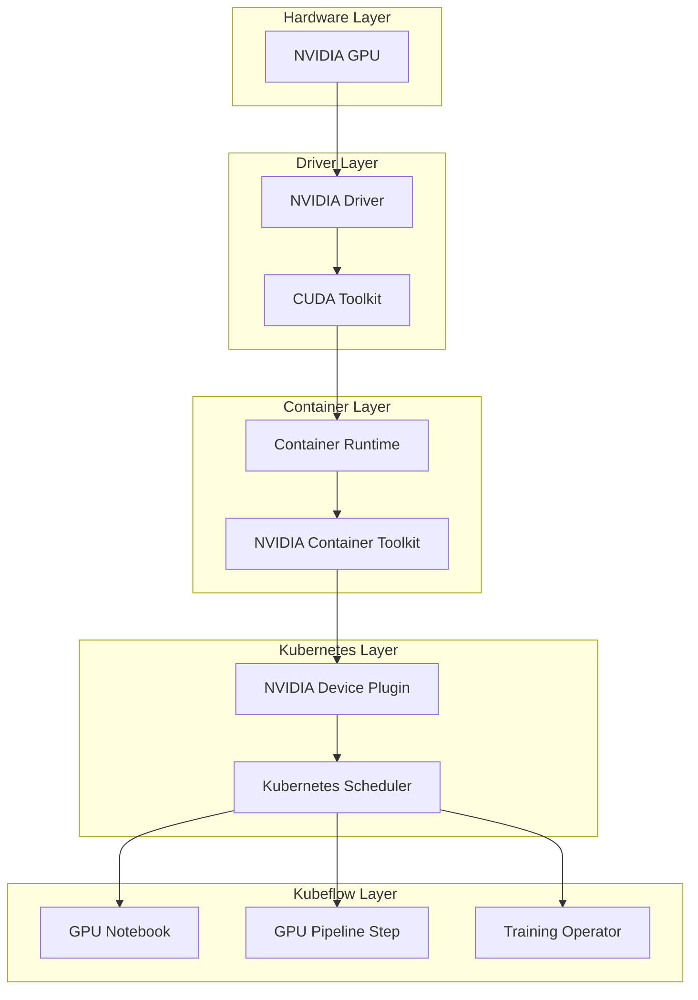

# How to Use Kubeflow with GPU Workers

Author: [nawazdhandala](https://www.github.com/nawazdhandala)

Tags: Kubeflow, GPU, Machine Learning, Deep Learning, Kubernetes, NVIDIA

Description: Learn how to configure Kubeflow to leverage GPU workers for accelerated model training, from node setup to multi-GPU distributed training strategies.

---

Training deep learning models on CPUs is painfully slow. A model that takes days on CPU can train in hours on GPU. Kubeflow makes GPU resources accessible through Kubernetes, but configuring everything correctly requires understanding the GPU scheduling stack from driver installation to pod resource requests.

## GPU Infrastructure Overview

Getting GPUs working in Kubeflow involves multiple layers that must be configured correctly.



## Setting Up GPU Nodes

### Verify GPU Hardware

Before configuring software, confirm GPU hardware is present:

```bash
# Check for NVIDIA GPUs on the node
lspci | grep -i nvidia

# Sample output:
# 00:04.0 3D controller: NVIDIA Corporation A100 PCIe 40GB (rev a1)
# 00:05.0 3D controller: NVIDIA Corporation A100 PCIe 40GB (rev a1)
```

### Install NVIDIA Drivers

On Ubuntu nodes:

```bash
# Add NVIDIA package repository
distribution=$(. /etc/os-release;echo $ID$VERSION_ID)
curl -s -L https://nvidia.github.io/libnvidia-container/gpgkey | sudo apt-key add -
curl -s -L https://nvidia.github.io/libnvidia-container/$distribution/libnvidia-container.list | \
  sudo tee /etc/apt/sources.list.d/nvidia-container-toolkit.list

# Install drivers
sudo apt-get update
sudo apt-get install -y nvidia-driver-535

# Reboot required
sudo reboot

# Verify installation
nvidia-smi
```

### Install NVIDIA Container Toolkit

```bash
# Install container toolkit
sudo apt-get install -y nvidia-container-toolkit

# Configure Docker
sudo nvidia-ctk runtime configure --runtime=docker
sudo systemctl restart docker

# For containerd (most Kubernetes setups)
sudo nvidia-ctk runtime configure --runtime=containerd
sudo systemctl restart containerd

# Test GPU access in containers
docker run --rm --gpus all nvidia/cuda:12.2.0-base-ubuntu22.04 nvidia-smi
```

### Deploy NVIDIA Device Plugin

The device plugin exposes GPUs to Kubernetes:

```bash
# Deploy the device plugin DaemonSet
kubectl create -f https://raw.githubusercontent.com/NVIDIA/k8s-device-plugin/v0.14.3/nvidia-device-plugin.yml

# Verify device plugin is running
kubectl get pods -n kube-system -l name=nvidia-device-plugin-ds

# Check GPU resources are advertised
kubectl describe nodes | grep -A5 "Allocated resources"
# Look for: nvidia.com/gpu
```

### Label GPU Nodes

Label nodes for easier scheduling:

```bash
# Label GPU nodes
kubectl label nodes gpu-node-1 accelerator=nvidia-tesla-a100
kubectl label nodes gpu-node-1 gpu-count=4

# Verify labels
kubectl get nodes -l accelerator=nvidia-tesla-a100
```

## Configuring GPU Notebooks

### Create GPU-Enabled Notebook

```yaml
apiVersion: kubeflow.org/v1
kind: Notebook
metadata:
  name: gpu-notebook
  namespace: kubeflow-user
spec:
  template:
    spec:
      containers:
        - name: gpu-notebook
          image: kubeflownotebookswg/jupyter-pytorch-cuda-full:v1.8.0
          resources:
            requests:
              cpu: "4"
              memory: "16Gi"
              nvidia.com/gpu: "1"
            limits:
              cpu: "8"
              memory: "32Gi"
              nvidia.com/gpu: "1"
          volumeMounts:
            - mountPath: /home/jovyan
              name: workspace
            - mountPath: /dev/shm
              name: dshm
      volumes:
        - name: workspace
          persistentVolumeClaim:
            claimName: gpu-notebook-pvc
        # Shared memory for PyTorch DataLoader
        - name: dshm
          emptyDir:
            medium: Memory
            sizeLimit: "16Gi"
      # Schedule on GPU nodes
      nodeSelector:
        accelerator: nvidia-tesla-a100
      tolerations:
        - key: "nvidia.com/gpu"
          operator: "Exists"
          effect: "NoSchedule"
```

### Verify GPU Access in Notebook

Run this in a notebook cell to verify GPU access:

```python
# Check PyTorch GPU access
import torch

print(f"PyTorch version: {torch.__version__}")
print(f"CUDA available: {torch.cuda.is_available()}")
print(f"CUDA version: {torch.version.cuda}")
print(f"GPU count: {torch.cuda.device_count()}")

for i in range(torch.cuda.device_count()):
    print(f"GPU {i}: {torch.cuda.get_device_name(i)}")
    print(f"  Memory: {torch.cuda.get_device_properties(i).total_memory / 1e9:.1f} GB")

# Quick GPU test
if torch.cuda.is_available():
    x = torch.randn(1000, 1000).cuda()
    y = torch.matmul(x, x)
    print(f"GPU computation successful: {y.shape}")
```

## GPU Pipeline Components

### Single GPU Training Component

```python
"""gpu_training.py - GPU training pipeline component."""

from kfp import dsl
from kfp.dsl import Dataset, Input, Output, Model, Metrics

@dsl.component(
    base_image="pytorch/pytorch:2.1.0-cuda12.1-cudnn8-runtime",
    packages_to_install=["pandas", "scikit-learn", "mlflow"]
)
def train_gpu_model(
    training_data: Input[Dataset],
    model_output: Output[Model],
    metrics: Output[Metrics],
    epochs: int = 10,
    batch_size: int = 64,
    learning_rate: float = 0.001
):
    """
    Train a model on GPU.

    Args:
        training_data: Input training dataset
        model_output: Output model artifact
        metrics: Output metrics
        epochs: Number of training epochs
        batch_size: Training batch size
        learning_rate: Optimizer learning rate
    """
    import torch
    import torch.nn as nn
    import torch.optim as optim
    from torch.utils.data import DataLoader, TensorDataset
    import pandas as pd
    import numpy as np

    # Check GPU availability
    device = torch.device("cuda" if torch.cuda.is_available() else "cpu")
    print(f"Training on: {device}")

    if torch.cuda.is_available():
        print(f"GPU: {torch.cuda.get_device_name(0)}")
        print(f"Memory: {torch.cuda.get_device_properties(0).total_memory / 1e9:.1f} GB")

    # Load data
    df = pd.read_parquet(training_data.path)
    X = df.drop('target', axis=1).values.astype(np.float32)
    y = df['target'].values.astype(np.float32)

    # Create data loaders
    dataset = TensorDataset(
        torch.from_numpy(X),
        torch.from_numpy(y).unsqueeze(1)
    )
    train_loader = DataLoader(
        dataset,
        batch_size=batch_size,
        shuffle=True,
        num_workers=4,
        pin_memory=True  # Faster GPU transfer
    )

    # Define model
    input_dim = X.shape[1]
    model = nn.Sequential(
        nn.Linear(input_dim, 256),
        nn.ReLU(),
        nn.Dropout(0.3),
        nn.Linear(256, 128),
        nn.ReLU(),
        nn.Dropout(0.3),
        nn.Linear(128, 64),
        nn.ReLU(),
        nn.Linear(64, 1),
        nn.Sigmoid()
    ).to(device)

    # Loss and optimizer
    criterion = nn.BCELoss()
    optimizer = optim.Adam(model.parameters(), lr=learning_rate)

    # Training loop
    model.train()
    for epoch in range(epochs):
        total_loss = 0
        for batch_X, batch_y in train_loader:
            # Move to GPU
            batch_X = batch_X.to(device)
            batch_y = batch_y.to(device)

            # Forward pass
            optimizer.zero_grad()
            outputs = model(batch_X)
            loss = criterion(outputs, batch_y)

            # Backward pass
            loss.backward()
            optimizer.step()

            total_loss += loss.item()

        avg_loss = total_loss / len(train_loader)
        print(f"Epoch {epoch+1}/{epochs}, Loss: {avg_loss:.4f}")

        # Log metrics
        metrics.log_metric(f"loss_epoch_{epoch+1}", avg_loss)

    # Save model
    torch.save(model.state_dict(), model_output.path)
    metrics.log_metric("final_loss", avg_loss)
    print(f"Model saved to {model_output.path}")
```

### Configure GPU Resources in Pipeline

```python
from kfp import dsl
from kfp import compiler

@dsl.pipeline(name="gpu-training-pipeline")
def gpu_training_pipeline(
    training_data_path: str,
    epochs: int = 10,
    batch_size: int = 64
):
    """Pipeline with GPU training."""

    # Data loading (CPU)
    load_task = load_data(source_path=training_data_path)
    load_task.set_cpu_limit("2")
    load_task.set_memory_limit("8Gi")

    # GPU training
    train_task = train_gpu_model(
        training_data=load_task.outputs["output_data"],
        epochs=epochs,
        batch_size=batch_size
    )

    # Request GPU resources
    train_task.set_accelerator_type("nvidia.com/gpu")
    train_task.set_accelerator_limit(1)
    train_task.set_cpu_limit("4")
    train_task.set_memory_limit("32Gi")

    # Schedule on GPU nodes
    train_task.add_node_selector_constraint(
        "accelerator", "nvidia-tesla-a100"
    )

    # Tolerate GPU node taints
    train_task.set_gpu_limit(1)
```

## Multi-GPU Training

### Data Parallel Training with PyTorch

```python
"""multi_gpu_training.py - Multi-GPU training component."""

from kfp import dsl
from kfp.dsl import Dataset, Input, Output, Model

@dsl.component(
    base_image="pytorch/pytorch:2.1.0-cuda12.1-cudnn8-runtime",
    packages_to_install=["pandas"]
)
def train_multi_gpu(
    training_data: Input[Dataset],
    model_output: Output[Model],
    num_gpus: int = 4,
    epochs: int = 10,
    batch_size: int = 256
):
    """
    Train with DataParallel on multiple GPUs.

    Args:
        training_data: Input dataset
        model_output: Output model
        num_gpus: Number of GPUs to use
        epochs: Training epochs
        batch_size: Per-GPU batch size (total = batch_size * num_gpus)
    """
    import torch
    import torch.nn as nn
    from torch.utils.data import DataLoader, TensorDataset
    import pandas as pd
    import numpy as np

    # Check available GPUs
    available_gpus = torch.cuda.device_count()
    use_gpus = min(num_gpus, available_gpus)
    print(f"Using {use_gpus} GPUs out of {available_gpus} available")

    device = torch.device("cuda:0")

    # Load data
    df = pd.read_parquet(training_data.path)
    X = torch.from_numpy(df.drop('target', axis=1).values.astype(np.float32))
    y = torch.from_numpy(df['target'].values.astype(np.float32)).unsqueeze(1)

    dataset = TensorDataset(X, y)
    # Increase batch size proportionally to GPU count
    effective_batch_size = batch_size * use_gpus
    train_loader = DataLoader(
        dataset,
        batch_size=effective_batch_size,
        shuffle=True,
        num_workers=4 * use_gpus,
        pin_memory=True
    )

    # Create model
    model = nn.Sequential(
        nn.Linear(X.shape[1], 512),
        nn.ReLU(),
        nn.Linear(512, 256),
        nn.ReLU(),
        nn.Linear(256, 1),
        nn.Sigmoid()
    )

    # Wrap with DataParallel
    if use_gpus > 1:
        model = nn.DataParallel(model, device_ids=list(range(use_gpus)))
    model = model.to(device)

    criterion = nn.BCELoss()
    optimizer = torch.optim.Adam(model.parameters())

    # Training
    for epoch in range(epochs):
        total_loss = 0
        for batch_X, batch_y in train_loader:
            batch_X = batch_X.to(device)
            batch_y = batch_y.to(device)

            optimizer.zero_grad()
            outputs = model(batch_X)
            loss = criterion(outputs, batch_y)
            loss.backward()
            optimizer.step()

            total_loss += loss.item()

        print(f"Epoch {epoch+1}: Loss = {total_loss/len(train_loader):.4f}")

    # Save model (unwrap DataParallel)
    model_to_save = model.module if hasattr(model, 'module') else model
    torch.save(model_to_save.state_dict(), model_output.path)
```

### Distributed Training with PyTorchJob

For larger scale training, use the Kubeflow Training Operator:

```yaml
apiVersion: kubeflow.org/v1
kind: PyTorchJob
metadata:
  name: distributed-training
  namespace: kubeflow-user
spec:
  pytorchReplicaSpecs:
    Master:
      replicas: 1
      restartPolicy: OnFailure
      template:
        spec:
          containers:
            - name: pytorch
              image: your-registry/distributed-trainer:v1.0
              imagePullPolicy: Always
              command:
                - python
                - -m
                - torch.distributed.launch
                - --nproc_per_node=4
                - --nnodes=2
                - --node_rank=0
                - --master_addr=$(MASTER_ADDR)
                - --master_port=$(MASTER_PORT)
                - train.py
              resources:
                requests:
                  nvidia.com/gpu: 4
                  cpu: "16"
                  memory: "64Gi"
                limits:
                  nvidia.com/gpu: 4
              env:
                - name: NCCL_DEBUG
                  value: "INFO"
          nodeSelector:
            accelerator: nvidia-tesla-a100
    Worker:
      replicas: 1
      restartPolicy: OnFailure
      template:
        spec:
          containers:
            - name: pytorch
              image: your-registry/distributed-trainer:v1.0
              command:
                - python
                - -m
                - torch.distributed.launch
                - --nproc_per_node=4
                - --nnodes=2
                - --node_rank=1
                - --master_addr=$(MASTER_ADDR)
                - --master_port=$(MASTER_PORT)
                - train.py
              resources:
                requests:
                  nvidia.com/gpu: 4
                  cpu: "16"
                  memory: "64Gi"
                limits:
                  nvidia.com/gpu: 4
          nodeSelector:
            accelerator: nvidia-tesla-a100
```

### Distributed Training Script

```python
"""train.py - Distributed training script for PyTorchJob."""

import os
import torch
import torch.distributed as dist
import torch.nn as nn
from torch.nn.parallel import DistributedDataParallel as DDP
from torch.utils.data import DataLoader, DistributedSampler

def setup_distributed():
    """Initialize distributed training."""
    # Get distributed info from environment
    rank = int(os.environ.get("RANK", 0))
    world_size = int(os.environ.get("WORLD_SIZE", 1))
    local_rank = int(os.environ.get("LOCAL_RANK", 0))

    # Initialize process group
    dist.init_process_group(
        backend="nccl",
        init_method="env://"
    )

    # Set device for this process
    torch.cuda.set_device(local_rank)

    return rank, world_size, local_rank

def cleanup():
    """Clean up distributed training."""
    dist.destroy_process_group()

def train():
    rank, world_size, local_rank = setup_distributed()
    device = torch.device(f"cuda:{local_rank}")

    print(f"Rank {rank}/{world_size}, Local rank: {local_rank}, Device: {device}")

    # Create model and move to GPU
    model = create_model().to(device)

    # Wrap with DDP
    model = DDP(model, device_ids=[local_rank])

    # Create distributed sampler
    train_dataset = load_dataset()
    sampler = DistributedSampler(
        train_dataset,
        num_replicas=world_size,
        rank=rank,
        shuffle=True
    )

    train_loader = DataLoader(
        train_dataset,
        batch_size=64,
        sampler=sampler,
        num_workers=4,
        pin_memory=True
    )

    optimizer = torch.optim.Adam(model.parameters())
    criterion = nn.CrossEntropyLoss()

    # Training loop
    for epoch in range(10):
        sampler.set_epoch(epoch)  # Important for shuffling
        model.train()

        for batch_idx, (data, target) in enumerate(train_loader):
            data = data.to(device)
            target = target.to(device)

            optimizer.zero_grad()
            output = model(data)
            loss = criterion(output, target)
            loss.backward()
            optimizer.step()

            if batch_idx % 100 == 0 and rank == 0:
                print(f"Epoch {epoch}, Batch {batch_idx}, Loss: {loss.item():.4f}")

    # Save model (only on rank 0)
    if rank == 0:
        torch.save(model.module.state_dict(), "/output/model.pt")

    cleanup()

if __name__ == "__main__":
    train()
```

## GPU Memory Optimization

### Gradient Checkpointing

Trade compute for memory:

```python
@dsl.component(
    base_image="pytorch/pytorch:2.1.0-cuda12.1-cudnn8-runtime"
)
def train_with_checkpointing(
    training_data: Input[Dataset],
    model_output: Output[Model]
):
    """Train large models with gradient checkpointing."""
    import torch
    from torch.utils.checkpoint import checkpoint_sequential

    class LargeModel(torch.nn.Module):
        def __init__(self):
            super().__init__()
            # Many layers that would normally exceed GPU memory
            self.layers = torch.nn.Sequential(
                *[torch.nn.Linear(1024, 1024) for _ in range(100)]
            )

        def forward(self, x):
            # Use checkpointing to reduce memory
            # Segments define how many layers to checkpoint together
            return checkpoint_sequential(self.layers, segments=10, input=x)

    model = LargeModel().cuda()
    # ... training code
```

### Mixed Precision Training

Use FP16 to double effective batch size:

```python
@dsl.component(
    base_image="pytorch/pytorch:2.1.0-cuda12.1-cudnn8-runtime"
)
def train_mixed_precision(
    training_data: Input[Dataset],
    model_output: Output[Model],
    batch_size: int = 128
):
    """Train with automatic mixed precision."""
    import torch
    from torch.cuda.amp import autocast, GradScaler

    model = create_model().cuda()
    optimizer = torch.optim.Adam(model.parameters())
    scaler = GradScaler()

    for epoch in range(epochs):
        for data, target in train_loader:
            data = data.cuda()
            target = target.cuda()

            optimizer.zero_grad()

            # Automatic mixed precision context
            with autocast():
                output = model(data)
                loss = criterion(output, target)

            # Scale loss and backward
            scaler.scale(loss).backward()
            scaler.step(optimizer)
            scaler.update()
```

## Monitoring GPU Usage

### GPU Metrics in Kubeflow

Deploy DCGM exporter for GPU metrics:

```yaml
apiVersion: apps/v1
kind: DaemonSet
metadata:
  name: dcgm-exporter
  namespace: monitoring
spec:
  selector:
    matchLabels:
      app: dcgm-exporter
  template:
    metadata:
      labels:
        app: dcgm-exporter
    spec:
      containers:
        - name: dcgm-exporter
          image: nvcr.io/nvidia/k8s/dcgm-exporter:3.2.5-3.1.8-ubuntu22.04
          ports:
            - containerPort: 9400
          securityContext:
            privileged: true
          volumeMounts:
            - name: pod-resources
              mountPath: /var/lib/kubelet/pod-resources
      volumes:
        - name: pod-resources
          hostPath:
            path: /var/lib/kubelet/pod-resources
      nodeSelector:
        accelerator: nvidia-tesla-a100
```

### Prometheus Queries for GPU Metrics

```promql
# GPU utilization per pod
DCGM_FI_DEV_GPU_UTIL{namespace="kubeflow-user"}

# GPU memory usage
DCGM_FI_DEV_FB_USED{namespace="kubeflow-user"} / DCGM_FI_DEV_FB_TOTAL * 100

# GPU temperature
DCGM_FI_DEV_GPU_TEMP{namespace="kubeflow-user"}

# Power usage
DCGM_FI_DEV_POWER_USAGE{namespace="kubeflow-user"}
```

### In-Training GPU Monitoring

```python
def log_gpu_stats():
    """Log GPU statistics during training."""
    import torch

    if torch.cuda.is_available():
        for i in range(torch.cuda.device_count()):
            memory_allocated = torch.cuda.memory_allocated(i) / 1e9
            memory_reserved = torch.cuda.memory_reserved(i) / 1e9
            max_memory = torch.cuda.max_memory_allocated(i) / 1e9

            print(f"GPU {i}:")
            print(f"  Allocated: {memory_allocated:.2f} GB")
            print(f"  Reserved: {memory_reserved:.2f} GB")
            print(f"  Peak: {max_memory:.2f} GB")

# Call during training
for epoch in range(epochs):
    train_one_epoch()
    log_gpu_stats()
    torch.cuda.reset_peak_memory_stats()  # Reset for next epoch
```

## Troubleshooting GPU Issues

### Common Problems and Solutions

```bash
# Check if GPU is visible to Kubernetes
kubectl describe node <gpu-node> | grep nvidia

# Check device plugin logs
kubectl logs -n kube-system -l name=nvidia-device-plugin-ds

# Check pod GPU allocation
kubectl describe pod <pod-name> | grep -A5 "Limits:"

# Test GPU access in a debug pod
kubectl run gpu-test --rm -it --restart=Never \
  --image=nvidia/cuda:12.2.0-base-ubuntu22.04 \
  --limits=nvidia.com/gpu=1 \
  -- nvidia-smi
```

### GPU Not Detected in Pod

```bash
# Check if nvidia runtime is default
kubectl exec -it <pod> -- cat /etc/docker/daemon.json

# Verify device files exist
kubectl exec -it <pod> -- ls -la /dev/nvidia*

# Check CUDA libraries
kubectl exec -it <pod> -- ldconfig -p | grep cuda
```

---

GPU acceleration transforms Kubeflow from a pipeline orchestrator into a deep learning powerhouse. Start with single GPU components, then scale to multi-GPU and distributed training as your models grow. Monitor GPU utilization to ensure you are getting value from expensive hardware, and optimize memory usage to train larger models. The investment in proper GPU configuration pays off in dramatically reduced training times.
