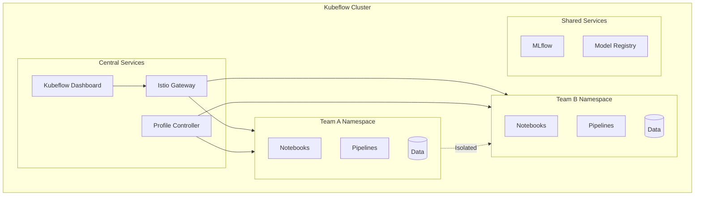

# How to Configure Kubeflow Multi-Tenancy

Author: [nawazdhandala](https://www.github.com/nawazdhandala)

Tags: Kubeflow, Multi-Tenancy, Kubernetes, Security, ML Ops

Description: Learn how to configure Kubeflow for multi-tenant environments with proper isolation, resource quotas, and access controls for teams sharing ML infrastructure.

---

When multiple teams share a Kubeflow cluster, isolation becomes critical. Without proper multi-tenancy configuration, one team's runaway training job can consume all GPU resources, or worse, they might accidentally access another team's models and data. Kubeflow's profile system provides the foundation for secure multi-tenant ML platforms.

## Multi-Tenancy Architecture

Kubeflow uses Kubernetes namespaces as the basis for tenant isolation, with additional access controls layered on top.



## Creating User Profiles

Profiles are the primary unit of tenancy in Kubeflow. Each profile creates an isolated namespace with associated RBAC.

### Basic Profile Creation

```yaml
apiVersion: kubeflow.org/v1
kind: Profile
metadata:
  name: team-data-science
spec:
  owner:
    kind: User
    name: alice@company.com
  resourceQuotaSpec:
    hard:
      cpu: "20"
      memory: "100Gi"
      requests.nvidia.com/gpu: "4"
      persistentvolumeclaims: "10"
      requests.storage: "500Gi"
```

Apply the profile:

```bash
kubectl apply -f profile.yaml

# Verify profile creation
kubectl get profiles

# Check the namespace was created
kubectl get namespace team-data-science
```

### Profile with Multiple Contributors

Add team members to a profile:

```yaml
apiVersion: kubeflow.org/v1
kind: Profile
metadata:
  name: team-ml-platform
spec:
  owner:
    kind: User
    name: bob@company.com
  # Additional contributors get edit access
  contributors:
    - kind: User
      name: carol@company.com
    - kind: User
      name: david@company.com
    - kind: Group
      name: ml-engineers@company.com
  resourceQuotaSpec:
    hard:
      cpu: "50"
      memory: "200Gi"
      requests.nvidia.com/gpu: "8"
```

### Programmatic Profile Management

Manage profiles through the Kubeflow API:

```python
"""profile_manager.py - Manage Kubeflow profiles programmatically."""

from kubernetes import client, config
from kubernetes.client.rest import ApiException

class ProfileManager:
    """Manage Kubeflow profiles."""

    def __init__(self):
        config.load_kube_config()
        self.api = client.CustomObjectsApi()

    def create_profile(
        self,
        name: str,
        owner_email: str,
        cpu_quota: str = "10",
        memory_quota: str = "50Gi",
        gpu_quota: str = "2",
        contributors: list = None
    ):
        """
        Create a new Kubeflow profile.

        Args:
            name: Profile name (will be namespace name)
            owner_email: Email of the profile owner
            cpu_quota: CPU quota
            memory_quota: Memory quota
            gpu_quota: GPU quota
            contributors: List of contributor emails
        """
        profile = {
            "apiVersion": "kubeflow.org/v1",
            "kind": "Profile",
            "metadata": {"name": name},
            "spec": {
                "owner": {
                    "kind": "User",
                    "name": owner_email
                },
                "resourceQuotaSpec": {
                    "hard": {
                        "cpu": cpu_quota,
                        "memory": memory_quota,
                        "requests.nvidia.com/gpu": gpu_quota
                    }
                }
            }
        }

        if contributors:
            profile["spec"]["contributors"] = [
                {"kind": "User", "name": email}
                for email in contributors
            ]

        try:
            self.api.create_cluster_custom_object(
                group="kubeflow.org",
                version="v1",
                plural="profiles",
                body=profile
            )
            print(f"Profile {name} created successfully")
        except ApiException as e:
            print(f"Error creating profile: {e}")

    def add_contributor(self, profile_name: str, contributor_email: str):
        """Add a contributor to an existing profile."""
        # Get current profile
        profile = self.api.get_cluster_custom_object(
            group="kubeflow.org",
            version="v1",
            plural="profiles",
            name=profile_name
        )

        # Add contributor
        if "contributors" not in profile["spec"]:
            profile["spec"]["contributors"] = []

        profile["spec"]["contributors"].append({
            "kind": "User",
            "name": contributor_email
        })

        # Update profile
        self.api.patch_cluster_custom_object(
            group="kubeflow.org",
            version="v1",
            plural="profiles",
            name=profile_name,
            body=profile
        )
        print(f"Added {contributor_email} to {profile_name}")

    def list_profiles(self):
        """List all profiles."""
        profiles = self.api.list_cluster_custom_object(
            group="kubeflow.org",
            version="v1",
            plural="profiles"
        )
        return [p["metadata"]["name"] for p in profiles["items"]]

# Usage
if __name__ == "__main__":
    manager = ProfileManager()

    # Create a new team profile
    manager.create_profile(
        name="fraud-detection-team",
        owner_email="lead@company.com",
        cpu_quota="30",
        memory_quota="120Gi",
        gpu_quota="4",
        contributors=["analyst1@company.com", "analyst2@company.com"]
    )
```

## Configuring Resource Quotas

Resource quotas prevent any single team from consuming all cluster resources.

### Comprehensive Quota Configuration

```yaml
apiVersion: kubeflow.org/v1
kind: Profile
metadata:
  name: team-research
spec:
  owner:
    kind: User
    name: researcher@company.com
  resourceQuotaSpec:
    hard:
      # Compute resources
      requests.cpu: "20"
      limits.cpu: "40"
      requests.memory: "80Gi"
      limits.memory: "160Gi"

      # GPU resources
      requests.nvidia.com/gpu: "4"

      # Storage
      persistentvolumeclaims: "20"
      requests.storage: "1Ti"

      # Object counts
      pods: "50"
      services: "20"
      secrets: "100"
      configmaps: "100"
```

### Limit Ranges for Default Resources

Set default resource requests so users don't need to specify them:

```yaml
apiVersion: v1
kind: LimitRange
metadata:
  name: default-resources
  namespace: team-research
spec:
  limits:
    # Container defaults
    - type: Container
      default:
        cpu: "1"
        memory: "2Gi"
      defaultRequest:
        cpu: "500m"
        memory: "1Gi"
      max:
        cpu: "8"
        memory: "32Gi"
        nvidia.com/gpu: "2"

    # PVC defaults
    - type: PersistentVolumeClaim
      max:
        storage: "100Gi"
      min:
        storage: "1Gi"
```

### Priority Classes for Workload Scheduling

Define priority classes to handle resource contention:

```yaml
apiVersion: scheduling.k8s.io/v1
kind: PriorityClass
metadata:
  name: high-priority-ml
value: 1000000
globalDefault: false
description: "High priority for production ML workloads"
---
apiVersion: scheduling.k8s.io/v1
kind: PriorityClass
metadata:
  name: normal-priority-ml
value: 100000
globalDefault: true
description: "Normal priority for development ML workloads"
---
apiVersion: scheduling.k8s.io/v1
kind: PriorityClass
metadata:
  name: low-priority-ml
value: 10000
preemptionPolicy: Never
description: "Low priority for experimental workloads"
```

## Network Isolation

Isolate network traffic between tenant namespaces.

### Network Policy for Namespace Isolation

```yaml
apiVersion: networking.k8s.io/v1
kind: NetworkPolicy
metadata:
  name: tenant-isolation
  namespace: team-research
spec:
  podSelector: {}
  policyTypes:
    - Ingress
    - Egress

  ingress:
    # Allow traffic from same namespace
    - from:
        - podSelector: {}

    # Allow traffic from Istio ingress
    - from:
        - namespaceSelector:
            matchLabels:
              kubernetes.io/metadata.name: istio-system

    # Allow traffic from Kubeflow central services
    - from:
        - namespaceSelector:
            matchLabels:
              kubernetes.io/metadata.name: kubeflow

  egress:
    # Allow traffic to same namespace
    - to:
        - podSelector: {}

    # Allow DNS
    - to:
        - namespaceSelector:
            matchLabels:
              kubernetes.io/metadata.name: kube-system
          podSelector:
            matchLabels:
              k8s-app: kube-dns
      ports:
        - protocol: UDP
          port: 53

    # Allow traffic to shared services
    - to:
        - namespaceSelector:
            matchLabels:
              shared-services: "true"
```

### Apply Network Policies Automatically

Use a controller to apply network policies to new profiles:

```yaml
apiVersion: kustomize.config.k8s.io/v1beta1
kind: Kustomization
resources:
  - network-policy.yaml

namespace: ${NAMESPACE}

configurations:
  - kustomizeconfig.yaml
```

## RBAC Configuration

Fine-grained access control within each tenant.

### Custom Roles for ML Workflows

```yaml
# Role for data scientists - can run notebooks and pipelines
apiVersion: rbac.authorization.k8s.io/v1
kind: Role
metadata:
  name: ml-data-scientist
  namespace: team-research
rules:
  # Notebook access
  - apiGroups: ["kubeflow.org"]
    resources: ["notebooks"]
    verbs: ["get", "list", "create", "delete"]

  # Pipeline access
  - apiGroups: ["kubeflow.org"]
    resources: ["pipelines", "pipelineruns"]
    verbs: ["get", "list", "create", "delete"]

  # Pod logs for debugging
  - apiGroups: [""]
    resources: ["pods", "pods/log"]
    verbs: ["get", "list"]

  # Secrets for credentials (read only)
  - apiGroups: [""]
    resources: ["secrets"]
    verbs: ["get", "list"]

  # PVC management
  - apiGroups: [""]
    resources: ["persistentvolumeclaims"]
    verbs: ["get", "list", "create", "delete"]
---
# Role for ML engineers - additional deployment access
apiVersion: rbac.authorization.k8s.io/v1
kind: Role
metadata:
  name: ml-engineer
  namespace: team-research
rules:
  # All data scientist permissions plus:
  - apiGroups: ["kubeflow.org"]
    resources: ["notebooks", "pipelines", "pipelineruns"]
    verbs: ["*"]

  # Model serving
  - apiGroups: ["serving.kubeflow.org"]
    resources: ["inferenceservices"]
    verbs: ["*"]

  # Deployments and services
  - apiGroups: ["apps"]
    resources: ["deployments"]
    verbs: ["get", "list", "create", "update", "delete"]

  - apiGroups: [""]
    resources: ["services"]
    verbs: ["get", "list", "create", "update", "delete"]

  # ConfigMaps and Secrets
  - apiGroups: [""]
    resources: ["configmaps", "secrets"]
    verbs: ["*"]
```

### Bind Roles to Users

```yaml
apiVersion: rbac.authorization.k8s.io/v1
kind: RoleBinding
metadata:
  name: data-scientist-binding
  namespace: team-research
subjects:
  - kind: User
    name: alice@company.com
    apiGroup: rbac.authorization.k8s.io
  - kind: Group
    name: data-scientists@company.com
    apiGroup: rbac.authorization.k8s.io
roleRef:
  kind: Role
  name: ml-data-scientist
  apiGroup: rbac.authorization.k8s.io
---
apiVersion: rbac.authorization.k8s.io/v1
kind: RoleBinding
metadata:
  name: ml-engineer-binding
  namespace: team-research
subjects:
  - kind: User
    name: bob@company.com
    apiGroup: rbac.authorization.k8s.io
roleRef:
  kind: Role
  name: ml-engineer
  apiGroup: rbac.authorization.k8s.io
```

## Authentication Integration

### Configure Dex for Identity Provider Integration

```yaml
apiVersion: v1
kind: ConfigMap
metadata:
  name: dex
  namespace: auth
data:
  config.yaml: |
    issuer: https://dex.kubeflow.example.com
    storage:
      type: kubernetes
      config:
        inCluster: true
    web:
      http: 0.0.0.0:5556

    connectors:
      # OIDC connector for corporate SSO
      - type: oidc
        id: corporate-sso
        name: Corporate SSO
        config:
          issuer: https://sso.company.com
          clientID: kubeflow-client
          clientSecret: $OIDC_CLIENT_SECRET
          redirectURI: https://kubeflow.example.com/dex/callback
          scopes:
            - openid
            - profile
            - email
            - groups
          userNameKey: email
          insecureSkipEmailVerified: true

      # LDAP connector
      - type: ldap
        id: ldap
        name: LDAP
        config:
          host: ldap.company.com:636
          insecureNoSSL: false
          bindDN: cn=admin,dc=company,dc=com
          bindPW: $LDAP_BIND_PASSWORD
          userSearch:
            baseDN: ou=users,dc=company,dc=com
            filter: "(objectClass=person)"
            username: uid
            idAttr: uid
            emailAttr: mail
            nameAttr: cn
          groupSearch:
            baseDN: ou=groups,dc=company,dc=com
            filter: "(objectClass=groupOfNames)"
            userMatchers:
              - userAttr: DN
                groupAttr: member
            nameAttr: cn

    staticClients:
      - id: kubeflow-oidc-authservice
        redirectURIs:
          - https://kubeflow.example.com/login/oidc
        name: Kubeflow
        secret: $STATIC_CLIENT_SECRET
```

## Audit Logging

Track user actions across tenants for compliance.

### Enable Kubernetes Audit Logging

```yaml
apiVersion: audit.k8s.io/v1
kind: Policy
metadata:
  name: kubeflow-audit-policy
rules:
  # Log all Kubeflow resource changes
  - level: RequestResponse
    resources:
      - group: "kubeflow.org"
        resources: ["*"]
    verbs: ["create", "update", "patch", "delete"]

  # Log notebook access
  - level: Metadata
    resources:
      - group: "kubeflow.org"
        resources: ["notebooks"]
    verbs: ["get", "list"]

  # Log pipeline runs
  - level: RequestResponse
    resources:
      - group: "kubeflow.org"
        resources: ["pipelineruns"]
    verbs: ["create"]

  # Log secret access (metadata only for security)
  - level: Metadata
    resources:
      - group: ""
        resources: ["secrets"]
    verbs: ["get", "list"]

  # Log all admin actions
  - level: RequestResponse
    users: ["system:admin"]
    verbs: ["*"]
```

### Custom Audit Webhook

Send audit events to external systems:

```python
"""audit_webhook.py - Process Kubeflow audit events."""

from flask import Flask, request
import json
import logging
from datetime import datetime

app = Flask(__name__)
logging.basicConfig(level=logging.INFO)

@app.route('/audit', methods=['POST'])
def receive_audit():
    """Receive and process audit events."""
    events = request.json.get('items', [])

    for event in events:
        # Extract relevant information
        audit_record = {
            'timestamp': event.get('requestReceivedTimestamp'),
            'user': event.get('user', {}).get('username'),
            'groups': event.get('user', {}).get('groups', []),
            'verb': event.get('verb'),
            'resource': event.get('objectRef', {}).get('resource'),
            'name': event.get('objectRef', {}).get('name'),
            'namespace': event.get('objectRef', {}).get('namespace'),
            'response_code': event.get('responseStatus', {}).get('code')
        }

        # Log or send to external system
        logging.info(f"Audit: {json.dumps(audit_record)}")

        # Send to SIEM or data lake
        # send_to_splunk(audit_record)
        # send_to_elasticsearch(audit_record)

    return {'status': 'ok'}

if __name__ == '__main__':
    app.run(host='0.0.0.0', port=8080)
```

## Monitoring Multi-Tenant Usage

Track resource usage per tenant:

```yaml
apiVersion: v1
kind: ConfigMap
metadata:
  name: prometheus-rules
  namespace: monitoring
data:
  kubeflow-tenant-rules.yaml: |
    groups:
      - name: kubeflow-tenant-alerts
        rules:
          # Alert when tenant approaches quota
          - alert: TenantCPUQuotaHigh
            expr: |
              sum(kube_resourcequota{resource="requests.cpu", type="used"}) by (namespace)
              /
              sum(kube_resourcequota{resource="requests.cpu", type="hard"}) by (namespace)
              > 0.8
            for: 15m
            labels:
              severity: warning
            annotations:
              summary: "Tenant {{ $labels.namespace }} using >80% CPU quota"

          - alert: TenantGPUQuotaExhausted
            expr: |
              sum(kube_resourcequota{resource="requests.nvidia.com/gpu", type="used"}) by (namespace)
              ==
              sum(kube_resourcequota{resource="requests.nvidia.com/gpu", type="hard"}) by (namespace)
            for: 5m
            labels:
              severity: critical
            annotations:
              summary: "Tenant {{ $labels.namespace }} exhausted GPU quota"
```

### Grafana Dashboard Query

```promql
# CPU usage by tenant
sum(
  rate(container_cpu_usage_seconds_total{namespace=~"team-.*"}[5m])
) by (namespace)

# Memory usage by tenant
sum(
  container_memory_usage_bytes{namespace=~"team-.*"}
) by (namespace)

# GPU utilization by tenant
DCGM_FI_DEV_GPU_UTIL{namespace=~"team-.*"}
```

---

Multi-tenancy in Kubeflow requires careful attention to isolation, quotas, and access controls. By leveraging profiles, RBAC, network policies, and monitoring, you create a secure environment where multiple teams can share expensive ML infrastructure without stepping on each other. Start with basic profile isolation and add more sophisticated controls as your organization's needs evolve.
