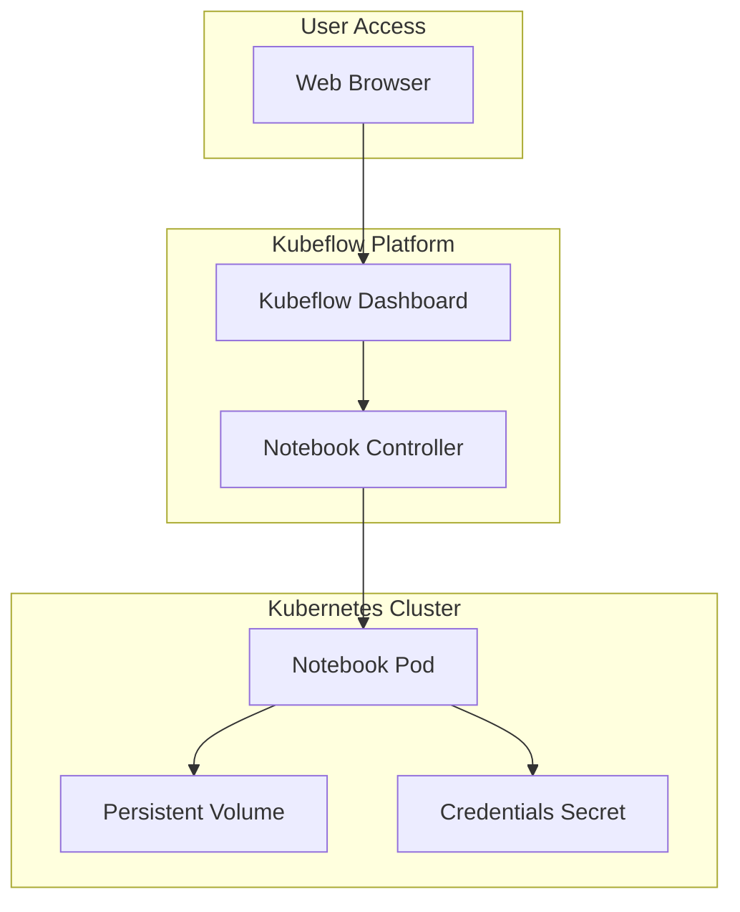

# How to Configure Kubeflow Notebooks

Author: [nawazdhandala](https://www.github.com/nawazdhandala)

Tags: Kubeflow, ML Ops, Jupyter, Kubernetes, Machine Learning

Description: A practical guide to configuring Kubeflow Notebooks for interactive machine learning development with custom environments, persistent storage, and resource management.

---

Kubeflow Notebooks provide data scientists with familiar Jupyter environments running natively on Kubernetes. Unlike local Jupyter instances, these notebooks can scale to use cluster resources, access shared datasets, and integrate directly with ML pipelines. Getting the configuration right makes the difference between a frustrating experience and a productive ML workflow.

## Understanding Kubeflow Notebook Architecture

Before diving into configuration, let's understand how Kubeflow Notebooks work under the hood.



Each notebook server runs as a Kubernetes Pod with:
- A container running JupyterLab or similar IDE
- Persistent storage for notebooks and data
- Access to Kubernetes secrets for credentials
- Configurable CPU, memory, and GPU resources

## Prerequisites

Before configuring notebooks, ensure your cluster has:

```bash
# Check Kubeflow installation
kubectl get pods -n kubeflow | grep notebook

# Verify the notebook controller is running
kubectl get deployment -n kubeflow notebook-controller-deployment

# Check available storage classes
kubectl get storageclass
```

## Creating a Basic Notebook Server

### Using the Kubeflow UI

The simplest approach is through the Kubeflow dashboard:

1. Navigate to Notebooks in the left sidebar
2. Click "New Notebook"
3. Fill in the configuration form

### Using kubectl and YAML

For reproducible configurations, define notebooks as YAML:

```yaml
apiVersion: kubeflow.org/v1
kind: Notebook
metadata:
  name: ml-dev-notebook
  namespace: kubeflow-user
  labels:
    app: ml-dev-notebook
spec:
  template:
    spec:
      containers:
        - name: ml-dev-notebook
          image: kubeflownotebookswg/jupyter-scipy:v1.8.0
          resources:
            requests:
              cpu: "1"
              memory: "2Gi"
            limits:
              cpu: "2"
              memory: "4Gi"
          volumeMounts:
            - mountPath: /home/jovyan
              name: workspace
      volumes:
        - name: workspace
          persistentVolumeClaim:
            claimName: ml-dev-workspace
```

Create the PVC first:

```yaml
apiVersion: v1
kind: PersistentVolumeClaim
metadata:
  name: ml-dev-workspace
  namespace: kubeflow-user
spec:
  accessModes:
    - ReadWriteOnce
  resources:
    requests:
      storage: 20Gi
  storageClassName: standard
```

Apply both:

```bash
kubectl apply -f pvc.yaml
kubectl apply -f notebook.yaml
```

## Custom Container Images

The default images work for basic tasks, but ML projects often need specific packages. Build custom images based on Kubeflow's base images.

### Dockerfile for Custom ML Environment

```dockerfile
# Start from Kubeflow's base image
FROM kubeflownotebookswg/jupyter-scipy:v1.8.0

# Switch to root for package installation
USER root

# Install system dependencies
RUN apt-get update && apt-get install -y \
    libgl1-mesa-glx \
    libglib2.0-0 \
    && rm -rf /var/lib/apt/lists/*

# Switch back to jovyan user
USER jovyan

# Install Python packages
RUN pip install --no-cache-dir \
    torch==2.1.0 \
    torchvision==0.16.0 \
    transformers==4.35.0 \
    datasets==2.14.0 \
    mlflow==2.8.0 \
    great-expectations==0.18.0

# Install JupyterLab extensions
RUN pip install --no-cache-dir \
    jupyterlab-git \
    jupyterlab-lsp \
    python-lsp-server[all]

# Set working directory
WORKDIR /home/jovyan
```

Build and push to your registry:

```bash
# Build the image
docker build -t your-registry.com/ml-notebook:v1.0 .

# Push to registry
docker push your-registry.com/ml-notebook:v1.0
```

### Using Custom Images in Notebooks

Reference your custom image in the notebook spec:

```yaml
apiVersion: kubeflow.org/v1
kind: Notebook
metadata:
  name: custom-ml-notebook
  namespace: kubeflow-user
spec:
  template:
    spec:
      containers:
        - name: custom-ml-notebook
          image: your-registry.com/ml-notebook:v1.0
          imagePullPolicy: Always
          # ... rest of config
      imagePullSecrets:
        - name: registry-credentials
```

## Configuring Persistent Storage

### Multiple Volume Mounts

Mount different volumes for code, data, and shared resources:

```yaml
apiVersion: kubeflow.org/v1
kind: Notebook
metadata:
  name: data-science-notebook
  namespace: kubeflow-user
spec:
  template:
    spec:
      containers:
        - name: notebook
          image: kubeflownotebookswg/jupyter-scipy:v1.8.0
          volumeMounts:
            # User workspace
            - mountPath: /home/jovyan
              name: workspace
            # Shared datasets (read-only)
            - mountPath: /data
              name: shared-data
              readOnly: true
            # Scratch space for temporary files
            - mountPath: /scratch
              name: scratch
      volumes:
        - name: workspace
          persistentVolumeClaim:
            claimName: user-workspace
        - name: shared-data
          persistentVolumeClaim:
            claimName: shared-datasets
        - name: scratch
          emptyDir:
            sizeLimit: 50Gi
```

### Using NFS for Shared Storage

For team collaboration, use NFS volumes:

```yaml
apiVersion: v1
kind: PersistentVolume
metadata:
  name: shared-datasets
spec:
  capacity:
    storage: 500Gi
  accessModes:
    - ReadOnlyMany
  nfs:
    server: nfs.example.com
    path: /exports/ml-datasets
---
apiVersion: v1
kind: PersistentVolumeClaim
metadata:
  name: shared-datasets
  namespace: kubeflow-user
spec:
  accessModes:
    - ReadOnlyMany
  resources:
    requests:
      storage: 500Gi
  volumeName: shared-datasets
```

## Resource Management

### Setting Resource Quotas

Prevent runaway notebooks from consuming all cluster resources:

```yaml
apiVersion: v1
kind: ResourceQuota
metadata:
  name: notebook-quota
  namespace: kubeflow-user
spec:
  hard:
    requests.cpu: "8"
    requests.memory: "32Gi"
    limits.cpu: "16"
    limits.memory: "64Gi"
    persistentvolumeclaims: "5"
    requests.storage: "100Gi"
```

### Limit Ranges for Default Resources

Set defaults so notebooks don't start with minimal resources:

```yaml
apiVersion: v1
kind: LimitRange
metadata:
  name: notebook-limits
  namespace: kubeflow-user
spec:
  limits:
    - type: Container
      default:
        cpu: "2"
        memory: "4Gi"
      defaultRequest:
        cpu: "1"
        memory: "2Gi"
      max:
        cpu: "8"
        memory: "32Gi"
```

## Environment Variables and Secrets

### Injecting Environment Variables

Pass configuration to notebooks via environment variables:

```yaml
apiVersion: kubeflow.org/v1
kind: Notebook
metadata:
  name: configured-notebook
  namespace: kubeflow-user
spec:
  template:
    spec:
      containers:
        - name: notebook
          image: kubeflownotebookswg/jupyter-scipy:v1.8.0
          env:
            - name: MLFLOW_TRACKING_URI
              value: "http://mlflow.kubeflow.svc:5000"
            - name: AWS_DEFAULT_REGION
              value: "us-west-2"
            - name: S3_ENDPOINT
              value: "http://minio.kubeflow.svc:9000"
            # From secrets
            - name: AWS_ACCESS_KEY_ID
              valueFrom:
                secretKeyRef:
                  name: minio-credentials
                  key: access-key
            - name: AWS_SECRET_ACCESS_KEY
              valueFrom:
                secretKeyRef:
                  name: minio-credentials
                  key: secret-key
```

### Creating Secrets for Credentials

```bash
# Create secret for MinIO/S3 credentials
kubectl create secret generic minio-credentials \
  --namespace kubeflow-user \
  --from-literal=access-key=minio \
  --from-literal=secret-key=minio123

# Create secret for Git credentials
kubectl create secret generic git-credentials \
  --namespace kubeflow-user \
  --from-literal=username=your-username \
  --from-literal=password=your-token
```

## Configuring Notebook Idle Culling

Automatically stop idle notebooks to save resources:

```yaml
apiVersion: kubeflow.org/v1
kind: Notebook
metadata:
  name: auto-cull-notebook
  namespace: kubeflow-user
  annotations:
    # Cull after 30 minutes of inactivity
    notebooks.kubeflow.org/http-rewrite-uri: "/"
    kubeflow-resource-stopped: "false"
spec:
  template:
    metadata:
      annotations:
        # Enable culling
        notebooks.kubeflow.org/last-activity-check-timestamp: ""
    spec:
      containers:
        - name: notebook
          image: kubeflownotebookswg/jupyter-scipy:v1.8.0
```

Configure the culling controller in the Kubeflow installation:

```yaml
# In your Kubeflow configuration
cullingPolicy:
  cullIdleTime: 30  # minutes
  enableCulling: true
  idlenessCheckPeriod: 1  # minutes
```

## Pod Affinity and Node Selection

### Running on Specific Nodes

Use node selectors for specialized hardware:

```yaml
apiVersion: kubeflow.org/v1
kind: Notebook
metadata:
  name: high-memory-notebook
  namespace: kubeflow-user
spec:
  template:
    spec:
      nodeSelector:
        node-type: high-memory
      containers:
        - name: notebook
          image: kubeflownotebookswg/jupyter-scipy:v1.8.0
          resources:
            requests:
              memory: "64Gi"
            limits:
              memory: "128Gi"
```

### Tolerations for Dedicated Nodes

```yaml
apiVersion: kubeflow.org/v1
kind: Notebook
metadata:
  name: dedicated-notebook
  namespace: kubeflow-user
spec:
  template:
    spec:
      tolerations:
        - key: "dedicated"
          operator: "Equal"
          value: "ml-workloads"
          effect: "NoSchedule"
      nodeSelector:
        dedicated: ml-workloads
      containers:
        - name: notebook
          image: kubeflownotebookswg/jupyter-scipy:v1.8.0
```

## Troubleshooting Common Issues

### Notebook Pod Not Starting

```bash
# Check pod status
kubectl get pods -n kubeflow-user -l app=notebook-name

# View pod events
kubectl describe pod <pod-name> -n kubeflow-user

# Check notebook controller logs
kubectl logs -n kubeflow -l app=notebook-controller-deployment
```

### Storage Issues

```bash
# Check PVC status
kubectl get pvc -n kubeflow-user

# Describe PVC for events
kubectl describe pvc <pvc-name> -n kubeflow-user

# Check storage class
kubectl get storageclass
```

### Image Pull Errors

```bash
# Check image pull secrets exist
kubectl get secrets -n kubeflow-user

# Verify secret is correctly formatted
kubectl get secret registry-credentials -n kubeflow-user -o yaml

# Test image pull manually
kubectl run test-pull --image=your-registry.com/ml-notebook:v1.0 --restart=Never -n kubeflow-user
```

## Automation Script

Create notebooks programmatically:

```python
#!/usr/bin/env python3
"""Script to create Kubeflow notebooks with standard configurations."""

import yaml
from kubernetes import client, config

def create_notebook(name: str, namespace: str, image: str, cpu: str, memory: str, storage: str):
    """Create a Kubeflow notebook with the specified configuration."""

    # Load kubeconfig
    config.load_kube_config()

    # Create custom objects API
    api = client.CustomObjectsApi()

    notebook_spec = {
        "apiVersion": "kubeflow.org/v1",
        "kind": "Notebook",
        "metadata": {
            "name": name,
            "namespace": namespace
        },
        "spec": {
            "template": {
                "spec": {
                    "containers": [{
                        "name": name,
                        "image": image,
                        "resources": {
                            "requests": {"cpu": cpu, "memory": memory},
                            "limits": {"cpu": cpu, "memory": memory}
                        },
                        "volumeMounts": [{
                            "mountPath": "/home/jovyan",
                            "name": "workspace"
                        }]
                    }],
                    "volumes": [{
                        "name": "workspace",
                        "persistentVolumeClaim": {"claimName": f"{name}-pvc"}
                    }]
                }
            }
        }
    }

    # Create the notebook
    api.create_namespaced_custom_object(
        group="kubeflow.org",
        version="v1",
        namespace=namespace,
        plural="notebooks",
        body=notebook_spec
    )
    print(f"Notebook {name} created in namespace {namespace}")

if __name__ == "__main__":
    create_notebook(
        name="dev-notebook",
        namespace="kubeflow-user",
        image="kubeflownotebookswg/jupyter-scipy:v1.8.0",
        cpu="2",
        memory="4Gi",
        storage="20Gi"
    )
```

---

Properly configured Kubeflow Notebooks transform how data scientists interact with Kubernetes clusters. By setting up custom images, persistent storage, resource limits, and environment variables, you create reproducible ML environments that scale with your team's needs. Start with basic configurations and iterate as you discover what your workflows require.
