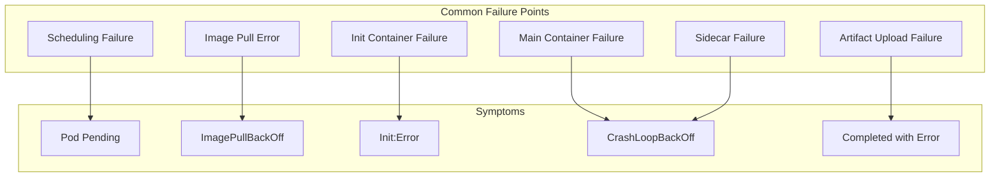

# How to Debug Kubeflow Pipeline Failures

Author: [nawazdhandala](https://www.github.com/nawazdhandala)

Tags: Kubeflow, Debugging, Pipelines, Troubleshooting, ML Ops

Description: Master the techniques for debugging failed Kubeflow pipelines, from inspecting logs and artifacts to handling common failure patterns and implementing retry strategies.

---

Pipeline failures are inevitable. A data source changes format, a dependency upgrades with breaking changes, or a model training job runs out of memory. The difference between hours of frustration and quick resolution lies in knowing how to systematically debug Kubeflow pipelines.

## Understanding Pipeline Failure Modes

Before diving into debugging techniques, understand where failures can occur in a Kubeflow pipeline.



## Quick Diagnosis Commands

Start with these commands to identify the problem area:

```bash
# Get pipeline run status
kubectl get pipelineruns -n kubeflow-user

# Get all pods for a specific run
kubectl get pods -n kubeflow-user -l pipeline/runid=<run-id>

# Quick status of all pipeline pods
kubectl get pods -n kubeflow-user -l pipeline/runid=<run-id> \
  -o custom-columns=NAME:.metadata.name,STATUS:.status.phase,REASON:.status.reason

# Get events for the namespace (sorted by time)
kubectl get events -n kubeflow-user --sort-by='.lastTimestamp' | tail -50
```

## Inspecting Failed Steps

### Finding the Failed Pod

```bash
# List all pods for a run with their status
kubectl get pods -n kubeflow-user -l pipeline/runid=<run-id> \
  -o jsonpath='{range .items[*]}{.metadata.name}{"\t"}{.status.phase}{"\t"}{.status.containerStatuses[0].state}{"\n"}{end}'

# Find pods in error state
kubectl get pods -n kubeflow-user -l pipeline/runid=<run-id> \
  --field-selector=status.phase=Failed

# Describe the failed pod for detailed information
kubectl describe pod <pod-name> -n kubeflow-user
```

### Extracting Logs

Pipeline pods have multiple containers. Get logs from the right one:

```bash
# List containers in a pod
kubectl get pod <pod-name> -n kubeflow-user -o jsonpath='{.spec.containers[*].name}'

# Get main container logs
kubectl logs <pod-name> -n kubeflow-user -c main

# Get init container logs (for artifact download issues)
kubectl logs <pod-name> -n kubeflow-user -c setup

# Get sidecar logs (for artifact upload issues)
kubectl logs <pod-name> -n kubeflow-user -c sidecar

# Get logs from previous crashed container
kubectl logs <pod-name> -n kubeflow-user -c main --previous

# Stream logs in real-time
kubectl logs -f <pod-name> -n kubeflow-user -c main
```

### Accessing Artifacts from Failed Runs

Even failed runs may have produced partial artifacts:

```bash
# Check MinIO/S3 for artifacts
mc ls minio/mlpipeline/artifacts/<run-id>/

# Download artifacts locally
mc cp -r minio/mlpipeline/artifacts/<run-id>/ ./debug-artifacts/

# Or using AWS CLI for S3
aws s3 ls s3://mlpipeline/artifacts/<run-id>/ --recursive
aws s3 cp s3://mlpipeline/artifacts/<run-id>/ ./debug-artifacts/ --recursive
```

## Common Failure Patterns and Solutions

### Pattern 1: Image Pull Failures

**Symptoms:**
```
Error: ImagePullBackOff
Error: ErrImagePull
```

**Diagnosis:**
```bash
# Check the exact error
kubectl describe pod <pod-name> -n kubeflow-user | grep -A 5 "Events:"

# Common errors:
# - "unauthorized: authentication required" - missing imagePullSecret
# - "manifest unknown" - wrong image tag
# - "connection refused" - registry unreachable
```

**Solutions:**

```yaml
# Add image pull secrets to component
@dsl.component(base_image="private-registry.com/ml-image:v1.0")
def my_component():
    pass

# In pipeline, add image pull secret
@dsl.pipeline
def my_pipeline():
    task = my_component()
    task.set_image_pull_secrets(["registry-credentials"])
```

Or create the secret and patch the default service account:

```bash
# Create registry secret
kubectl create secret docker-registry registry-credentials \
  --docker-server=private-registry.com \
  --docker-username=user \
  --docker-password=password \
  --namespace=kubeflow-user

# Patch default service account
kubectl patch serviceaccount default -n kubeflow-user \
  -p '{"imagePullSecrets": [{"name": "registry-credentials"}]}'
```

### Pattern 2: Out of Memory (OOM)

**Symptoms:**
```
OOMKilled
Exit Code: 137
```

**Diagnosis:**
```bash
# Check container exit code and reason
kubectl get pod <pod-name> -n kubeflow-user \
  -o jsonpath='{.status.containerStatuses[0].lastState.terminated}'

# Check resource usage before failure
kubectl top pod <pod-name> -n kubeflow-user --containers
```

**Solutions:**

```python
# Increase memory limits in component
@dsl.component
def memory_intensive_task():
    pass

@dsl.pipeline
def my_pipeline():
    task = memory_intensive_task()
    task.set_memory_limit("16Gi")
    task.set_memory_request("8Gi")
```

Or optimize the code:

```python
@dsl.component(
    base_image="python:3.10",
    packages_to_install=["pandas", "pyarrow"]
)
def process_large_data(input_path: str, output_path: str):
    """Process data in chunks to avoid OOM."""
    import pandas as pd

    # Process in chunks instead of loading all at once
    chunk_size = 100000
    chunks = pd.read_parquet(input_path, chunksize=chunk_size)

    results = []
    for chunk in chunks:
        # Process chunk
        processed = transform(chunk)
        results.append(processed)

        # Force garbage collection
        del chunk
        import gc
        gc.collect()

    # Write results
    pd.concat(results).to_parquet(output_path)
```

### Pattern 3: Timeout Failures

**Symptoms:**
```
DeadlineExceeded
context deadline exceeded
```

**Diagnosis:**
```bash
# Check pod age vs timeout
kubectl get pod <pod-name> -n kubeflow-user \
  -o jsonpath='{.metadata.creationTimestamp}'

# Check if the step is actually stuck
kubectl logs -f <pod-name> -n kubeflow-user -c main
```

**Solutions:**

```python
# Increase timeout for long-running steps
@dsl.component
def long_training_job():
    pass

@dsl.pipeline
def my_pipeline():
    task = long_training_job()
    # Set timeout to 6 hours
    task.set_timeout(21600)
```

### Pattern 4: Artifact Handling Failures

**Symptoms:**
```
failed to download artifact
failed to upload artifact
artifact path not found
```

**Diagnosis:**
```bash
# Check init container logs for download issues
kubectl logs <pod-name> -n kubeflow-user -c setup

# Check sidecar logs for upload issues
kubectl logs <pod-name> -n kubeflow-user -c sidecar

# Verify artifact storage is accessible
kubectl exec -it <pod-name> -n kubeflow-user -c main -- \
  curl -s http://minio.kubeflow.svc:9000/minio/health/live
```

**Solutions:**

```python
# Ensure output paths exist before writing
@dsl.component
def write_artifact(output_data: Output[Dataset]):
    import os

    # Create parent directory if needed
    os.makedirs(os.path.dirname(output_data.path), exist_ok=True)

    # Write data
    df.to_parquet(output_data.path)
```

### Pattern 5: Dependency Failures

**Symptoms:**
```
ModuleNotFoundError
ImportError
pip install failed
```

**Diagnosis:**
```bash
# Check container logs for import errors
kubectl logs <pod-name> -n kubeflow-user -c main | grep -i "error\|import\|module"
```

**Solutions:**

```python
# Pin specific versions
@dsl.component(
    base_image="python:3.10",
    packages_to_install=[
        "pandas==2.1.0",
        "numpy==1.24.0",
        "scikit-learn==1.3.0"
    ]
)
def stable_component():
    pass

# Or use a pre-built image with dependencies
@dsl.component(base_image="your-registry/ml-base:v1.0")
def component_with_custom_image():
    pass
```

## Implementing Retry Logic

### Automatic Retries for Transient Failures

```python
from kfp import dsl
from kfp.dsl import PipelineTask

@dsl.component
def flaky_api_call():
    """Component that may fail due to transient issues."""
    import requests
    response = requests.get("https://api.example.com/data")
    response.raise_for_status()

@dsl.pipeline
def pipeline_with_retries():
    task = flaky_api_call()
    # Retry up to 3 times with backoff
    task.set_retry(
        num_retries=3,
        backoff_duration="60s",
        backoff_factor=2.0,
        backoff_max_duration="3600s"
    )
```

### Custom Retry Logic in Code

```python
@dsl.component(
    base_image="python:3.10",
    packages_to_install=["requests", "tenacity"]
)
def robust_api_call(endpoint: str) -> str:
    """API call with custom retry logic."""
    import requests
    from tenacity import (
        retry, stop_after_attempt, wait_exponential,
        retry_if_exception_type
    )

    @retry(
        stop=stop_after_attempt(5),
        wait=wait_exponential(multiplier=1, min=4, max=60),
        retry=retry_if_exception_type((
            requests.exceptions.ConnectionError,
            requests.exceptions.Timeout,
            requests.exceptions.HTTPError
        ))
    )
    def make_request():
        response = requests.get(endpoint, timeout=30)
        response.raise_for_status()
        return response.json()

    result = make_request()
    return str(result)
```

## Debugging in Development

### Local Pipeline Testing

Test components locally before deploying:

```python
"""local_test.py - Test pipeline components locally."""

import tempfile
import os

# Import your component function
from my_pipeline import preprocess_data, train_model

def test_preprocess():
    """Test preprocessing locally."""
    # Create temporary input/output
    with tempfile.TemporaryDirectory() as tmpdir:
        input_path = os.path.join(tmpdir, "input.parquet")
        output_path = os.path.join(tmpdir, "output.parquet")

        # Create test data
        import pandas as pd
        test_df = pd.DataFrame({
            'feature1': [1, 2, 3],
            'feature2': [4, 5, 6],
            'target': [0, 1, 0]
        })
        test_df.to_parquet(input_path)

        # Run component function directly
        # Note: You need to call the underlying Python function
        preprocess_data.python_func(input_path, output_path)

        # Verify output
        result = pd.read_parquet(output_path)
        assert len(result) == 3
        print("Preprocessing test passed!")

if __name__ == "__main__":
    test_preprocess()
```

### Debug Mode Pipeline

Add debugging capabilities to your pipeline:

```python
@dsl.component(
    base_image="python:3.10",
    packages_to_install=["pandas", "pyarrow"]
)
def debug_component(
    input_data: Input[Dataset],
    output_data: Output[Dataset],
    debug_mode: bool = False
):
    """Component with debug mode."""
    import pandas as pd
    import sys
    import traceback

    try:
        df = pd.read_parquet(input_data.path)

        if debug_mode:
            print(f"Input shape: {df.shape}")
            print(f"Columns: {list(df.columns)}")
            print(f"Dtypes:\n{df.dtypes}")
            print(f"Sample:\n{df.head()}")
            print(f"Memory usage: {df.memory_usage(deep=True).sum() / 1e6:.2f} MB")

        # Processing logic
        result = process(df)

        if debug_mode:
            print(f"Output shape: {result.shape}")

        result.to_parquet(output_data.path)

    except Exception as e:
        print(f"Error: {e}")
        print(f"Traceback:\n{traceback.format_exc()}")

        if debug_mode:
            # Dump state for debugging
            import json
            debug_info = {
                "error": str(e),
                "input_exists": os.path.exists(input_data.path),
                "python_version": sys.version,
                "env_vars": dict(os.environ)
            }
            print(f"Debug info:\n{json.dumps(debug_info, indent=2)}")

        raise
```

## Interactive Debugging

### Exec into Running Pods

For stuck pipelines, exec into the pod:

```bash
# Exec into the main container
kubectl exec -it <pod-name> -n kubeflow-user -c main -- /bin/bash

# Inside the container, you can:
# - Check file system
ls -la /tmp/inputs/
ls -la /tmp/outputs/

# - Run Python interactively
python3 -c "import pandas; print(pandas.__version__)"

# - Check network connectivity
curl -v http://minio.kubeflow.svc:9000

# - Check environment
env | grep -i kubeflow
```

### Port Forward for Local Debugging

```bash
# Forward a port to access services locally
kubectl port-forward <pod-name> -n kubeflow-user 8888:8888

# Now connect to localhost:8888
```

## Debugging Script

Automate common debugging tasks:

```bash
#!/bin/bash
# debug-pipeline.sh - Debug a failed pipeline run

RUN_ID=$1
NAMESPACE=${2:-kubeflow-user}

if [ -z "$RUN_ID" ]; then
    echo "Usage: debug-pipeline.sh <run-id> [namespace]"
    exit 1
fi

echo "=== Pipeline Run: $RUN_ID ==="
echo ""

echo "=== Pod Status ==="
kubectl get pods -n $NAMESPACE -l pipeline/runid=$RUN_ID \
    -o custom-columns=NAME:.metadata.name,STATUS:.status.phase,RESTARTS:.status.containerStatuses[0].restartCount

echo ""
echo "=== Failed Pods ==="
FAILED_PODS=$(kubectl get pods -n $NAMESPACE -l pipeline/runid=$RUN_ID \
    --field-selector=status.phase=Failed -o jsonpath='{.items[*].metadata.name}')

for POD in $FAILED_PODS; do
    echo ""
    echo "--- Pod: $POD ---"

    echo "Events:"
    kubectl get events -n $NAMESPACE --field-selector involvedObject.name=$POD \
        --sort-by='.lastTimestamp' | tail -10

    echo ""
    echo "Container States:"
    kubectl get pod $POD -n $NAMESPACE \
        -o jsonpath='{range .status.containerStatuses[*]}{.name}: {.state}{"\n"}{end}'

    echo ""
    echo "Main Container Logs (last 50 lines):"
    kubectl logs $POD -n $NAMESPACE -c main --tail=50 2>/dev/null || echo "No logs available"
done

echo ""
echo "=== Recent Events ==="
kubectl get events -n $NAMESPACE --sort-by='.lastTimestamp' | tail -20
```

## Monitoring Pipeline Health

Set up alerts for pipeline failures:

```yaml
apiVersion: monitoring.coreos.com/v1
kind: PrometheusRule
metadata:
  name: pipeline-alerts
  namespace: kubeflow
spec:
  groups:
    - name: kubeflow-pipelines
      rules:
        - alert: PipelineRunFailed
          expr: |
            kube_pod_status_phase{namespace=~"kubeflow-.*", phase="Failed"}
            * on(pod) group_left(label_pipeline_runid)
            kube_pod_labels{label_pipeline_runid!=""}
            > 0
          for: 1m
          labels:
            severity: warning
          annotations:
            summary: "Pipeline run failed"
            description: "Pod {{ $labels.pod }} in pipeline {{ $labels.label_pipeline_runid }} failed"

        - alert: PipelineStuck
          expr: |
            time() - kube_pod_created{namespace=~"kubeflow-.*"}
            * on(pod) group_left(label_pipeline_runid)
            kube_pod_labels{label_pipeline_runid!=""}
            > 7200
          for: 5m
          labels:
            severity: warning
          annotations:
            summary: "Pipeline step running for >2 hours"
```

---

Debugging Kubeflow pipelines becomes systematic once you know where to look. Start with pod status and events, then drill into container logs. Most failures fall into predictable patterns with known solutions. Build debugging capabilities into your pipelines from the start, and you will spend less time troubleshooting and more time building models.
