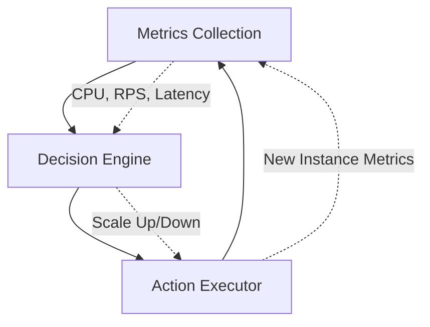

# How to Implement Load Balancer Autoscaling

Author: [nawazdhandala](https://www.github.com/nawazdhandala)

Tags: Load Balancing, Autoscaling, Kubernetes, AWS, Cloud, DevOps, High Availability

Description: A hands-on guide to implementing autoscaling for load-balanced applications, covering cloud-native solutions, Kubernetes HPA, and custom scaling strategies.

---

Traffic spikes do not send calendar invites. Your Black Friday sale, viral tweet, or unexpected bot attack will arrive without warning, and your infrastructure needs to scale before users start seeing 503 errors. Load balancer autoscaling is the practice of automatically adjusting backend capacity based on demand while keeping the load balancer itself healthy. This guide covers the patterns, tools, and code you need to build autoscaling that actually works.

## The Autoscaling Triangle

Effective autoscaling requires three components working together:



1. **Metrics Collection:** Gather signals like CPU utilization, request rate, response latency, and queue depth
2. **Decision Engine:** Evaluate metrics against thresholds and decide when to scale
3. **Action Executor:** Spin up or terminate instances and update load balancer configuration

## AWS Auto Scaling with Application Load Balancer

AWS provides native integration between ALB and Auto Scaling Groups. Here is a production-ready Terraform configuration:

```hcl
# Auto Scaling Group with launch template
resource "aws_launch_template" "app" {
  name_prefix   = "app-"
  image_id      = var.ami_id
  instance_type = "t3.medium"

  network_interfaces {
    associate_public_ip_address = false
    security_groups             = [aws_security_group.app.id]
  }

  user_data = base64encode(<<-EOF
    #!/bin/bash
    # Install and start application
    yum install -y docker
    systemctl start docker
    docker run -d -p 8080:8080 ${var.app_image}
  EOF
  )

  tag_specifications {
    resource_type = "instance"
    tags = {
      Name = "app-server"
    }
  }
}

resource "aws_autoscaling_group" "app" {
  name                = "app-asg"
  desired_capacity    = 2
  max_size            = 10
  min_size            = 2
  target_group_arns   = [aws_lb_target_group.app.arn]
  vpc_zone_identifier = var.private_subnet_ids

  launch_template {
    id      = aws_launch_template.app.id
    version = "$Latest"
  }

  # Health check configuration
  health_check_type         = "ELB"
  health_check_grace_period = 300

  # Instance refresh for rolling updates
  instance_refresh {
    strategy = "Rolling"
    preferences {
      min_healthy_percentage = 75
    }
  }

  tag {
    key                 = "Environment"
    value               = "production"
    propagate_at_launch = true
  }
}

# Target Tracking Scaling Policy - CPU Based
resource "aws_autoscaling_policy" "cpu_target" {
  name                   = "cpu-target-tracking"
  autoscaling_group_name = aws_autoscaling_group.app.name
  policy_type            = "TargetTrackingScaling"

  target_tracking_configuration {
    predefined_metric_specification {
      predefined_metric_type = "ASGAverageCPUUtilization"
    }
    target_value = 70.0
  }
}

# Target Tracking Scaling Policy - Request Count Based
resource "aws_autoscaling_policy" "request_count" {
  name                   = "request-count-tracking"
  autoscaling_group_name = aws_autoscaling_group.app.name
  policy_type            = "TargetTrackingScaling"

  target_tracking_configuration {
    predefined_metric_specification {
      predefined_metric_type = "ALBRequestCountPerTarget"
      resource_label         = "${aws_lb.app.arn_suffix}/${aws_lb_target_group.app.arn_suffix}"
    }
    target_value = 1000.0  # requests per target per minute
  }
}

# Step Scaling for rapid scale-out during traffic spikes
resource "aws_autoscaling_policy" "scale_out_fast" {
  name                   = "scale-out-fast"
  autoscaling_group_name = aws_autoscaling_group.app.name
  policy_type            = "StepScaling"
  adjustment_type        = "ChangeInCapacity"

  step_adjustment {
    scaling_adjustment          = 2
    metric_interval_lower_bound = 0
    metric_interval_upper_bound = 20
  }

  step_adjustment {
    scaling_adjustment          = 4
    metric_interval_lower_bound = 20
  }
}

# CloudWatch alarm to trigger step scaling
resource "aws_cloudwatch_metric_alarm" "high_cpu" {
  alarm_name          = "app-high-cpu"
  comparison_operator = "GreaterThanThreshold"
  evaluation_periods  = 2
  metric_name         = "CPUUtilization"
  namespace           = "AWS/EC2"
  period              = 60
  statistic           = "Average"
  threshold           = 80

  dimensions = {
    AutoScalingGroupName = aws_autoscaling_group.app.name
  }

  alarm_actions = [aws_autoscaling_policy.scale_out_fast.arn]
}
```

## Kubernetes Horizontal Pod Autoscaler

For Kubernetes deployments, HPA automatically scales pods based on metrics:

```yaml
# deployment.yaml
apiVersion: apps/v1
kind: Deployment
metadata:
  name: api-server
  labels:
    app: api-server
spec:
  replicas: 3
  selector:
    matchLabels:
      app: api-server
  template:
    metadata:
      labels:
        app: api-server
    spec:
      containers:
      - name: api
        image: myregistry/api-server:v1.2.3
        ports:
        - containerPort: 8080
        resources:
          requests:
            cpu: "250m"
            memory: "512Mi"
          limits:
            cpu: "1000m"
            memory: "1Gi"
        readinessProbe:
          httpGet:
            path: /health
            port: 8080
          initialDelaySeconds: 5
          periodSeconds: 10
        livenessProbe:
          httpGet:
            path: /health
            port: 8080
          initialDelaySeconds: 15
          periodSeconds: 20
---
# hpa.yaml - Basic CPU-based autoscaling
apiVersion: autoscaling/v2
kind: HorizontalPodAutoscaler
metadata:
  name: api-server-hpa
spec:
  scaleTargetRef:
    apiVersion: apps/v1
    kind: Deployment
    name: api-server
  minReplicas: 3
  maxReplicas: 50
  metrics:
  - type: Resource
    resource:
      name: cpu
      target:
        type: Utilization
        averageUtilization: 70
  - type: Resource
    resource:
      name: memory
      target:
        type: Utilization
        averageUtilization: 80
  behavior:
    scaleDown:
      stabilizationWindowSeconds: 300  # Wait 5 min before scaling down
      policies:
      - type: Percent
        value: 10
        periodSeconds: 60
    scaleUp:
      stabilizationWindowSeconds: 0  # Scale up immediately
      policies:
      - type: Percent
        value: 100
        periodSeconds: 15
      - type: Pods
        value: 4
        periodSeconds: 15
      selectPolicy: Max
```

### Custom Metrics Autoscaling with KEDA

KEDA (Kubernetes Event-driven Autoscaling) enables scaling based on external metrics:

```yaml
# keda-scaledobject.yaml
apiVersion: keda.sh/v1alpha1
kind: ScaledObject
metadata:
  name: api-server-scaler
spec:
  scaleTargetRef:
    name: api-server
  minReplicaCount: 3
  maxReplicaCount: 100
  pollingInterval: 15
  cooldownPeriod: 300
  triggers:
  # Scale based on Prometheus metrics
  - type: prometheus
    metadata:
      serverAddress: http://prometheus.monitoring:9090
      metricName: http_requests_per_second
      query: sum(rate(http_requests_total{app="api-server"}[2m]))
      threshold: "100"
  # Scale based on RabbitMQ queue depth
  - type: rabbitmq
    metadata:
      host: amqp://rabbitmq.default:5672
      queueName: tasks
      queueLength: "50"
  # Scale based on Redis list length
  - type: redis
    metadata:
      address: redis.default:6379
      listName: job-queue
      listLength: "100"
```

## Load Balancer Health Checks and Draining

Autoscaling only works if your load balancer correctly identifies healthy instances. Configure proper health checks and connection draining:

```yaml
# Kubernetes Service with proper health check annotations for AWS NLB
apiVersion: v1
kind: Service
metadata:
  name: api-service
  annotations:
    # Use target group health check
    service.beta.kubernetes.io/aws-load-balancer-healthcheck-protocol: HTTP
    service.beta.kubernetes.io/aws-load-balancer-healthcheck-path: /health
    service.beta.kubernetes.io/aws-load-balancer-healthcheck-interval: "10"
    service.beta.kubernetes.io/aws-load-balancer-healthcheck-timeout: "5"
    service.beta.kubernetes.io/aws-load-balancer-healthcheck-healthy-threshold: "2"
    service.beta.kubernetes.io/aws-load-balancer-healthcheck-unhealthy-threshold: "2"
    # Enable connection draining
    service.beta.kubernetes.io/aws-load-balancer-connection-draining-enabled: "true"
    service.beta.kubernetes.io/aws-load-balancer-connection-draining-timeout: "60"
spec:
  type: LoadBalancer
  selector:
    app: api-server
  ports:
  - port: 80
    targetPort: 8080
```

## Scaling Patterns

```mermaid
flowchart TD
    subgraph "Reactive Scaling"
        R1[Traffic Spike] --> R2[Metrics Breach Threshold]
        R2 --> R3[Scale Up]
        R3 --> R4[Traffic Handled]
    end

    subgraph "Predictive Scaling"
        P1[Historical Data] --> P2[ML Model]
        P2 --> P3[Predicted Demand]
        P3 --> P4[Pre-scale Before Spike]
    end

    subgraph "Scheduled Scaling"
        S1[Cron Schedule] --> S2[Known Peak Times]
        S2 --> S3[Scale to Expected Capacity]
    end
```



### Predictive Scaling with AWS

AWS offers predictive scaling that uses machine learning to forecast traffic:

```hcl
resource "aws_autoscaling_policy" "predictive" {
  name                   = "predictive-scaling"
  autoscaling_group_name = aws_autoscaling_group.app.name
  policy_type            = "PredictiveScaling"

  predictive_scaling_configuration {
    metric_specification {
      target_value = 70

      predefined_load_metric_specification {
        predefined_metric_type = "ASGTotalCPUUtilization"
      }

      predefined_scaling_metric_specification {
        predefined_metric_type = "ASGAverageCPUUtilization"
      }
    }

    mode                         = "ForecastAndScale"
    scheduling_buffer_time       = 300  # Scale 5 min before predicted spike
    max_capacity_breach_behavior = "IncreaseMaxCapacity"
    max_capacity_buffer          = 10
  }
}
```

### Scheduled Scaling for Known Patterns

If you know your traffic patterns, schedule capacity changes:

```hcl
# Scale up for business hours
resource "aws_autoscaling_schedule" "business_hours_up" {
  scheduled_action_name  = "business-hours-scale-up"
  autoscaling_group_name = aws_autoscaling_group.app.name
  min_size               = 5
  max_size               = 20
  desired_capacity       = 10
  recurrence             = "0 8 * * MON-FRI"  # 8 AM weekdays
  time_zone              = "America/New_York"
}

# Scale down after hours
resource "aws_autoscaling_schedule" "after_hours_down" {
  scheduled_action_name  = "after-hours-scale-down"
  autoscaling_group_name = aws_autoscaling_group.app.name
  min_size               = 2
  max_size               = 10
  desired_capacity       = 2
  recurrence             = "0 20 * * MON-FRI"  # 8 PM weekdays
  time_zone              = "America/New_York"
}
```

## Custom Autoscaling Logic

Sometimes built-in solutions are not enough. Here is a Python script for custom autoscaling decisions:

```python
#!/usr/bin/env python3
"""
Custom autoscaler that considers multiple signals.
Run as a Kubernetes CronJob or standalone service.
"""

import boto3
import requests
from dataclasses import dataclass
from typing import List
import logging

logging.basicConfig(level=logging.INFO)
logger = logging.getLogger(__name__)

@dataclass
class ScalingSignal:
    name: str
    current_value: float
    threshold: float
    weight: float

    @property
    def breach_ratio(self) -> float:
        """How much the signal exceeds threshold (1.0 = at threshold)"""
        return self.current_value / self.threshold

def collect_signals() -> List[ScalingSignal]:
    """Gather metrics from various sources"""
    signals = []

    # CPU from CloudWatch
    cloudwatch = boto3.client('cloudwatch')
    cpu_response = cloudwatch.get_metric_statistics(
        Namespace='AWS/EC2',
        MetricName='CPUUtilization',
        Dimensions=[{'Name': 'AutoScalingGroupName', 'Value': 'app-asg'}],
        StartTime=datetime.utcnow() - timedelta(minutes=5),
        EndTime=datetime.utcnow(),
        Period=60,
        Statistics=['Average']
    )
    if cpu_response['Datapoints']:
        avg_cpu = sum(d['Average'] for d in cpu_response['Datapoints']) / len(cpu_response['Datapoints'])
        signals.append(ScalingSignal('cpu', avg_cpu, 70.0, weight=0.4))

    # Request latency from application metrics
    try:
        metrics_response = requests.get('http://prometheus:9090/api/v1/query', params={
            'query': 'histogram_quantile(0.95, rate(http_request_duration_seconds_bucket[5m]))'
        })
        p95_latency = float(metrics_response.json()['data']['result'][0]['value'][1])
        signals.append(ScalingSignal('p95_latency', p95_latency * 1000, 200.0, weight=0.3))  # ms
    except Exception as e:
        logger.warning(f"Failed to get latency metrics: {e}")

    # Queue depth from SQS
    sqs = boto3.client('sqs')
    queue_attrs = sqs.get_queue_attributes(
        QueueUrl='https://sqs.us-east-1.amazonaws.com/123456789/tasks',
        AttributeNames=['ApproximateNumberOfMessages']
    )
    queue_depth = int(queue_attrs['Attributes']['ApproximateNumberOfMessages'])
    signals.append(ScalingSignal('queue_depth', queue_depth, 1000.0, weight=0.3))

    return signals

def calculate_desired_capacity(signals: List[ScalingSignal], current_capacity: int, min_cap: int, max_cap: int) -> int:
    """Calculate target capacity based on weighted signals"""

    # Weighted breach ratio
    total_weight = sum(s.weight for s in signals)
    weighted_breach = sum(s.breach_ratio * s.weight for s in signals) / total_weight

    logger.info(f"Weighted breach ratio: {weighted_breach:.2f}")

    # Scale up if breach > 1.0, scale down if breach < 0.7
    if weighted_breach > 1.0:
        # Scale up proportionally to breach
        scale_factor = min(weighted_breach, 2.0)  # Cap at 2x
        desired = int(current_capacity * scale_factor)
    elif weighted_breach < 0.7:
        # Scale down conservatively
        desired = int(current_capacity * 0.9)
    else:
        desired = current_capacity

    # Clamp to min/max
    return max(min_cap, min(max_cap, desired))

def apply_scaling(desired_capacity: int):
    """Update ASG desired capacity"""
    autoscaling = boto3.client('autoscaling')
    autoscaling.set_desired_capacity(
        AutoScalingGroupName='app-asg',
        DesiredCapacity=desired_capacity,
        HonorCooldown=True
    )
    logger.info(f"Set desired capacity to {desired_capacity}")

def main():
    autoscaling = boto3.client('autoscaling')

    # Get current state
    asg = autoscaling.describe_auto_scaling_groups(AutoScalingGroupNames=['app-asg'])['AutoScalingGroups'][0]
    current = asg['DesiredCapacity']
    min_cap = asg['MinSize']
    max_cap = asg['MaxSize']

    # Collect and evaluate
    signals = collect_signals()
    for s in signals:
        logger.info(f"Signal {s.name}: {s.current_value:.2f} / {s.threshold:.2f} (weight: {s.weight})")

    desired = calculate_desired_capacity(signals, current, min_cap, max_cap)

    if desired != current:
        logger.info(f"Scaling from {current} to {desired}")
        apply_scaling(desired)
    else:
        logger.info(f"No scaling needed, maintaining {current} instances")

if __name__ == '__main__':
    main()
```

## Autoscaling Best Practices

**1. Set appropriate cooldown periods:** Prevent thrashing by waiting between scale events. Scale up fast, scale down slow.

**2. Use multiple metrics:** CPU alone is not enough. Combine CPU, memory, request latency, and queue depth.

**3. Test your limits:** Run load tests to verify scaling actually works before you need it in production.

**4. Monitor scaling events:** Track scale-up and scale-down events in your observability platform. Alert on scaling failures.

**5. Plan for cold start:** New instances take time to warm up. Account for JIT compilation, cache warming, and connection pool initialization.

**6. Set realistic min/max bounds:** Too low a minimum risks service degradation. Too high a maximum risks runaway costs.

## Monitoring Autoscaling Health

Create dashboards that show:

- Current vs desired capacity over time
- Scaling event frequency and triggers
- Time from scale decision to instance serving traffic
- Cost impact of scaling decisions
- Failed scaling attempts

---

Autoscaling transforms your infrastructure from a fixed cost to a variable cost that matches demand. The key is choosing the right metrics to scale on, setting appropriate thresholds and cooldowns, and monitoring the system to ensure it responds correctly. Start with simple target tracking policies, add predictive scaling for known patterns, and build custom logic only when the built-in solutions fall short. Whatever approach you take, test it thoroughly before traffic spikes reveal the gaps.
