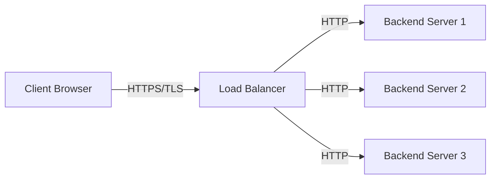
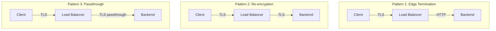

# How to Configure Load Balancer SSL Termination

Author: [nawazdhandala](https://www.github.com/nawazdhandala)

Tags: Load Balancing, SSL, TLS, Networking, Security, HTTPS, DevOps

Description: A practical guide to configuring SSL termination on load balancers, covering certificate management, cipher suites, and backend communication patterns.

---

SSL termination at the load balancer is one of those decisions that seems simple until you realize how many ways it can go wrong. Terminate too early without securing backend traffic and you expose sensitive data on your internal network. Terminate at the wrong layer and your application servers choke on cryptographic overhead. This guide walks through the why, the how, and the gotchas of SSL termination done right.

## What is SSL Termination?

SSL termination (or TLS termination) is the process of decrypting encrypted HTTPS traffic at the load balancer before forwarding requests to backend servers. The load balancer handles the CPU-intensive cryptographic operations, and backend servers receive plain HTTP traffic.



## Why Terminate SSL at the Load Balancer?

**Performance:** TLS handshakes are expensive. A single RSA-2048 handshake can consume 10ms of CPU time. Offloading this to dedicated load balancer hardware (or optimized software) frees your application servers to handle business logic.

**Certificate Management:** Managing certificates on one load balancer is simpler than managing them across dozens of backend servers. When renewal time comes, you update one place.

**Centralized Security Policy:** Cipher suites, protocol versions, and HSTS headers live in one configuration file instead of scattered across your fleet.

## Basic NGINX SSL Termination Configuration

Here is a production-ready NGINX configuration for SSL termination:

```nginx
# /etc/nginx/conf.d/ssl-termination.conf

upstream backend_pool {
    # Health checks and load balancing
    least_conn;
    server 10.0.1.10:8080 weight=5;
    server 10.0.1.11:8080 weight=5;
    server 10.0.1.12:8080 weight=5;

    # Keep connections alive to backends
    keepalive 32;
}

server {
    listen 443 ssl http2;
    server_name api.example.com;

    # Certificate and key paths
    ssl_certificate /etc/nginx/ssl/api.example.com.crt;
    ssl_certificate_key /etc/nginx/ssl/api.example.com.key;

    # Modern TLS configuration (TLS 1.2+ only)
    ssl_protocols TLSv1.2 TLSv1.3;

    # Secure cipher suite - prefers ECDHE for forward secrecy
    ssl_ciphers ECDHE-ECDSA-AES128-GCM-SHA256:ECDHE-RSA-AES128-GCM-SHA256:ECDHE-ECDSA-AES256-GCM-SHA384:ECDHE-RSA-AES256-GCM-SHA384;
    ssl_prefer_server_ciphers on;

    # SSL session caching for performance
    ssl_session_cache shared:SSL:10m;
    ssl_session_timeout 1d;
    ssl_session_tickets off;

    # OCSP stapling for faster certificate validation
    ssl_stapling on;
    ssl_stapling_verify on;
    resolver 8.8.8.8 8.8.4.4 valid=300s;
    resolver_timeout 5s;

    # Security headers
    add_header Strict-Transport-Security "max-age=63072000" always;
    add_header X-Content-Type-Options nosniff;
    add_header X-Frame-Options DENY;

    location / {
        proxy_pass http://backend_pool;

        # Pass original client information to backends
        proxy_set_header Host $host;
        proxy_set_header X-Real-IP $remote_addr;
        proxy_set_header X-Forwarded-For $proxy_add_x_forwarded_for;
        proxy_set_header X-Forwarded-Proto $scheme;

        # Connection pooling to backends
        proxy_http_version 1.1;
        proxy_set_header Connection "";
    }
}

# Redirect HTTP to HTTPS
server {
    listen 80;
    server_name api.example.com;
    return 301 https://$server_name$request_uri;
}
```

## HAProxy SSL Termination

HAProxy offers fine-grained control over SSL termination. Here is an equivalent configuration:

```haproxy
# /etc/haproxy/haproxy.cfg

global
    # SSL/TLS settings
    ssl-default-bind-ciphers ECDHE-ECDSA-AES128-GCM-SHA256:ECDHE-RSA-AES128-GCM-SHA256
    ssl-default-bind-options ssl-min-ver TLSv1.2 no-tls-tickets

    # Increase DH param size for better security
    tune.ssl.default-dh-param 2048

    # Maximum SSL session cache entries
    tune.ssl.cachesize 100000

defaults
    mode http
    timeout connect 5s
    timeout client 30s
    timeout server 30s
    option httplog

frontend https_frontend
    bind *:443 ssl crt /etc/haproxy/certs/api.example.com.pem alpn h2,http/1.1

    # HSTS header
    http-response set-header Strict-Transport-Security max-age=63072000

    # Pass client cert info if using mTLS
    http-request set-header X-SSL-Client-CN %{+Q}[ssl_c_s_dn(cn)]
    http-request set-header X-SSL-Client-Verify %[ssl_c_verify]

    # Route to backend
    default_backend app_servers

frontend http_frontend
    bind *:80
    # Redirect all HTTP to HTTPS
    http-request redirect scheme https code 301

backend app_servers
    balance leastconn
    option httpchk GET /health

    # Forward original protocol
    http-request set-header X-Forwarded-Proto https

    server app1 10.0.1.10:8080 check
    server app2 10.0.1.11:8080 check
    server app3 10.0.1.12:8080 check
```

## AWS Application Load Balancer SSL Configuration

For cloud deployments, AWS ALB handles SSL termination with ACM (AWS Certificate Manager):

```hcl
# Terraform configuration for AWS ALB with SSL termination

resource "aws_lb" "api" {
  name               = "api-load-balancer"
  internal           = false
  load_balancer_type = "application"
  security_groups    = [aws_security_group.alb.id]
  subnets            = var.public_subnet_ids

  enable_deletion_protection = true
}

# HTTPS listener with ACM certificate
resource "aws_lb_listener" "https" {
  load_balancer_arn = aws_lb.api.arn
  port              = 443
  protocol          = "HTTPS"
  ssl_policy        = "ELBSecurityPolicy-TLS13-1-2-2021-06"
  certificate_arn   = aws_acm_certificate.api.arn

  default_action {
    type             = "forward"
    target_group_arn = aws_lb_target_group.api.arn
  }
}

# HTTP to HTTPS redirect
resource "aws_lb_listener" "http" {
  load_balancer_arn = aws_lb.api.arn
  port              = 80
  protocol          = "HTTP"

  default_action {
    type = "redirect"
    redirect {
      port        = "443"
      protocol    = "HTTPS"
      status_code = "HTTP_301"
    }
  }
}

# Target group sends plain HTTP to backends
resource "aws_lb_target_group" "api" {
  name     = "api-targets"
  port     = 8080
  protocol = "HTTP"
  vpc_id   = var.vpc_id

  health_check {
    enabled             = true
    healthy_threshold   = 2
    interval            = 30
    matcher             = "200"
    path                = "/health"
    port                = "traffic-port"
    protocol            = "HTTP"
    timeout             = 5
    unhealthy_threshold = 2
  }
}
```

## SSL Termination Patterns



### Pattern 1: Edge Termination (Most Common)

SSL terminates at the load balancer. Backend traffic is plain HTTP. Use this when:
- Your internal network is trusted (private VPC, isolated VLAN)
- You want maximum performance
- Backend servers lack the resources for TLS

### Pattern 2: Re-encryption

SSL terminates at the load balancer, then a new TLS connection is established to backends. Use this when:
- Compliance requires encryption in transit everywhere
- Traffic crosses untrusted network segments
- You need to inspect traffic at the load balancer

```nginx
# NGINX re-encryption to backend
location / {
    proxy_pass https://backend_pool;
    proxy_ssl_verify on;
    proxy_ssl_trusted_certificate /etc/nginx/ssl/backend-ca.crt;
    proxy_ssl_session_reuse on;
}
```

### Pattern 3: TLS Passthrough

The load balancer does not decrypt traffic. It forwards encrypted packets directly to backends based on SNI (Server Name Indication). Use this when:
- End-to-end encryption is mandatory
- You cannot or will not manage certificates at the load balancer
- mTLS (mutual TLS) is required between client and server

## Certificate Management Best Practices

### Automated Certificate Renewal with Certbot

```bash
#!/bin/bash
# /opt/scripts/renew-certs.sh

# Renew certificates
certbot renew --quiet

# Reload NGINX to pick up new certs
systemctl reload nginx

# Verify the certificate
openssl x509 -in /etc/letsencrypt/live/api.example.com/fullchain.pem -noout -dates
```

Add to crontab:
```bash
# Run twice daily (certbot only renews if expiry < 30 days)
0 0,12 * * * /opt/scripts/renew-certs.sh >> /var/log/cert-renewal.log 2>&1
```

### Certificate Chain Verification

Always verify your certificate chain is complete:

```bash
# Check certificate chain
openssl s_client -connect api.example.com:443 -servername api.example.com < /dev/null 2>/dev/null | openssl x509 -noout -dates -subject -issuer

# Verify chain is complete (should show full path to root)
openssl s_client -connect api.example.com:443 -showcerts < /dev/null 2>/dev/null
```

## Common Mistakes and How to Avoid Them

**1. Missing intermediate certificates:** Your browser works because it caches intermediates, but API clients fail. Always include the full chain.

**2. Forgetting X-Forwarded-Proto:** Your application sees HTTP and generates wrong URLs. Pass the original protocol header.

**3. Weak cipher suites:** Old configurations allow SSLv3 or weak ciphers. Test with SSL Labs.

**4. No HSTS header:** Users can be downgraded to HTTP. Add Strict-Transport-Security.

**5. Session ticket keys not rotated:** Same session ticket key for months. Disable tickets or rotate keys regularly.

## Testing Your SSL Configuration

Use these tools to validate your setup:

```bash
# Test TLS configuration with SSL Labs (online)
# Visit: https://www.ssllabs.com/ssltest/

# Local testing with testssl.sh
docker run --rm -ti drwetter/testssl.sh api.example.com

# Quick cipher check
nmap --script ssl-enum-ciphers -p 443 api.example.com

# Verify certificate expiry
echo | openssl s_client -connect api.example.com:443 2>/dev/null | openssl x509 -noout -enddate
```

## Monitoring SSL Termination

Track these metrics in your observability platform:

- **SSL handshake time:** Should be under 50ms for most clients
- **Certificate expiry days remaining:** Alert at 30, 14, and 7 days
- **TLS protocol version distribution:** Track TLS 1.2 vs 1.3 adoption
- **Cipher suite usage:** Identify clients using weak ciphers
- **SSL session reuse rate:** Higher is better for performance

---

SSL termination at the load balancer is the right choice for most architectures. It centralizes certificate management, improves performance, and simplifies backend configuration. The key is choosing the right pattern for your security requirements: edge termination for trusted networks, re-encryption for zero-trust environments, and passthrough when end-to-end encryption is non-negotiable. Whatever you choose, automate certificate renewal, monitor expiry dates, and test your configuration regularly. A misconfigured SSL setup is worse than no SSL at all because it creates a false sense of security.
