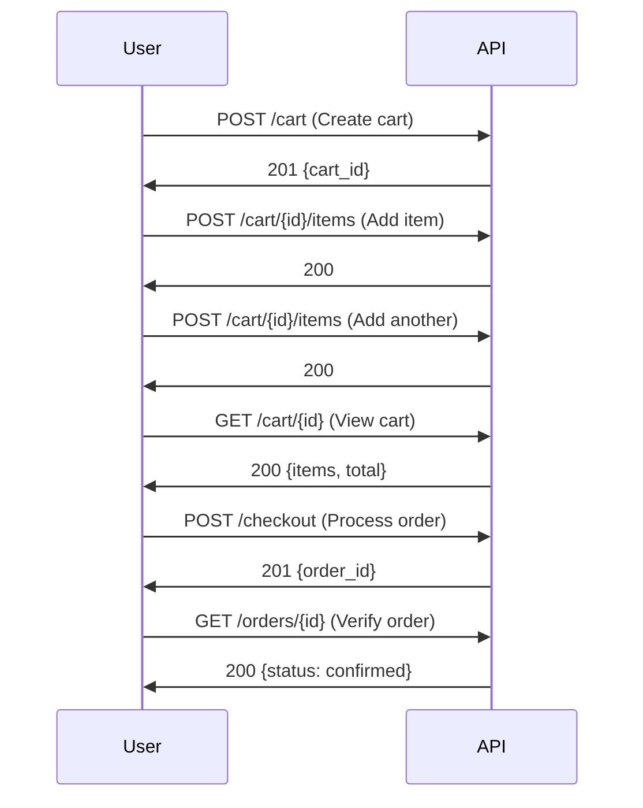

# How to Use Locust for API Testing

Author: [nawazdhandala](https://www.github.com/nawazdhandala)

Tags: Locust, API Testing, Load Testing, REST API, GraphQL, Performance Testing, Python

Description: Learn how to use Locust for comprehensive API load testing including REST endpoints, GraphQL, authentication flows, and file uploads.

---

APIs are the backbone of modern applications, and their performance directly impacts user experience. Locust excels at API load testing because it lets you write test scenarios in Python, giving you full control over request construction, response validation, and test flow logic.

This guide covers practical patterns for testing REST APIs, GraphQL endpoints, authenticated requests, and complex API workflows with Locust.

---

## Basic REST API Testing

Start with fundamental CRUD operations:

```python
# locustfile.py - Basic REST API testing
from locust import HttpUser, task, between
import json

class RestApiUser(HttpUser):
    wait_time = between(1, 3)

    def on_start(self):
        """Setup before user starts making requests."""
        # Store data created during tests for cleanup
        self.created_ids = []

    def on_stop(self):
        """Cleanup when user stops."""
        for resource_id in self.created_ids:
            self.client.delete(f"/api/resources/{resource_id}")

    @task(5)
    def get_resources(self):
        """GET - List resources"""
        with self.client.get("/api/resources", catch_response=True) as response:
            if response.status_code == 200:
                data = response.json()
                if isinstance(data, list):
                    response.success()
                else:
                    response.failure("Expected list response")
            else:
                response.failure(f"Status: {response.status_code}")

    @task(3)
    def get_single_resource(self):
        """GET - Single resource"""
        with self.client.get("/api/resources/1", catch_response=True) as response:
            if response.status_code in [200, 404]:
                response.success()
            else:
                response.failure(f"Unexpected status: {response.status_code}")

    @task(2)
    def create_resource(self):
        """POST - Create resource"""
        payload = {
            "name": f"Test Resource",
            "description": "Created by load test",
            "type": "test"
        }

        with self.client.post("/api/resources",
                             json=payload,
                             catch_response=True) as response:
            if response.status_code == 201:
                data = response.json()
                if 'id' in data:
                    self.created_ids.append(data['id'])
                    response.success()
                else:
                    response.failure("No ID in response")
            else:
                response.failure(f"Status: {response.status_code}")

    @task(1)
    def update_resource(self):
        """PUT - Update resource"""
        if not self.created_ids:
            return

        resource_id = self.created_ids[-1]
        payload = {
            "name": "Updated Resource",
            "description": "Modified by load test"
        }

        with self.client.put(f"/api/resources/{resource_id}",
                            json=payload,
                            catch_response=True) as response:
            if response.status_code in [200, 204]:
                response.success()
            else:
                response.failure(f"Status: {response.status_code}")

    @task(1)
    def delete_resource(self):
        """DELETE - Remove resource"""
        if not self.created_ids:
            return

        resource_id = self.created_ids.pop()

        with self.client.delete(f"/api/resources/{resource_id}",
                               catch_response=True) as response:
            if response.status_code in [200, 204, 404]:
                response.success()
            else:
                response.failure(f"Status: {response.status_code}")
```

---

## API Request Architecture


---

## Authentication Patterns

### JWT Token Authentication

```python
# locustfile.py - JWT authentication
from locust import HttpUser, task, between
import time

class JwtAuthUser(HttpUser):
    wait_time = between(1, 2)

    def __init__(self, *args, **kwargs):
        super().__init__(*args, **kwargs)
        self.token = None
        self.token_expiry = 0

    def get_token(self):
        """Obtain or refresh JWT token."""
        # Check if token is still valid (with 60s buffer)
        if self.token and time.time() < (self.token_expiry - 60):
            return self.token

        # Login to get new token
        response = self.client.post("/api/auth/login", json={
            "username": "testuser",
            "password": "testpass"
        }, name="/api/auth/login [token refresh]")

        if response.status_code == 200:
            data = response.json()
            self.token = data['access_token']
            # Assume token valid for 1 hour
            self.token_expiry = time.time() + 3600
            return self.token
        else:
            raise Exception(f"Login failed: {response.status_code}")

    def on_start(self):
        """Get initial token."""
        self.get_token()

    @task
    def authenticated_request(self):
        """Make request with JWT token."""
        token = self.get_token()

        headers = {
            "Authorization": f"Bearer {token}"
        }

        with self.client.get("/api/protected/data",
                            headers=headers,
                            catch_response=True) as response:
            if response.status_code == 200:
                response.success()
            elif response.status_code == 401:
                # Token expired, force refresh
                self.token = None
                response.failure("Token expired")
            else:
                response.failure(f"Status: {response.status_code}")
```

### OAuth2 Client Credentials

```python
# locustfile.py - OAuth2 client credentials flow
from locust import HttpUser, task, between
import time

class OAuth2User(HttpUser):
    wait_time = between(1, 2)

    # OAuth2 config
    TOKEN_URL = "https://auth.example.com/oauth/token"
    CLIENT_ID = "your_client_id"
    CLIENT_SECRET = "your_client_secret"

    def __init__(self, *args, **kwargs):
        super().__init__(*args, **kwargs)
        self.access_token = None
        self.token_expiry = 0

    def get_access_token(self):
        """Get OAuth2 access token using client credentials."""
        if self.access_token and time.time() < (self.token_expiry - 60):
            return self.access_token

        response = self.client.post(
            self.TOKEN_URL,
            data={
                "grant_type": "client_credentials",
                "client_id": self.CLIENT_ID,
                "client_secret": self.CLIENT_SECRET,
                "scope": "read write"
            },
            name="/oauth/token [auth]"
        )

        if response.status_code == 200:
            data = response.json()
            self.access_token = data['access_token']
            self.token_expiry = time.time() + data.get('expires_in', 3600)
            return self.access_token
        else:
            raise Exception(f"OAuth2 token request failed: {response.status_code}")

    def on_start(self):
        self.get_access_token()

    @task
    def api_request(self):
        token = self.get_access_token()

        response = self.client.get(
            "/api/data",
            headers={"Authorization": f"Bearer {token}"}
        )
```

### API Key Authentication

```python
# locustfile.py - API key authentication
from locust import HttpUser, task, between
import os

class ApiKeyUser(HttpUser):
    wait_time = between(1, 2)

    def on_start(self):
        """Set up API key header."""
        api_key = os.getenv("API_KEY", "test-api-key")

        # Some APIs use header
        self.client.headers.update({
            "X-API-Key": api_key
        })

        # Or query parameter approach
        self.api_key = api_key

    @task
    def header_auth_request(self):
        """Request with API key in header."""
        self.client.get("/api/data")

    @task
    def query_param_auth_request(self):
        """Request with API key in query params."""
        self.client.get("/api/data", params={"api_key": self.api_key})
```

---

## GraphQL Testing

```python
# locustfile.py - GraphQL API testing
from locust import HttpUser, task, between
import json

class GraphQLUser(HttpUser):
    wait_time = between(1, 2)

    def graphql_query(self, query, variables=None, operation_name=None):
        """Execute a GraphQL query."""
        payload = {"query": query}

        if variables:
            payload["variables"] = variables
        if operation_name:
            payload["operationName"] = operation_name

        return self.client.post(
            "/graphql",
            json=payload,
            headers={"Content-Type": "application/json"}
        )

    @task(3)
    def query_users(self):
        """GraphQL query for users list."""
        query = """
        query GetUsers($limit: Int, $offset: Int) {
            users(limit: $limit, offset: $offset) {
                id
                name
                email
                createdAt
            }
        }
        """

        with self.graphql_query(
            query,
            variables={"limit": 10, "offset": 0}
        ) as response:
            if response.status_code == 200:
                data = response.json()
                if "errors" in data:
                    response.failure(f"GraphQL errors: {data['errors']}")
                elif "data" in data and data["data"]["users"]:
                    response.success()
                else:
                    response.failure("No users in response")

    @task(2)
    def query_single_user(self):
        """GraphQL query for single user."""
        query = """
        query GetUser($id: ID!) {
            user(id: $id) {
                id
                name
                email
                posts {
                    id
                    title
                }
            }
        }
        """

        with self.graphql_query(query, variables={"id": "1"}) as response:
            if response.status_code == 200:
                data = response.json()
                if "errors" not in data:
                    response.success()
                else:
                    response.failure(str(data["errors"]))

    @task(1)
    def create_user_mutation(self):
        """GraphQL mutation to create user."""
        mutation = """
        mutation CreateUser($input: CreateUserInput!) {
            createUser(input: $input) {
                id
                name
                email
            }
        }
        """

        variables = {
            "input": {
                "name": "Load Test User",
                "email": f"loadtest_{id(self)}@example.com"
            }
        }

        with self.graphql_query(mutation, variables=variables) as response:
            if response.status_code == 200:
                data = response.json()
                if "errors" not in data and data.get("data", {}).get("createUser"):
                    response.success()
                else:
                    response.failure(f"Mutation failed: {data}")
```

---

## File Upload Testing

```python
# locustfile.py - File upload API testing
from locust import HttpUser, task, between
import io
import os

class FileUploadUser(HttpUser):
    wait_time = between(2, 5)

    def generate_file(self, size_kb=100):
        """Generate a file-like object for upload."""
        content = b"x" * (size_kb * 1024)
        return io.BytesIO(content)

    @task
    def upload_small_file(self):
        """Upload a small file (100KB)."""
        file_content = self.generate_file(100)

        files = {
            'file': ('test_small.txt', file_content, 'text/plain')
        }

        with self.client.post("/api/upload",
                             files=files,
                             catch_response=True,
                             name="/api/upload [small]") as response:
            if response.status_code in [200, 201]:
                response.success()
            else:
                response.failure(f"Upload failed: {response.status_code}")

    @task
    def upload_large_file(self):
        """Upload a larger file (1MB)."""
        file_content = self.generate_file(1024)

        files = {
            'file': ('test_large.bin', file_content, 'application/octet-stream')
        }

        with self.client.post("/api/upload",
                             files=files,
                             catch_response=True,
                             name="/api/upload [large]") as response:
            if response.status_code in [200, 201]:
                response.success()
            else:
                response.failure(f"Upload failed: {response.status_code}")

    @task
    def upload_with_metadata(self):
        """Upload file with additional form data."""
        file_content = self.generate_file(50)

        files = {
            'file': ('document.pdf', file_content, 'application/pdf')
        }

        data = {
            'title': 'Test Document',
            'description': 'Uploaded via load test',
            'category': 'testing'
        }

        with self.client.post("/api/documents",
                             files=files,
                             data=data,
                             catch_response=True) as response:
            if response.status_code in [200, 201]:
                response.success()
            else:
                response.failure(f"Upload failed: {response.status_code}")
```

---

## API Workflow Testing

Test complex multi-step workflows:



```python
# locustfile.py - E-commerce workflow testing
from locust import HttpUser, task, between, SequentialTaskSet
import random

class CheckoutFlow(SequentialTaskSet):
    """Sequential task set for checkout workflow."""

    def __init__(self, *args, **kwargs):
        super().__init__(*args, **kwargs)
        self.cart_id = None
        self.order_id = None

    @task
    def create_cart(self):
        """Step 1: Create shopping cart."""
        with self.client.post("/api/cart",
                             json={},
                             catch_response=True) as response:
            if response.status_code == 201:
                self.cart_id = response.json()['id']
                response.success()
            else:
                response.failure(f"Failed to create cart: {response.status_code}")
                self.interrupt()  # Stop this flow

    @task
    def add_items(self):
        """Step 2: Add items to cart."""
        if not self.cart_id:
            self.interrupt()

        # Add 2-5 items
        for _ in range(random.randint(2, 5)):
            product_id = random.randint(1, 100)

            with self.client.post(
                f"/api/cart/{self.cart_id}/items",
                json={"product_id": product_id, "quantity": 1},
                catch_response=True,
                name="/api/cart/{id}/items"
            ) as response:
                if response.status_code != 200:
                    response.failure(f"Failed to add item: {response.status_code}")

    @task
    def view_cart(self):
        """Step 3: View cart contents."""
        if not self.cart_id:
            self.interrupt()

        with self.client.get(
            f"/api/cart/{self.cart_id}",
            catch_response=True,
            name="/api/cart/{id}"
        ) as response:
            if response.status_code == 200:
                data = response.json()
                if data.get('items') and len(data['items']) > 0:
                    response.success()
                else:
                    response.failure("Cart is empty")
            else:
                response.failure(f"Failed to get cart: {response.status_code}")

    @task
    def checkout(self):
        """Step 4: Process checkout."""
        if not self.cart_id:
            self.interrupt()

        with self.client.post(
            "/api/checkout",
            json={
                "cart_id": self.cart_id,
                "payment_method": "credit_card",
                "shipping_address": {
                    "street": "123 Test St",
                    "city": "Test City",
                    "zip": "12345"
                }
            },
            catch_response=True
        ) as response:
            if response.status_code == 201:
                self.order_id = response.json()['order_id']
                response.success()
            else:
                response.failure(f"Checkout failed: {response.status_code}")

    @task
    def verify_order(self):
        """Step 5: Verify order was created."""
        if not self.order_id:
            self.interrupt()

        with self.client.get(
            f"/api/orders/{self.order_id}",
            catch_response=True,
            name="/api/orders/{id}"
        ) as response:
            if response.status_code == 200:
                data = response.json()
                if data.get('status') in ['confirmed', 'processing']:
                    response.success()
                else:
                    response.failure(f"Unexpected order status: {data.get('status')}")
            else:
                response.failure(f"Order not found: {response.status_code}")

        # Reset for next iteration
        self.cart_id = None
        self.order_id = None

class EcommerceUser(HttpUser):
    wait_time = between(1, 3)
    tasks = [CheckoutFlow]
```

---

## Pagination Testing

```python
# locustfile.py - API pagination testing
from locust import HttpUser, task, between

class PaginationUser(HttpUser):
    wait_time = between(1, 2)

    @task
    def paginate_through_results(self):
        """Test pagination handling."""
        page = 1
        per_page = 20
        total_fetched = 0

        while True:
            with self.client.get(
                "/api/items",
                params={"page": page, "per_page": per_page},
                catch_response=True,
                name="/api/items [paginated]"
            ) as response:
                if response.status_code != 200:
                    response.failure(f"Page {page} failed: {response.status_code}")
                    break

                data = response.json()
                items = data.get('items', [])
                total_fetched += len(items)

                # Check if more pages
                total = data.get('total', 0)
                if total_fetched >= total or len(items) == 0:
                    response.success()
                    break

                # Limit pages to avoid infinite loops
                if page >= 10:
                    response.success()
                    break

                page += 1

    @task
    def cursor_pagination(self):
        """Test cursor-based pagination."""
        cursor = None

        for _ in range(5):  # Fetch up to 5 pages
            params = {"limit": 50}
            if cursor:
                params["cursor"] = cursor

            with self.client.get(
                "/api/items",
                params=params,
                catch_response=True,
                name="/api/items [cursor]"
            ) as response:
                if response.status_code != 200:
                    response.failure(f"Request failed: {response.status_code}")
                    break

                data = response.json()
                cursor = data.get('next_cursor')

                if not cursor:
                    # No more pages
                    response.success()
                    break
```

---

## Rate Limit Testing

```python
# locustfile.py - Test API rate limits
from locust import HttpUser, task, between, events
from collections import defaultdict
import time

rate_limit_hits = defaultdict(int)

class RateLimitUser(HttpUser):
    wait_time = between(0.1, 0.5)  # Fast requests to test limits

    @task
    def test_rate_limit(self):
        """Test how API handles rate limiting."""
        with self.client.get("/api/data", catch_response=True) as response:
            if response.status_code == 200:
                response.success()
            elif response.status_code == 429:
                # Rate limited
                rate_limit_hits['429'] += 1

                # Check retry-after header
                retry_after = response.headers.get('Retry-After')
                if retry_after:
                    print(f"Rate limited. Retry after: {retry_after}s")

                # Mark as expected behavior, not failure
                response.success()
            else:
                response.failure(f"Unexpected status: {response.status_code}")

@events.test_stop.add_listener
def report_rate_limits(environment, **kwargs):
    print(f"\n=== Rate Limit Report ===")
    print(f"429 responses received: {rate_limit_hits['429']}")
    total = environment.stats.total.num_requests
    if total > 0:
        rate = rate_limit_hits['429'] / total * 100
        print(f"Rate limit hit rate: {rate:.1f}%")
```

---

API load testing with Locust gives you the flexibility to test any endpoint pattern, authentication scheme, or workflow complexity. Start with basic CRUD operations to establish baseline performance, then layer on authentication, multi-step workflows, and edge cases like file uploads and pagination. The key is writing realistic test scenarios that mirror actual client behavior, including proper error handling and response validation.

---

OneUptime monitors your APIs in production, complementing Locust load tests with real-time performance data. Correlate your load test findings with actual user experience metrics to ensure your API performance meets expectations under real-world conditions.
