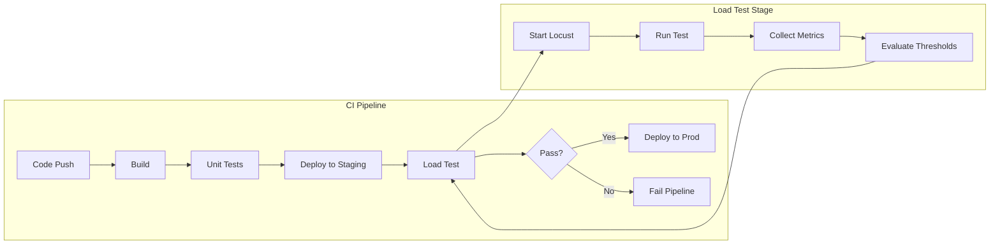
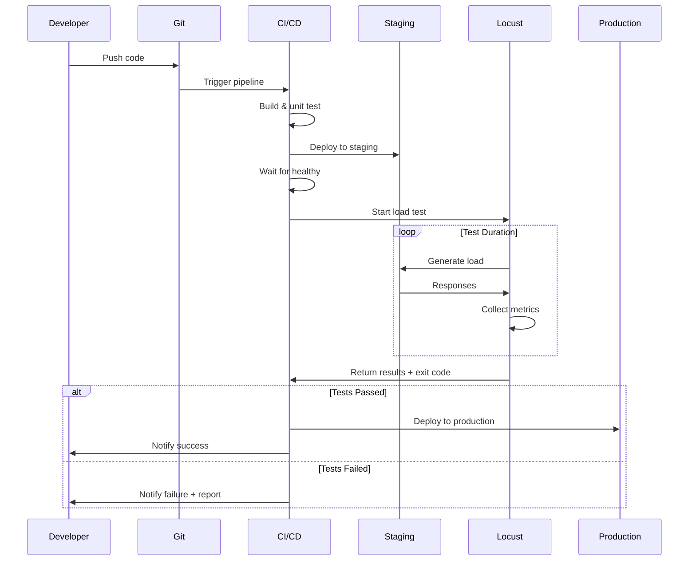

# How to Configure Locust for CI/CD

Author: [nawazdhandala](https://www.github.com/nawazdhandala)

Tags: Locust, CI/CD, Load Testing, GitHub Actions, Jenkins, Performance Testing, Automation

Description: A complete guide to integrating Locust load tests into CI/CD pipelines with automated pass/fail criteria and result reporting.

---

Load testing should not be an afterthought run manually before releases. By integrating Locust into your CI/CD pipeline, you catch performance regressions early, establish baseline metrics, and ensure every deployment meets your performance standards.

This guide covers Locust CI/CD integration patterns for GitHub Actions, GitLab CI, Jenkins, and general principles that apply to any CI system.

---

## CI/CD Integration Architecture



---

## Headless Mode Configuration

For CI/CD, Locust runs without the web UI using command-line parameters:

```bash
# Basic headless run
locust \
    --headless \
    --host=https://staging.example.com \
    --users=100 \
    --spawn-rate=10 \
    --run-time=5m \
    --csv=results \
    --html=report.html

# With exit code based on failure ratio
locust \
    --headless \
    --host=https://staging.example.com \
    --users=50 \
    --spawn-rate=5 \
    --run-time=3m \
    --stop-timeout=10 \
    --exit-code-on-error=1
```

Key flags for CI/CD:
- `--headless`: Run without web UI
- `--users`: Total number of simulated users
- `--spawn-rate`: Users to spawn per second
- `--run-time`: Test duration (e.g., 5m, 1h)
- `--csv`: Export results to CSV files
- `--html`: Generate HTML report
- `--exit-code-on-error`: Return non-zero exit code on failures

---

## Threshold-Based Pass/Fail

Implement custom exit codes based on performance thresholds:

```python
# locustfile.py - CI/CD optimized with thresholds
from locust import HttpUser, task, between, events
import sys

# Performance thresholds
THRESHOLDS = {
    'response_time_p95': 500,     # 95th percentile < 500ms
    'response_time_p99': 1000,    # 99th percentile < 1000ms
    'failure_rate': 1.0,          # Less than 1% failure rate
    'min_rps': 100                # At least 100 requests per second
}

class ThresholdChecker:
    def __init__(self):
        self.passed = True
        self.failures = []

    def check(self, name, actual, threshold, comparison='lt'):
        """Check if metric meets threshold."""
        if comparison == 'lt':
            passed = actual < threshold
        elif comparison == 'gt':
            passed = actual > threshold
        else:
            passed = actual == threshold

        if not passed:
            self.passed = False
            self.failures.append(f"{name}: {actual} (threshold: {threshold})")

        return passed

checker = ThresholdChecker()

@events.quitting.add_listener
def check_thresholds(environment, **kwargs):
    """Evaluate thresholds and set exit code."""
    stats = environment.stats.total

    if stats.num_requests == 0:
        print("ERROR: No requests were made")
        environment.process_exit_code = 1
        return

    # Calculate metrics
    failure_rate = (stats.num_failures / stats.num_requests) * 100
    p95 = stats.get_response_time_percentile(0.95)
    p99 = stats.get_response_time_percentile(0.99)
    rps = stats.total_rps

    # Check thresholds
    checker.check('P95 Response Time', p95, THRESHOLDS['response_time_p95'])
    checker.check('P99 Response Time', p99, THRESHOLDS['response_time_p99'])
    checker.check('Failure Rate %', failure_rate, THRESHOLDS['failure_rate'])
    checker.check('Requests/sec', rps, THRESHOLDS['min_rps'], comparison='gt')

    # Report results
    print("\n" + "="*50)
    print("PERFORMANCE TEST RESULTS")
    print("="*50)
    print(f"Total Requests: {stats.num_requests}")
    print(f"Failed Requests: {stats.num_failures}")
    print(f"Failure Rate: {failure_rate:.2f}%")
    print(f"P95 Response Time: {p95:.0f}ms")
    print(f"P99 Response Time: {p99:.0f}ms")
    print(f"Requests/sec: {rps:.2f}")
    print("="*50)

    if checker.passed:
        print("STATUS: PASSED - All thresholds met")
        environment.process_exit_code = 0
    else:
        print("STATUS: FAILED - Threshold violations:")
        for failure in checker.failures:
            print(f"  - {failure}")
        environment.process_exit_code = 1

class ApiUser(HttpUser):
    wait_time = between(0.5, 1.5)

    @task(3)
    def get_api(self):
        self.client.get("/api/data")

    @task(1)
    def post_api(self):
        self.client.post("/api/submit", json={"data": "test"})
```

---

## GitHub Actions Integration

Complete GitHub Actions workflow for Locust load testing:

```yaml
# .github/workflows/load-test.yml
name: Load Test

on:
  push:
    branches: [main]
  pull_request:
    branches: [main]
  workflow_dispatch:
    inputs:
      users:
        description: 'Number of users'
        default: '100'
      duration:
        description: 'Test duration'
        default: '5m'

env:
  TARGET_HOST: https://staging.example.com

jobs:
  load-test:
    runs-on: ubuntu-latest

    steps:
      - name: Checkout code
        uses: actions/checkout@v4

      - name: Set up Python
        uses: actions/setup-python@v5
        with:
          python-version: '3.11'

      - name: Install dependencies
        run: |
          pip install locust
          pip install -r requirements.txt

      - name: Wait for staging deployment
        run: |
          # Wait for staging to be ready (customize as needed)
          for i in {1..30}; do
            if curl -s -o /dev/null -w "%{http_code}" $TARGET_HOST/health | grep -q "200"; then
              echo "Staging is ready"
              exit 0
            fi
            echo "Waiting for staging... attempt $i"
            sleep 10
          done
          echo "Staging not ready after 5 minutes"
          exit 1

      - name: Run load test
        run: |
          locust \
            --headless \
            --host=$TARGET_HOST \
            --users=${{ github.event.inputs.users || '100' }} \
            --spawn-rate=10 \
            --run-time=${{ github.event.inputs.duration || '5m' }} \
            --csv=results \
            --html=report.html \
            --locustfile=tests/load/locustfile.py

      - name: Upload test results
        uses: actions/upload-artifact@v4
        if: always()
        with:
          name: load-test-results
          path: |
            results_stats.csv
            results_stats_history.csv
            results_failures.csv
            report.html

      - name: Post results to PR
        if: github.event_name == 'pull_request'
        uses: actions/github-script@v7
        with:
          script: |
            const fs = require('fs');

            // Read CSV results
            const stats = fs.readFileSync('results_stats.csv', 'utf8');
            const lines = stats.trim().split('\n');
            const headers = lines[0].split(',');
            const aggregated = lines[lines.length - 1].split(',');

            // Build comment
            const comment = `## Load Test Results

            | Metric | Value |
            |--------|-------|
            | Total Requests | ${aggregated[2]} |
            | Failure Rate | ${aggregated[4]}% |
            | Avg Response Time | ${aggregated[5]}ms |
            | P95 Response Time | ${aggregated[8]}ms |
            | Requests/sec | ${aggregated[9]} |

            [Full Report](../actions/runs/${context.runId})
            `;

            github.rest.issues.createComment({
              issue_number: context.issue.number,
              owner: context.repo.owner,
              repo: context.repo.repo,
              body: comment
            });
```

---

## GitLab CI Integration

```yaml
# .gitlab-ci.yml
stages:
  - build
  - test
  - load-test
  - deploy

variables:
  STAGING_URL: https://staging.example.com
  LOCUST_USERS: 100
  LOCUST_SPAWN_RATE: 10
  LOCUST_RUN_TIME: 5m

load-test:
  stage: load-test
  image: locustio/locust:2.20.0
  script:
    - |
      locust \
        --headless \
        --host=$STAGING_URL \
        --users=$LOCUST_USERS \
        --spawn-rate=$LOCUST_SPAWN_RATE \
        --run-time=$LOCUST_RUN_TIME \
        --csv=results \
        --html=report.html \
        --locustfile=tests/load/locustfile.py
  artifacts:
    paths:
      - results_stats.csv
      - results_stats_history.csv
      - results_failures.csv
      - report.html
    reports:
      performance: results_stats.csv
    expire_in: 30 days
  rules:
    - if: $CI_COMMIT_BRANCH == "main"
    - if: $CI_PIPELINE_SOURCE == "merge_request_event"
  allow_failure: false

# Separate job for extended load tests
load-test-extended:
  stage: load-test
  image: locustio/locust:2.20.0
  variables:
    LOCUST_USERS: 500
    LOCUST_RUN_TIME: 30m
  script:
    - |
      locust \
        --headless \
        --host=$STAGING_URL \
        --users=$LOCUST_USERS \
        --spawn-rate=20 \
        --run-time=$LOCUST_RUN_TIME \
        --csv=extended_results \
        --html=extended_report.html \
        --locustfile=tests/load/locustfile.py
  artifacts:
    paths:
      - extended_results*.csv
      - extended_report.html
    expire_in: 30 days
  rules:
    - if: $CI_COMMIT_BRANCH == "main"
      when: manual
  allow_failure: true
```

---

## Jenkins Pipeline Integration

```groovy
// Jenkinsfile
pipeline {
    agent any

    environment {
        TARGET_HOST = 'https://staging.example.com'
        LOCUST_USERS = '100'
        LOCUST_SPAWN_RATE = '10'
        LOCUST_RUN_TIME = '5m'
    }

    stages {
        stage('Setup') {
            steps {
                sh '''
                    python -m venv venv
                    . venv/bin/activate
                    pip install locust
                '''
            }
        }

        stage('Wait for Staging') {
            steps {
                timeout(time: 5, unit: 'MINUTES') {
                    waitUntil {
                        script {
                            def response = sh(
                                script: "curl -s -o /dev/null -w '%{http_code}' ${TARGET_HOST}/health",
                                returnStdout: true
                            ).trim()
                            return response == '200'
                        }
                    }
                }
            }
        }

        stage('Load Test') {
            steps {
                sh '''
                    . venv/bin/activate
                    locust \
                        --headless \
                        --host=${TARGET_HOST} \
                        --users=${LOCUST_USERS} \
                        --spawn-rate=${LOCUST_SPAWN_RATE} \
                        --run-time=${LOCUST_RUN_TIME} \
                        --csv=results \
                        --html=report.html \
                        --locustfile=tests/load/locustfile.py
                '''
            }
            post {
                always {
                    archiveArtifacts artifacts: 'results*.csv, report.html', fingerprint: true
                    publishHTML(target: [
                        allowMissing: false,
                        alwaysLinkToLastBuild: true,
                        keepAll: true,
                        reportDir: '.',
                        reportFiles: 'report.html',
                        reportName: 'Load Test Report'
                    ])
                }
            }
        }

        stage('Evaluate Results') {
            steps {
                script {
                    def stats = readCSV file: 'results_stats.csv'
                    def aggregated = stats[-1]  // Last row is aggregated

                    def failureRate = aggregated[4] as Float
                    def p95 = aggregated[8] as Float

                    if (failureRate > 1.0) {
                        error "Failure rate ${failureRate}% exceeds threshold of 1%"
                    }

                    if (p95 > 500) {
                        error "P95 response time ${p95}ms exceeds threshold of 500ms"
                    }

                    echo "Load test passed: Failure rate ${failureRate}%, P95 ${p95}ms"
                }
            }
        }
    }

    post {
        failure {
            slackSend(
                channel: '#alerts',
                color: 'danger',
                message: "Load test failed for ${env.JOB_NAME} - ${env.BUILD_URL}"
            )
        }
    }
}
```

---

## Test Configuration by Environment

Manage different test configurations for various environments:

```python
# tests/load/config.py
import os

class LoadTestConfig:
    """Environment-specific load test configuration."""

    CONFIGS = {
        'dev': {
            'users': 10,
            'spawn_rate': 2,
            'run_time': '1m',
            'thresholds': {
                'p95_response_time': 1000,
                'failure_rate': 5.0
            }
        },
        'staging': {
            'users': 100,
            'spawn_rate': 10,
            'run_time': '5m',
            'thresholds': {
                'p95_response_time': 500,
                'failure_rate': 1.0
            }
        },
        'production': {
            'users': 500,
            'spawn_rate': 50,
            'run_time': '15m',
            'thresholds': {
                'p95_response_time': 200,
                'failure_rate': 0.1
            }
        }
    }

    @classmethod
    def get(cls, env=None):
        env = env or os.getenv('LOAD_TEST_ENV', 'staging')
        return cls.CONFIGS.get(env, cls.CONFIGS['staging'])
```

```python
# tests/load/locustfile.py
from locust import HttpUser, task, between, events
from config import LoadTestConfig

config = LoadTestConfig.get()

@events.quitting.add_listener
def validate_thresholds(environment, **kwargs):
    stats = environment.stats.total
    thresholds = config['thresholds']

    p95 = stats.get_response_time_percentile(0.95)
    failure_rate = (stats.num_failures / stats.num_requests) * 100 if stats.num_requests > 0 else 0

    passed = True

    if p95 > thresholds['p95_response_time']:
        print(f"FAIL: P95 {p95}ms > {thresholds['p95_response_time']}ms")
        passed = False

    if failure_rate > thresholds['failure_rate']:
        print(f"FAIL: Failure rate {failure_rate}% > {thresholds['failure_rate']}%")
        passed = False

    environment.process_exit_code = 0 if passed else 1

class ApiUser(HttpUser):
    wait_time = between(1, 2)

    @task
    def api_call(self):
        self.client.get("/api/endpoint")
```

Run with environment selection:

```bash
LOAD_TEST_ENV=staging locust --headless --host=https://staging.example.com
```

---

## Pipeline Workflow Visualization



---

## Parallel Load Testing

Run multiple load test scenarios in parallel:

```yaml
# .github/workflows/parallel-load-test.yml
name: Parallel Load Tests

on:
  push:
    branches: [main]

jobs:
  load-test:
    runs-on: ubuntu-latest
    strategy:
      matrix:
        scenario:
          - name: api-read
            file: tests/load/api_read.py
            users: 200
          - name: api-write
            file: tests/load/api_write.py
            users: 50
          - name: checkout-flow
            file: tests/load/checkout.py
            users: 30
      fail-fast: false

    steps:
      - uses: actions/checkout@v4

      - name: Setup Python
        uses: actions/setup-python@v5
        with:
          python-version: '3.11'

      - name: Install Locust
        run: pip install locust

      - name: Run ${{ matrix.scenario.name }} test
        run: |
          locust \
            --headless \
            --host=https://staging.example.com \
            --users=${{ matrix.scenario.users }} \
            --spawn-rate=10 \
            --run-time=5m \
            --csv=${{ matrix.scenario.name }}_results \
            --html=${{ matrix.scenario.name }}_report.html \
            --locustfile=${{ matrix.scenario.file }}

      - name: Upload results
        uses: actions/upload-artifact@v4
        with:
          name: ${{ matrix.scenario.name }}-results
          path: |
            ${{ matrix.scenario.name }}_results*.csv
            ${{ matrix.scenario.name }}_report.html
```

---

## Result Aggregation and Reporting

Create a summary job that aggregates results from parallel tests:

```yaml
# Add to .github/workflows/parallel-load-test.yml
  aggregate-results:
    needs: load-test
    runs-on: ubuntu-latest
    if: always()

    steps:
      - name: Download all artifacts
        uses: actions/download-artifact@v4
        with:
          path: results

      - name: Generate summary
        run: |
          echo "# Load Test Summary" >> $GITHUB_STEP_SUMMARY
          echo "" >> $GITHUB_STEP_SUMMARY
          echo "| Scenario | Requests | Failures | P95 (ms) | RPS |" >> $GITHUB_STEP_SUMMARY
          echo "|----------|----------|----------|----------|-----|" >> $GITHUB_STEP_SUMMARY

          for dir in results/*/; do
            scenario=$(basename "$dir" | sed 's/-results//')
            csv=$(find "$dir" -name "*_stats.csv" | head -1)
            if [ -f "$csv" ]; then
              # Parse last line (aggregated stats)
              stats=$(tail -1 "$csv")
              requests=$(echo "$stats" | cut -d',' -f3)
              failures=$(echo "$stats" | cut -d',' -f4)
              p95=$(echo "$stats" | cut -d',' -f9)
              rps=$(echo "$stats" | cut -d',' -f10)
              echo "| $scenario | $requests | $failures | $p95 | $rps |" >> $GITHUB_STEP_SUMMARY
            fi
          done
```

---

Integrating Locust into your CI/CD pipeline creates a safety net that catches performance regressions before they reach production. Start with basic headless runs and threshold checks, then expand to parallel testing and comprehensive reporting. The key is making load tests fast enough to run on every commit while thorough enough to catch real issues. Five-minute smoke tests on every PR combined with longer soak tests before major releases provides good coverage without slowing down development velocity.

---

OneUptime provides continuous monitoring that complements CI/CD load testing. While Locust validates performance during deployment, OneUptime tracks real-world performance 24/7, alerting you to degradations that only appear under genuine production traffic patterns.
