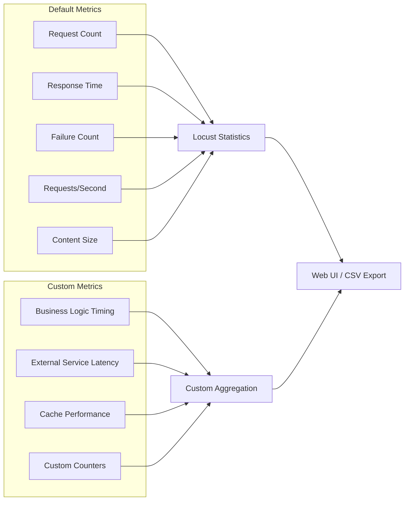
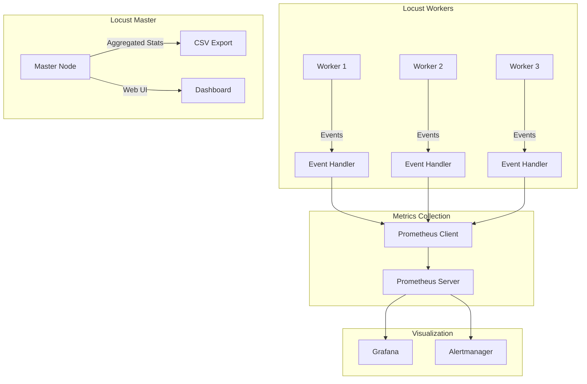

# How to Use Locust with Custom Metrics

Author: [nawazdhandala](https://www.github.com/nawazdhandala)

Tags: Locust, Custom Metrics, Load Testing, Performance Testing, Python, Monitoring, Prometheus

Description: Learn how to extend Locust with custom metrics to capture business-specific performance data beyond standard response times.

---

Locust provides excellent default metrics for response times and request counts, but real-world load testing often requires custom measurements. You might need to track database query times, message queue latency, cache hit rates, or business-specific KPIs during your tests.

This guide covers multiple approaches to implementing custom metrics in Locust, from simple event-based tracking to full Prometheus integration.

---

## Understanding Locust's Default Metrics

Before adding custom metrics, understand what Locust tracks automatically:



Default metrics are captured per request name/endpoint. Custom metrics let you track anything else.

---

## Event-Based Custom Metrics

Locust fires events throughout the test lifecycle. Hook into these to track custom data:

```python
# locustfile.py - Basic custom metrics with events
from locust import HttpUser, task, between, events
import time
from collections import defaultdict
import threading

# Thread-safe custom metrics storage
class CustomMetrics:
    def __init__(self):
        self.lock = threading.Lock()
        self.metrics = defaultdict(list)

    def record(self, name, value):
        with self.lock:
            self.metrics[name].append({
                'value': value,
                'timestamp': time.time()
            })

    def get_stats(self, name):
        with self.lock:
            values = [m['value'] for m in self.metrics[name]]
            if not values:
                return None
            return {
                'count': len(values),
                'min': min(values),
                'max': max(values),
                'avg': sum(values) / len(values)
            }

# Global metrics instance
custom_metrics = CustomMetrics()

@events.request.add_listener
def on_request(request_type, name, response_time, response_length,
               response, context, exception, start_time, url, **kwargs):
    """Track additional data on every request."""
    if response is not None:
        # Track response header processing time
        if 'x-processing-time' in response.headers:
            processing_time = float(response.headers['x-processing-time'])
            custom_metrics.record('server_processing_time', processing_time)

        # Track content type distribution
        content_type = response.headers.get('content-type', 'unknown')
        custom_metrics.record(f'content_type_{content_type}', 1)

@events.test_stop.add_listener
def on_test_stop(environment, **kwargs):
    """Print custom metrics summary when test ends."""
    print("\n--- Custom Metrics Summary ---")
    stats = custom_metrics.get_stats('server_processing_time')
    if stats:
        print(f"Server Processing Time:")
        print(f"  Count: {stats['count']}")
        print(f"  Min: {stats['min']:.2f}ms")
        print(f"  Max: {stats['max']:.2f}ms")
        print(f"  Avg: {stats['avg']:.2f}ms")

class ApiUser(HttpUser):
    wait_time = between(1, 3)

    @task
    def api_request(self):
        self.client.get("/api/data")
```

---

## Tracking Business Logic Timing

Measure specific operations within your test flow:

```python
# locustfile.py - Business logic timing
from locust import HttpUser, task, between, events
import time
from contextlib import contextmanager

class TimingMetrics:
    """Track timing for arbitrary code blocks."""

    def __init__(self):
        self.timings = defaultdict(list)
        self.lock = threading.Lock()

    @contextmanager
    def measure(self, name):
        """Context manager for timing code blocks."""
        start = time.perf_counter()
        try:
            yield
        finally:
            elapsed = (time.perf_counter() - start) * 1000  # Convert to ms
            with self.lock:
                self.timings[name].append(elapsed)

    def record_timing(self, name, elapsed_ms):
        """Manually record a timing value."""
        with self.lock:
            self.timings[name].append(elapsed_ms)

timing_metrics = TimingMetrics()

class EcommerceUser(HttpUser):
    wait_time = between(1, 2)

    @task
    def complete_checkout_flow(self):
        """Measure each step of a multi-request flow."""

        # Measure cart creation
        with timing_metrics.measure('cart_creation'):
            response = self.client.post("/api/cart", json={"items": []})
            cart_id = response.json().get('id')

        # Measure adding items
        with timing_metrics.measure('add_to_cart'):
            self.client.post(f"/api/cart/{cart_id}/items", json={
                "product_id": "SKU-123",
                "quantity": 2
            })

        # Measure checkout process
        with timing_metrics.measure('checkout'):
            self.client.post(f"/api/cart/{cart_id}/checkout", json={
                "payment_method": "credit_card"
            })

        # Measure the entire flow
        timing_metrics.record_timing('complete_checkout',
                                     sum([timing_metrics.timings['cart_creation'][-1],
                                          timing_metrics.timings['add_to_cart'][-1],
                                          timing_metrics.timings['checkout'][-1]]))

    @task(3)
    def browse_products(self):
        """Simple product browsing."""
        with timing_metrics.measure('product_list_load'):
            self.client.get("/api/products")

@events.test_stop.add_listener
def print_timing_report(environment, **kwargs):
    """Generate timing report at test end."""
    print("\n=== Business Logic Timing Report ===")
    for name, times in timing_metrics.timings.items():
        if times:
            print(f"\n{name}:")
            print(f"  Samples: {len(times)}")
            print(f"  P50: {sorted(times)[len(times)//2]:.2f}ms")
            print(f"  P95: {sorted(times)[int(len(times)*0.95)]:.2f}ms")
            print(f"  P99: {sorted(times)[int(len(times)*0.99)]:.2f}ms")
```

---

## Prometheus Integration

Export custom metrics to Prometheus for persistent storage and visualization:

```python
# locustfile.py - Prometheus metrics integration
from locust import HttpUser, task, between, events
from prometheus_client import Counter, Histogram, Gauge, start_http_server
import time

# Define Prometheus metrics
REQUEST_LATENCY = Histogram(
    'locust_request_latency_seconds',
    'Request latency in seconds',
    ['method', 'endpoint', 'status'],
    buckets=[0.01, 0.025, 0.05, 0.1, 0.25, 0.5, 1.0, 2.5, 5.0, 10.0]
)

REQUEST_COUNT = Counter(
    'locust_requests_total',
    'Total request count',
    ['method', 'endpoint', 'status']
)

ACTIVE_USERS = Gauge(
    'locust_active_users',
    'Number of active simulated users'
)

CUSTOM_BUSINESS_METRIC = Histogram(
    'locust_order_processing_seconds',
    'Order processing time',
    ['order_type'],
    buckets=[0.1, 0.5, 1.0, 2.0, 5.0, 10.0]
)

# Start Prometheus metrics server
@events.init.add_listener
def on_init(environment, **kwargs):
    """Start Prometheus HTTP server when Locust initializes."""
    start_http_server(9646)  # Prometheus will scrape this port
    print("Prometheus metrics available at :9646/metrics")

@events.request.add_listener
def on_request(request_type, name, response_time, response_length,
               response, context, exception, **kwargs):
    """Record request metrics to Prometheus."""
    status = 'success' if exception is None else 'failure'

    # Record latency histogram
    REQUEST_LATENCY.labels(
        method=request_type,
        endpoint=name,
        status=status
    ).observe(response_time / 1000)  # Convert ms to seconds

    # Increment request counter
    REQUEST_COUNT.labels(
        method=request_type,
        endpoint=name,
        status=status
    ).inc()

@events.spawning_complete.add_listener
def on_spawning_complete(user_count, **kwargs):
    """Update active users gauge."""
    ACTIVE_USERS.set(user_count)

class ApiUser(HttpUser):
    wait_time = between(1, 2)

    @task
    def place_order(self):
        start = time.time()

        response = self.client.post("/api/orders", json={
            "items": [{"sku": "PROD-001", "qty": 1}]
        })

        # Record business metric
        elapsed = time.time() - start
        order_type = "standard"
        if response.json().get('express'):
            order_type = "express"

        CUSTOM_BUSINESS_METRIC.labels(order_type=order_type).observe(elapsed)
```

Prometheus scrape configuration:

```yaml
# prometheus.yml
scrape_configs:
  - job_name: 'locust'
    static_configs:
      - targets: ['localhost:9646']
    scrape_interval: 5s
```

---

## Custom Metrics Architecture

For complex testing scenarios, structure your metrics collection:



---

## Percentile Tracking

Track response time percentiles beyond what Locust provides by default:

```python
# locustfile.py - Detailed percentile tracking
from locust import HttpUser, task, between, events
import numpy as np
from collections import defaultdict
import threading

class PercentileTracker:
    """Track percentiles for custom metrics."""

    def __init__(self, percentiles=[50, 75, 90, 95, 99]):
        self.data = defaultdict(list)
        self.percentiles = percentiles
        self.lock = threading.Lock()

    def record(self, metric_name, value):
        with self.lock:
            self.data[metric_name].append(value)

    def get_percentiles(self, metric_name):
        with self.lock:
            values = self.data.get(metric_name, [])
            if not values:
                return {}

            arr = np.array(values)
            result = {}
            for p in self.percentiles:
                result[f'p{p}'] = np.percentile(arr, p)
            result['count'] = len(values)
            result['mean'] = np.mean(arr)
            result['std'] = np.std(arr)
            return result

    def reset(self):
        with self.lock:
            self.data.clear()

tracker = PercentileTracker()

@events.request.add_listener
def track_request(request_type, name, response_time, **kwargs):
    """Record response times for percentile calculation."""
    tracker.record(f"{request_type}_{name}", response_time)

@events.test_stop.add_listener
def report_percentiles(environment, **kwargs):
    """Print percentile report."""
    print("\n=== Percentile Report ===")
    for metric_name in tracker.data.keys():
        stats = tracker.get_percentiles(metric_name)
        print(f"\n{metric_name}:")
        print(f"  Count: {stats['count']}")
        print(f"  Mean: {stats['mean']:.2f}ms")
        print(f"  StdDev: {stats['std']:.2f}ms")
        for p in tracker.percentiles:
            print(f"  P{p}: {stats[f'p{p}']:.2f}ms")

class ApiUser(HttpUser):
    wait_time = between(1, 2)

    @task
    def get_data(self):
        self.client.get("/api/data")
```

---

## External Service Tracking

When your application calls external services, track those latencies separately:

```python
# locustfile.py - External service tracking
from locust import HttpUser, task, between, events
import time

class ExternalServiceMetrics:
    """Track metrics for external service dependencies."""

    def __init__(self):
        self.services = defaultdict(lambda: {
            'latencies': [],
            'errors': 0,
            'successes': 0
        })
        self.lock = threading.Lock()

    def record_call(self, service_name, latency_ms, success=True):
        with self.lock:
            self.services[service_name]['latencies'].append(latency_ms)
            if success:
                self.services[service_name]['successes'] += 1
            else:
                self.services[service_name]['errors'] += 1

    def report(self):
        print("\n=== External Service Metrics ===")
        for name, data in self.services.items():
            lats = data['latencies']
            total = data['successes'] + data['errors']
            error_rate = (data['errors'] / total * 100) if total > 0 else 0

            print(f"\n{name}:")
            print(f"  Calls: {total}")
            print(f"  Error Rate: {error_rate:.2f}%")
            if lats:
                print(f"  Avg Latency: {sum(lats)/len(lats):.2f}ms")
                print(f"  Max Latency: {max(lats):.2f}ms")

external_metrics = ExternalServiceMetrics()

class PaymentFlowUser(HttpUser):
    wait_time = between(2, 5)

    @task
    def process_payment(self):
        # Call our API which internally calls payment provider
        start = time.time()
        response = self.client.post("/api/payments", json={
            "amount": 99.99,
            "currency": "USD"
        })

        # Parse response to get external service timing
        if response.status_code == 200:
            data = response.json()

            # Track payment gateway latency (returned by our API)
            if 'gateway_latency_ms' in data:
                external_metrics.record_call(
                    'payment_gateway',
                    data['gateway_latency_ms'],
                    success=data.get('gateway_success', True)
                )

            # Track fraud check latency
            if 'fraud_check_ms' in data:
                external_metrics.record_call(
                    'fraud_service',
                    data['fraud_check_ms'],
                    success=True
                )

@events.test_stop.add_listener
def print_external_metrics(environment, **kwargs):
    external_metrics.report()
```

---

## Exporting Custom Metrics to CSV

Save custom metrics alongside Locust's built-in CSV export:

```python
# locustfile.py - CSV export for custom metrics
from locust import HttpUser, task, between, events
import csv
import time
from datetime import datetime

class CSVMetricsExporter:
    """Export custom metrics to CSV files."""

    def __init__(self, filename_prefix="custom_metrics"):
        self.filename = f"{filename_prefix}_{datetime.now().strftime('%Y%m%d_%H%M%S')}.csv"
        self.data = []
        self.lock = threading.Lock()

    def record(self, metric_name, value, tags=None):
        with self.lock:
            self.data.append({
                'timestamp': time.time(),
                'metric': metric_name,
                'value': value,
                'tags': str(tags) if tags else ''
            })

    def export(self):
        if not self.data:
            return

        with open(self.filename, 'w', newline='') as f:
            writer = csv.DictWriter(f, fieldnames=['timestamp', 'metric', 'value', 'tags'])
            writer.writeheader()
            writer.writerows(self.data)

        print(f"Custom metrics exported to {self.filename}")

csv_exporter = CSVMetricsExporter()

@events.request.add_listener
def export_request_metrics(request_type, name, response_time,
                           response, exception, **kwargs):
    """Record every request to CSV."""
    csv_exporter.record(
        'request_time',
        response_time,
        tags={'method': request_type, 'endpoint': name}
    )

@events.test_stop.add_listener
def save_csv(environment, **kwargs):
    csv_exporter.export()

class ApiUser(HttpUser):
    wait_time = between(1, 2)

    @task
    def make_request(self):
        self.client.get("/api/endpoint")
```

---

Custom metrics transform Locust from a generic load testing tool into a comprehensive performance analysis platform tailored to your specific needs. Start with event-based tracking for quick insights, then graduate to Prometheus integration for production-grade observability. The key is identifying which metrics matter for your application - response times tell part of the story, but business logic timing, external service health, and custom KPIs complete the picture.

---

OneUptime integrates seamlessly with Prometheus and OpenTelemetry, allowing you to visualize Locust custom metrics alongside your application's real-time performance data. Correlate load test results with actual system behavior for deeper insights into performance characteristics.
