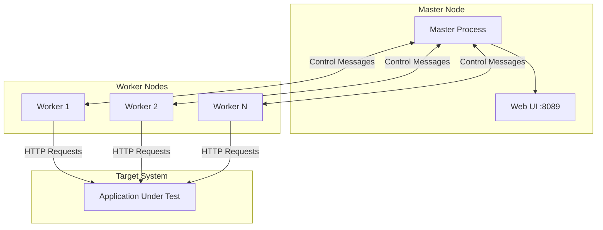
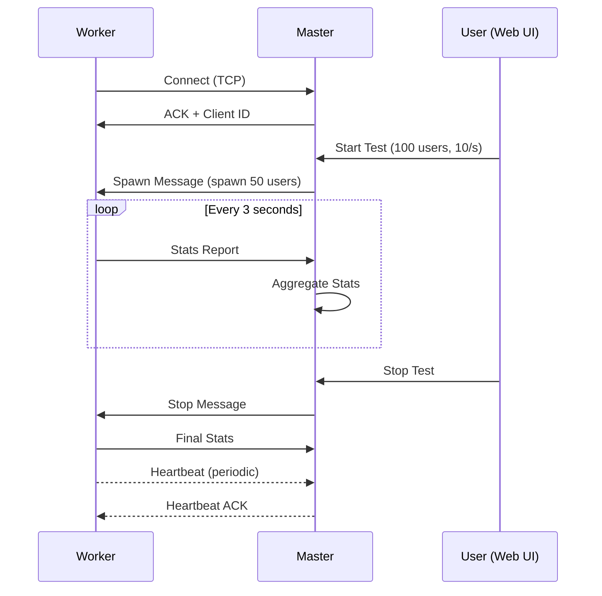

# How to Implement Locust Distributed Mode

Author: [nawazdhandala](https://www.github.com/nawazdhandala)

Tags: Locust, Load Testing, Distributed Testing, Performance Testing, Python, Scalability

Description: A practical guide to implementing Locust distributed mode for scaling load tests across multiple machines.

---

When your single-machine load test cannot generate enough traffic to stress your target system, distributed mode becomes essential. Locust provides a straightforward master-worker architecture that allows you to coordinate load generation across multiple machines while collecting results in a centralized dashboard.

This guide walks through the complete setup of Locust distributed mode, from basic configuration to production-ready deployments on Kubernetes.

---

## Understanding Locust Architecture

Locust distributed mode follows a master-worker pattern. The master node coordinates test execution and aggregates statistics, while worker nodes generate the actual load against your target system.



The master node:
- Hosts the web interface for test control and monitoring
- Distributes user spawn rates to workers
- Aggregates statistics from all workers
- Does not generate load itself

Worker nodes:
- Connect to master via TCP sockets
- Spawn simulated users as instructed
- Send statistics back to master
- Operate independently if master disconnects

---

## Basic Distributed Setup

Start with a simple locustfile that defines your load test behavior:

```python
# locustfile.py
from locust import HttpUser, task, between

class ApiUser(HttpUser):
    # Random wait between 1-3 seconds between tasks
    wait_time = between(1, 3)

    @task(3)  # Weight of 3 - runs 3x more often than weight-1 tasks
    def get_homepage(self):
        self.client.get("/")

    @task(2)
    def get_api_status(self):
        self.client.get("/api/status")

    @task(1)
    def search_products(self):
        self.client.get("/api/products", params={"q": "test"})
```

Start the master node:

```bash
# Start master - binds to all interfaces by default
locust --master --host=https://api.example.com

# Specify bind address for security
locust --master --master-bind-host=10.0.0.1 --master-bind-port=5557
```

Start worker nodes on separate machines:

```bash
# Connect worker to master
locust --worker --master-host=10.0.0.1

# Specify master port if non-default
locust --worker --master-host=10.0.0.1 --master-port=5557
```

---

## Running Multiple Workers Per Machine

Modern servers have multiple CPU cores, but Python's GIL limits single-process performance. Run multiple worker processes to utilize all cores:

```bash
#!/bin/bash
# start-workers.sh - Start multiple workers on a single machine

MASTER_HOST=${MASTER_HOST:-"localhost"}
NUM_WORKERS=${NUM_WORKERS:-$(nproc)}  # Default to number of CPU cores

echo "Starting $NUM_WORKERS workers connecting to $MASTER_HOST"

for i in $(seq 1 $NUM_WORKERS); do
    locust --worker --master-host=$MASTER_HOST &
    echo "Started worker $i with PID $!"
done

# Wait for all background processes
wait
```

For production environments, use a process manager:

```bash
# Using GNU Parallel for easy management
seq 1 8 | parallel -j 8 "locust --worker --master-host=10.0.0.1"

# Using supervisord for persistent workers
# /etc/supervisor/conf.d/locust-worker.conf
[program:locust-worker]
command=locust --worker --master-host=10.0.0.1
process_name=%(program_name)s_%(process_num)02d
numprocs=8
autostart=true
autorestart=true
```

---

## Docker-Based Distributed Setup

Containerization simplifies deployment and scaling. Create a Docker setup for Locust:

```dockerfile
# Dockerfile
FROM locustio/locust:2.20.0

# Copy your locustfile and any dependencies
COPY locustfile.py /mnt/locust/
COPY requirements.txt /mnt/locust/

# Install additional dependencies if needed
RUN pip install -r /mnt/locust/requirements.txt

WORKDIR /mnt/locust
```

Use Docker Compose for local distributed testing:

```yaml
# docker-compose.yml
version: '3.8'

services:
  master:
    build: .
    ports:
      - "8089:8089"      # Web UI
      - "5557:5557"      # Master bind port
    command: >
      locust
        --master
        --host=https://api.example.com
        --expect-workers=4
    volumes:
      - ./locustfile.py:/mnt/locust/locustfile.py
    environment:
      - LOCUST_LOGLEVEL=INFO

  worker:
    build: .
    command: locust --worker --master-host=master
    volumes:
      - ./locustfile.py:/mnt/locust/locustfile.py
    depends_on:
      - master
    deploy:
      replicas: 4  # Scale workers here
```

Start the distributed test:

```bash
# Start master and workers
docker-compose up --scale worker=8

# View logs
docker-compose logs -f master
```

---

## Kubernetes Deployment

For large-scale load testing, deploy Locust on Kubernetes:

```yaml
# locust-master-deployment.yaml
apiVersion: apps/v1
kind: Deployment
metadata:
  name: locust-master
  labels:
    app: locust
    role: master
spec:
  replicas: 1
  selector:
    matchLabels:
      app: locust
      role: master
  template:
    metadata:
      labels:
        app: locust
        role: master
    spec:
      containers:
      - name: locust
        image: locustio/locust:2.20.0
        args:
          - "--master"
          - "--host=https://api.example.com"
          - "--expect-workers=10"
        ports:
        - containerPort: 8089
          name: web
        - containerPort: 5557
          name: master
        resources:
          requests:
            cpu: "500m"
            memory: "512Mi"
          limits:
            cpu: "1000m"
            memory: "1Gi"
        volumeMounts:
        - name: locustfile
          mountPath: /mnt/locust
      volumes:
      - name: locustfile
        configMap:
          name: locust-scripts
---
apiVersion: v1
kind: Service
metadata:
  name: locust-master
spec:
  selector:
    app: locust
    role: master
  ports:
  - port: 8089
    targetPort: 8089
    name: web
  - port: 5557
    targetPort: 5557
    name: master
  type: LoadBalancer  # Use ClusterIP if internal only
```

```yaml
# locust-worker-deployment.yaml
apiVersion: apps/v1
kind: Deployment
metadata:
  name: locust-worker
  labels:
    app: locust
    role: worker
spec:
  replicas: 10  # Scale as needed
  selector:
    matchLabels:
      app: locust
      role: worker
  template:
    metadata:
      labels:
        app: locust
        role: worker
    spec:
      containers:
      - name: locust
        image: locustio/locust:2.20.0
        args:
          - "--worker"
          - "--master-host=locust-master"
        resources:
          requests:
            cpu: "500m"
            memory: "256Mi"
          limits:
            cpu: "1000m"
            memory: "512Mi"
        volumeMounts:
        - name: locustfile
          mountPath: /mnt/locust
      volumes:
      - name: locustfile
        configMap:
          name: locust-scripts
```

```yaml
# locust-configmap.yaml
apiVersion: v1
kind: ConfigMap
metadata:
  name: locust-scripts
data:
  locustfile.py: |
    from locust import HttpUser, task, between

    class ApiUser(HttpUser):
        wait_time = between(1, 3)

        @task
        def health_check(self):
            self.client.get("/health")

        @task(3)
        def api_request(self):
            self.client.get("/api/data")
```

Deploy to Kubernetes:

```bash
# Create configmap with locustfile
kubectl create configmap locust-scripts --from-file=locustfile.py

# Deploy master and workers
kubectl apply -f locust-master-deployment.yaml
kubectl apply -f locust-worker-deployment.yaml

# Scale workers dynamically
kubectl scale deployment locust-worker --replicas=20

# Access web UI
kubectl port-forward svc/locust-master 8089:8089
```

---

## Handling Worker Failures

Configure master to handle worker disconnections gracefully:

```python
# locustfile.py with event handlers
from locust import HttpUser, task, between, events

@events.worker_report.add_listener
def on_worker_report(client_id, data):
    """Process statistics from workers."""
    print(f"Worker {client_id} reported: {data['user_count']} users")

@events.worker_connect.add_listener
def on_worker_connect(client_id, message):
    """Handle new worker connections."""
    print(f"Worker connected: {client_id}")

@events.worker_disconnect.add_listener
def on_worker_disconnect(client_id):
    """Handle worker disconnections."""
    print(f"Worker disconnected: {client_id}")
    # Add alerting logic here if needed

class ApiUser(HttpUser):
    wait_time = between(1, 3)

    @task
    def load_test(self):
        self.client.get("/api/endpoint")
```

Set master expectations for automated environments:

```bash
# Wait for minimum workers before starting
locust --master --expect-workers=5 --expect-workers-max-wait=120
```

---

## Communication Flow

Understanding the master-worker communication helps with troubleshooting:



---

## Performance Optimization Tips

Maximize the load generation capacity of your distributed setup:

```python
# locustfile.py - Optimized for high throughput
from locust import HttpUser, task, between, FastHttpUser

# Use FastHttpUser for higher performance (uses geventhttpclient)
class HighPerformanceUser(FastHttpUser):
    wait_time = between(0.1, 0.5)  # Shorter waits for higher RPS

    # Connection pooling is automatic with FastHttpUser
    # Disable SSL verification for internal testing (not for production)
    insecure = True

    @task
    def fast_request(self):
        # Use connection reuse
        with self.client.get("/api/fast", catch_response=True) as response:
            if response.status_code == 200:
                response.success()
            else:
                response.failure(f"Got {response.status_code}")
```

Network and system tuning for worker machines:

```bash
# Increase file descriptor limits
ulimit -n 65535

# Tune TCP settings for high connection rates
sudo sysctl -w net.ipv4.tcp_tw_reuse=1
sudo sysctl -w net.core.somaxconn=65535
sudo sysctl -w net.ipv4.ip_local_port_range="1024 65535"
```

---

## Monitoring Distributed Tests

Track the health of your distributed test cluster:

```python
# locustfile.py with monitoring integration
import time
from locust import HttpUser, task, events
import requests

# Send metrics to external monitoring system
METRICS_ENDPOINT = "https://oneuptime.com/api/metrics"

@events.report_to_master.add_listener
def on_report_to_master(client_id, data):
    """Send custom metrics alongside Locust stats."""
    try:
        requests.post(METRICS_ENDPOINT, json={
            "worker_id": client_id,
            "user_count": data["user_count"],
            "timestamp": time.time()
        }, timeout=5)
    except Exception as e:
        print(f"Failed to send metrics: {e}")

@events.quitting.add_listener
def on_quitting(environment):
    """Clean up when test ends."""
    print(f"Test completed. Total requests: {environment.stats.total.num_requests}")
```

---

Distributed mode transforms Locust from a simple load testing tool into a scalable performance testing platform. By properly configuring master-worker communication, containerizing your setup, and deploying to Kubernetes, you can generate millions of requests per second across your infrastructure. Start with a simple two-node setup, validate your configuration, then scale workers based on your target load requirements.

---

For comprehensive monitoring of your load test infrastructure and application performance, OneUptime provides unified observability with OpenTelemetry support, allowing you to correlate load test metrics with application telemetry in real-time.
