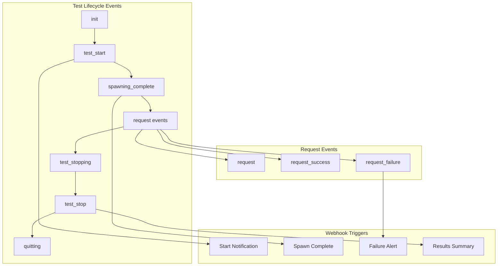
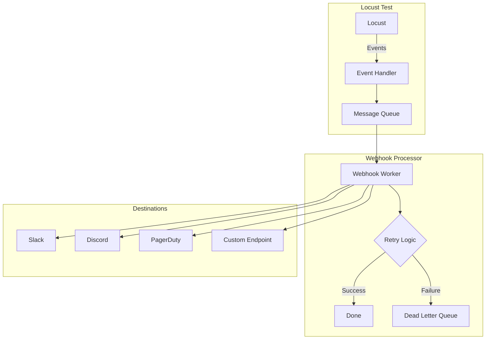

# How to Implement Locust Web Hooks

Author: [nawazdhandala](https://www.github.com/nawazdhandala)

Tags: Locust, Webhooks, Load Testing, Notifications, Slack, Integration, Event-Driven

Description: Learn how to implement webhooks in Locust to send real-time notifications about test progress, failures, and completion.

---

Locust's event system provides hooks into every phase of test execution. By leveraging these events, you can send webhooks to external systems for notifications, logging, and integration with your existing toolchain.

This guide covers implementing webhooks for Slack, Discord, PagerDuty, and custom endpoints, along with patterns for reliable delivery and useful payload structures.

---

## Locust Event System Overview

Locust fires events throughout the test lifecycle that you can hook into:



Available events:
- `init`: Locust environment initialized
- `test_start`: Test run begins
- `spawning_complete`: All users spawned
- `request`: Every request (success or failure)
- `request_success`: Successful requests only
- `request_failure`: Failed requests only
- `test_stopping`: Test is stopping
- `test_stop`: Test has stopped
- `quitting`: Locust is exiting

---

## Basic Webhook Implementation

Start with a simple webhook sender:

```python
# locustfile.py - Basic webhook implementation
from locust import HttpUser, task, between, events
import requests
import json
import time
from datetime import datetime

class WebhookSender:
    """Send webhooks to external endpoints."""

    def __init__(self, webhook_url, timeout=10):
        self.webhook_url = webhook_url
        self.timeout = timeout

    def send(self, payload):
        """Send webhook with error handling."""
        try:
            response = requests.post(
                self.webhook_url,
                json=payload,
                timeout=self.timeout,
                headers={'Content-Type': 'application/json'}
            )
            response.raise_for_status()
            return True
        except requests.exceptions.RequestException as e:
            print(f"Webhook failed: {e}")
            return False

# Initialize webhook sender
webhook = WebhookSender("https://your-webhook-endpoint.com/locust")

@events.test_start.add_listener
def on_test_start(environment, **kwargs):
    """Notify when test starts."""
    webhook.send({
        "event": "test_started",
        "timestamp": datetime.utcnow().isoformat(),
        "host": environment.host,
        "user_count": environment.runner.target_user_count if environment.runner else 0
    })

@events.test_stop.add_listener
def on_test_stop(environment, **kwargs):
    """Send summary when test ends."""
    stats = environment.stats.total

    webhook.send({
        "event": "test_completed",
        "timestamp": datetime.utcnow().isoformat(),
        "host": environment.host,
        "results": {
            "total_requests": stats.num_requests,
            "total_failures": stats.num_failures,
            "failure_rate": round((stats.num_failures / stats.num_requests * 100), 2) if stats.num_requests > 0 else 0,
            "avg_response_time": round(stats.avg_response_time, 2),
            "p95_response_time": stats.get_response_time_percentile(0.95),
            "p99_response_time": stats.get_response_time_percentile(0.99),
            "requests_per_second": round(stats.total_rps, 2)
        }
    })

class ApiUser(HttpUser):
    wait_time = between(1, 2)

    @task
    def api_request(self):
        self.client.get("/api/data")
```

---

## Slack Integration

Send formatted notifications to Slack:

```python
# locustfile.py - Slack webhook integration
from locust import HttpUser, task, between, events
import requests
import os
from datetime import datetime

SLACK_WEBHOOK_URL = os.getenv("SLACK_WEBHOOK_URL")

class SlackNotifier:
    """Send Slack notifications for Locust events."""

    def __init__(self, webhook_url):
        self.webhook_url = webhook_url

    def send_message(self, blocks, text="Locust Load Test Update"):
        """Send Slack block message."""
        if not self.webhook_url:
            print("SLACK_WEBHOOK_URL not configured")
            return

        try:
            requests.post(self.webhook_url, json={
                "text": text,
                "blocks": blocks
            }, timeout=10)
        except Exception as e:
            print(f"Slack notification failed: {e}")

    def test_started(self, host, user_count, spawn_rate):
        """Notify test start."""
        self.send_message([
            {
                "type": "header",
                "text": {
                    "type": "plain_text",
                    "text": "Load Test Started"
                }
            },
            {
                "type": "section",
                "fields": [
                    {"type": "mrkdwn", "text": f"*Target:*\n{host}"},
                    {"type": "mrkdwn", "text": f"*Users:*\n{user_count}"},
                    {"type": "mrkdwn", "text": f"*Spawn Rate:*\n{spawn_rate}/s"},
                    {"type": "mrkdwn", "text": f"*Started:*\n{datetime.utcnow().strftime('%Y-%m-%d %H:%M:%S')} UTC"}
                ]
            }
        ])

    def test_completed(self, host, stats):
        """Notify test completion with results."""
        failure_rate = (stats.num_failures / stats.num_requests * 100) if stats.num_requests > 0 else 0
        status_emoji = ":white_check_mark:" if failure_rate < 1 else ":x:"

        self.send_message([
            {
                "type": "header",
                "text": {
                    "type": "plain_text",
                    "text": f"{status_emoji} Load Test Completed"
                }
            },
            {
                "type": "section",
                "fields": [
                    {"type": "mrkdwn", "text": f"*Target:*\n{host}"},
                    {"type": "mrkdwn", "text": f"*Total Requests:*\n{stats.num_requests:,}"},
                    {"type": "mrkdwn", "text": f"*Failures:*\n{stats.num_failures:,} ({failure_rate:.2f}%)"},
                    {"type": "mrkdwn", "text": f"*Avg Response:*\n{stats.avg_response_time:.0f}ms"}
                ]
            },
            {
                "type": "section",
                "fields": [
                    {"type": "mrkdwn", "text": f"*P95 Response:*\n{stats.get_response_time_percentile(0.95):.0f}ms"},
                    {"type": "mrkdwn", "text": f"*P99 Response:*\n{stats.get_response_time_percentile(0.99):.0f}ms"},
                    {"type": "mrkdwn", "text": f"*RPS:*\n{stats.total_rps:.1f}"},
                    {"type": "mrkdwn", "text": f"*Max Response:*\n{stats.max_response_time:.0f}ms"}
                ]
            }
        ])

    def failure_alert(self, endpoint, error, failure_count):
        """Alert on request failures."""
        self.send_message([
            {
                "type": "header",
                "text": {
                    "type": "plain_text",
                    "text": ":warning: Request Failures Detected"
                }
            },
            {
                "type": "section",
                "fields": [
                    {"type": "mrkdwn", "text": f"*Endpoint:*\n{endpoint}"},
                    {"type": "mrkdwn", "text": f"*Total Failures:*\n{failure_count}"},
                    {"type": "mrkdwn", "text": f"*Error:*\n```{error[:200]}```"}
                ]
            }
        ])

slack = SlackNotifier(SLACK_WEBHOOK_URL)

# Track failures to avoid alert spam
failure_counts = {}
FAILURE_ALERT_THRESHOLD = 10  # Alert after N failures per endpoint

@events.test_start.add_listener
def on_test_start(environment, **kwargs):
    target_users = environment.runner.target_user_count if environment.runner else 0
    spawn_rate = environment.runner.spawn_rate if environment.runner else 0
    slack.test_started(environment.host, target_users, spawn_rate)

@events.request_failure.add_listener
def on_request_failure(request_type, name, response_time, response, exception, **kwargs):
    key = f"{request_type}:{name}"
    failure_counts[key] = failure_counts.get(key, 0) + 1

    # Alert on threshold crossing
    if failure_counts[key] == FAILURE_ALERT_THRESHOLD:
        error_msg = str(exception) if exception else "Unknown error"
        slack.failure_alert(name, error_msg, failure_counts[key])

@events.test_stop.add_listener
def on_test_stop(environment, **kwargs):
    slack.test_completed(environment.host, environment.stats.total)

class ApiUser(HttpUser):
    wait_time = between(1, 2)

    @task
    def api_request(self):
        self.client.get("/api/data")
```

---

## Discord Integration

Discord uses a similar webhook format with some differences:

```python
# locustfile.py - Discord webhook integration
from locust import HttpUser, task, between, events
import requests
import os
from datetime import datetime

DISCORD_WEBHOOK_URL = os.getenv("DISCORD_WEBHOOK_URL")

class DiscordNotifier:
    """Send Discord notifications via webhook."""

    def __init__(self, webhook_url):
        self.webhook_url = webhook_url

    def send_embed(self, title, description, color, fields=None):
        """Send Discord embed message."""
        if not self.webhook_url:
            return

        embed = {
            "title": title,
            "description": description,
            "color": color,
            "timestamp": datetime.utcnow().isoformat(),
            "fields": fields or []
        }

        try:
            requests.post(self.webhook_url, json={
                "embeds": [embed]
            }, timeout=10)
        except Exception as e:
            print(f"Discord notification failed: {e}")

    def test_started(self, host, user_count):
        self.send_embed(
            title="Load Test Started",
            description=f"Testing `{host}`",
            color=3447003,  # Blue
            fields=[
                {"name": "Target Users", "value": str(user_count), "inline": True},
                {"name": "Status", "value": "Running", "inline": True}
            ]
        )

    def test_completed(self, host, stats, passed):
        failure_rate = (stats.num_failures / stats.num_requests * 100) if stats.num_requests > 0 else 0
        color = 3066993 if passed else 15158332  # Green or Red

        self.send_embed(
            title="Load Test Completed",
            description=f"Testing `{host}` - {'PASSED' if passed else 'FAILED'}",
            color=color,
            fields=[
                {"name": "Total Requests", "value": f"{stats.num_requests:,}", "inline": True},
                {"name": "Failures", "value": f"{stats.num_failures:,} ({failure_rate:.2f}%)", "inline": True},
                {"name": "Avg Response", "value": f"{stats.avg_response_time:.0f}ms", "inline": True},
                {"name": "P95 Response", "value": f"{stats.get_response_time_percentile(0.95):.0f}ms", "inline": True},
                {"name": "P99 Response", "value": f"{stats.get_response_time_percentile(0.99):.0f}ms", "inline": True},
                {"name": "RPS", "value": f"{stats.total_rps:.1f}", "inline": True}
            ]
        )

discord = DiscordNotifier(DISCORD_WEBHOOK_URL)

@events.test_start.add_listener
def on_start(environment, **kwargs):
    user_count = environment.runner.target_user_count if environment.runner else 0
    discord.test_started(environment.host, user_count)

@events.test_stop.add_listener
def on_stop(environment, **kwargs):
    stats = environment.stats.total
    failure_rate = (stats.num_failures / stats.num_requests * 100) if stats.num_requests > 0 else 0
    passed = failure_rate < 1.0  # Less than 1% failures
    discord.test_completed(environment.host, stats, passed)

class ApiUser(HttpUser):
    wait_time = between(1, 2)

    @task
    def api_request(self):
        self.client.get("/api/data")
```

---

## PagerDuty Integration

Trigger incidents on critical failures:

```python
# locustfile.py - PagerDuty integration
from locust import HttpUser, task, between, events
import requests
import os
from datetime import datetime

PAGERDUTY_ROUTING_KEY = os.getenv("PAGERDUTY_ROUTING_KEY")

class PagerDutyNotifier:
    """Trigger PagerDuty incidents for critical load test failures."""

    EVENTS_API = "https://events.pagerduty.com/v2/enqueue"

    def __init__(self, routing_key):
        self.routing_key = routing_key
        self.dedup_key = None

    def trigger(self, summary, severity="error", details=None):
        """Trigger a PagerDuty incident."""
        if not self.routing_key:
            return

        self.dedup_key = f"locust-{datetime.utcnow().strftime('%Y%m%d%H%M')}"

        payload = {
            "routing_key": self.routing_key,
            "event_action": "trigger",
            "dedup_key": self.dedup_key,
            "payload": {
                "summary": summary,
                "severity": severity,
                "source": "Locust Load Test",
                "timestamp": datetime.utcnow().isoformat(),
                "custom_details": details or {}
            }
        }

        try:
            requests.post(self.EVENTS_API, json=payload, timeout=10)
        except Exception as e:
            print(f"PagerDuty notification failed: {e}")

    def resolve(self):
        """Resolve the triggered incident."""
        if not self.routing_key or not self.dedup_key:
            return

        payload = {
            "routing_key": self.routing_key,
            "event_action": "resolve",
            "dedup_key": self.dedup_key
        }

        try:
            requests.post(self.EVENTS_API, json=payload, timeout=10)
        except Exception as e:
            print(f"PagerDuty resolve failed: {e}")

pagerduty = PagerDutyNotifier(PAGERDUTY_ROUTING_KEY)

# Track critical thresholds
CRITICAL_FAILURE_RATE = 10.0  # 10% failures triggers incident
CRITICAL_P99 = 5000  # 5 second P99 triggers incident

@events.test_stop.add_listener
def check_critical_thresholds(environment, **kwargs):
    """Trigger PagerDuty on critical threshold violations."""
    stats = environment.stats.total

    if stats.num_requests == 0:
        return

    failure_rate = (stats.num_failures / stats.num_requests) * 100
    p99 = stats.get_response_time_percentile(0.99)

    critical = False
    issues = []

    if failure_rate >= CRITICAL_FAILURE_RATE:
        critical = True
        issues.append(f"Failure rate: {failure_rate:.1f}%")

    if p99 >= CRITICAL_P99:
        critical = True
        issues.append(f"P99 response time: {p99:.0f}ms")

    if critical:
        pagerduty.trigger(
            summary=f"Load Test Critical Failure: {', '.join(issues)}",
            severity="critical",
            details={
                "host": environment.host,
                "total_requests": stats.num_requests,
                "failure_rate": f"{failure_rate:.2f}%",
                "p99_response_time": f"{p99:.0f}ms",
                "avg_response_time": f"{stats.avg_response_time:.0f}ms"
            }
        )

class ApiUser(HttpUser):
    wait_time = between(1, 2)

    @task
    def api_request(self):
        self.client.get("/api/data")
```

---

## Webhook Architecture

For production deployments, use a robust webhook architecture:



```python
# locustfile.py - Production webhook handler with retry
from locust import HttpUser, task, between, events
import requests
import threading
import queue
import time
from dataclasses import dataclass
from typing import Dict, Any, Optional

@dataclass
class WebhookMessage:
    url: str
    payload: Dict[str, Any]
    retries: int = 0
    max_retries: int = 3

class WebhookWorker:
    """Background worker for reliable webhook delivery."""

    def __init__(self):
        self.queue = queue.Queue()
        self.running = False
        self.worker_thread = None

    def start(self):
        """Start the background worker."""
        self.running = True
        self.worker_thread = threading.Thread(target=self._process_queue, daemon=True)
        self.worker_thread.start()

    def stop(self):
        """Stop the worker and drain queue."""
        self.running = False
        # Process remaining messages
        while not self.queue.empty():
            try:
                msg = self.queue.get_nowait()
                self._send(msg)
            except queue.Empty:
                break

    def enqueue(self, url: str, payload: Dict[str, Any]):
        """Add message to queue."""
        self.queue.put(WebhookMessage(url=url, payload=payload))

    def _process_queue(self):
        """Process messages from queue."""
        while self.running:
            try:
                msg = self.queue.get(timeout=1)
                self._send(msg)
            except queue.Empty:
                continue

    def _send(self, msg: WebhookMessage):
        """Send webhook with retry logic."""
        try:
            response = requests.post(
                msg.url,
                json=msg.payload,
                timeout=10,
                headers={'Content-Type': 'application/json'}
            )
            response.raise_for_status()
        except requests.exceptions.RequestException as e:
            if msg.retries < msg.max_retries:
                msg.retries += 1
                # Exponential backoff
                time.sleep(2 ** msg.retries)
                self.queue.put(msg)
            else:
                print(f"Webhook failed after {msg.max_retries} retries: {e}")

# Global webhook worker
webhook_worker = WebhookWorker()

@events.init.add_listener
def start_webhook_worker(environment, **kwargs):
    webhook_worker.start()

@events.quitting.add_listener
def stop_webhook_worker(environment, **kwargs):
    webhook_worker.stop()

# Configuration for multiple webhooks
WEBHOOK_CONFIG = {
    "slack": "https://hooks.slack.com/services/xxx",
    "custom": "https://api.example.com/webhooks/locust"
}

@events.test_start.add_listener
def notify_start(environment, **kwargs):
    payload = {
        "event": "test_started",
        "host": environment.host,
        "timestamp": time.time()
    }

    for name, url in WEBHOOK_CONFIG.items():
        if url:
            webhook_worker.enqueue(url, payload)

@events.test_stop.add_listener
def notify_stop(environment, **kwargs):
    stats = environment.stats.total

    payload = {
        "event": "test_completed",
        "host": environment.host,
        "timestamp": time.time(),
        "results": {
            "requests": stats.num_requests,
            "failures": stats.num_failures,
            "avg_response_time": stats.avg_response_time,
            "p95": stats.get_response_time_percentile(0.95),
            "rps": stats.total_rps
        }
    }

    for name, url in WEBHOOK_CONFIG.items():
        if url:
            webhook_worker.enqueue(url, payload)

class ApiUser(HttpUser):
    wait_time = between(1, 2)

    @task
    def api_request(self):
        self.client.get("/api/data")
```

---

## Real-Time Progress Updates

Send periodic updates during long-running tests:

```python
# locustfile.py - Periodic progress updates
from locust import HttpUser, task, between, events
import threading
import time
import requests

WEBHOOK_URL = "https://your-webhook.com/progress"
UPDATE_INTERVAL = 60  # Send update every 60 seconds

class ProgressReporter:
    """Send periodic progress updates via webhook."""

    def __init__(self, webhook_url, interval):
        self.webhook_url = webhook_url
        self.interval = interval
        self.running = False
        self.thread = None
        self.environment = None

    def start(self, environment):
        self.environment = environment
        self.running = True
        self.thread = threading.Thread(target=self._report_loop, daemon=True)
        self.thread.start()

    def stop(self):
        self.running = False

    def _report_loop(self):
        while self.running:
            time.sleep(self.interval)
            if self.running:
                self._send_progress()

    def _send_progress(self):
        if not self.environment:
            return

        stats = self.environment.stats.total
        user_count = len(self.environment.runner.user_greenlets) if self.environment.runner else 0

        payload = {
            "event": "progress",
            "timestamp": time.time(),
            "active_users": user_count,
            "total_requests": stats.num_requests,
            "current_rps": stats.current_rps,
            "avg_response_time": stats.avg_response_time,
            "failure_rate": (stats.num_failures / stats.num_requests * 100) if stats.num_requests > 0 else 0
        }

        try:
            requests.post(self.webhook_url, json=payload, timeout=5)
        except Exception as e:
            print(f"Progress update failed: {e}")

progress_reporter = ProgressReporter(WEBHOOK_URL, UPDATE_INTERVAL)

@events.test_start.add_listener
def start_progress(environment, **kwargs):
    progress_reporter.start(environment)

@events.test_stop.add_listener
def stop_progress(environment, **kwargs):
    progress_reporter.stop()

class ApiUser(HttpUser):
    wait_time = between(1, 2)

    @task
    def api_request(self):
        self.client.get("/api/data")
```

---

Webhooks transform Locust from a standalone tool into an integrated part of your observability stack. Whether you need Slack notifications for your team, PagerDuty alerts for critical failures, or custom integrations with your internal systems, Locust's event system provides the hooks you need. Start with simple notifications, then build toward a production-ready webhook infrastructure with retry logic and queue-based delivery to ensure no important events are lost.

---

OneUptime's webhook system integrates naturally with Locust notifications. Feed your load test results directly into OneUptime to correlate synthetic load with real-world performance metrics and trigger alerts based on combined signals.
