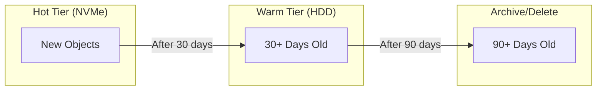
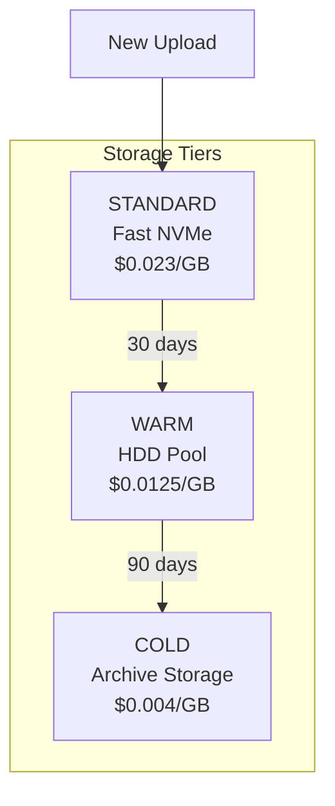

# How to Implement MinIO Lifecycle Rules

Author: [nawazdhandala](https://www.github.com/nawazdhandala)

Tags: MinIO, Object Storage, Lifecycle Management, Storage Optimization, DevOps, Kubernetes

Description: A practical guide to implementing MinIO lifecycle rules for automatic data expiration, tiering, and storage cost optimization.

---

Object storage tends to grow without bound unless you actively manage it. Log files pile up, temporary uploads never get deleted, and before you know it, you're staring at terabytes of data nobody needs. MinIO lifecycle rules let you automate the cleanup, moving old data to cheaper storage or deleting it entirely.

## Understanding Lifecycle Rules

Lifecycle rules define actions that MinIO takes on objects based on age or other criteria. The two primary actions are:

- **Expiration** - Delete objects after a specified period
- **Transition** - Move objects to a different storage tier



## Prerequisites

Before configuring lifecycle rules, ensure you have:

- MinIO server running (standalone or distributed)
- MinIO Client (mc) installed
- Admin credentials with policy management permissions

```bash
# Install MinIO Client
curl -O https://dl.min.io/client/mc/release/linux-amd64/mc
chmod +x mc
sudo mv mc /usr/local/bin/

# Configure alias for your MinIO server
mc alias set myminio http://minio.example.com:9000 ACCESS_KEY SECRET_KEY
```

## Basic Expiration Rules

### Delete Objects After N Days

The most common use case is deleting objects after a retention period.

```bash
# Create a lifecycle rule to delete objects older than 30 days
mc ilm rule add myminio/logs-bucket --expire-days 30

# Verify the rule was created
mc ilm rule ls myminio/logs-bucket
```

### JSON Configuration Method

For more control, use a JSON configuration file:

```json
{
  "Rules": [
    {
      "ID": "delete-old-logs",
      "Status": "Enabled",
      "Filter": {
        "Prefix": "logs/"
      },
      "Expiration": {
        "Days": 30
      }
    }
  ]
}
```

Apply the configuration:

```bash
# Save as lifecycle.json, then apply
mc ilm import myminio/my-bucket < lifecycle.json

# Export current rules to verify
mc ilm export myminio/my-bucket
```

## Prefix-Based Rules

Target specific object paths with prefix filters.

```json
{
  "Rules": [
    {
      "ID": "expire-temp-uploads",
      "Status": "Enabled",
      "Filter": {
        "Prefix": "temp/"
      },
      "Expiration": {
        "Days": 1
      }
    },
    {
      "ID": "expire-debug-logs",
      "Status": "Enabled",
      "Filter": {
        "Prefix": "debug/"
      },
      "Expiration": {
        "Days": 7
      }
    },
    {
      "ID": "expire-application-logs",
      "Status": "Enabled",
      "Filter": {
        "Prefix": "app-logs/"
      },
      "Expiration": {
        "Days": 90
      }
    }
  ]
}
```

## Tag-Based Rules

Filter objects by tags for more granular control.

```json
{
  "Rules": [
    {
      "ID": "expire-tagged-temporary",
      "Status": "Enabled",
      "Filter": {
        "Tag": {
          "Key": "retention",
          "Value": "temporary"
        }
      },
      "Expiration": {
        "Days": 7
      }
    },
    {
      "ID": "expire-tagged-archive",
      "Status": "Enabled",
      "Filter": {
        "And": {
          "Prefix": "backups/",
          "Tags": [
            {
              "Key": "type",
              "Value": "incremental"
            }
          ]
        }
      },
      "Expiration": {
        "Days": 30
      }
    }
  ]
}
```

Set tags when uploading objects:

```bash
# Upload with tags
mc cp myfile.log myminio/bucket/logs/ --tags "retention=temporary&environment=dev"
```

## Storage Tiering with Transitions

Move objects between storage tiers to optimize costs.



### Configure Remote Tier

First, set up the target tier:

```bash
# Add a remote tier pointing to another MinIO or S3-compatible storage
mc admin tier add minio myminio WARM-TIER \
  --endpoint https://warm-storage.example.com \
  --access-key WARM_ACCESS_KEY \
  --secret-key WARM_SECRET_KEY \
  --bucket warm-bucket

# List configured tiers
mc admin tier ls myminio
```

### Transition Rule Configuration

```json
{
  "Rules": [
    {
      "ID": "tiered-storage-policy",
      "Status": "Enabled",
      "Filter": {
        "Prefix": "data/"
      },
      "Transitions": [
        {
          "Days": 30,
          "StorageClass": "WARM-TIER"
        },
        {
          "Days": 90,
          "StorageClass": "COLD-TIER"
        }
      ],
      "Expiration": {
        "Days": 365
      }
    }
  ]
}
```

## Version Management

Handle versioned buckets with specific lifecycle rules.

### Delete Non-Current Versions

```json
{
  "Rules": [
    {
      "ID": "cleanup-old-versions",
      "Status": "Enabled",
      "Filter": {},
      "NoncurrentVersionExpiration": {
        "NoncurrentDays": 30
      }
    }
  ]
}
```

### Limit Version Count

Keep only the last N versions:

```json
{
  "Rules": [
    {
      "ID": "limit-versions",
      "Status": "Enabled",
      "Filter": {
        "Prefix": "documents/"
      },
      "NoncurrentVersionExpiration": {
        "NewerNoncurrentVersions": 5,
        "NoncurrentDays": 1
      }
    }
  ]
}
```

### Delete Markers Cleanup

Remove delete markers when they become the only version:

```json
{
  "Rules": [
    {
      "ID": "cleanup-delete-markers",
      "Status": "Enabled",
      "Filter": {},
      "Expiration": {
        "ExpiredObjectDeleteMarker": true
      }
    }
  ]
}
```

## Incomplete Multipart Upload Cleanup

Abort stale multipart uploads that were never completed:

```json
{
  "Rules": [
    {
      "ID": "abort-incomplete-uploads",
      "Status": "Enabled",
      "Filter": {},
      "AbortIncompleteMultipartUpload": {
        "DaysAfterInitiation": 7
      }
    }
  ]
}
```

This is essential for preventing storage leaks from failed uploads.

## Complete Production Example

Here is a comprehensive lifecycle configuration for a production environment:

```json
{
  "Rules": [
    {
      "ID": "temp-files-cleanup",
      "Status": "Enabled",
      "Filter": {
        "Prefix": "temp/"
      },
      "Expiration": {
        "Days": 1
      }
    },
    {
      "ID": "logs-tiering-and-expiration",
      "Status": "Enabled",
      "Filter": {
        "Prefix": "logs/"
      },
      "Transitions": [
        {
          "Days": 14,
          "StorageClass": "WARM-TIER"
        }
      ],
      "Expiration": {
        "Days": 90
      }
    },
    {
      "ID": "backups-long-retention",
      "Status": "Enabled",
      "Filter": {
        "Prefix": "backups/"
      },
      "Transitions": [
        {
          "Days": 30,
          "StorageClass": "WARM-TIER"
        },
        {
          "Days": 180,
          "StorageClass": "COLD-TIER"
        }
      ],
      "Expiration": {
        "Days": 730
      }
    },
    {
      "ID": "version-cleanup",
      "Status": "Enabled",
      "Filter": {},
      "NoncurrentVersionExpiration": {
        "NoncurrentDays": 30,
        "NewerNoncurrentVersions": 3
      }
    },
    {
      "ID": "multipart-cleanup",
      "Status": "Enabled",
      "Filter": {},
      "AbortIncompleteMultipartUpload": {
        "DaysAfterInitiation": 7
      }
    },
    {
      "ID": "delete-marker-cleanup",
      "Status": "Enabled",
      "Filter": {},
      "Expiration": {
        "ExpiredObjectDeleteMarker": true
      }
    }
  ]
}
```

## Monitoring Lifecycle Rule Execution

### Check Lifecycle Status

```bash
# List all rules and their status
mc ilm rule ls myminio/my-bucket --json

# Get detailed bucket info including lifecycle
mc stat myminio/my-bucket
```

### Audit with MinIO Console

The MinIO Console provides a visual interface to monitor lifecycle rules. Navigate to Buckets > Select Bucket > Lifecycle to view and manage rules.

### Enable Audit Logging

Track lifecycle actions in MinIO audit logs:

```bash
# Enable audit logging
mc admin config set myminio audit_webhook \
  endpoint="http://audit-collector:8080/minio-events" \
  auth_token="your-auth-token"

# Restart MinIO to apply
mc admin service restart myminio
```

## Common Pitfalls

**Rule Overlap** - When multiple rules match the same object, MinIO applies the most restrictive action. Be careful with overlapping prefixes.

**Scanner Delay** - Lifecycle rules are processed by a background scanner. Objects may persist slightly beyond their expiration date. Configure scanner speed:

```bash
# Increase scanner speed (higher values = faster scanning, more CPU)
mc admin config set myminio scanner speed=fast
```

**Versioned Buckets** - Standard expiration rules create delete markers rather than permanently deleting objects. Add NoncurrentVersionExpiration to actually reclaim space.

**Time Zone** - Expiration is calculated from object creation time in UTC. Plan your retention periods accordingly.

## Kubernetes Deployment

Apply lifecycle rules in a Kubernetes environment using a Job:

```yaml
apiVersion: batch/v1
kind: Job
metadata:
  name: minio-lifecycle-setup
  namespace: minio
spec:
  template:
    spec:
      containers:
        - name: mc
          image: minio/mc:latest
          command:
            - /bin/sh
            - -c
            - |
              mc alias set myminio http://minio:9000 $MINIO_ACCESS_KEY $MINIO_SECRET_KEY
              mc ilm import myminio/logs-bucket < /config/lifecycle.json
          env:
            - name: MINIO_ACCESS_KEY
              valueFrom:
                secretKeyRef:
                  name: minio-credentials
                  key: access-key
            - name: MINIO_SECRET_KEY
              valueFrom:
                secretKeyRef:
                  name: minio-credentials
                  key: secret-key
          volumeMounts:
            - name: lifecycle-config
              mountPath: /config
      restartPolicy: OnFailure
      volumes:
        - name: lifecycle-config
          configMap:
            name: minio-lifecycle-rules
---
apiVersion: v1
kind: ConfigMap
metadata:
  name: minio-lifecycle-rules
  namespace: minio
data:
  lifecycle.json: |
    {
      "Rules": [
        {
          "ID": "logs-expiration",
          "Status": "Enabled",
          "Filter": {"Prefix": "logs/"},
          "Expiration": {"Days": 30}
        }
      ]
    }
```

---

Lifecycle rules are essential for keeping object storage costs under control and maintaining compliance with data retention policies. Start with simple expiration rules for temporary data, then expand to tiered storage as your needs grow. The key is to apply rules proactively rather than waiting until storage costs become a problem.
