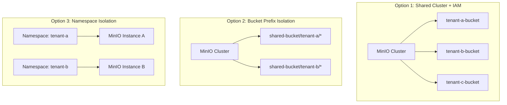
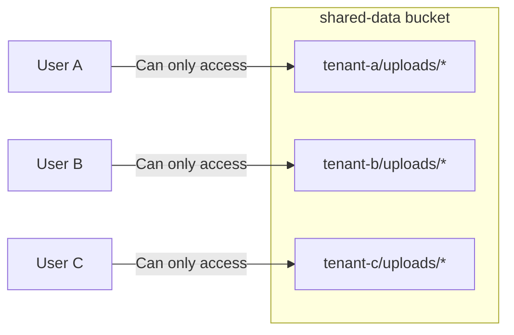
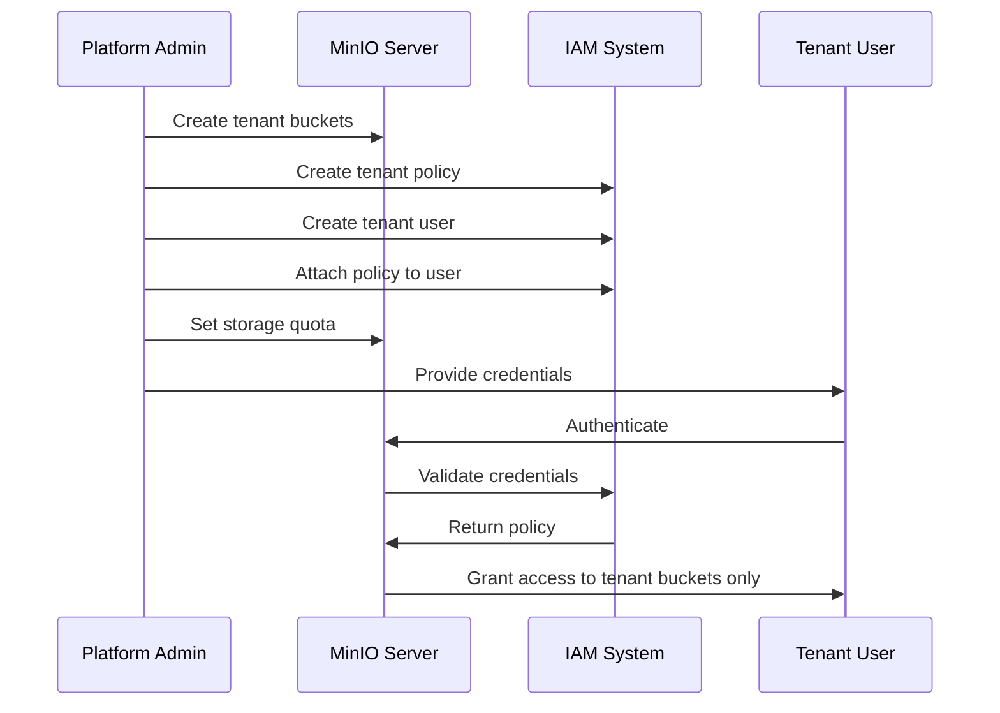

# How to Configure MinIO Multi-Tenancy

Author: [nawazdhandala](https://www.github.com/nawazdhandala)

Tags: MinIO, Object Storage, Multi-Tenancy, IAM, Security, Kubernetes

Description: A practical guide to implementing secure multi-tenant object storage with MinIO using policies, bucket isolation, and resource quotas.

---

Running a single MinIO cluster for multiple teams or customers requires careful isolation. Each tenant needs their own buckets, credentials, and resource limits without being able to access other tenants' data. MinIO provides several mechanisms to achieve this, from simple IAM policies to full namespace isolation in Kubernetes.

## Multi-Tenancy Architecture Options

There are three primary approaches to MinIO multi-tenancy:



## Option 1: Shared Cluster with IAM Policies

The most common approach uses a single MinIO cluster with IAM policies to isolate tenants.

### Create Tenant Buckets

```bash
# Create dedicated buckets for each tenant
mc mb myminio/tenant-alpha-data
mc mb myminio/tenant-beta-data
mc mb myminio/tenant-gamma-data
```

### Create Tenant Policies

Define a policy that restricts access to specific bucket prefixes:

```json
{
  "Version": "2012-10-17",
  "Statement": [
    {
      "Effect": "Allow",
      "Action": [
        "s3:GetBucketLocation",
        "s3:ListBucket"
      ],
      "Resource": [
        "arn:aws:s3:::tenant-alpha-*"
      ]
    },
    {
      "Effect": "Allow",
      "Action": [
        "s3:GetObject",
        "s3:PutObject",
        "s3:DeleteObject"
      ],
      "Resource": [
        "arn:aws:s3:::tenant-alpha-*/*"
      ]
    }
  ]
}
```

Apply the policy:

```bash
# Save as tenant-alpha-policy.json
mc admin policy create myminio tenant-alpha-policy tenant-alpha-policy.json

# List policies to verify
mc admin policy ls myminio
```

### Create Tenant Users

```bash
# Create user for tenant alpha
mc admin user add myminio tenant-alpha-user SecurePassword123!

# Attach the tenant policy
mc admin policy attach myminio tenant-alpha-policy --user tenant-alpha-user

# Verify user policy
mc admin user info myminio tenant-alpha-user
```

### Create Tenant Service Accounts

For programmatic access, create service accounts:

```bash
# Create service account with inherited policy
mc admin user svcacct add myminio tenant-alpha-user \
  --access-key "tenant-alpha-svc" \
  --secret-key "tenant-alpha-secret-key-here"

# Or create with custom policy (more restrictive than parent)
mc admin user svcacct add myminio tenant-alpha-user \
  --access-key "tenant-alpha-readonly" \
  --secret-key "readonly-secret-key" \
  --policy /path/to/readonly-policy.json
```

## Option 2: Prefix-Based Isolation

When you want a single bucket with tenant-specific prefixes:



### Prefix Policy Example

```json
{
  "Version": "2012-10-17",
  "Statement": [
    {
      "Effect": "Allow",
      "Action": [
        "s3:ListBucket"
      ],
      "Resource": [
        "arn:aws:s3:::shared-data"
      ],
      "Condition": {
        "StringLike": {
          "s3:prefix": [
            "tenant-alpha/*",
            "tenant-alpha"
          ]
        }
      }
    },
    {
      "Effect": "Allow",
      "Action": [
        "s3:GetObject",
        "s3:PutObject",
        "s3:DeleteObject"
      ],
      "Resource": [
        "arn:aws:s3:::shared-data/tenant-alpha/*"
      ]
    }
  ]
}
```

## Option 3: Kubernetes Namespace Isolation

For strongest isolation, deploy separate MinIO instances per tenant:

### Tenant MinIO Deployment

```yaml
apiVersion: v1
kind: Namespace
metadata:
  name: tenant-alpha
  labels:
    tenant: alpha
---
apiVersion: v1
kind: Secret
metadata:
  name: minio-credentials
  namespace: tenant-alpha
type: Opaque
stringData:
  root-user: "tenant-alpha-admin"
  root-password: "SecurePassword123!"
---
apiVersion: apps/v1
kind: StatefulSet
metadata:
  name: minio
  namespace: tenant-alpha
spec:
  serviceName: minio
  replicas: 1
  selector:
    matchLabels:
      app: minio
  template:
    metadata:
      labels:
        app: minio
        tenant: alpha
    spec:
      containers:
        - name: minio
          image: minio/minio:latest
          args:
            - server
            - /data
            - --console-address
            - ":9001"
          env:
            - name: MINIO_ROOT_USER
              valueFrom:
                secretKeyRef:
                  name: minio-credentials
                  key: root-user
            - name: MINIO_ROOT_PASSWORD
              valueFrom:
                secretKeyRef:
                  name: minio-credentials
                  key: root-password
          ports:
            - containerPort: 9000
              name: api
            - containerPort: 9001
              name: console
          volumeMounts:
            - name: data
              mountPath: /data
          resources:
            requests:
              memory: "512Mi"
              cpu: "250m"
            limits:
              memory: "2Gi"
              cpu: "1000m"
  volumeClaimTemplates:
    - metadata:
        name: data
      spec:
        accessModes:
          - ReadWriteOnce
        resources:
          requests:
            storage: 100Gi
        storageClassName: fast-ssd
---
apiVersion: v1
kind: Service
metadata:
  name: minio
  namespace: tenant-alpha
spec:
  ports:
    - port: 9000
      name: api
    - port: 9001
      name: console
  selector:
    app: minio
```

### Network Policy for Tenant Isolation

```yaml
apiVersion: networking.k8s.io/v1
kind: NetworkPolicy
metadata:
  name: tenant-isolation
  namespace: tenant-alpha
spec:
  podSelector: {}
  policyTypes:
    - Ingress
    - Egress
  ingress:
    # Allow traffic only from same namespace
    - from:
        - podSelector: {}
    # Allow traffic from ingress controller
    - from:
        - namespaceSelector:
            matchLabels:
              kubernetes.io/metadata.name: ingress-nginx
  egress:
    # Allow DNS
    - to:
        - namespaceSelector:
            matchLabels:
              kubernetes.io/metadata.name: kube-system
      ports:
        - protocol: UDP
          port: 53
    # Allow traffic within namespace
    - to:
        - podSelector: {}
```

## Implementing Resource Quotas

### Storage Quotas per Tenant

MinIO supports bucket quotas to limit storage consumption:

```bash
# Set a 100GB quota on tenant bucket
mc quota set myminio/tenant-alpha-data --size 100GB

# Check quota status
mc quota info myminio/tenant-alpha-data

# Remove quota
mc quota clear myminio/tenant-alpha-data
```

### Kubernetes Resource Quotas

```yaml
apiVersion: v1
kind: ResourceQuota
metadata:
  name: tenant-alpha-quota
  namespace: tenant-alpha
spec:
  hard:
    requests.cpu: "2"
    requests.memory: "4Gi"
    limits.cpu: "4"
    limits.memory: "8Gi"
    persistentvolumeclaims: "5"
    requests.storage: "500Gi"
```

### Rate Limiting with MinIO

Implement API rate limits per user:

```bash
# Set rate limit for a user (requests per second)
mc admin user ratelimit set myminio tenant-alpha-user \
  --rate 100 \
  --burst 200
```

## Group-Based Access Control

Organize users into groups for easier management:

```bash
# Create a group
mc admin group add myminio tenant-alpha-admins tenant-alpha-user

# Create admin policy
cat > tenant-admin-policy.json << 'EOF'
{
  "Version": "2012-10-17",
  "Statement": [
    {
      "Effect": "Allow",
      "Action": [
        "s3:*"
      ],
      "Resource": [
        "arn:aws:s3:::tenant-alpha-*",
        "arn:aws:s3:::tenant-alpha-*/*"
      ]
    },
    {
      "Effect": "Allow",
      "Action": [
        "admin:CreateUser",
        "admin:DeleteUser",
        "admin:ListUsers",
        "admin:CreateServiceAccount",
        "admin:DeleteServiceAccount"
      ],
      "Resource": [
        "arn:minio:iam:::user/tenant-alpha-*"
      ]
    }
  ]
}
EOF

# Attach policy to group
mc admin policy create myminio tenant-alpha-admin-policy tenant-admin-policy.json
mc admin policy attach myminio tenant-alpha-admin-policy --group tenant-alpha-admins
```

## OIDC Integration for Tenant Authentication

Integrate with your identity provider for SSO:

```bash
# Configure OIDC
mc admin config set myminio identity_openid \
  config_url="https://auth.example.com/.well-known/openid-configuration" \
  client_id="minio-client" \
  client_secret="your-client-secret" \
  claim_name="groups" \
  scopes="openid,profile,email"

# Restart MinIO
mc admin service restart myminio
```

Map OIDC claims to policies:

```bash
# Map OIDC group to MinIO policy
mc admin policy create myminio tenant-alpha-oidc-policy tenant-alpha-policy.json

# Configure claim-based policy mapping
mc admin config set myminio identity_openid \
  claim_userinfo="enabled" \
  redirect_uri="http://minio.example.com/oauth_callback"
```

## Audit Logging per Tenant

Enable audit logging to track tenant activity:

```bash
# Configure audit webhook
mc admin config set myminio audit_webhook:tenant-logs \
  endpoint="http://audit-service:8080/logs" \
  auth_token="secret-token" \
  client_cert="" \
  client_key=""

# Restart to apply
mc admin service restart myminio
```

Sample audit log entry:

```json
{
  "version": "1",
  "deploymentid": "production-cluster",
  "time": "2026-01-28T10:30:00Z",
  "trigger": "incoming",
  "api": {
    "name": "PutObject",
    "bucket": "tenant-alpha-data",
    "object": "uploads/file.pdf",
    "status": "OK",
    "statusCode": 200
  },
  "remotehost": "10.0.1.50",
  "requestID": "17A8B2C3D4E5F6",
  "userAgent": "MinIO (linux; amd64)",
  "requestClaims": {
    "accessKey": "tenant-alpha-svc",
    "parent": "tenant-alpha-user"
  }
}
```

## Complete Multi-Tenant Setup Script

```bash
#!/bin/bash
# multi-tenant-setup.sh - Create isolated tenant in MinIO

MINIO_ALIAS="myminio"
TENANT_NAME=$1
STORAGE_QUOTA=$2  # e.g., "100GB"

if [ -z "$TENANT_NAME" ]; then
  echo "Usage: $0 <tenant-name> [storage-quota]"
  exit 1
fi

echo "Creating tenant: $TENANT_NAME"

# Create tenant bucket
mc mb ${MINIO_ALIAS}/${TENANT_NAME}-data
mc mb ${MINIO_ALIAS}/${TENANT_NAME}-backups

# Set quota if specified
if [ -n "$STORAGE_QUOTA" ]; then
  mc quota set ${MINIO_ALIAS}/${TENANT_NAME}-data --size $STORAGE_QUOTA
  mc quota set ${MINIO_ALIAS}/${TENANT_NAME}-backups --size $STORAGE_QUOTA
fi

# Create tenant policy
cat > /tmp/${TENANT_NAME}-policy.json << EOF
{
  "Version": "2012-10-17",
  "Statement": [
    {
      "Effect": "Allow",
      "Action": ["s3:GetBucketLocation", "s3:ListBucket"],
      "Resource": ["arn:aws:s3:::${TENANT_NAME}-*"]
    },
    {
      "Effect": "Allow",
      "Action": ["s3:GetObject", "s3:PutObject", "s3:DeleteObject"],
      "Resource": ["arn:aws:s3:::${TENANT_NAME}-*/*"]
    }
  ]
}
EOF

mc admin policy create ${MINIO_ALIAS} ${TENANT_NAME}-policy /tmp/${TENANT_NAME}-policy.json

# Create tenant admin user
ADMIN_PASSWORD=$(openssl rand -base64 24)
mc admin user add ${MINIO_ALIAS} ${TENANT_NAME}-admin "$ADMIN_PASSWORD"
mc admin policy attach ${MINIO_ALIAS} ${TENANT_NAME}-policy --user ${TENANT_NAME}-admin

# Create service account
SVC_ACCESS_KEY="${TENANT_NAME}-svc-$(openssl rand -hex 4)"
SVC_SECRET_KEY=$(openssl rand -base64 32)

mc admin user svcacct add ${MINIO_ALIAS} ${TENANT_NAME}-admin \
  --access-key "$SVC_ACCESS_KEY" \
  --secret-key "$SVC_SECRET_KEY"

echo "======================================"
echo "Tenant created successfully!"
echo "======================================"
echo "Admin User: ${TENANT_NAME}-admin"
echo "Admin Password: $ADMIN_PASSWORD"
echo "Service Account Access Key: $SVC_ACCESS_KEY"
echo "Service Account Secret Key: $SVC_SECRET_KEY"
echo "Buckets: ${TENANT_NAME}-data, ${TENANT_NAME}-backups"
echo "======================================"

# Cleanup
rm /tmp/${TENANT_NAME}-policy.json
```

## Tenant Management Flow



## Security Best Practices

1. **Use separate credentials per environment** - Never share credentials between dev, staging, and production.

2. **Rotate credentials regularly** - Implement automated key rotation with service accounts.

3. **Enable encryption** - Use server-side encryption per bucket:
   ```bash
   mc encrypt set sse-s3 myminio/tenant-alpha-data
   ```

4. **Enable versioning for critical data**:
   ```bash
   mc version enable myminio/tenant-alpha-data
   ```

5. **Implement bucket policies as defense in depth**:
   ```bash
   mc anonymous set none myminio/tenant-alpha-data
   ```

6. **Monitor for policy violations** - Set up alerts for access denied events in audit logs.

---

Multi-tenancy in MinIO comes down to proper IAM configuration and clear boundaries. Start with the shared cluster approach for simplicity, and move to namespace isolation only when you need stronger guarantees. The key is establishing clear policies upfront and automating tenant provisioning to prevent configuration drift.
