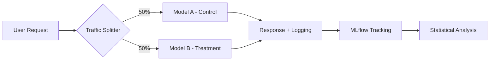
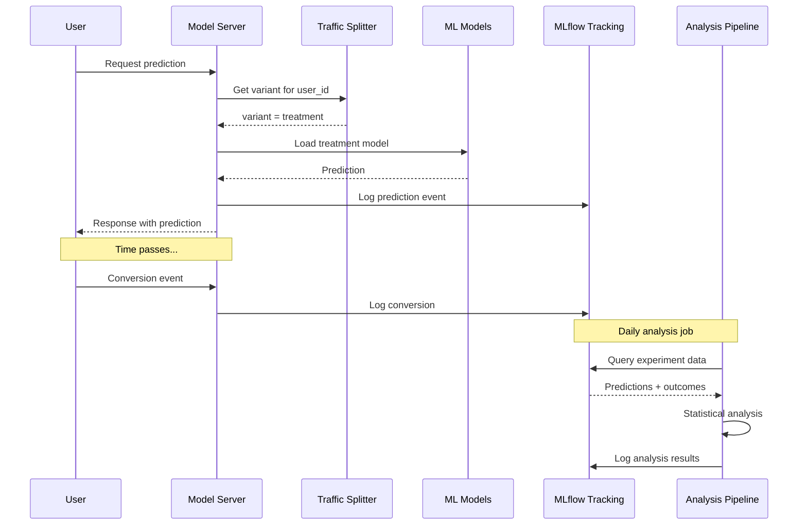

# How to Implement MLflow for A/B Testing

Author: [nawazdhandala](https://www.github.com/nawazdhandala)

Tags: MLflow, A/B Testing, MLOps, Machine Learning, Experimentation, Python

Description: Learn how to implement A/B testing for machine learning models using MLflow for experiment tracking, traffic splitting, and statistical analysis.

---

A/B testing machine learning models requires careful experiment design, traffic management, and statistical rigor. MLflow provides the infrastructure to track model variants, log predictions, and analyze results. This guide shows how to build a complete A/B testing system for ML models using MLflow.

## Why A/B Test ML Models?

Offline metrics (accuracy, F1, AUC) do not always correlate with business outcomes. A/B testing lets you measure real-world impact:

- Does the new recommendation model increase conversion rates?
- Does the updated fraud model reduce false positives without increasing fraud?
- Does the personalization model improve user engagement?



## Setting Up the Experiment Structure

First, create an organized experiment structure in MLflow:

```python
import mlflow
from mlflow.tracking import MlflowClient

client = MlflowClient()

# Create parent experiment for the A/B test
mlflow.set_experiment("/ab-tests/recommendation-model-v2")

# Create child runs for each variant
with mlflow.start_run(run_name="ab-test-2026-01-28") as parent_run:
    # Log test configuration
    mlflow.log_param("test_name", "recommendation-model-v2-test")
    mlflow.log_param("start_date", "2026-01-28")
    mlflow.log_param("target_sample_size", 10000)
    mlflow.log_param("significance_level", 0.05)
    mlflow.log_param("minimum_detectable_effect", 0.02)

    # Create nested runs for each variant
    with mlflow.start_run(run_name="control-model-v1", nested=True) as control_run:
        mlflow.log_param("model_version", "v1.2.3")
        mlflow.log_param("traffic_percentage", 50)
        mlflow.set_tag("variant", "control")
        control_run_id = control_run.info.run_id

    with mlflow.start_run(run_name="treatment-model-v2", nested=True) as treatment_run:
        mlflow.log_param("model_version", "v2.0.0")
        mlflow.log_param("traffic_percentage", 50)
        mlflow.set_tag("variant", "treatment")
        treatment_run_id = treatment_run.info.run_id

print(f"Control run ID: {control_run_id}")
print(f"Treatment run ID: {treatment_run_id}")
```

## Traffic Splitting Implementation

Implement consistent traffic splitting based on user IDs:

```python
import hashlib
from typing import Literal

class TrafficSplitter:
    """
    Deterministic traffic splitter using consistent hashing.
    The same user always sees the same variant.
    """

    def __init__(self, control_percentage: int = 50, salt: str = "ab-test-v1"):
        self.control_percentage = control_percentage
        self.salt = salt

    def get_variant(self, user_id: str) -> Literal["control", "treatment"]:
        """
        Assign user to a variant based on hashed user ID.
        Consistent hashing ensures the same user always gets the same variant.
        """
        # Create deterministic hash
        hash_input = f"{self.salt}:{user_id}"
        hash_value = int(hashlib.md5(hash_input.encode()).hexdigest(), 16)

        # Map to percentage bucket
        bucket = hash_value % 100

        if bucket < self.control_percentage:
            return "control"
        else:
            return "treatment"

    def get_variant_distribution(self, user_ids: list) -> dict:
        """Check actual distribution across a list of users."""
        distribution = {"control": 0, "treatment": 0}
        for user_id in user_ids:
            variant = self.get_variant(user_id)
            distribution[variant] += 1
        return distribution


# Usage example
splitter = TrafficSplitter(control_percentage=50, salt="rec-model-test-001")

# Verify distribution
import random
test_users = [f"user_{i}" for i in range(10000)]
distribution = splitter.get_variant_distribution(test_users)
print(f"Distribution: {distribution}")
# Output: Distribution: {'control': 4987, 'treatment': 5013}
```

## Model Serving with A/B Testing

Create a serving layer that routes requests and logs predictions:

```python
import mlflow
import mlflow.pyfunc
from datetime import datetime
import json

class ABTestingModelServer:
    """
    Model server that handles A/B testing, prediction, and logging.
    """

    def __init__(
        self,
        control_model_uri: str,
        treatment_model_uri: str,
        experiment_name: str,
        control_percentage: int = 50
    ):
        self.control_model = mlflow.pyfunc.load_model(control_model_uri)
        self.treatment_model = mlflow.pyfunc.load_model(treatment_model_uri)
        self.splitter = TrafficSplitter(control_percentage)
        self.experiment_name = experiment_name

        # Set up MLflow experiment
        mlflow.set_experiment(experiment_name)

    def predict(self, user_id: str, features: dict) -> dict:
        """
        Make prediction using the appropriate model variant.
        Logs the prediction for later analysis.
        """
        variant = self.splitter.get_variant(user_id)
        timestamp = datetime.utcnow().isoformat()

        # Select model based on variant
        if variant == "control":
            model = self.control_model
        else:
            model = self.treatment_model

        # Make prediction
        import pandas as pd
        input_df = pd.DataFrame([features])
        prediction = model.predict(input_df)[0]

        # Log prediction event
        self._log_prediction(
            user_id=user_id,
            variant=variant,
            features=features,
            prediction=prediction,
            timestamp=timestamp
        )

        return {
            "user_id": user_id,
            "variant": variant,
            "prediction": prediction,
            "timestamp": timestamp
        }

    def _log_prediction(
        self,
        user_id: str,
        variant: str,
        features: dict,
        prediction,
        timestamp: str
    ):
        """Log prediction to MLflow for later analysis."""
        # In production, batch these writes for efficiency
        prediction_record = {
            "user_id": user_id,
            "variant": variant,
            "prediction": float(prediction) if hasattr(prediction, '__float__') else prediction,
            "timestamp": timestamp,
            "features": features
        }

        # Log to a file artifact (batch in production)
        # For real-time, consider streaming to a database
        with open(f"/tmp/predictions_{variant}.jsonl", "a") as f:
            f.write(json.dumps(prediction_record) + "\n")


# Initialize the server
server = ABTestingModelServer(
    control_model_uri="models:/recommendation-model/1",
    treatment_model_uri="models:/recommendation-model/2",
    experiment_name="/ab-tests/recommendation-model-v2",
    control_percentage=50
)

# Make predictions
result = server.predict(
    user_id="user_12345",
    features={"age": 28, "tenure_days": 180, "purchase_count": 12}
)
print(result)
```

## Logging Outcomes

Track conversions and other business metrics:

```python
import mlflow
from datetime import datetime

class OutcomeTracker:
    """
    Track business outcomes (conversions, clicks, etc.) for A/B test analysis.
    """

    def __init__(self, experiment_name: str):
        self.experiment_name = experiment_name
        mlflow.set_experiment(experiment_name)

    def log_conversion(
        self,
        user_id: str,
        variant: str,
        converted: bool,
        revenue: float = 0.0,
        metadata: dict = None
    ):
        """Log a conversion event."""
        event = {
            "user_id": user_id,
            "variant": variant,
            "converted": converted,
            "revenue": revenue,
            "timestamp": datetime.utcnow().isoformat(),
            "metadata": metadata or {}
        }

        # Append to outcomes file
        with open(f"/tmp/outcomes_{variant}.jsonl", "a") as f:
            f.write(json.dumps(event) + "\n")

    def log_engagement(
        self,
        user_id: str,
        variant: str,
        event_type: str,
        value: float = 1.0
    ):
        """Log engagement events (clicks, views, time spent, etc.)."""
        event = {
            "user_id": user_id,
            "variant": variant,
            "event_type": event_type,
            "value": value,
            "timestamp": datetime.utcnow().isoformat()
        }

        with open(f"/tmp/engagement_{variant}.jsonl", "a") as f:
            f.write(json.dumps(event) + "\n")


# Usage
tracker = OutcomeTracker("/ab-tests/recommendation-model-v2")

# Log conversion
tracker.log_conversion(
    user_id="user_12345",
    variant="treatment",
    converted=True,
    revenue=49.99
)

# Log engagement
tracker.log_engagement(
    user_id="user_12345",
    variant="treatment",
    event_type="click",
    value=1.0
)
```

## Statistical Analysis

Analyze results with proper statistical methods:

```python
import numpy as np
from scipy import stats
import pandas as pd
import mlflow

def load_experiment_data(variant: str) -> pd.DataFrame:
    """Load outcomes data for a variant."""
    records = []
    with open(f"/tmp/outcomes_{variant}.jsonl", "r") as f:
        for line in f:
            records.append(json.loads(line))
    return pd.DataFrame(records)

def calculate_conversion_rate(df: pd.DataFrame) -> tuple:
    """Calculate conversion rate and standard error."""
    n = len(df)
    conversions = df["converted"].sum()
    rate = conversions / n if n > 0 else 0
    se = np.sqrt(rate * (1 - rate) / n) if n > 0 else 0
    return rate, se, n

def run_ab_test_analysis(experiment_name: str):
    """
    Run statistical analysis on A/B test results.
    """
    mlflow.set_experiment(experiment_name)

    # Load data for both variants
    control_df = load_experiment_data("control")
    treatment_df = load_experiment_data("treatment")

    # Calculate metrics
    control_rate, control_se, control_n = calculate_conversion_rate(control_df)
    treatment_rate, treatment_se, treatment_n = calculate_conversion_rate(treatment_df)

    # Calculate lift
    lift = (treatment_rate - control_rate) / control_rate if control_rate > 0 else 0

    # Two-proportion z-test
    pooled_rate = (control_df["converted"].sum() + treatment_df["converted"].sum()) / (control_n + treatment_n)
    pooled_se = np.sqrt(pooled_rate * (1 - pooled_rate) * (1/control_n + 1/treatment_n))
    z_stat = (treatment_rate - control_rate) / pooled_se if pooled_se > 0 else 0
    p_value = 2 * (1 - stats.norm.cdf(abs(z_stat)))  # Two-tailed test

    # Confidence interval for the difference
    ci_lower = (treatment_rate - control_rate) - 1.96 * pooled_se
    ci_upper = (treatment_rate - control_rate) + 1.96 * pooled_se

    # Log results to MLflow
    with mlflow.start_run(run_name="analysis-results"):
        mlflow.log_metric("control_conversion_rate", control_rate)
        mlflow.log_metric("treatment_conversion_rate", treatment_rate)
        mlflow.log_metric("control_sample_size", control_n)
        mlflow.log_metric("treatment_sample_size", treatment_n)
        mlflow.log_metric("relative_lift", lift)
        mlflow.log_metric("z_statistic", z_stat)
        mlflow.log_metric("p_value", p_value)
        mlflow.log_metric("ci_lower", ci_lower)
        mlflow.log_metric("ci_upper", ci_upper)

        # Determine significance
        is_significant = p_value < 0.05
        mlflow.log_param("is_significant", is_significant)
        mlflow.log_param("recommendation",
            "Deploy treatment" if is_significant and lift > 0 else "Keep control"
        )

    results = {
        "control": {"rate": control_rate, "n": control_n},
        "treatment": {"rate": treatment_rate, "n": treatment_n},
        "lift": lift,
        "p_value": p_value,
        "confidence_interval": (ci_lower, ci_upper),
        "is_significant": is_significant
    }

    return results


# Run analysis
results = run_ab_test_analysis("/ab-tests/recommendation-model-v2")
print(f"Control conversion rate: {results['control']['rate']:.4f}")
print(f"Treatment conversion rate: {results['treatment']['rate']:.4f}")
print(f"Relative lift: {results['lift']:.2%}")
print(f"P-value: {results['p_value']:.4f}")
print(f"Significant: {results['is_significant']}")
```

## Sequential Testing for Early Stopping

Implement sequential testing to detect winners earlier:

```python
import numpy as np
from scipy import stats

class SequentialTester:
    """
    Sequential probability ratio test (SPRT) for early stopping.
    Allows stopping the test early when results are conclusive.
    """

    def __init__(
        self,
        alpha: float = 0.05,  # Type I error rate
        beta: float = 0.20,   # Type II error rate (1 - power)
        minimum_effect: float = 0.02  # Minimum detectable effect
    ):
        self.alpha = alpha
        self.beta = beta
        self.minimum_effect = minimum_effect

        # Calculate decision boundaries
        self.upper_boundary = np.log((1 - beta) / alpha)
        self.lower_boundary = np.log(beta / (1 - alpha))

    def calculate_log_likelihood_ratio(
        self,
        control_conversions: int,
        control_n: int,
        treatment_conversions: int,
        treatment_n: int
    ) -> float:
        """Calculate the log likelihood ratio for SPRT."""
        # Estimate conversion rates
        p_control = control_conversions / control_n if control_n > 0 else 0.5
        p_treatment = treatment_conversions / treatment_n if treatment_n > 0 else 0.5

        # Avoid log(0)
        p_control = max(min(p_control, 0.999), 0.001)
        p_treatment = max(min(p_treatment, 0.999), 0.001)

        # Under H0: both have same rate
        p_null = (control_conversions + treatment_conversions) / (control_n + treatment_n)
        p_null = max(min(p_null, 0.999), 0.001)

        # Under H1: treatment is better by minimum_effect
        p_alt = p_null + self.minimum_effect
        p_alt = max(min(p_alt, 0.999), 0.001)

        # Log likelihood ratio
        llr = (
            treatment_conversions * np.log(p_alt / p_null) +
            (treatment_n - treatment_conversions) * np.log((1 - p_alt) / (1 - p_null))
        )

        return llr

    def check_stopping_condition(
        self,
        control_conversions: int,
        control_n: int,
        treatment_conversions: int,
        treatment_n: int
    ) -> dict:
        """
        Check if we should stop the test.
        Returns decision: 'continue', 'reject_null' (treatment wins), or 'accept_null' (no difference).
        """
        llr = self.calculate_log_likelihood_ratio(
            control_conversions, control_n,
            treatment_conversions, treatment_n
        )

        if llr >= self.upper_boundary:
            return {
                "decision": "reject_null",
                "message": "Treatment is significantly better. Stop test and deploy.",
                "llr": llr
            }
        elif llr <= self.lower_boundary:
            return {
                "decision": "accept_null",
                "message": "No significant difference detected. Stop test and keep control.",
                "llr": llr
            }
        else:
            return {
                "decision": "continue",
                "message": "Not enough evidence. Continue collecting data.",
                "llr": llr
            }


# Usage
tester = SequentialTester(alpha=0.05, beta=0.20, minimum_effect=0.02)

# Check periodically as data comes in
result = tester.check_stopping_condition(
    control_conversions=487,
    control_n=5000,
    treatment_conversions=523,
    treatment_n=5000
)
print(result)
```

## Complete A/B Testing Workflow



## Monitoring the Test

Set up monitoring to catch issues during the test:

```python
import mlflow

def check_test_health(experiment_name: str) -> dict:
    """
    Check health metrics for an ongoing A/B test.
    """
    mlflow.set_experiment(experiment_name)

    control_df = load_experiment_data("control")
    treatment_df = load_experiment_data("treatment")

    checks = {}

    # Check sample ratio mismatch (SRM)
    total_n = len(control_df) + len(treatment_df)
    expected_control = total_n * 0.5
    chi_sq = ((len(control_df) - expected_control) ** 2) / expected_control
    chi_sq += ((len(treatment_df) - expected_control) ** 2) / expected_control
    srm_p_value = 1 - stats.chi2.cdf(chi_sq, df=1)

    checks["sample_ratio_mismatch"] = {
        "control_n": len(control_df),
        "treatment_n": len(treatment_df),
        "chi_squared": chi_sq,
        "p_value": srm_p_value,
        "is_healthy": srm_p_value > 0.01  # Alert if p < 0.01
    }

    # Check for novelty effects (are results stable over time?)
    # Compare first half vs second half of treatment data
    if len(treatment_df) > 100:
        first_half = treatment_df.head(len(treatment_df) // 2)
        second_half = treatment_df.tail(len(treatment_df) // 2)

        first_rate = first_half["converted"].mean()
        second_rate = second_half["converted"].mean()

        checks["novelty_effect"] = {
            "first_half_rate": first_rate,
            "second_half_rate": second_rate,
            "difference": abs(first_rate - second_rate),
            "is_healthy": abs(first_rate - second_rate) < 0.05
        }

    # Log health check results
    with mlflow.start_run(run_name="health-check"):
        for check_name, check_result in checks.items():
            mlflow.log_param(f"{check_name}_healthy", check_result["is_healthy"])
            for key, value in check_result.items():
                if isinstance(value, (int, float)):
                    mlflow.log_metric(f"{check_name}_{key}", value)

    return checks


# Run health check
health = check_test_health("/ab-tests/recommendation-model-v2")
if not health["sample_ratio_mismatch"]["is_healthy"]:
    print("WARNING: Sample ratio mismatch detected. Check traffic splitting logic.")
```

## Best Practices

1. **Use consistent hashing for assignment** - Ensures users always see the same variant, avoiding experience inconsistency.

2. **Log everything** - Predictions, outcomes, timestamps, and feature values. You cannot analyze what you did not log.

3. **Run power analysis first** - Determine required sample size before starting the test.

4. **Monitor for sample ratio mismatch** - A significant imbalance indicates a bug in your splitting logic.

5. **Watch for novelty effects** - Early results may not reflect long-term behavior.

6. **Use sequential testing carefully** - It allows early stopping but increases complexity.

7. **Document the test** - Record hypothesis, metrics, sample size calculation, and decision criteria in MLflow.

---

A/B testing ML models bridges the gap between offline evaluation and real-world impact. By using MLflow to track predictions, outcomes, and analysis results, you create an auditable record of your experiments. Start with simple 50/50 splits and fixed-horizon tests, then graduate to sequential testing and multi-armed bandits as your experimentation practice matures.
