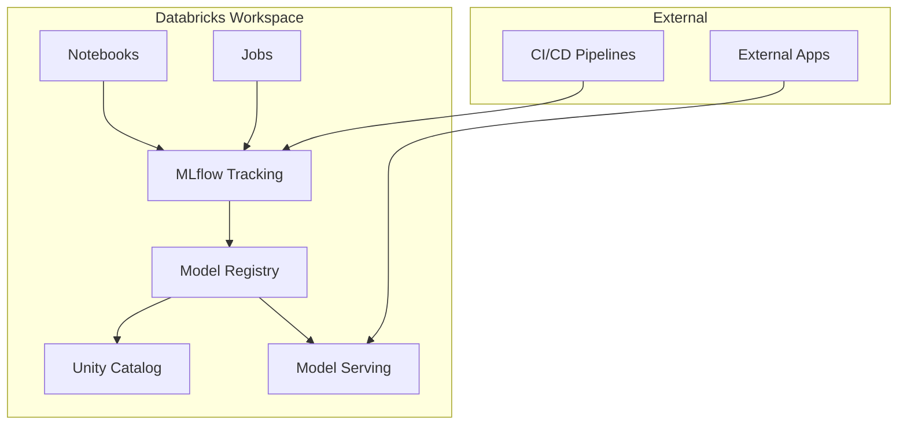
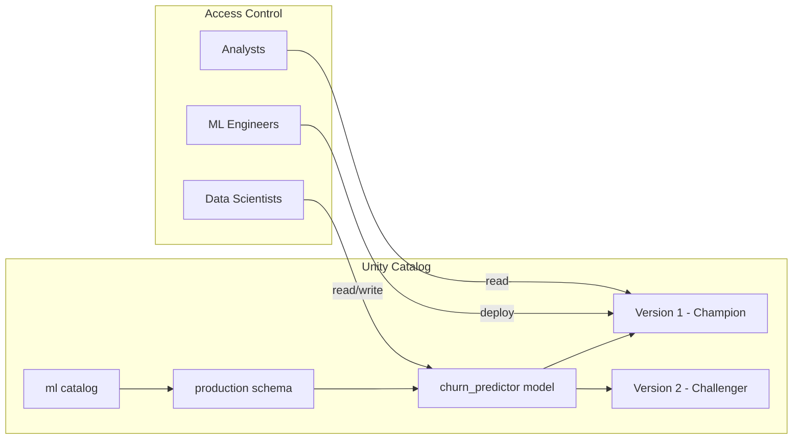
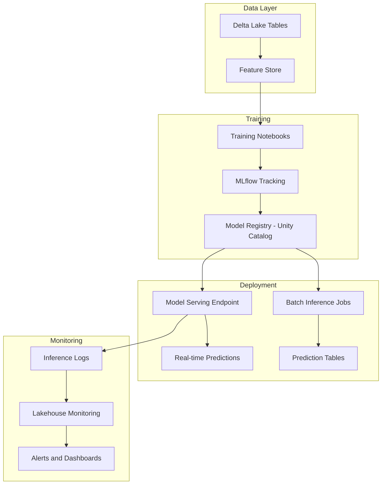

# How to Use MLflow with Databricks

Author: [nawazdhandala](https://www.github.com/nawazdhandala)

Tags: MLflow, Databricks, MLOps, Machine Learning, Spark, Python

Description: A hands-on guide to using MLflow with Databricks for experiment tracking, model registry, and production deployments at scale.

---

Databricks provides a managed MLflow experience that integrates deeply with Spark, notebooks, and the Unity Catalog. This guide covers how to set up and use MLflow effectively within Databricks - from experiment tracking to deploying models in production.

## Why MLflow on Databricks?

Running MLflow on Databricks offers several advantages over self-hosted setups:

- Managed tracking server with automatic authentication
- Integration with Unity Catalog for model governance
- Built-in model serving endpoints
- Seamless Spark DataFrame logging
- Collaborative notebook experience with experiment visibility



## Setting Up MLflow in Databricks

MLflow is pre-installed in Databricks Runtime. You can start tracking experiments immediately:

```python
# In a Databricks notebook
import mlflow

# MLflow is automatically configured to use the workspace tracking server
# No setup required - just start logging

with mlflow.start_run():
    mlflow.log_param("learning_rate", 0.01)
    mlflow.log_metric("accuracy", 0.95)
```

### Configuring Experiments

Create and organize experiments in Databricks:

```python
import mlflow

# Set experiment by path (creates if not exists)
mlflow.set_experiment("/Users/your-email@company.com/churn-prediction")

# Or use a shared workspace experiment
mlflow.set_experiment("/Shared/team-experiments/recommendation-model")

# Get experiment details
experiment = mlflow.get_experiment_by_name("/Users/your-email@company.com/churn-prediction")
print(f"Experiment ID: {experiment.experiment_id}")
print(f"Artifact Location: {experiment.artifact_location}")
```

## Tracking Experiments with Spark

One of the key benefits of Databricks is the integration with Spark DataFrames:

```python
import mlflow
import mlflow.spark
from pyspark.ml.feature import VectorAssembler, StringIndexer
from pyspark.ml.classification import RandomForestClassifier
from pyspark.ml import Pipeline
from pyspark.ml.evaluation import MulticlassClassificationEvaluator

# Load data as Spark DataFrame
df = spark.read.parquet("/mnt/data/customer_features")

# Split data
train_df, test_df = df.randomSplit([0.8, 0.2], seed=42)

# Define feature pipeline
assembler = VectorAssembler(
    inputCols=["age", "tenure", "monthly_charges", "total_charges"],
    outputCol="features"
)

indexer = StringIndexer(inputCol="churn", outputCol="label")

rf = RandomForestClassifier(
    numTrees=100,
    maxDepth=10,
    seed=42
)

pipeline = Pipeline(stages=[assembler, indexer, rf])

# Train with MLflow tracking
with mlflow.start_run(run_name="spark-rf-model"):
    # Log Spark-specific parameters
    mlflow.log_param("num_trees", 100)
    mlflow.log_param("max_depth", 10)
    mlflow.log_param("training_rows", train_df.count())

    # Fit pipeline
    model = pipeline.fit(train_df)

    # Evaluate
    predictions = model.transform(test_df)
    evaluator = MulticlassClassificationEvaluator(
        labelCol="label",
        predictionCol="prediction"
    )

    accuracy = evaluator.evaluate(predictions, {evaluator.metricName: "accuracy"})
    f1 = evaluator.evaluate(predictions, {evaluator.metricName: "f1"})

    mlflow.log_metric("accuracy", accuracy)
    mlflow.log_metric("f1_score", f1)

    # Log Spark ML model
    mlflow.spark.log_model(model, "spark-model")

    # Also log sample predictions as artifact
    sample_predictions = predictions.select("features", "label", "prediction").limit(100)
    sample_pandas = sample_predictions.toPandas()
    sample_pandas.to_csv("/tmp/sample_predictions.csv", index=False)
    mlflow.log_artifact("/tmp/sample_predictions.csv")

    print(f"Model accuracy: {accuracy:.4f}")
```

## Feature Store Integration

Databricks Feature Store works seamlessly with MLflow:

```python
from databricks.feature_store import FeatureStoreClient
import mlflow

fs = FeatureStoreClient()

# Define features to use from feature store
feature_lookups = [
    FeatureLookup(
        table_name="ml.features.customer_features",
        feature_names=["avg_transaction_amount", "days_since_last_purchase"],
        lookup_key="customer_id"
    ),
    FeatureLookup(
        table_name="ml.features.product_features",
        feature_names=["category_embedding", "price_tier"],
        lookup_key="product_id"
    )
]

# Create training dataset
training_set = fs.create_training_set(
    df=labels_df,  # DataFrame with customer_id, product_id, and label
    feature_lookups=feature_lookups,
    label="purchased"
)

training_df = training_set.load_df()

# Train model with feature store awareness
with mlflow.start_run():
    # Train your model
    model = train_model(training_df)

    # Log model with feature store metadata
    # This enables automatic feature lookup at inference time
    fs.log_model(
        model=model,
        artifact_path="model",
        flavor=mlflow.sklearn,
        training_set=training_set,
        registered_model_name="recommendation_model"
    )
```

## Model Registry with Unity Catalog

Unity Catalog provides enterprise-grade model governance:

```python
import mlflow
from mlflow.tracking import MlflowClient

# Configure MLflow to use Unity Catalog
mlflow.set_registry_uri("databricks-uc")

# Register a model to Unity Catalog
model_uri = f"runs:/{run_id}/model"
model_name = "ml.production.churn_predictor"  # catalog.schema.model_name

# Register the model
mlflow.register_model(model_uri, model_name)

# Work with model versions
client = MlflowClient()

# Add description to model
client.update_registered_model(
    name=model_name,
    description="Customer churn prediction model using XGBoost"
)

# Set aliases (replaces stages in UC)
client.set_registered_model_alias(
    name=model_name,
    alias="Champion",
    version=1
)

# Add tags for governance
client.set_model_version_tag(
    name=model_name,
    version=1,
    key="validation_status",
    value="approved"
)
```



## Deploying Models with Model Serving

Databricks Model Serving provides managed endpoints for real-time inference:

```python
from databricks.sdk import WorkspaceClient
from databricks.sdk.service.serving import EndpointCoreConfigInput, ServedModelInput

w = WorkspaceClient()

# Create a model serving endpoint
endpoint_name = "churn-predictor-endpoint"

w.serving_endpoints.create_and_wait(
    name=endpoint_name,
    config=EndpointCoreConfigInput(
        served_models=[
            ServedModelInput(
                model_name="ml.production.churn_predictor",
                model_version="1",
                workload_size="Small",
                scale_to_zero_enabled=True
            )
        ]
    )
)

print(f"Endpoint {endpoint_name} is ready")
```

### Querying the Endpoint

```python
import requests
import json

# Get endpoint URL
endpoint_url = f"https://{workspace_url}/serving-endpoints/{endpoint_name}/invocations"

# Prepare request
headers = {
    "Authorization": f"Bearer {token}",
    "Content-Type": "application/json"
}

data = {
    "dataframe_records": [
        {"age": 35, "tenure": 24, "monthly_charges": 65.5, "total_charges": 1572.0},
        {"age": 42, "tenure": 48, "monthly_charges": 89.0, "total_charges": 4272.0}
    ]
}

# Make prediction request
response = requests.post(endpoint_url, headers=headers, json=data)
predictions = response.json()

print(predictions)
# {"predictions": [0, 1]}
```

## Automated Model Training with Jobs

Set up scheduled retraining using Databricks Jobs:

```python
# training_job.py - Notebook or Python file for scheduled training
import mlflow
from datetime import datetime

def train_and_register():
    mlflow.set_experiment("/Shared/production/churn-model-training")

    with mlflow.start_run(run_name=f"scheduled-{datetime.now().isoformat()}"):
        # Load fresh data
        df = spark.read.table("ml.features.customer_training_data")

        # Train model
        model = train_model(df)

        # Log metrics
        metrics = evaluate_model(model, test_df)
        for name, value in metrics.items():
            mlflow.log_metric(name, value)

        # Register if performance meets threshold
        if metrics["accuracy"] > 0.85:
            mlflow.register_model(
                f"runs:/{mlflow.active_run().info.run_id}/model",
                "ml.production.churn_predictor"
            )
            print("New model version registered")
        else:
            print(f"Model accuracy {metrics['accuracy']:.4f} below threshold")

if __name__ == "__main__":
    train_and_register()
```

Configure the job via Databricks UI or API:

```python
from databricks.sdk import WorkspaceClient
from databricks.sdk.service.jobs import Task, NotebookTask, CronSchedule

w = WorkspaceClient()

# Create scheduled training job
job = w.jobs.create(
    name="churn-model-retraining",
    tasks=[
        Task(
            task_key="train",
            notebook_task=NotebookTask(
                notebook_path="/Repos/ml-team/model-training/training_job"
            ),
            existing_cluster_id="your-cluster-id"
        )
    ],
    schedule=CronSchedule(
        quartz_cron_expression="0 0 6 * * ?",  # Daily at 6 AM
        timezone_id="America/New_York"
    )
)

print(f"Created job with ID: {job.job_id}")
```

## Comparing Experiments

Use the MLflow UI or API to compare runs:

```python
import mlflow
from mlflow.tracking import MlflowClient
import pandas as pd

client = MlflowClient()

# Get all runs from experiment
experiment = mlflow.get_experiment_by_name("/Shared/team-experiments/churn-model")
runs = client.search_runs(
    experiment_ids=[experiment.experiment_id],
    filter_string="metrics.accuracy > 0.8",
    order_by=["metrics.accuracy DESC"],
    max_results=10
)

# Create comparison DataFrame
comparison_data = []
for run in runs:
    comparison_data.append({
        "run_id": run.info.run_id,
        "run_name": run.info.run_name,
        "accuracy": run.data.metrics.get("accuracy"),
        "f1_score": run.data.metrics.get("f1_score"),
        "learning_rate": run.data.params.get("learning_rate"),
        "num_trees": run.data.params.get("num_trees")
    })

comparison_df = pd.DataFrame(comparison_data)
display(comparison_df)  # Databricks display function
```

## Autologging Configuration

Enable automatic logging for supported frameworks:

```python
import mlflow

# Enable autologging for sklearn
mlflow.sklearn.autolog(
    log_input_examples=True,
    log_model_signatures=True,
    log_models=True,
    silent=False
)

# Enable autologging for Spark ML
mlflow.spark.autolog()

# Enable autologging for PyTorch
mlflow.pytorch.autolog()

# Now any training will be automatically logged
from sklearn.ensemble import GradientBoostingClassifier

# This training is automatically tracked
model = GradientBoostingClassifier(n_estimators=100)
model.fit(X_train, y_train)
# Parameters, metrics, and model are logged automatically
```

## Best Practices for Databricks MLflow

1. **Use Unity Catalog for production models** - Provides access control, lineage tracking, and audit logs.

2. **Organize experiments by project** - Use consistent naming like `/Shared/project-name/experiment-name`.

3. **Tag runs meaningfully** - Add tags for data version, feature set version, and business context.

4. **Enable autologging selectively** - Use autologging for exploration, manual logging for production training.

5. **Set up model validation gates** - Require approval before promoting models to Champion alias.

6. **Monitor endpoint performance** - Use Databricks Lakehouse Monitoring for inference tables.

## Architecture Overview



---

MLflow on Databricks combines the flexibility of open-source MLflow with enterprise-grade features for governance, deployment, and monitoring. By using Unity Catalog for model registry, Feature Store for consistent features, and Model Serving for production endpoints, you get a complete MLOps platform without managing infrastructure. Start with experiment tracking in notebooks, then progressively adopt model registry and serving as your ML operations mature.
