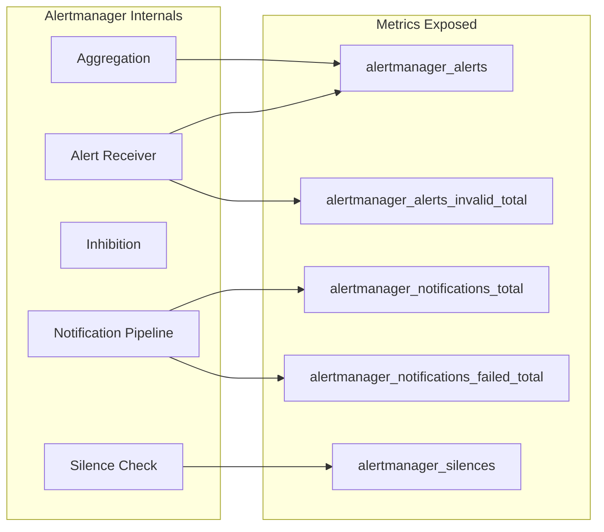

# How to Monitor Alertmanager Health

Author: [nawazdhandala](https://www.github.com/nawazdhandala)

Tags: Alertmanager, Prometheus, Monitoring, Observability, SRE

Description: Learn how to monitor Alertmanager itself using metrics, health endpoints, and alerting rules to ensure your alerting pipeline stays reliable.

---

Your alerting system is only useful if it works when you need it. Alertmanager exposes extensive metrics about its own health, notification delivery, and cluster state. Setting up monitoring for Alertmanager itself creates a feedback loop that catches issues before they cause missed alerts in production.

## Understanding Alertmanager Metrics

Alertmanager exposes Prometheus metrics on the `/metrics` endpoint. These metrics cover notification delivery, silences, inhibitions, and cluster health. Here are the most important ones to track.



## 1. Configure Prometheus to Scrape Alertmanager

First, add Alertmanager as a scrape target in your Prometheus configuration:

`prometheus.yml`

```yaml
scrape_configs:
  # Scrape Alertmanager metrics
  - job_name: 'alertmanager'
    # Scrape every 15 seconds for timely health data
    scrape_interval: 15s
    static_configs:
      - targets:
          - 'alertmanager-1.example.com:9093'
          - 'alertmanager-2.example.com:9093'
          - 'alertmanager-3.example.com:9093'
    # Add instance label for easier identification
    relabel_configs:
      - source_labels: [__address__]
        regex: '(.+):9093'
        target_label: alertmanager_instance
        replacement: '${1}'
```

For Kubernetes environments using ServiceMonitor:

```yaml
apiVersion: monitoring.coreos.com/v1
kind: ServiceMonitor
metadata:
  name: alertmanager
  namespace: monitoring
  labels:
    app: alertmanager
spec:
  selector:
    matchLabels:
      app: alertmanager
  endpoints:
    - port: web
      interval: 15s
      path: /metrics
  namespaceSelector:
    matchNames:
      - monitoring
```

## 2. Essential Health Metrics

These are the key metrics to monitor for Alertmanager health:

### Notification Success and Failure Rates

```promql
# Total notifications sent by integration type
sum by (integration) (rate(alertmanager_notifications_total[5m]))

# Failed notifications by integration - should be zero
sum by (integration) (rate(alertmanager_notifications_failed_total[5m]))

# Notification success rate percentage
100 * (
  1 - (
    sum(rate(alertmanager_notifications_failed_total[5m]))
    /
    sum(rate(alertmanager_notifications_total[5m]))
  )
)
```

### Alert Processing Metrics

```promql
# Current number of active alerts
alertmanager_alerts{state="active"}

# Rate of incoming alerts
rate(alertmanager_alerts_received_total[5m])

# Invalid alerts received - indicates configuration issues
rate(alertmanager_alerts_invalid_total[5m])
```

### Cluster Health Metrics

```promql
# Number of connected cluster peers
alertmanager_cluster_members

# Cluster peer health - should match total cluster size
alertmanager_cluster_peers_joined_total - alertmanager_cluster_peers_left_total

# Message propagation failures
rate(alertmanager_cluster_messages_publish_failures_total[5m])
```

## 3. Create Alerting Rules for Alertmanager

Create a rules file that alerts on Alertmanager issues. This creates a meta-monitoring setup where Prometheus watches Alertmanager.

`alertmanager-alerts.yml`

```yaml
groups:
  - name: alertmanager.rules
    rules:
      # Alert when notifications are failing
      - alert: AlertmanagerNotificationsFailing
        expr: |
          rate(alertmanager_notifications_failed_total[5m]) > 0
        for: 5m
        labels:
          severity: critical
        annotations:
          summary: "Alertmanager failing to send notifications"
          description: "Alertmanager {{ $labels.instance }} has been failing to send {{ $labels.integration }} notifications for 5 minutes."
          runbook_url: "https://runbooks.example.com/alertmanager-notifications"

      # Alert when Alertmanager is not processing alerts
      - alert: AlertmanagerNotReceivingAlerts
        expr: |
          rate(alertmanager_alerts_received_total[10m]) == 0
        for: 10m
        labels:
          severity: warning
        annotations:
          summary: "Alertmanager not receiving alerts"
          description: "Alertmanager {{ $labels.instance }} has not received any alerts in 10 minutes."

      # Alert on cluster membership issues
      - alert: AlertmanagerClusterMembersMissing
        expr: |
          alertmanager_cluster_members < 3
        for: 5m
        labels:
          severity: warning
        annotations:
          summary: "Alertmanager cluster has fewer than 3 members"
          description: "Alertmanager cluster has only {{ $value }} members, expected 3."

      # Alert when cluster is completely down
      - alert: AlertmanagerClusterDown
        expr: |
          alertmanager_cluster_members < 2
        for: 1m
        labels:
          severity: critical
        annotations:
          summary: "Alertmanager cluster lost quorum"
          description: "Alertmanager cluster has only {{ $value }} member(s). Deduplication may not work correctly."

      # Alert on high alert queue
      - alert: AlertmanagerHighAlertVolume
        expr: |
          alertmanager_alerts{state="active"} > 1000
        for: 15m
        labels:
          severity: warning
        annotations:
          summary: "High number of active alerts in Alertmanager"
          description: "Alertmanager {{ $labels.instance }} has {{ $value }} active alerts."

      # Alert when Alertmanager is down
      - alert: AlertmanagerDown
        expr: |
          up{job="alertmanager"} == 0
        for: 2m
        labels:
          severity: critical
        annotations:
          summary: "Alertmanager instance is down"
          description: "Alertmanager instance {{ $labels.instance }} has been down for 2 minutes."

      # Alert on gossip failures
      - alert: AlertmanagerClusterGossipFailures
        expr: |
          rate(alertmanager_cluster_messages_publish_failures_total[5m]) > 0
        for: 5m
        labels:
          severity: warning
        annotations:
          summary: "Alertmanager cluster gossip failing"
          description: "Alertmanager {{ $labels.instance }} is failing to propagate messages to cluster peers."

      # Alert on configuration reload failures
      - alert: AlertmanagerConfigReloadFailed
        expr: |
          alertmanager_config_last_reload_successful == 0
        for: 5m
        labels:
          severity: critical
        annotations:
          summary: "Alertmanager config reload failed"
          description: "Alertmanager {{ $labels.instance }} failed to reload its configuration."
```

## 4. Monitor Health Endpoints

Alertmanager provides HTTP health endpoints for liveness and readiness checks:

```bash
# Check if Alertmanager is healthy (returns 200 OK)
curl -s http://alertmanager:9093/-/healthy
# Output: OK

# Check if Alertmanager is ready to receive traffic
curl -s http://alertmanager:9093/-/ready
# Output: OK

# Get detailed status including cluster information
curl -s http://alertmanager:9093/api/v2/status | jq
```

For Kubernetes, configure probes using these endpoints:

```yaml
containers:
  - name: alertmanager
    livenessProbe:
      httpGet:
        path: /-/healthy
        port: 9093
      initialDelaySeconds: 30
      periodSeconds: 10
      timeoutSeconds: 3
      failureThreshold: 3
    readinessProbe:
      httpGet:
        path: /-/ready
        port: 9093
      initialDelaySeconds: 5
      periodSeconds: 5
      timeoutSeconds: 3
      failureThreshold: 2
```

## 5. Build a Grafana Dashboard

Create a dashboard to visualize Alertmanager health. Here are the essential panels:

```json
{
  "title": "Alertmanager Health",
  "panels": [
    {
      "title": "Notification Rate by Integration",
      "type": "graph",
      "targets": [
        {
          "expr": "sum by (integration) (rate(alertmanager_notifications_total[5m]))",
          "legendFormat": "{{ integration }}"
        }
      ]
    },
    {
      "title": "Notification Failures",
      "type": "graph",
      "targets": [
        {
          "expr": "sum by (integration) (rate(alertmanager_notifications_failed_total[5m]))",
          "legendFormat": "{{ integration }} failures"
        }
      ]
    },
    {
      "title": "Active Alerts",
      "type": "stat",
      "targets": [
        {
          "expr": "sum(alertmanager_alerts{state=\"active\"})"
        }
      ]
    },
    {
      "title": "Cluster Members",
      "type": "stat",
      "targets": [
        {
          "expr": "alertmanager_cluster_members"
        }
      ]
    },
    {
      "title": "Silences",
      "type": "stat",
      "targets": [
        {
          "expr": "sum(alertmanager_silences{state=\"active\"})"
        }
      ]
    }
  ]
}
```

Query the API to get more detailed information for dashboards:

```bash
# Get all active alerts
curl -s http://alertmanager:9093/api/v2/alerts | jq 'length'

# Get all active silences
curl -s http://alertmanager:9093/api/v2/silences | jq '[.[] | select(.status.state=="active")] | length'

# Get receivers configuration
curl -s http://alertmanager:9093/api/v2/receivers | jq '.[].name'
```

## 6. Set Up Dead Man's Switch

A dead man's switch is a continuously firing alert that proves the entire alerting pipeline works. If you stop receiving this alert, something is broken.

Add this to your Prometheus rules:

`deadmans-switch.yml`

```yaml
groups:
  - name: deadmans-switch
    rules:
      # This alert should ALWAYS fire - if it stops, alerting is broken
      - alert: DeadMansSwitch
        expr: vector(1)
        labels:
          severity: none
        annotations:
          summary: "Dead man's switch alert"
          description: "This alert fires continuously to prove the alerting pipeline works."
```

Configure a receiver that expects this alert:

```yaml
route:
  receiver: 'default'
  routes:
    # Route dead man's switch to a dedicated receiver
    - match:
        alertname: DeadMansSwitch
      receiver: 'deadmans-switch'
      # Don't group with other alerts
      group_wait: 0s
      group_interval: 1m
      repeat_interval: 1m

receivers:
  - name: 'deadmans-switch'
    webhook_configs:
      # Send to a service that alerts if it STOPS receiving
      - url: 'https://healthcheck.example.com/alertmanager-heartbeat'
        send_resolved: false
```

## 7. Monitor Notification Latency

Track how long it takes for alerts to be sent after being received:

```promql
# Average notification latency in seconds
rate(alertmanager_notification_latency_seconds_sum[5m])
/
rate(alertmanager_notification_latency_seconds_count[5m])

# 99th percentile notification latency
histogram_quantile(0.99,
  rate(alertmanager_notification_latency_seconds_bucket[5m])
)
```

Alert on high latency:

```yaml
- alert: AlertmanagerNotificationLatencyHigh
  expr: |
    histogram_quantile(0.99,
      rate(alertmanager_notification_latency_seconds_bucket[5m])
    ) > 10
  for: 5m
  labels:
    severity: warning
  annotations:
    summary: "High notification latency in Alertmanager"
    description: "99th percentile notification latency is {{ $value | humanizeDuration }}."
```

---

Monitoring Alertmanager is critical for maintaining a reliable alerting pipeline. Scrape its metrics with Prometheus, create alerting rules that catch notification failures and cluster issues, set up a dead man's switch as a continuous health check, and build dashboards that give visibility into alert flow. When Alertmanager has problems, you want to know before your on-call team misses a production incident.
