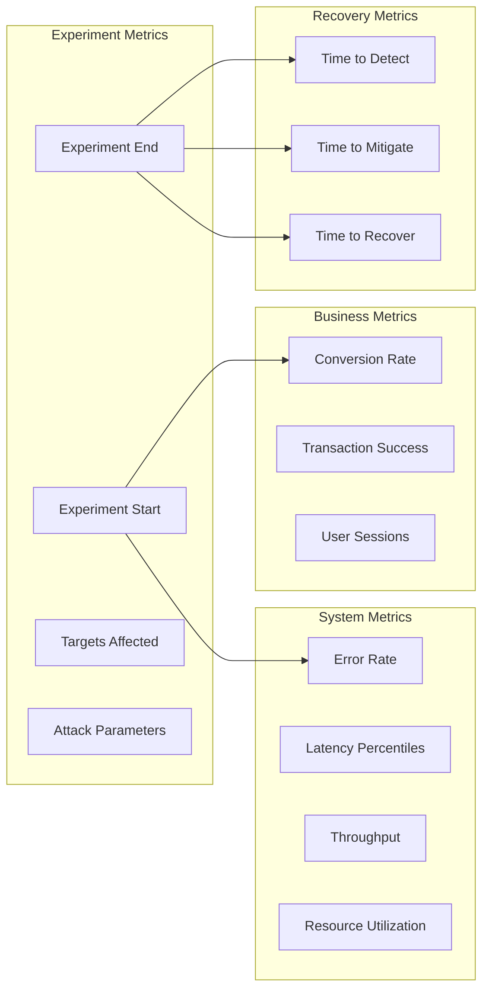
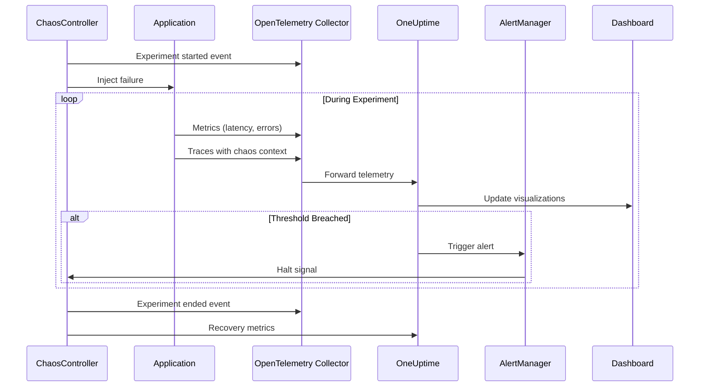

# How to Monitor Chaos Experiments

Author: [nawazdhandala](https://www.github.com/nawazdhandala)

Tags: Chaos Engineering, Observability, Monitoring, OpenTelemetry, SRE, Metrics, Alerting

Description: Learn how to set up effective monitoring for chaos experiments to capture meaningful data and ensure safety during fault injection.

---

## Why Monitoring Matters for Chaos Engineering

Chaos experiments without proper monitoring are just random destruction. The entire point of injecting failures is to observe how systems respond, measure impact, and validate resilience. If you cannot see what happens during an experiment, you gain no useful insights.

Good monitoring during chaos experiments answers these questions:

- Did the system behave as expected?
- How long did recovery take?
- What was the blast radius?
- Did safety thresholds get breached?
- Were the right people alerted?

## Core Metrics to Track



## Setting Up the Monitoring Stack

### OpenTelemetry Configuration

Configure OpenTelemetry to capture chaos experiment context:

```python
# chaos_telemetry.py
# OpenTelemetry setup for chaos experiment monitoring

from opentelemetry import trace, metrics
from opentelemetry.sdk.trace import TracerProvider
from opentelemetry.sdk.metrics import MeterProvider
from opentelemetry.sdk.resources import Resource
from opentelemetry.exporter.otlp.proto.grpc.trace_exporter import OTLPSpanExporter
from opentelemetry.exporter.otlp.proto.grpc.metric_exporter import OTLPMetricExporter
from opentelemetry.sdk.trace.export import BatchSpanProcessor
from opentelemetry.sdk.metrics.export import PeriodicExportingMetricReader
import os

def setup_chaos_telemetry():
    """Configure OpenTelemetry with chaos experiment context."""

    # Resource attributes identify the service and experiment
    resource = Resource.create({
        "service.name": os.environ.get("SERVICE_NAME", "unknown"),
        "service.version": os.environ.get("SERVICE_VERSION", "unknown"),
        "deployment.environment": os.environ.get("ENVIRONMENT", "unknown"),
        # Chaos-specific attributes
        "chaos.experiment.active": os.environ.get("CHAOS_EXPERIMENT_ACTIVE", "false"),
        "chaos.experiment.id": os.environ.get("CHAOS_EXPERIMENT_ID", "none"),
    })

    # Configure tracing
    trace_provider = TracerProvider(resource=resource)
    trace_exporter = OTLPSpanExporter(
        endpoint=os.environ.get("OTEL_EXPORTER_OTLP_ENDPOINT", "http://localhost:4317")
    )
    trace_provider.add_span_processor(BatchSpanProcessor(trace_exporter))
    trace.set_tracer_provider(trace_provider)

    # Configure metrics
    metric_reader = PeriodicExportingMetricReader(
        OTLPMetricExporter(
            endpoint=os.environ.get("OTEL_EXPORTER_OTLP_ENDPOINT", "http://localhost:4317")
        ),
        export_interval_millis=10000  # Export every 10 seconds during experiments
    )
    metric_provider = MeterProvider(resource=resource, metric_readers=[metric_reader])
    metrics.set_meter_provider(metric_provider)

    return trace.get_tracer(__name__), metrics.get_meter(__name__)

tracer, meter = setup_chaos_telemetry()

# Define chaos-specific metrics
experiment_counter = meter.create_counter(
    name="chaos.experiments.total",
    description="Total chaos experiments executed",
    unit="1"
)

recovery_histogram = meter.create_histogram(
    name="chaos.recovery.duration",
    description="Time to recover from chaos experiment",
    unit="s"
)

impact_gauge = meter.create_observable_gauge(
    name="chaos.impact.score",
    description="Current impact score of active experiment",
    unit="1"
)
```

### Experiment Event Tracking

Create structured events for experiment lifecycle:

```python
# chaos_events.py
# Track chaos experiment lifecycle events

from dataclasses import dataclass, asdict
from datetime import datetime
from typing import Dict, List, Optional
import json
import requests

@dataclass
class ChaosEvent:
    """Represents a chaos experiment lifecycle event."""
    event_type: str  # started, completed, halted, recovered
    experiment_id: str
    experiment_name: str
    timestamp: str
    targets: List[str]
    attack_type: str
    parameters: Dict
    metadata: Optional[Dict] = None

class ChaosEventTracker:
    """Send chaos events to monitoring systems."""

    def __init__(self, oneuptime_endpoint: str, api_key: str):
        self.endpoint = oneuptime_endpoint
        self.api_key = api_key
        self.events: List[ChaosEvent] = []

    def record_experiment_start(self, experiment_id: str, name: str,
                                 targets: List[str], attack_type: str,
                                 parameters: Dict):
        """Record when an experiment begins."""
        event = ChaosEvent(
            event_type="started",
            experiment_id=experiment_id,
            experiment_name=name,
            timestamp=datetime.utcnow().isoformat() + "Z",
            targets=targets,
            attack_type=attack_type,
            parameters=parameters
        )

        self._send_event(event)
        self.events.append(event)

        # Also create a span for distributed tracing
        with tracer.start_as_current_span("chaos.experiment.start") as span:
            span.set_attribute("chaos.experiment.id", experiment_id)
            span.set_attribute("chaos.experiment.name", name)
            span.set_attribute("chaos.attack.type", attack_type)
            span.set_attribute("chaos.targets.count", len(targets))

    def record_experiment_end(self, experiment_id: str, success: bool,
                               impact_metrics: Dict, recovery_time_seconds: float):
        """Record when an experiment completes."""
        event = ChaosEvent(
            event_type="completed" if success else "failed",
            experiment_id=experiment_id,
            experiment_name=self._get_experiment_name(experiment_id),
            timestamp=datetime.utcnow().isoformat() + "Z",
            targets=[],
            attack_type="",
            parameters={},
            metadata={
                "success": success,
                "impact_metrics": impact_metrics,
                "recovery_time_seconds": recovery_time_seconds
            }
        )

        self._send_event(event)

        # Record recovery time metric
        recovery_histogram.record(
            recovery_time_seconds,
            attributes={
                "experiment_id": experiment_id,
                "success": str(success)
            }
        )

    def record_halt(self, experiment_id: str, reason: str):
        """Record when an experiment is halted early."""
        event = ChaosEvent(
            event_type="halted",
            experiment_id=experiment_id,
            experiment_name=self._get_experiment_name(experiment_id),
            timestamp=datetime.utcnow().isoformat() + "Z",
            targets=[],
            attack_type="",
            parameters={},
            metadata={"halt_reason": reason}
        )

        self._send_event(event)

    def _send_event(self, event: ChaosEvent):
        """Send event to OneUptime."""
        try:
            response = requests.post(
                f"{self.endpoint}/api/telemetry/events",
                headers={
                    "Content-Type": "application/json",
                    "X-OneUptime-Token": self.api_key
                },
                json=asdict(event),
                timeout=5
            )
            response.raise_for_status()
        except requests.RequestException as e:
            print(f"Failed to send chaos event: {e}")

    def _get_experiment_name(self, experiment_id: str) -> str:
        """Look up experiment name from recorded events."""
        for event in self.events:
            if event.experiment_id == experiment_id:
                return event.experiment_name
        return "unknown"
```

## Building Chaos Dashboards

Create dedicated dashboards that show experiment status alongside system health:

```yaml
# chaos_dashboard.yaml
# Dashboard definition for chaos experiment monitoring

apiVersion: grafana.integreatly.org/v1beta1
kind: GrafanaDashboard
metadata:
  name: chaos-experiments
spec:
  json: |
    {
      "title": "Chaos Engineering Dashboard",
      "panels": [
        {
          "title": "Active Experiments",
          "type": "stat",
          "gridPos": {"x": 0, "y": 0, "w": 6, "h": 4},
          "targets": [
            {
              "expr": "sum(chaos_experiments_active)",
              "legendFormat": "Active"
            }
          ]
        },
        {
          "title": "Experiment Timeline",
          "type": "timeseries",
          "gridPos": {"x": 6, "y": 0, "w": 18, "h": 8},
          "targets": [
            {
              "expr": "chaos_experiments_total",
              "legendFormat": "{{experiment_name}}"
            }
          ],
          "fieldConfig": {
            "defaults": {
              "custom": {
                "drawStyle": "bars"
              }
            }
          }
        },
        {
          "title": "Error Rate During Experiments",
          "type": "timeseries",
          "gridPos": {"x": 0, "y": 8, "w": 12, "h": 8},
          "targets": [
            {
              "expr": "sum(rate(http_requests_total{status=~'5..'}[1m])) / sum(rate(http_requests_total[1m]))",
              "legendFormat": "Error Rate"
            }
          ],
          "thresholds": {
            "steps": [
              {"value": 0, "color": "green"},
              {"value": 0.01, "color": "yellow"},
              {"value": 0.05, "color": "red"}
            ]
          }
        },
        {
          "title": "P99 Latency",
          "type": "timeseries",
          "gridPos": {"x": 12, "y": 8, "w": 12, "h": 8},
          "targets": [
            {
              "expr": "histogram_quantile(0.99, rate(http_request_duration_seconds_bucket[1m]))",
              "legendFormat": "P99 Latency"
            }
          ]
        },
        {
          "title": "Recovery Time Distribution",
          "type": "histogram",
          "gridPos": {"x": 0, "y": 16, "w": 12, "h": 8},
          "targets": [
            {
              "expr": "chaos_recovery_duration_bucket",
              "legendFormat": "{{le}}"
            }
          ]
        },
        {
          "title": "Experiment Results",
          "type": "piechart",
          "gridPos": {"x": 12, "y": 16, "w": 6, "h": 8},
          "targets": [
            {
              "expr": "sum by (result) (chaos_experiments_total)",
              "legendFormat": "{{result}}"
            }
          ]
        }
      ],
      "annotations": {
        "list": [
          {
            "name": "Chaos Events",
            "datasource": "loki",
            "enable": true,
            "expr": "{job=\"chaos-controller\"} |= \"experiment\"",
            "titleFormat": "{{experiment_name}}",
            "textFormat": "{{event_type}}"
          }
        ]
      }
    }
```

## Monitoring Data Flow



## Configuring Safety Alerts

Set up alerts that automatically halt experiments when safety thresholds are breached:

```python
# chaos_safety_alerts.py
# Alert configuration for chaos experiment safety

from dataclasses import dataclass
from typing import Callable, List
import asyncio

@dataclass
class SafetyThreshold:
    """Define a safety threshold for chaos experiments."""
    name: str
    metric_query: str
    threshold_value: float
    comparison: str  # gt, lt, gte, lte
    duration_seconds: int
    action: str  # halt, warn, escalate

safety_thresholds = [
    SafetyThreshold(
        name="High Error Rate",
        metric_query="sum(rate(http_requests_total{status=~'5..'}[1m])) / sum(rate(http_requests_total[1m]))",
        threshold_value=0.05,  # 5% error rate
        comparison="gt",
        duration_seconds=60,
        action="halt"
    ),
    SafetyThreshold(
        name="Extreme Latency",
        metric_query="histogram_quantile(0.99, rate(http_request_duration_seconds_bucket[1m]))",
        threshold_value=10.0,  # 10 second P99
        comparison="gt",
        duration_seconds=30,
        action="halt"
    ),
    SafetyThreshold(
        name="Service Unavailable",
        metric_query="up{job='api'}",
        threshold_value=0,
        comparison="lte",
        duration_seconds=15,
        action="halt"
    ),
    SafetyThreshold(
        name="Elevated Error Rate",
        metric_query="sum(rate(http_requests_total{status=~'5..'}[1m])) / sum(rate(http_requests_total[1m]))",
        threshold_value=0.01,  # 1% error rate
        comparison="gt",
        duration_seconds=120,
        action="warn"
    )
]

class SafetyMonitor:
    """Monitor safety thresholds during chaos experiments."""

    def __init__(self, metrics_client, chaos_controller, alert_client):
        self.metrics = metrics_client
        self.chaos = chaos_controller
        self.alerts = alert_client
        self.active = False

    async def start_monitoring(self, experiment_id: str):
        """Begin monitoring safety thresholds."""
        self.active = True
        breach_counts = {t.name: 0 for t in safety_thresholds}

        while self.active:
            for threshold in safety_thresholds:
                current_value = await self.metrics.query(threshold.metric_query)

                if self._is_breached(current_value, threshold):
                    breach_counts[threshold.name] += 10  # 10 second intervals

                    if breach_counts[threshold.name] >= threshold.duration_seconds:
                        await self._handle_breach(experiment_id, threshold, current_value)
                        breach_counts[threshold.name] = 0
                else:
                    breach_counts[threshold.name] = 0

            await asyncio.sleep(10)

    def _is_breached(self, value: float, threshold: SafetyThreshold) -> bool:
        """Check if threshold is breached."""
        comparisons = {
            "gt": lambda v, t: v > t,
            "lt": lambda v, t: v < t,
            "gte": lambda v, t: v >= t,
            "lte": lambda v, t: v <= t
        }
        return comparisons[threshold.comparison](value, threshold.threshold_value)

    async def _handle_breach(self, experiment_id: str, threshold: SafetyThreshold,
                              current_value: float):
        """Take action when a threshold is breached."""
        if threshold.action == "halt":
            await self.chaos.halt_experiment(experiment_id)
            await self.alerts.send_critical(
                f"Chaos experiment {experiment_id} halted: {threshold.name}",
                f"Current value: {current_value}, Threshold: {threshold.threshold_value}"
            )
        elif threshold.action == "warn":
            await self.alerts.send_warning(
                f"Chaos experiment {experiment_id} warning: {threshold.name}",
                f"Current value: {current_value}, Threshold: {threshold.threshold_value}"
            )
        elif threshold.action == "escalate":
            await self.alerts.page_oncall(
                f"Chaos experiment {experiment_id} requires attention",
                f"{threshold.name}: {current_value} (limit: {threshold.threshold_value})"
            )

    def stop_monitoring(self):
        """Stop the safety monitor."""
        self.active = False
```

## Correlating Chaos with Incidents

When chaos experiments cause issues, you need to correlate the experiment with the resulting alerts:

```python
# chaos_correlation.py
# Correlate chaos experiments with observability data

from datetime import datetime, timedelta
from typing import Dict, List, Optional

class ChaosCorrelator:
    """Correlate chaos experiments with incidents and metrics."""

    def __init__(self, experiment_store, incident_client, metrics_client):
        self.experiments = experiment_store
        self.incidents = incident_client
        self.metrics = metrics_client

    async def get_experiment_impact_report(self, experiment_id: str) -> Dict:
        """Generate a comprehensive impact report for an experiment."""
        experiment = await self.experiments.get(experiment_id)

        # Define the analysis window
        start_time = experiment.start_time - timedelta(minutes=5)  # Baseline
        end_time = experiment.end_time + timedelta(minutes=10)  # Recovery

        # Gather all correlated data
        report = {
            "experiment": {
                "id": experiment_id,
                "name": experiment.name,
                "type": experiment.attack_type,
                "duration_seconds": (experiment.end_time - experiment.start_time).total_seconds(),
                "targets": experiment.targets
            },
            "baseline": await self._get_baseline_metrics(
                start_time,
                experiment.start_time
            ),
            "during_experiment": await self._get_experiment_metrics(
                experiment.start_time,
                experiment.end_time
            ),
            "recovery": await self._get_recovery_metrics(
                experiment.end_time,
                end_time
            ),
            "incidents": await self._get_correlated_incidents(
                experiment.start_time,
                end_time
            ),
            "alerts": await self._get_triggered_alerts(
                experiment.start_time,
                end_time
            )
        }

        # Calculate impact scores
        report["impact_analysis"] = self._analyze_impact(report)

        return report

    async def _get_baseline_metrics(self, start: datetime, end: datetime) -> Dict:
        """Get baseline metrics before experiment."""
        return {
            "error_rate": await self.metrics.query_range(
                "sum(rate(http_requests_total{status=~'5..'}[1m])) / sum(rate(http_requests_total[1m]))",
                start, end
            ),
            "p50_latency": await self.metrics.query_range(
                "histogram_quantile(0.5, rate(http_request_duration_seconds_bucket[1m]))",
                start, end
            ),
            "p99_latency": await self.metrics.query_range(
                "histogram_quantile(0.99, rate(http_request_duration_seconds_bucket[1m]))",
                start, end
            ),
            "throughput": await self.metrics.query_range(
                "sum(rate(http_requests_total[1m]))",
                start, end
            )
        }

    def _analyze_impact(self, report: Dict) -> Dict:
        """Analyze the impact of the experiment."""
        baseline = report["baseline"]
        during = report["during_experiment"]

        return {
            "error_rate_increase": (
                max(during["error_rate"]) - sum(baseline["error_rate"]) / len(baseline["error_rate"])
            ),
            "latency_increase_percent": (
                (max(during["p99_latency"]) / (sum(baseline["p99_latency"]) / len(baseline["p99_latency"])) - 1) * 100
            ),
            "recovery_time_seconds": report["recovery"]["time_to_baseline"],
            "incidents_created": len(report["incidents"]),
            "alerts_fired": len(report["alerts"])
        }
```

## Best Practices

**Annotate everything**: Add experiment markers to all your dashboards so anomalies are immediately attributable to chaos.

**Keep baseline comparisons**: Always capture pre-experiment metrics to measure actual impact versus normal variance.

**Use short export intervals**: During experiments, increase telemetry export frequency to capture rapid changes.

**Create dedicated dashboards**: Do not mix chaos monitoring with general operations dashboards - the requirements differ.

**Automate reporting**: Generate experiment reports automatically so findings are captured while memories are fresh.

---

Effective chaos experiment monitoring turns destructive tests into actionable insights. By instrumenting your experiments with OpenTelemetry, setting up safety alerts, and correlating chaos events with system behavior, you transform random failures into controlled learning opportunities. The investment in monitoring infrastructure pays dividends in both experiment safety and the quality of insights you gain from each test.
