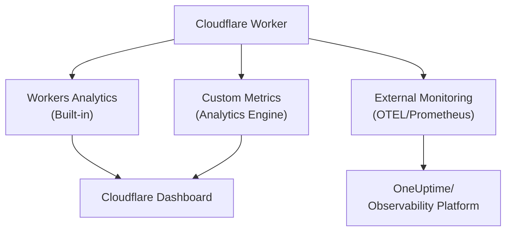

# How to Monitor Cloudflare Workers Performance

Author: [nawazdhandala](https://www.github.com/nawazdhandala)

Tags: Cloudflare, Cloudflare Workers, Performance, Monitoring, Observability, Metrics, Serverless

Description: Learn how to monitor Cloudflare Workers performance with built-in analytics, custom metrics, and external observability tools.

---

> Performance monitoring for serverless functions requires different strategies than traditional servers. Cloudflare Workers execute at the edge, making latency and resource usage critical metrics to track.

You cannot optimize what you cannot measure. Here is how to gain visibility into your Workers performance.

---

## Overview



---

## Built-in Workers Analytics

### Access Analytics via Dashboard

Cloudflare provides built-in analytics for all Workers:

1. Go to Cloudflare Dashboard
2. Select Workers and Pages
3. Click on your Worker
4. View the Analytics tab

Key metrics available:
- Request count
- Error rate
- CPU time
- Response duration
- Subrequest count

### Query Analytics via API

Access analytics programmatically using GraphQL:

```typescript
// scripts/fetch-analytics.ts
interface AnalyticsQuery {
  query: string;
  variables: Record<string, unknown>;
}

interface WorkerMetrics {
  requests: number;
  errors: number;
  cpuTime: number;
  duration: number;
}

async function fetchWorkerAnalytics(
  accountId: string,
  scriptName: string,
  apiToken: string
): Promise<WorkerMetrics> {
  const query: AnalyticsQuery = {
    query: `
      query GetWorkerAnalytics($accountId: String!, $scriptName: String!, $since: Time!, $until: Time!) {
        viewer {
          accounts(filter: { accountTag: $accountId }) {
            workersInvocationsAdaptive(
              filter: { scriptName: $scriptName, datetime_geq: $since, datetime_leq: $until }
              limit: 1000
            ) {
              sum {
                requests
                errors
                subrequests
              }
              quantiles {
                cpuTimeP50
                cpuTimeP99
                durationP50
                durationP99
              }
            }
          }
        }
      }
    `,
    variables: {
      accountId,
      scriptName,
      since: new Date(Date.now() - 3600000).toISOString(), // Last hour
      until: new Date().toISOString()
    }
  };

  const response = await fetch("https://api.cloudflare.com/client/v4/graphql", {
    method: "POST",
    headers: {
      "Content-Type": "application/json",
      "Authorization": `Bearer ${apiToken}`
    },
    body: JSON.stringify(query)
  });

  const data = await response.json();
  const metrics = data.data.viewer.accounts[0].workersInvocationsAdaptive[0];

  return {
    requests: metrics.sum.requests,
    errors: metrics.sum.errors,
    cpuTime: metrics.quantiles.cpuTimeP99,
    duration: metrics.quantiles.durationP99
  };
}
```

---

## Custom Metrics with Analytics Engine

### Configure Analytics Engine

Set up Analytics Engine binding in wrangler.toml:

```toml
# wrangler.toml
name = "my-worker"
main = "src/worker.ts"
compatibility_date = "2024-01-01"

# Analytics Engine binding
[[analytics_engine_datasets]]
binding = "METRICS"
dataset = "worker_metrics"
```

### Record Custom Metrics

Write metrics to Analytics Engine:

```typescript
// src/metrics.ts
export interface Env {
  METRICS: AnalyticsEngineDataset;
}

interface MetricEvent {
  blobs: string[];
  doubles: number[];
  indexes: string[];
}

class MetricsRecorder {
  private dataset: AnalyticsEngineDataset;
  private events: MetricEvent[] = [];

  constructor(dataset: AnalyticsEngineDataset) {
    this.dataset = dataset;
  }

  recordRequest(data: {
    path: string;
    method: string;
    status: number;
    duration: number;
    cpuTime: number;
    cacheStatus: string;
  }): void {
    this.dataset.writeDataPoint({
      blobs: [
        data.path,
        data.method,
        data.cacheStatus
      ],
      doubles: [
        data.status,
        data.duration,
        data.cpuTime
      ],
      indexes: [data.path]
    });
  }

  recordError(data: {
    path: string;
    errorType: string;
    errorMessage: string;
  }): void {
    this.dataset.writeDataPoint({
      blobs: [
        data.path,
        data.errorType,
        data.errorMessage
      ],
      doubles: [1], // Error count
      indexes: [data.errorType]
    });
  }

  recordCustomMetric(name: string, value: number, labels: Record<string, string>): void {
    this.dataset.writeDataPoint({
      blobs: [name, ...Object.values(labels)],
      doubles: [value],
      indexes: [name]
    });
  }
}

export { MetricsRecorder };
```

### Use Metrics in Worker

```typescript
// src/worker.ts
import { MetricsRecorder, Env } from "./metrics";

export default {
  async fetch(request: Request, env: Env, ctx: ExecutionContext): Promise<Response> {
    const metrics = new MetricsRecorder(env.METRICS);
    const startTime = Date.now();
    const url = new URL(request.url);

    let status = 200;
    let response: Response;

    try {
      response = await handleRequest(request, env);
      status = response.status;
    } catch (error) {
      status = 500;

      metrics.recordError({
        path: url.pathname,
        errorType: error instanceof Error ? error.name : "UnknownError",
        errorMessage: error instanceof Error ? error.message : "Unknown"
      });

      response = Response.json({ error: "Internal error" }, { status: 500 });
    }

    // Record request metrics using waitUntil to not block response
    ctx.waitUntil((async () => {
      metrics.recordRequest({
        path: url.pathname,
        method: request.method,
        status,
        duration: Date.now() - startTime,
        cpuTime: 0, // Would need actual CPU measurement
        cacheStatus: response.headers.get("cf-cache-status") || "NONE"
      });
    })());

    return response;
  }
};

async function handleRequest(request: Request, env: Env): Promise<Response> {
  return Response.json({ status: "ok" });
}
```

---

## Query Analytics Engine Data

### SQL API for Metrics

Query your custom metrics with SQL:

```typescript
// scripts/query-metrics.ts
interface QueryResult {
  data: Array<Record<string, unknown>>;
  meta: { name: string; type: string }[];
}

async function queryMetrics(
  accountId: string,
  apiToken: string
): Promise<QueryResult> {
  const query = `
    SELECT
      blob1 as path,
      blob2 as method,
      COUNT() as request_count,
      AVG(double2) as avg_duration,
      quantileExact(0.99)(double2) as p99_duration,
      SUM(CASE WHEN double1 >= 500 THEN 1 ELSE 0 END) as error_count
    FROM worker_metrics
    WHERE timestamp > NOW() - INTERVAL '1' HOUR
    GROUP BY blob1, blob2
    ORDER BY request_count DESC
    LIMIT 100
  `;

  const response = await fetch(
    `https://api.cloudflare.com/client/v4/accounts/${accountId}/analytics_engine/sql`,
    {
      method: "POST",
      headers: {
        "Authorization": `Bearer ${apiToken}`,
        "Content-Type": "text/plain"
      },
      body: query
    }
  );

  return response.json();
}

async function getErrorBreakdown(
  accountId: string,
  apiToken: string
): Promise<QueryResult> {
  const query = `
    SELECT
      blob2 as error_type,
      blob3 as error_message,
      COUNT() as count
    FROM worker_metrics
    WHERE
      timestamp > NOW() - INTERVAL '1' HOUR
      AND blob2 != ''
    GROUP BY blob2, blob3
    ORDER BY count DESC
    LIMIT 50
  `;

  const response = await fetch(
    `https://api.cloudflare.com/client/v4/accounts/${accountId}/analytics_engine/sql`,
    {
      method: "POST",
      headers: {
        "Authorization": `Bearer ${apiToken}`,
        "Content-Type": "text/plain"
      },
      body: query
    }
  );

  return response.json();
}
```

---

## OpenTelemetry Integration

### Send Traces to External Collector

Export OpenTelemetry traces from your Worker:

```typescript
// src/otel.ts
interface Span {
  traceId: string;
  spanId: string;
  parentSpanId?: string;
  name: string;
  startTimeUnixNano: string;
  endTimeUnixNano: string;
  attributes: Array<{ key: string; value: { stringValue?: string; intValue?: number } }>;
  status: { code: number };
}

interface OTLPTrace {
  resourceSpans: Array<{
    resource: {
      attributes: Array<{ key: string; value: { stringValue: string } }>;
    };
    scopeSpans: Array<{
      scope: { name: string };
      spans: Span[];
    }>;
  }>;
}

class OTelExporter {
  private endpoint: string;
  private headers: Record<string, string>;
  private serviceName: string;
  private spans: Span[] = [];

  constructor(config: {
    endpoint: string;
    token: string;
    serviceName: string;
  }) {
    this.endpoint = config.endpoint;
    this.headers = {
      "Content-Type": "application/json",
      "Authorization": `Bearer ${config.token}`
    };
    this.serviceName = config.serviceName;
  }

  private generateId(): string {
    const bytes = new Uint8Array(16);
    crypto.getRandomValues(bytes);
    return Array.from(bytes).map(b => b.toString(16).padStart(2, "0")).join("");
  }

  startSpan(name: string, traceId?: string, parentSpanId?: string): Span {
    const span: Span = {
      traceId: traceId || this.generateId(),
      spanId: this.generateId().substring(0, 16),
      parentSpanId,
      name,
      startTimeUnixNano: (Date.now() * 1000000).toString(),
      endTimeUnixNano: "",
      attributes: [],
      status: { code: 0 }
    };

    this.spans.push(span);
    return span;
  }

  endSpan(span: Span): void {
    span.endTimeUnixNano = (Date.now() * 1000000).toString();
  }

  setAttribute(span: Span, key: string, value: string | number): void {
    if (typeof value === "string") {
      span.attributes.push({ key, value: { stringValue: value } });
    } else {
      span.attributes.push({ key, value: { intValue: value } });
    }
  }

  setError(span: Span, error: Error): void {
    span.status = { code: 2 }; // Error status
    this.setAttribute(span, "error.message", error.message);
    this.setAttribute(span, "error.type", error.name);
  }

  async flush(): Promise<void> {
    if (this.spans.length === 0) return;

    const payload: OTLPTrace = {
      resourceSpans: [{
        resource: {
          attributes: [
            { key: "service.name", value: { stringValue: this.serviceName } }
          ]
        },
        scopeSpans: [{
          scope: { name: "cloudflare-worker" },
          spans: this.spans
        }]
      }]
    };

    await fetch(`${this.endpoint}/v1/traces`, {
      method: "POST",
      headers: this.headers,
      body: JSON.stringify(payload)
    });

    this.spans = [];
  }
}

export { OTelExporter, Span };
```

### Use OTel in Worker

```typescript
// src/worker.ts
import { OTelExporter, Span } from "./otel";

export interface Env {
  OTEL_ENDPOINT: string;
  OTEL_TOKEN: string;
}

export default {
  async fetch(request: Request, env: Env, ctx: ExecutionContext): Promise<Response> {
    const otel = new OTelExporter({
      endpoint: env.OTEL_ENDPOINT,
      token: env.OTEL_TOKEN,
      serviceName: "my-worker"
    });

    const url = new URL(request.url);

    // Start root span
    const rootSpan = otel.startSpan(`${request.method} ${url.pathname}`);
    otel.setAttribute(rootSpan, "http.method", request.method);
    otel.setAttribute(rootSpan, "http.url", request.url);
    otel.setAttribute(rootSpan, "http.host", url.host);

    let response: Response;

    try {
      // Create child span for business logic
      const processSpan = otel.startSpan(
        "process-request",
        rootSpan.traceId,
        rootSpan.spanId
      );

      response = await processRequest(request, env, otel, processSpan);

      otel.endSpan(processSpan);
      otel.setAttribute(rootSpan, "http.status_code", response.status);

    } catch (error) {
      otel.setError(rootSpan, error as Error);
      otel.setAttribute(rootSpan, "http.status_code", 500);
      response = Response.json({ error: "Internal error" }, { status: 500 });
    }

    otel.endSpan(rootSpan);

    // Flush traces without blocking response
    ctx.waitUntil(otel.flush());

    return response;
  }
};

async function processRequest(
  request: Request,
  env: Env,
  otel: OTelExporter,
  parentSpan: Span
): Promise<Response> {
  // Create span for external API call
  const apiSpan = otel.startSpan(
    "external-api-call",
    parentSpan.traceId,
    parentSpan.spanId
  );

  const apiResponse = await fetch("https://api.example.com/data");
  otel.setAttribute(apiSpan, "http.status_code", apiResponse.status);
  otel.endSpan(apiSpan);

  const data = await apiResponse.json();

  return Response.json(data);
}
```

---

## Performance Timing

### Measure Detailed Timing

Track timing for different phases of request processing:

```typescript
// src/timing.ts
interface TimingData {
  total: number;
  phases: Record<string, number>;
}

class RequestTimer {
  private startTime: number;
  private phases: Map<string, { start: number; end?: number }> = new Map();

  constructor() {
    this.startTime = Date.now();
  }

  startPhase(name: string): void {
    this.phases.set(name, { start: Date.now() });
  }

  endPhase(name: string): void {
    const phase = this.phases.get(name);
    if (phase) {
      phase.end = Date.now();
    }
  }

  getTimings(): TimingData {
    const phases: Record<string, number> = {};

    for (const [name, timing] of this.phases) {
      if (timing.end) {
        phases[name] = timing.end - timing.start;
      }
    }

    return {
      total: Date.now() - this.startTime,
      phases
    };
  }

  toServerTiming(): string {
    const entries: string[] = [];

    for (const [name, timing] of this.phases) {
      if (timing.end) {
        const duration = timing.end - timing.start;
        entries.push(`${name};dur=${duration}`);
      }
    }

    entries.push(`total;dur=${Date.now() - this.startTime}`);

    return entries.join(", ");
  }
}

export { RequestTimer, TimingData };
```

### Add Server-Timing Headers

```typescript
// src/worker.ts
import { RequestTimer } from "./timing";

export default {
  async fetch(request: Request): Promise<Response> {
    const timer = new RequestTimer();

    // Measure authentication
    timer.startPhase("auth");
    await authenticateRequest(request);
    timer.endPhase("auth");

    // Measure data fetch
    timer.startPhase("fetch");
    const data = await fetchData();
    timer.endPhase("fetch");

    // Measure serialization
    timer.startPhase("serialize");
    const body = JSON.stringify(data);
    timer.endPhase("serialize");

    // Return response with Server-Timing header
    return new Response(body, {
      headers: {
        "Content-Type": "application/json",
        "Server-Timing": timer.toServerTiming()
      }
    });
  }
};

async function authenticateRequest(request: Request): Promise<void> {
  // Auth logic
}

async function fetchData(): Promise<object> {
  return { data: [] };
}
```

---

## Health Check Endpoint

### Implement Health Checks

Create a health endpoint for external monitoring:

```typescript
// src/health.ts
export interface Env {
  KV_STORE: KVNamespace;
  DB: D1Database;
}

interface HealthStatus {
  status: "healthy" | "degraded" | "unhealthy";
  checks: Record<string, {
    status: "pass" | "fail";
    latency: number;
    message?: string;
  }>;
  version: string;
  timestamp: string;
}

async function checkHealth(env: Env): Promise<HealthStatus> {
  const checks: HealthStatus["checks"] = {};
  let overallHealthy = true;

  // Check KV Store
  const kvStart = Date.now();
  try {
    await env.KV_STORE.get("health-check-key");
    checks.kv = { status: "pass", latency: Date.now() - kvStart };
  } catch (error) {
    checks.kv = {
      status: "fail",
      latency: Date.now() - kvStart,
      message: error instanceof Error ? error.message : "Unknown error"
    };
    overallHealthy = false;
  }

  // Check D1 Database
  const dbStart = Date.now();
  try {
    await env.DB.prepare("SELECT 1").first();
    checks.database = { status: "pass", latency: Date.now() - dbStart };
  } catch (error) {
    checks.database = {
      status: "fail",
      latency: Date.now() - dbStart,
      message: error instanceof Error ? error.message : "Unknown error"
    };
    overallHealthy = false;
  }

  return {
    status: overallHealthy ? "healthy" : "unhealthy",
    checks,
    version: "1.0.0",
    timestamp: new Date().toISOString()
  };
}

export { checkHealth, HealthStatus };
```

### Expose Health Endpoint

```typescript
// src/worker.ts
import { checkHealth, Env } from "./health";

export default {
  async fetch(request: Request, env: Env): Promise<Response> {
    const url = new URL(request.url);

    if (url.pathname === "/health") {
      const health = await checkHealth(env);

      return Response.json(health, {
        status: health.status === "healthy" ? 200 : 503,
        headers: {
          "Cache-Control": "no-store"
        }
      });
    }

    // Regular request handling
    return handleRequest(request, env);
  }
};

async function handleRequest(request: Request, env: Env): Promise<Response> {
  return Response.json({ status: "ok" });
}
```

---

## Alerting on Performance Issues

### Define Alert Thresholds

Create a monitoring configuration for alerts:

```typescript
// src/alerting.ts
interface AlertConfig {
  metric: string;
  threshold: number;
  window: string;
  severity: "warning" | "critical";
}

const alertConfigs: AlertConfig[] = [
  {
    metric: "error_rate",
    threshold: 0.01, // 1% error rate
    window: "5m",
    severity: "warning"
  },
  {
    metric: "error_rate",
    threshold: 0.05, // 5% error rate
    window: "5m",
    severity: "critical"
  },
  {
    metric: "p99_latency",
    threshold: 1000, // 1 second
    window: "5m",
    severity: "warning"
  },
  {
    metric: "p99_latency",
    threshold: 5000, // 5 seconds
    window: "5m",
    severity: "critical"
  }
];

async function checkAlerts(
  metrics: { errorRate: number; p99Latency: number },
  alertWebhook: string
): Promise<void> {
  const alerts: string[] = [];

  for (const config of alertConfigs) {
    let currentValue: number;

    switch (config.metric) {
      case "error_rate":
        currentValue = metrics.errorRate;
        break;
      case "p99_latency":
        currentValue = metrics.p99Latency;
        break;
      default:
        continue;
    }

    if (currentValue > config.threshold) {
      alerts.push(
        `${config.severity.toUpperCase()}: ${config.metric} is ${currentValue} (threshold: ${config.threshold})`
      );
    }
  }

  if (alerts.length > 0) {
    await fetch(alertWebhook, {
      method: "POST",
      headers: { "Content-Type": "application/json" },
      body: JSON.stringify({
        text: `Worker Performance Alert:\n${alerts.join("\n")}`
      })
    });
  }
}

export { checkAlerts, alertConfigs };
```

---

## Dashboard Metrics Summary

### Create Metrics Summary Endpoint

```typescript
// src/summary.ts
export interface Env {
  METRICS: AnalyticsEngineDataset;
}

interface MetricsSummary {
  period: string;
  requests: {
    total: number;
    perMinute: number;
  };
  latency: {
    p50: number;
    p95: number;
    p99: number;
  };
  errors: {
    total: number;
    rate: number;
  };
  topEndpoints: Array<{
    path: string;
    count: number;
    avgLatency: number;
  }>;
}

// This would typically query Analytics Engine
// Simplified example for demonstration
async function getMetricsSummary(env: Env): Promise<MetricsSummary> {
  // In production, this would query Analytics Engine SQL API
  return {
    period: "last_hour",
    requests: {
      total: 10000,
      perMinute: 167
    },
    latency: {
      p50: 45,
      p95: 150,
      p99: 350
    },
    errors: {
      total: 50,
      rate: 0.005
    },
    topEndpoints: [
      { path: "/api/users", count: 3500, avgLatency: 50 },
      { path: "/api/orders", count: 2800, avgLatency: 75 },
      { path: "/api/products", count: 2200, avgLatency: 40 }
    ]
  };
}

export { getMetricsSummary, MetricsSummary };
```

---

## Best Practices

1. **Use waitUntil for metrics** - Do not block responses for telemetry
2. **Sample high-volume metrics** - Reduce costs for high-traffic Workers
3. **Set up health endpoints** - Enable external monitoring services
4. **Track business metrics** - Not just technical metrics
5. **Implement Server-Timing** - Helps with browser debugging
6. **Alert on trends** - Not just instantaneous values

---

## Conclusion

Monitoring Cloudflare Workers performance requires a combination of built-in analytics and custom instrumentation. Key takeaways:

- **Built-in analytics** provide request counts, errors, and CPU time
- **Analytics Engine** enables custom metrics with SQL queries
- **OpenTelemetry integration** connects Workers to your observability stack
- **Health endpoints** enable external uptime monitoring

---

*Need comprehensive monitoring for your Workers? [OneUptime](https://oneuptime.com) provides distributed tracing, custom metrics, and alerting for serverless applications at the edge.*
