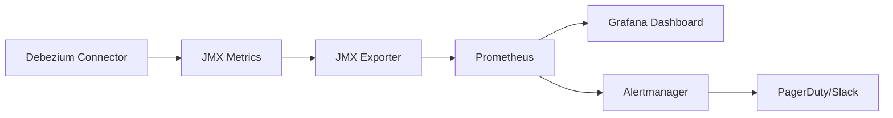

# How to Monitor Debezium Connectors

Author: [nawazdhandala](https://www.github.com/nawazdhandala)

Tags: Debezium, Monitoring, Kafka Connect, JMX, Prometheus, Observability, Change Data Capture

Description: Learn how to monitor Debezium connectors using JMX metrics, Prometheus, and alerting to ensure reliable change data capture pipelines.

---

> Debezium connectors run silently until they fail. Without monitoring, you discover problems when downstream systems show stale data. Proactive monitoring catches replication lag, connector failures, and performance issues before they impact your business.

CDC pipelines are critical infrastructure. Monitor them like any production system.

---

## Overview

Debezium exposes metrics through JMX (Java Management Extensions). These metrics can be scraped by Prometheus, visualized in Grafana, and used for alerting.



---

## JMX Metrics Setup

### Enable JMX in Kafka Connect

Configure Kafka Connect to expose JMX metrics:

```bash
# kafka-connect-env.sh
export KAFKA_JMX_OPTS="-Dcom.sun.management.jmxremote \
  -Dcom.sun.management.jmxremote.authenticate=false \
  -Dcom.sun.management.jmxremote.ssl=false \
  -Dcom.sun.management.jmxremote.port=9999 \
  -Dcom.sun.management.jmxremote.rmi.port=9999 \
  -Djava.rmi.server.hostname=localhost"
```

For Docker deployments:

```yaml
# docker-compose.yml
services:
  kafka-connect:
    image: debezium/connect:2.5
    environment:
      KAFKA_JMX_PORT: 9999
      KAFKA_JMX_HOSTNAME: kafka-connect
      JMXHOST: kafka-connect
      JMXPORT: 9999
    ports:
      - "8083:8083"
      - "9999:9999"
```

---

## Key Metrics to Monitor

### Connector Status Metrics

```
# Connector state (0=running, 1=paused, 2=failed)
kafka.connect:type=connector-metrics,connector={connector}

# Task status
kafka.connect:type=connector-task-metrics,connector={connector},task={task}
```

### Streaming Metrics

Debezium streaming metrics track CDC performance:

```
# MBean: debezium.{connector-type}:type=connector-metrics,context=streaming,server={server}

# Total number of events processed
NumberOfEventsFiltered
TotalNumberOfEventsSeen

# Current lag from source database
MilliSecondsBehindSource

# Snapshot status (true/false)
SnapshotRunning
SnapshotCompleted

# Last event timestamp
LastEvent

# Number of committed transactions
NumberOfCommittedTransactions
```

### Snapshot Metrics

Track initial snapshot progress:

```
# MBean: debezium.{connector-type}:type=connector-metrics,context=snapshot,server={server}

# Snapshot progress
TotalTableCount
RemainingTableCount
SnapshotRunning
SnapshotCompleted
RowsScanned
```

---

## Prometheus JMX Exporter

### Configuration

Create a JMX exporter configuration for Debezium metrics:

```yaml
# jmx-exporter-config.yml
startDelaySeconds: 0
ssl: false
lowercaseOutputName: true
lowercaseOutputLabelNames: true

rules:
  # Kafka Connect worker metrics
  - pattern: 'kafka.connect<type=connect-worker-metrics>([^:]+):'
    name: kafka_connect_worker_$1
    type: GAUGE

  # Connector metrics
  - pattern: 'kafka.connect<type=connector-metrics, connector=([^,]+)><>([^:]+)'
    name: kafka_connect_connector_$2
    type: GAUGE
    labels:
      connector: $1

  # Task metrics
  - pattern: 'kafka.connect<type=connector-task-metrics, connector=([^,]+), task=([^,]+)><>([^:]+)'
    name: kafka_connect_task_$3
    type: GAUGE
    labels:
      connector: $1
      task: $2

  # Debezium streaming metrics
  - pattern: 'debezium.([^:]+)<type=connector-metrics, context=streaming, server=([^,]+)><>([^:]+)'
    name: debezium_streaming_$3
    type: GAUGE
    labels:
      plugin: $1
      server: $2

  # Debezium snapshot metrics
  - pattern: 'debezium.([^:]+)<type=connector-metrics, context=snapshot, server=([^,]+)><>([^:]+)'
    name: debezium_snapshot_$3
    type: GAUGE
    labels:
      plugin: $1
      server: $2

  # Debezium schema history metrics
  - pattern: 'debezium.([^:]+)<type=connector-metrics, context=schema-history, server=([^,]+)><>([^:]+)'
    name: debezium_schema_history_$3
    type: GAUGE
    labels:
      plugin: $1
      server: $2
```

### Deploy JMX Exporter

Run the JMX exporter as a Java agent:

```bash
# Download JMX exporter
wget https://repo1.maven.org/maven2/io/prometheus/jmx/jmx_prometheus_javaagent/0.19.0/jmx_prometheus_javaagent-0.19.0.jar

# Add to Kafka Connect startup
export KAFKA_OPTS="-javaagent:/opt/jmx_prometheus_javaagent-0.19.0.jar=9404:/opt/jmx-exporter-config.yml"
```

Docker Compose with JMX exporter:

```yaml
# docker-compose.yml
services:
  kafka-connect:
    image: debezium/connect:2.5
    environment:
      KAFKA_OPTS: "-javaagent:/kafka/jmx_prometheus_javaagent.jar=9404:/kafka/jmx-exporter-config.yml"
    ports:
      - "8083:8083"
      - "9404:9404"
    volumes:
      - ./jmx_prometheus_javaagent.jar:/kafka/jmx_prometheus_javaagent.jar
      - ./jmx-exporter-config.yml:/kafka/jmx-exporter-config.yml
```

---

## Prometheus Configuration

Configure Prometheus to scrape Debezium metrics:

```yaml
# prometheus.yml
global:
  scrape_interval: 15s
  evaluation_interval: 15s

scrape_configs:
  # Scrape Kafka Connect JMX metrics
  - job_name: 'kafka-connect'
    static_configs:
      - targets: ['kafka-connect:9404']
    relabel_configs:
      - source_labels: [__address__]
        target_label: instance
        regex: '([^:]+):\d+'
        replacement: '${1}'

  # Scrape Kafka Connect REST API for connector status
  - job_name: 'kafka-connect-rest'
    metrics_path: /connectors
    static_configs:
      - targets: ['kafka-connect:8083']
```

---

## Custom Metrics Collector

Build a custom collector for connector status using the REST API:

```python
# debezium_exporter.py
from prometheus_client import start_http_server, Gauge, Counter
import requests
import time
import logging

logging.basicConfig(level=logging.INFO)
logger = logging.getLogger(__name__)

# Define Prometheus metrics
connector_status = Gauge(
    'debezium_connector_status',
    'Connector status (1=running, 0=not running)',
    ['connector', 'type']
)

connector_tasks_total = Gauge(
    'debezium_connector_tasks_total',
    'Total number of tasks',
    ['connector']
)

connector_tasks_running = Gauge(
    'debezium_connector_tasks_running',
    'Number of running tasks',
    ['connector']
)

connector_tasks_failed = Gauge(
    'debezium_connector_tasks_failed',
    'Number of failed tasks',
    ['connector']
)

replication_lag_ms = Gauge(
    'debezium_replication_lag_milliseconds',
    'Replication lag in milliseconds',
    ['connector']
)

class DebeziumCollector:
    def __init__(self, connect_url: str):
        self.connect_url = connect_url.rstrip('/')

    def collect_metrics(self):
        """Collect metrics from all connectors"""
        try:
            # Get list of connectors
            response = requests.get(f"{self.connect_url}/connectors")
            response.raise_for_status()
            connectors = response.json()

            for connector in connectors:
                self._collect_connector_metrics(connector)

        except requests.RequestException as e:
            logger.error(f"Failed to collect metrics: {e}")

    def _collect_connector_metrics(self, connector_name: str):
        """Collect metrics for a single connector"""
        try:
            # Get connector status
            response = requests.get(
                f"{self.connect_url}/connectors/{connector_name}/status"
            )
            response.raise_for_status()
            status = response.json()

            # Extract connector state
            connector_state = status.get('connector', {}).get('state', 'UNKNOWN')
            connector_type = status.get('type', 'unknown')

            # Set status metric (1 if running, 0 otherwise)
            is_running = 1 if connector_state == 'RUNNING' else 0
            connector_status.labels(
                connector=connector_name,
                type=connector_type
            ).set(is_running)

            # Count task states
            tasks = status.get('tasks', [])
            total_tasks = len(tasks)
            running_tasks = sum(1 for t in tasks if t.get('state') == 'RUNNING')
            failed_tasks = sum(1 for t in tasks if t.get('state') == 'FAILED')

            connector_tasks_total.labels(connector=connector_name).set(total_tasks)
            connector_tasks_running.labels(connector=connector_name).set(running_tasks)
            connector_tasks_failed.labels(connector=connector_name).set(failed_tasks)

            logger.info(
                f"Connector {connector_name}: state={connector_state}, "
                f"tasks={running_tasks}/{total_tasks}"
            )

        except requests.RequestException as e:
            logger.error(f"Failed to get status for {connector_name}: {e}")
            connector_status.labels(
                connector=connector_name,
                type='unknown'
            ).set(0)

def main():
    # Start Prometheus HTTP server
    start_http_server(9405)
    logger.info("Prometheus metrics server started on port 9405")

    # Create collector
    collector = DebeziumCollector("http://kafka-connect:8083")

    # Collect metrics every 15 seconds
    while True:
        collector.collect_metrics()
        time.sleep(15)

if __name__ == "__main__":
    main()
```

---

## Alerting Rules

### Prometheus Alert Rules

Define alerts for common Debezium issues:

```yaml
# debezium-alerts.yml
groups:
  - name: debezium
    interval: 30s
    rules:
      # Alert when connector is not running
      - alert: DebeziumConnectorDown
        expr: debezium_connector_status == 0
        for: 2m
        labels:
          severity: critical
        annotations:
          summary: "Debezium connector {{ $labels.connector }} is down"
          description: "Connector {{ $labels.connector }} has been down for more than 2 minutes"

      # Alert when tasks have failed
      - alert: DebeziumTaskFailed
        expr: debezium_connector_tasks_failed > 0
        for: 1m
        labels:
          severity: critical
        annotations:
          summary: "Debezium connector {{ $labels.connector }} has failed tasks"
          description: "{{ $value }} tasks have failed for connector {{ $labels.connector }}"

      # Alert on high replication lag
      - alert: DebeziumHighReplicationLag
        expr: debezium_streaming_millisecondsbehindSource > 60000
        for: 5m
        labels:
          severity: warning
        annotations:
          summary: "High replication lag for {{ $labels.server }}"
          description: "Replication lag is {{ $value | humanizeDuration }} for {{ $labels.server }}"

      # Alert when snapshot is taking too long
      - alert: DebeziumSnapshotStuck
        expr: debezium_snapshot_snapshotrunning == 1 and
              (time() - debezium_snapshot_snapshotstarted) > 3600
        for: 10m
        labels:
          severity: warning
        annotations:
          summary: "Snapshot running for more than 1 hour"
          description: "Snapshot for {{ $labels.server }} has been running for over an hour"

      # Alert when no events received
      - alert: DebeziumNoEvents
        expr: rate(debezium_streaming_totalnumberofeventsseen[5m]) == 0
        for: 15m
        labels:
          severity: warning
        annotations:
          summary: "No events received from {{ $labels.server }}"
          description: "No CDC events received in the last 15 minutes"

      # Alert on connector restart loop
      - alert: DebeziumConnectorRestartLoop
        expr: changes(debezium_connector_status[10m]) > 3
        for: 1m
        labels:
          severity: critical
        annotations:
          summary: "Connector {{ $labels.connector }} is restarting frequently"
          description: "Connector restarted {{ $value }} times in the last 10 minutes"
```

---

## REST API Monitoring

### Health Check Script

Create a health check script for monitoring tools:

```bash
#!/bin/bash
# check-debezium-health.sh

CONNECT_URL="${CONNECT_URL:-http://localhost:8083}"
EXIT_CODE=0

# Check Kafka Connect is responding
echo "Checking Kafka Connect health..."
if ! curl -sf "${CONNECT_URL}/" > /dev/null; then
    echo "ERROR: Kafka Connect is not responding"
    exit 2
fi

# Get all connectors
CONNECTORS=$(curl -sf "${CONNECT_URL}/connectors" | jq -r '.[]')

for CONNECTOR in $CONNECTORS; do
    STATUS=$(curl -sf "${CONNECT_URL}/connectors/${CONNECTOR}/status")

    CONNECTOR_STATE=$(echo "$STATUS" | jq -r '.connector.state')
    FAILED_TASKS=$(echo "$STATUS" | jq '[.tasks[] | select(.state == "FAILED")] | length')

    if [ "$CONNECTOR_STATE" != "RUNNING" ]; then
        echo "ERROR: Connector $CONNECTOR is in state $CONNECTOR_STATE"
        EXIT_CODE=2
    elif [ "$FAILED_TASKS" -gt 0 ]; then
        echo "ERROR: Connector $CONNECTOR has $FAILED_TASKS failed tasks"
        EXIT_CODE=2
    else
        echo "OK: Connector $CONNECTOR is running"
    fi
done

exit $EXIT_CODE
```

### Connector Status API Calls

Common REST API calls for monitoring:

```bash
# List all connectors
curl -s http://localhost:8083/connectors | jq .

# Get connector status
curl -s http://localhost:8083/connectors/my-connector/status | jq .

# Get connector configuration
curl -s http://localhost:8083/connectors/my-connector/config | jq .

# Get connector tasks
curl -s http://localhost:8083/connectors/my-connector/tasks | jq .

# Restart failed connector
curl -X POST http://localhost:8083/connectors/my-connector/restart

# Restart specific task
curl -X POST http://localhost:8083/connectors/my-connector/tasks/0/restart
```

---

## Grafana Dashboard

### Dashboard JSON

Create a comprehensive Debezium monitoring dashboard:

```json
{
  "dashboard": {
    "title": "Debezium CDC Monitoring",
    "panels": [
      {
        "title": "Connector Status",
        "type": "stat",
        "targets": [
          {
            "expr": "sum(debezium_connector_status)",
            "legendFormat": "Running Connectors"
          }
        ],
        "fieldConfig": {
          "defaults": {
            "thresholds": {
              "steps": [
                {"color": "red", "value": 0},
                {"color": "green", "value": 1}
              ]
            }
          }
        }
      },
      {
        "title": "Replication Lag",
        "type": "timeseries",
        "targets": [
          {
            "expr": "debezium_streaming_millisecondsbehindSource",
            "legendFormat": "{{ server }}"
          }
        ],
        "fieldConfig": {
          "defaults": {
            "unit": "ms"
          }
        }
      },
      {
        "title": "Events per Second",
        "type": "timeseries",
        "targets": [
          {
            "expr": "rate(debezium_streaming_totalnumberofeventsseen[1m])",
            "legendFormat": "{{ server }}"
          }
        ]
      },
      {
        "title": "Failed Tasks",
        "type": "stat",
        "targets": [
          {
            "expr": "sum(debezium_connector_tasks_failed)",
            "legendFormat": "Failed Tasks"
          }
        ],
        "fieldConfig": {
          "defaults": {
            "thresholds": {
              "steps": [
                {"color": "green", "value": 0},
                {"color": "red", "value": 1}
              ]
            }
          }
        }
      }
    ]
  }
}
```

---

## Log Monitoring

### Structured Logging

Configure structured logging for better log analysis:

```properties
# log4j.properties for Kafka Connect
log4j.rootLogger=INFO, stdout

log4j.appender.stdout=org.apache.log4j.ConsoleAppender
log4j.appender.stdout.layout=org.apache.log4j.PatternLayout
log4j.appender.stdout.layout.ConversionPattern=%d{ISO8601} %-5p [%t] %c - %m%n

# Enable debug logging for Debezium
log4j.logger.io.debezium=DEBUG
log4j.logger.io.debezium.connector=INFO
```

### Log Patterns to Monitor

Search for these patterns to identify issues:

```bash
# Connection failures
grep -E "Connection refused|Connection reset|Lost connection" connect.log

# Replication errors
grep -E "binlog|WAL|redo log" connect.log | grep -i error

# Task failures
grep -E "Task.*FAILED|Exception" connect.log

# Snapshot progress
grep -E "Snapshot|snapshot" connect.log
```

---

## Integration with OneUptime

Send Debezium metrics to OneUptime for centralized monitoring:

```python
# oneuptime_exporter.py
import requests
import time
from datetime import datetime

class OneUptimeExporter:
    def __init__(self, endpoint: str, api_key: str):
        self.endpoint = endpoint
        self.api_key = api_key

    def send_metrics(self, metrics: dict):
        """Send metrics to OneUptime"""
        headers = {
            "Authorization": f"Bearer {self.api_key}",
            "Content-Type": "application/json"
        }

        payload = {
            "timestamp": datetime.utcnow().isoformat(),
            "metrics": metrics
        }

        try:
            response = requests.post(
                f"{self.endpoint}/metrics",
                headers=headers,
                json=payload
            )
            response.raise_for_status()
        except requests.RequestException as e:
            print(f"Failed to send metrics: {e}")

    def collect_and_send(self, connect_url: str):
        """Collect Debezium metrics and send to OneUptime"""
        metrics = {}

        # Get connector status
        response = requests.get(f"{connect_url}/connectors")
        connectors = response.json()

        for connector in connectors:
            status = requests.get(
                f"{connect_url}/connectors/{connector}/status"
            ).json()

            metrics[f"debezium.{connector}.status"] = (
                1 if status['connector']['state'] == 'RUNNING' else 0
            )

            running_tasks = sum(
                1 for t in status['tasks']
                if t['state'] == 'RUNNING'
            )
            metrics[f"debezium.{connector}.tasks_running"] = running_tasks

        self.send_metrics(metrics)
```

---

## Best Practices

1. **Monitor lag continuously** - replication lag is the primary health indicator
2. **Alert on task failures** - failed tasks stop data flow
3. **Track event throughput** - sudden drops indicate problems
4. **Log correlation** - include trace IDs for debugging
5. **Capacity planning** - monitor resource usage trends
6. **Test failover** - verify monitoring detects failures

---

## Conclusion

Monitoring Debezium connectors is essential for reliable CDC pipelines. Key metrics to track:

- **Connector and task status** - are they running?
- **Replication lag** - how far behind is the connector?
- **Event throughput** - is data flowing?
- **Error rates** - are there failures?

Combine JMX metrics, REST API monitoring, and log analysis for comprehensive visibility.

---

*Running Debezium in production? [OneUptime](https://oneuptime.com) provides end-to-end monitoring for your CDC pipelines with alerting and dashboards.*
