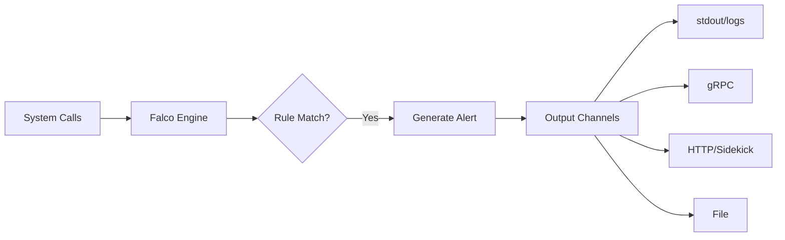
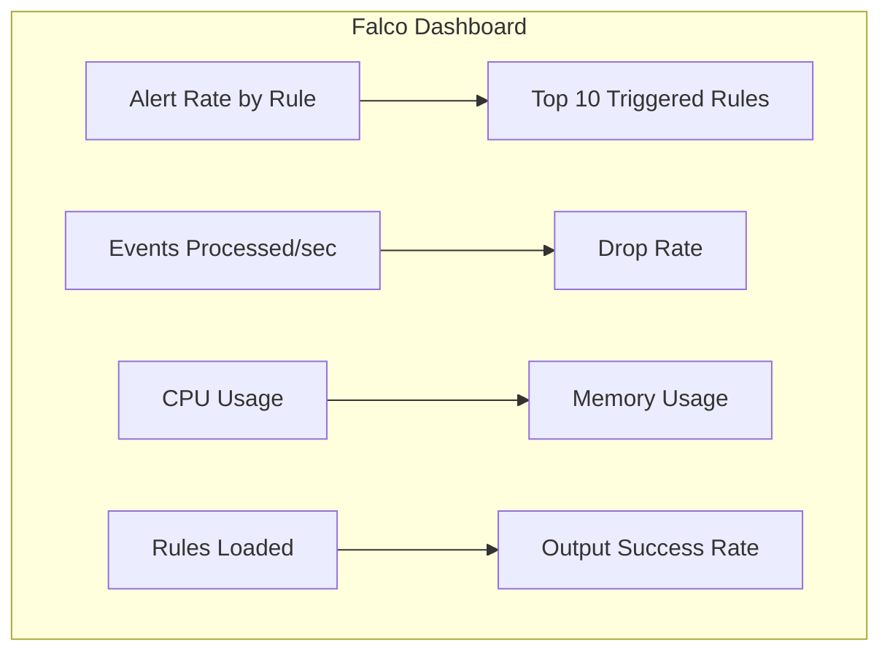

# How to Monitor Falco Alerts

Author: [nawazdhandala](https://www.github.com/nawazdhandala)

Tags: Falco, Security, Monitoring, Kubernetes, Observability

Description: Learn how to effectively monitor Falco alerts using Prometheus, Grafana, and alerting best practices for runtime security.

---

Running Falco in production is only half the battle. Without proper monitoring, you might miss critical security events or fail to notice when Falco itself stops working. This guide covers how to build a comprehensive monitoring system for your Falco deployment.

## Understanding Falco Alert Flow

Before setting up monitoring, it helps to understand how Falco generates and exports alerts:



## Enabling Prometheus Metrics in Falco

Falco exposes internal metrics through a Prometheus endpoint. Enable it in your Falco configuration:

```yaml
# falco.yaml
webserver:
  enabled: true
  listen_port: 8765
  k8s_healthz_endpoint: /healthz
  ssl_enabled: false

metrics:
  enabled: true
  interval: 1h
  output_rule: true
  resource_utilization_enabled: true
  state_counters_enabled: true
  kernel_event_counters_enabled: true
  libbpf_stats_enabled: true
```

If using Helm, add these values:

```yaml
# values.yaml
falco:
  webserver:
    enabled: true
  metrics:
    enabled: true
```

## Key Metrics to Monitor

Falco exposes several important metrics categories:

```bash
# Rules-related metrics
falco_rules_matches_total          # Total rule matches by rule name
falco_rules_loaded                 # Number of rules currently loaded

# Event processing metrics
falco_kernel_events_total          # Total kernel events processed
falco_kernel_events_dropped_total  # Events dropped due to buffer overflow

# Resource utilization
falco_cpu_usage_ratio              # CPU usage percentage
falco_memory_rss_bytes             # Resident memory size
falco_memory_vsz_bytes             # Virtual memory size

# Output metrics (when using Sidekick)
falco_outputs_sent_total           # Alerts sent to outputs
falco_outputs_failed_total         # Failed output deliveries
```

## Setting Up Prometheus Scraping

Create a ServiceMonitor to have Prometheus automatically discover and scrape Falco metrics:

```yaml
# falco-servicemonitor.yaml
apiVersion: monitoring.coreos.com/v1
kind: ServiceMonitor
metadata:
  name: falco
  namespace: monitoring
  labels:
    app: falco
spec:
  selector:
    matchLabels:
      app.kubernetes.io/name: falco
  namespaceSelector:
    matchNames:
      - falco
  endpoints:
    - port: http-metrics
      interval: 30s
      path: /metrics
```

Apply the configuration:

```bash
kubectl apply -f falco-servicemonitor.yaml
```

## Building Grafana Dashboards

Create a comprehensive Grafana dashboard to visualize Falco health and alert activity:

```json
{
  "dashboard": {
    "title": "Falco Security Monitoring",
    "panels": [
      {
        "title": "Alert Rate",
        "type": "graph",
        "targets": [
          {
            "expr": "sum(rate(falco_rules_matches_total[5m])) by (rule)",
            "legendFormat": "{{ rule }}"
          }
        ]
      },
      {
        "title": "Events Processed",
        "type": "stat",
        "targets": [
          {
            "expr": "sum(rate(falco_kernel_events_total[1m]))",
            "legendFormat": "Events/sec"
          }
        ]
      },
      {
        "title": "Dropped Events",
        "type": "graph",
        "targets": [
          {
            "expr": "sum(rate(falco_kernel_events_dropped_total[5m]))",
            "legendFormat": "Dropped/sec"
          }
        ]
      }
    ]
  }
}
```

A practical dashboard layout:



## Creating Alerting Rules

Set up Prometheus alerting rules to notify you of Falco issues:

```yaml
# falco-alerts.yaml
apiVersion: monitoring.coreos.com/v1
kind: PrometheusRule
metadata:
  name: falco-alerts
  namespace: monitoring
spec:
  groups:
    - name: falco.rules
      rules:
        # Alert when Falco is dropping events
        - alert: FalcoEventsDropped
          expr: rate(falco_kernel_events_dropped_total[5m]) > 0
          for: 5m
          labels:
            severity: warning
          annotations:
            summary: "Falco is dropping kernel events"
            description: "Falco on {{ $labels.instance }} is dropping events. This may indicate buffer overflow."

        # Alert when Falco stops processing events
        - alert: FalcoNotProcessingEvents
          expr: rate(falco_kernel_events_total[5m]) == 0
          for: 5m
          labels:
            severity: critical
          annotations:
            summary: "Falco has stopped processing events"
            description: "Falco on {{ $labels.instance }} has not processed any events in 5 minutes."

        # Alert on high-priority security events
        - alert: FalcoCriticalAlert
          expr: sum(increase(falco_rules_matches_total{priority="Critical"}[5m])) > 0
          for: 0m
          labels:
            severity: critical
          annotations:
            summary: "Critical Falco security alert detected"
            description: "A critical security rule was triggered: {{ $labels.rule }}"

        # Alert when output delivery fails
        - alert: FalcoOutputFailure
          expr: rate(falco_outputs_failed_total[5m]) > 0
          for: 5m
          labels:
            severity: warning
          annotations:
            summary: "Falco alert delivery is failing"
            description: "Falco is unable to deliver alerts to configured outputs."
```

## Monitoring with Falco Sidekick UI

Falco Sidekick includes a web interface for viewing recent alerts:

```bash
# Enable the UI during installation
helm upgrade falco falcosecurity/falco \
  --namespace falco \
  --set falcosidekick.enabled=true \
  --set falcosidekick.webui.enabled=true

# Access the UI
kubectl port-forward svc/falco-sidekick-ui 2802:2802 -n falco
```

The UI provides:
- Real-time alert stream
- Filtering by priority, rule, and time range
- Alert count statistics
- Event details with full context

## Log-Based Monitoring

For environments without Prometheus, monitor Falco through logs:

```bash
# Stream Falco alerts in real-time
kubectl logs -n falco -l app.kubernetes.io/name=falco -f | jq .

# Count alerts by priority in the last hour
kubectl logs -n falco -l app.kubernetes.io/name=falco --since=1h | \
  jq -r '.priority' | sort | uniq -c

# Find specific rule triggers
kubectl logs -n falco -l app.kubernetes.io/name=falco --since=1h | \
  jq 'select(.rule == "Terminal shell in container")'
```

## Setting Up Alert Aggregation

Avoid alert fatigue by aggregating similar alerts:

```yaml
# alertmanager-config.yaml
route:
  receiver: 'default'
  group_by: ['alertname', 'rule']
  group_wait: 30s
  group_interval: 5m
  repeat_interval: 4h
  routes:
    - match:
        severity: critical
      receiver: 'pagerduty'
      group_wait: 0s
    - match:
        severity: warning
      receiver: 'slack'

receivers:
  - name: 'default'
    slack_configs:
      - channel: '#security-alerts'
  - name: 'pagerduty'
    pagerduty_configs:
      - routing_key: 'your-key'
  - name: 'slack'
    slack_configs:
      - channel: '#security-warnings'
```

## Health Check Endpoints

Falco provides health endpoints for liveness and readiness probes:

```yaml
# Pod configuration
livenessProbe:
  httpGet:
    path: /healthz
    port: 8765
  initialDelaySeconds: 60
  periodSeconds: 15

readinessProbe:
  httpGet:
    path: /healthz
    port: 8765
  initialDelaySeconds: 30
  periodSeconds: 10
```

Monitor health status externally:

```bash
# Check Falco health
curl http://falco-service:8765/healthz

# Expected response for healthy Falco
{"status":"ok"}
```

## Best Practices for Alert Monitoring

1. **Set Baseline Metrics** - Understand your normal alert volume before setting thresholds
2. **Monitor the Monitor** - Always alert on Falco health issues, not just security events
3. **Use Priority Filtering** - Route critical alerts differently than informational ones
4. **Aggregate Wisely** - Group related alerts but do not hide important patterns
5. **Review Regularly** - Audit your alert rules monthly to remove noise and add coverage
6. **Track False Positives** - Measure and reduce false positive rates over time

---

Effective monitoring transforms Falco from a passive security tool into an active defense system. By combining Prometheus metrics, Grafana dashboards, and smart alerting rules, you can ensure that security events get the attention they deserve while keeping your team focused on real threats rather than noise.

**Related Reading:**

- [How to Use Falco Sidekick for Alerting](https://oneuptime.com/blog/post/2026-01-28-falco-sidekick-alerting/view)
- [How to Debug Falco Rule Failures](https://oneuptime.com/blog/post/2026-01-28-debug-falco-rule-failures/view)
- [How to Integrate Falco with SIEM](https://oneuptime.com/blog/post/2026-01-28-falco-siem-integration/view)
