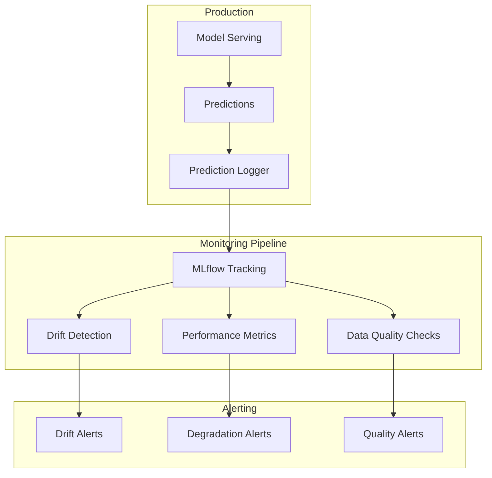
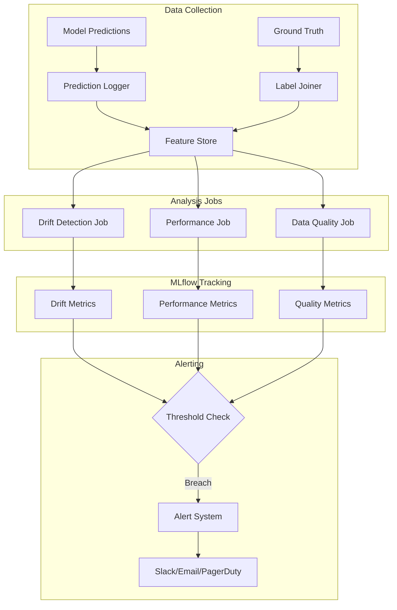

# How to Monitor Models with MLflow

Author: [nawazdhandala](https://www.github.com/nawazdhandala)

Tags: MLflow, Model Monitoring, MLOps, Machine Learning, Data Drift, Python

Description: A complete guide to monitoring machine learning models in production using MLflow for tracking predictions, detecting drift, and maintaining model health.

---

Deploying a model is just the beginning. Production models degrade over time as data distributions shift, user behavior changes, and the world moves on from your training data. This guide covers how to build a comprehensive model monitoring system using MLflow.

## Why Monitor ML Models?

Models fail silently. Unlike application errors that throw exceptions, a degrading model continues to return predictions - just increasingly wrong ones. Monitoring helps you detect:

- **Data drift**: Input features shifting from training distribution
- **Prediction drift**: Model outputs changing unexpectedly
- **Performance degradation**: Accuracy dropping as ground truth becomes available
- **Operational issues**: Latency spikes, error rates, resource exhaustion



## Setting Up Prediction Logging

First, instrument your model serving to log predictions:

```python
import mlflow
import pandas as pd
import numpy as np
from datetime import datetime
import json
from typing import Any

class MonitoredModel:
    """
    Wrapper that adds monitoring to any MLflow model.
    """

    def __init__(
        self,
        model_uri: str,
        experiment_name: str,
        log_sample_rate: float = 1.0  # Log all predictions by default
    ):
        self.model = mlflow.pyfunc.load_model(model_uri)
        self.experiment_name = experiment_name
        self.log_sample_rate = log_sample_rate
        self.model_version = model_uri.split("/")[-1]

        mlflow.set_experiment(experiment_name)

        # Buffer for batch logging
        self.prediction_buffer = []
        self.buffer_size = 100

    def predict(self, features: pd.DataFrame, request_id: str = None) -> np.ndarray:
        """Make prediction and log for monitoring."""
        start_time = datetime.utcnow()

        # Make prediction
        predictions = self.model.predict(features)

        end_time = datetime.utcnow()
        latency_ms = (end_time - start_time).total_seconds() * 1000

        # Sample-based logging
        if np.random.random() < self.log_sample_rate:
            self._buffer_prediction(
                features=features,
                predictions=predictions,
                request_id=request_id,
                timestamp=start_time,
                latency_ms=latency_ms
            )

        return predictions

    def _buffer_prediction(
        self,
        features: pd.DataFrame,
        predictions: np.ndarray,
        request_id: str,
        timestamp: datetime,
        latency_ms: float
    ):
        """Buffer predictions for batch logging."""
        for i in range(len(features)):
            record = {
                "request_id": request_id or f"req_{timestamp.timestamp()}_{i}",
                "timestamp": timestamp.isoformat(),
                "model_version": self.model_version,
                "features": features.iloc[i].to_dict(),
                "prediction": float(predictions[i]) if hasattr(predictions[i], '__float__') else predictions[i],
                "latency_ms": latency_ms
            }
            self.prediction_buffer.append(record)

        # Flush buffer when full
        if len(self.prediction_buffer) >= self.buffer_size:
            self._flush_buffer()

    def _flush_buffer(self):
        """Write buffered predictions to storage."""
        if not self.prediction_buffer:
            return

        # Write to JSONL file (in production, use a database or streaming system)
        timestamp = datetime.utcnow().strftime("%Y%m%d_%H%M%S")
        filename = f"/tmp/predictions_{timestamp}.jsonl"

        with open(filename, "w") as f:
            for record in self.prediction_buffer:
                f.write(json.dumps(record) + "\n")

        # Log as MLflow artifact
        with mlflow.start_run(run_name=f"predictions-{timestamp}"):
            mlflow.log_artifact(filename)
            mlflow.log_metric("prediction_count", len(self.prediction_buffer))
            mlflow.log_metric("avg_latency_ms",
                np.mean([r["latency_ms"] for r in self.prediction_buffer]))

        self.prediction_buffer = []


# Usage
model = MonitoredModel(
    model_uri="models:/churn-predictor/Production",
    experiment_name="/monitoring/churn-model",
    log_sample_rate=0.1  # Log 10% of predictions
)

# Make predictions
features_df = pd.DataFrame([
    {"age": 35, "tenure": 24, "monthly_charges": 65.5},
    {"age": 42, "tenure": 12, "monthly_charges": 89.0}
])
predictions = model.predict(features_df, request_id="batch_001")
```

## Data Drift Detection

Monitor for shifts in input feature distributions:

```python
import numpy as np
from scipy import stats
import pandas as pd
import mlflow

class DriftDetector:
    """
    Detect distribution drift between reference and production data.
    """

    def __init__(self, reference_data: pd.DataFrame):
        """
        Initialize with reference data (typically training or validation set).
        """
        self.reference_data = reference_data
        self.reference_stats = self._compute_statistics(reference_data)

    def _compute_statistics(self, df: pd.DataFrame) -> dict:
        """Compute summary statistics for each feature."""
        stats_dict = {}
        for col in df.columns:
            if df[col].dtype in [np.float64, np.int64, np.float32, np.int32]:
                stats_dict[col] = {
                    "type": "numerical",
                    "mean": df[col].mean(),
                    "std": df[col].std(),
                    "min": df[col].min(),
                    "max": df[col].max(),
                    "percentiles": df[col].quantile([0.25, 0.5, 0.75]).to_dict()
                }
            else:
                stats_dict[col] = {
                    "type": "categorical",
                    "value_counts": df[col].value_counts(normalize=True).to_dict()
                }
        return stats_dict

    def detect_drift(
        self,
        production_data: pd.DataFrame,
        threshold: float = 0.05
    ) -> dict:
        """
        Detect drift in production data compared to reference.
        Uses KS test for numerical and chi-squared for categorical features.
        """
        results = {}

        for col in self.reference_data.columns:
            if col not in production_data.columns:
                continue

            ref_col = self.reference_data[col].dropna()
            prod_col = production_data[col].dropna()

            if self.reference_stats[col]["type"] == "numerical":
                # Kolmogorov-Smirnov test
                statistic, p_value = stats.ks_2samp(ref_col, prod_col)
                drift_detected = p_value < threshold

                results[col] = {
                    "test": "ks_2samp",
                    "statistic": statistic,
                    "p_value": p_value,
                    "drift_detected": drift_detected,
                    "reference_mean": self.reference_stats[col]["mean"],
                    "production_mean": prod_col.mean(),
                    "mean_shift": prod_col.mean() - self.reference_stats[col]["mean"]
                }
            else:
                # Chi-squared test for categorical
                ref_counts = ref_col.value_counts()
                prod_counts = prod_col.value_counts()

                # Align categories
                all_categories = set(ref_counts.index) | set(prod_counts.index)
                ref_aligned = [ref_counts.get(cat, 0) for cat in all_categories]
                prod_aligned = [prod_counts.get(cat, 0) for cat in all_categories]

                # Normalize to expected frequencies
                ref_freq = np.array(ref_aligned) / sum(ref_aligned)
                expected = ref_freq * sum(prod_aligned)

                # Avoid division by zero
                expected = np.maximum(expected, 1e-10)

                statistic, p_value = stats.chisquare(prod_aligned, expected)
                drift_detected = p_value < threshold

                results[col] = {
                    "test": "chi_squared",
                    "statistic": statistic,
                    "p_value": p_value,
                    "drift_detected": drift_detected
                }

        return results

    def log_drift_metrics(self, drift_results: dict, run_name: str = None):
        """Log drift detection results to MLflow."""
        with mlflow.start_run(run_name=run_name or "drift-detection"):
            total_features = len(drift_results)
            drifted_features = sum(1 for r in drift_results.values() if r["drift_detected"])

            mlflow.log_metric("total_features_monitored", total_features)
            mlflow.log_metric("drifted_features_count", drifted_features)
            mlflow.log_metric("drift_ratio", drifted_features / total_features)

            for feature, result in drift_results.items():
                mlflow.log_metric(f"drift_{feature}_statistic", result["statistic"])
                mlflow.log_metric(f"drift_{feature}_p_value", result["p_value"])
                mlflow.set_tag(f"drift_{feature}", result["drift_detected"])

                if "mean_shift" in result:
                    mlflow.log_metric(f"drift_{feature}_mean_shift", result["mean_shift"])


# Usage
# Load reference data (your training set)
reference_df = pd.read_csv("training_data.csv")
detector = DriftDetector(reference_df)

# Check production data periodically
production_df = pd.read_csv("production_predictions.csv")
drift_results = detector.detect_drift(production_df)

# Log results
mlflow.set_experiment("/monitoring/drift-detection")
detector.log_drift_metrics(drift_results, run_name="daily-drift-check")

# Check for alerts
for feature, result in drift_results.items():
    if result["drift_detected"]:
        print(f"ALERT: Drift detected in feature '{feature}' (p={result['p_value']:.4f})")
```

## Prediction Drift Monitoring

Track changes in model output distribution:

```python
import numpy as np
from scipy import stats
import mlflow

class PredictionMonitor:
    """
    Monitor prediction distribution for drift and anomalies.
    """

    def __init__(self, baseline_predictions: np.ndarray):
        """Initialize with baseline predictions (from validation set)."""
        self.baseline = baseline_predictions
        self.baseline_mean = np.mean(baseline_predictions)
        self.baseline_std = np.std(baseline_predictions)
        self.baseline_distribution = np.histogram(baseline_predictions, bins=50)

    def check_prediction_drift(
        self,
        current_predictions: np.ndarray,
        threshold: float = 0.05
    ) -> dict:
        """Check if current predictions differ from baseline."""
        # KS test
        ks_stat, ks_p = stats.ks_2samp(self.baseline, current_predictions)

        # Population Stability Index (PSI)
        psi = self._calculate_psi(current_predictions)

        # Basic statistics comparison
        current_mean = np.mean(current_predictions)
        current_std = np.std(current_predictions)

        return {
            "ks_statistic": ks_stat,
            "ks_p_value": ks_p,
            "ks_drift_detected": ks_p < threshold,
            "psi": psi,
            "psi_drift_detected": psi > 0.2,  # Common threshold
            "baseline_mean": self.baseline_mean,
            "current_mean": current_mean,
            "mean_shift": current_mean - self.baseline_mean,
            "baseline_std": self.baseline_std,
            "current_std": current_std
        }

    def _calculate_psi(self, current: np.ndarray, bins: int = 10) -> float:
        """
        Calculate Population Stability Index.
        PSI < 0.1: No significant change
        0.1 <= PSI < 0.2: Moderate change
        PSI >= 0.2: Significant change
        """
        # Create bins from baseline
        _, bin_edges = np.histogram(self.baseline, bins=bins)

        # Calculate proportions
        baseline_props, _ = np.histogram(self.baseline, bins=bin_edges)
        current_props, _ = np.histogram(current, bins=bin_edges)

        # Normalize
        baseline_props = baseline_props / len(self.baseline)
        current_props = current_props / len(current)

        # Avoid log(0)
        baseline_props = np.maximum(baseline_props, 1e-10)
        current_props = np.maximum(current_props, 1e-10)

        # Calculate PSI
        psi = np.sum((current_props - baseline_props) * np.log(current_props / baseline_props))

        return psi


# Usage
baseline_preds = np.random.normal(0.5, 0.1, 10000)  # From validation set
monitor = PredictionMonitor(baseline_preds)

# Check current predictions
current_preds = np.random.normal(0.55, 0.12, 1000)  # Shifted distribution
result = monitor.check_prediction_drift(current_preds)

print(f"PSI: {result['psi']:.4f} (Drift: {result['psi_drift_detected']})")
print(f"Mean shift: {result['mean_shift']:.4f}")
```

## Performance Monitoring with Ground Truth

When labels become available, track actual performance:

```python
import mlflow
import pandas as pd
import numpy as np
from sklearn.metrics import accuracy_score, precision_score, recall_score, f1_score, roc_auc_score
from datetime import datetime, timedelta

class PerformanceMonitor:
    """
    Track model performance when ground truth becomes available.
    """

    def __init__(self, experiment_name: str, baseline_metrics: dict):
        self.experiment_name = experiment_name
        self.baseline_metrics = baseline_metrics
        mlflow.set_experiment(experiment_name)

    def evaluate_batch(
        self,
        predictions: np.ndarray,
        labels: np.ndarray,
        prediction_proba: np.ndarray = None,
        batch_timestamp: datetime = None
    ) -> dict:
        """Evaluate a batch of predictions against ground truth."""
        metrics = {
            "accuracy": accuracy_score(labels, predictions),
            "precision": precision_score(labels, predictions, average="weighted", zero_division=0),
            "recall": recall_score(labels, predictions, average="weighted", zero_division=0),
            "f1": f1_score(labels, predictions, average="weighted", zero_division=0)
        }

        if prediction_proba is not None:
            try:
                metrics["roc_auc"] = roc_auc_score(labels, prediction_proba)
            except ValueError:
                pass  # Skip if single class

        # Calculate degradation from baseline
        degradation = {}
        for metric_name, value in metrics.items():
            if metric_name in self.baseline_metrics:
                baseline = self.baseline_metrics[metric_name]
                degradation[metric_name] = value - baseline

        return {
            "metrics": metrics,
            "degradation": degradation,
            "timestamp": batch_timestamp or datetime.utcnow(),
            "sample_size": len(predictions)
        }

    def log_performance(self, evaluation: dict, alert_threshold: float = 0.05):
        """Log performance metrics and check for alerts."""
        timestamp_str = evaluation["timestamp"].strftime("%Y%m%d_%H%M%S")

        with mlflow.start_run(run_name=f"performance-{timestamp_str}"):
            # Log current metrics
            for name, value in evaluation["metrics"].items():
                mlflow.log_metric(f"current_{name}", value)

            # Log degradation
            alerts = []
            for name, delta in evaluation["degradation"].items():
                mlflow.log_metric(f"degradation_{name}", delta)

                # Check for significant degradation
                if delta < -alert_threshold:
                    alerts.append({
                        "metric": name,
                        "degradation": delta,
                        "current": evaluation["metrics"][name],
                        "baseline": self.baseline_metrics[name]
                    })

            mlflow.log_metric("sample_size", evaluation["sample_size"])
            mlflow.log_param("has_alerts", len(alerts) > 0)

            if alerts:
                mlflow.set_tag("alert_status", "degradation_detected")
                mlflow.log_dict({"alerts": alerts}, "alerts.json")

        return alerts


# Usage
baseline = {
    "accuracy": 0.92,
    "precision": 0.91,
    "recall": 0.93,
    "f1": 0.92,
    "roc_auc": 0.96
}

monitor = PerformanceMonitor(
    experiment_name="/monitoring/model-performance",
    baseline_metrics=baseline
)

# When ground truth becomes available (e.g., weekly batch)
predictions = np.array([1, 0, 1, 1, 0, 1, 0, 0, 1, 1])
labels = np.array([1, 0, 1, 0, 0, 1, 1, 0, 1, 1])
proba = np.array([0.9, 0.2, 0.8, 0.6, 0.3, 0.85, 0.4, 0.1, 0.95, 0.7])

evaluation = monitor.evaluate_batch(predictions, labels, proba)
alerts = monitor.log_performance(evaluation, alert_threshold=0.03)

for alert in alerts:
    print(f"ALERT: {alert['metric']} degraded by {alert['degradation']:.4f}")
```

## Monitoring Dashboard Architecture



## Automated Monitoring Pipeline

Put it all together with an automated monitoring job:

```python
import mlflow
from datetime import datetime, timedelta
import pandas as pd
import numpy as np

class ModelMonitoringPipeline:
    """
    Complete monitoring pipeline that runs periodically.
    """

    def __init__(
        self,
        model_name: str,
        reference_data_path: str,
        baseline_metrics: dict
    ):
        self.model_name = model_name
        self.reference_data = pd.read_parquet(reference_data_path)
        self.drift_detector = DriftDetector(self.reference_data)
        self.performance_monitor = PerformanceMonitor(
            f"/monitoring/{model_name}",
            baseline_metrics
        )

        # Get baseline predictions for prediction monitoring
        baseline_preds = pd.read_parquet(f"{reference_data_path}_predictions")
        self.prediction_monitor = PredictionMonitor(baseline_preds["prediction"].values)

    def run_monitoring(
        self,
        production_data: pd.DataFrame,
        predictions: np.ndarray,
        labels: np.ndarray = None
    ) -> dict:
        """Run complete monitoring pipeline."""
        mlflow.set_experiment(f"/monitoring/{self.model_name}")

        results = {}
        timestamp = datetime.utcnow()

        with mlflow.start_run(run_name=f"monitoring-{timestamp.strftime('%Y%m%d_%H%M')}"):
            # 1. Data drift detection
            drift_results = self.drift_detector.detect_drift(production_data)
            results["data_drift"] = drift_results

            drifted_features = [f for f, r in drift_results.items() if r["drift_detected"]]
            mlflow.log_metric("drifted_features_count", len(drifted_features))
            mlflow.set_tag("drifted_features", ",".join(drifted_features) if drifted_features else "none")

            # 2. Prediction drift
            pred_drift = self.prediction_monitor.check_prediction_drift(predictions)
            results["prediction_drift"] = pred_drift

            mlflow.log_metric("prediction_psi", pred_drift["psi"])
            mlflow.log_metric("prediction_mean_shift", pred_drift["mean_shift"])
            mlflow.set_tag("prediction_drift_detected", pred_drift["psi_drift_detected"])

            # 3. Performance metrics (if labels available)
            if labels is not None:
                evaluation = self.performance_monitor.evaluate_batch(
                    predictions=(predictions > 0.5).astype(int),
                    labels=labels,
                    prediction_proba=predictions,
                    batch_timestamp=timestamp
                )
                results["performance"] = evaluation

                for name, value in evaluation["metrics"].items():
                    mlflow.log_metric(name, value)
                for name, delta in evaluation["degradation"].items():
                    mlflow.log_metric(f"degradation_{name}", delta)

            # 4. Data quality checks
            quality_issues = self._check_data_quality(production_data)
            results["data_quality"] = quality_issues

            mlflow.log_metric("missing_value_ratio", quality_issues["missing_ratio"])
            mlflow.log_metric("outlier_ratio", quality_issues["outlier_ratio"])

            # 5. Generate alerts
            alerts = self._generate_alerts(results)
            results["alerts"] = alerts

            if alerts:
                mlflow.set_tag("alert_status", "action_required")
                mlflow.log_dict({"alerts": alerts}, "alerts.json")
            else:
                mlflow.set_tag("alert_status", "healthy")

        return results

    def _check_data_quality(self, df: pd.DataFrame) -> dict:
        """Check for data quality issues."""
        total_cells = df.size
        missing_cells = df.isna().sum().sum()

        # Simple outlier detection using IQR
        outlier_count = 0
        for col in df.select_dtypes(include=[np.number]).columns:
            q1, q3 = df[col].quantile([0.25, 0.75])
            iqr = q3 - q1
            outliers = ((df[col] < q1 - 1.5 * iqr) | (df[col] > q3 + 1.5 * iqr)).sum()
            outlier_count += outliers

        return {
            "missing_ratio": missing_cells / total_cells,
            "outlier_ratio": outlier_count / len(df),
            "row_count": len(df)
        }

    def _generate_alerts(self, results: dict) -> list:
        """Generate alerts based on monitoring results."""
        alerts = []

        # Data drift alerts
        drift_results = results.get("data_drift", {})
        drifted = [f for f, r in drift_results.items() if r.get("drift_detected")]
        if len(drifted) > len(drift_results) * 0.3:  # >30% features drifted
            alerts.append({
                "type": "data_drift",
                "severity": "high",
                "message": f"Significant data drift detected in {len(drifted)} features",
                "features": drifted
            })

        # Prediction drift alerts
        pred_drift = results.get("prediction_drift", {})
        if pred_drift.get("psi_drift_detected"):
            alerts.append({
                "type": "prediction_drift",
                "severity": "high",
                "message": f"Prediction distribution shift detected (PSI={pred_drift['psi']:.4f})",
                "psi": pred_drift["psi"]
            })

        # Performance alerts
        perf = results.get("performance", {})
        degradation = perf.get("degradation", {})
        for metric, delta in degradation.items():
            if delta < -0.05:  # 5% degradation threshold
                alerts.append({
                    "type": "performance_degradation",
                    "severity": "critical",
                    "message": f"{metric} degraded by {abs(delta):.2%}",
                    "metric": metric,
                    "degradation": delta
                })

        return alerts


# Run monitoring job
pipeline = ModelMonitoringPipeline(
    model_name="churn-predictor",
    reference_data_path="/data/reference/training_features.parquet",
    baseline_metrics={"accuracy": 0.92, "f1": 0.91, "roc_auc": 0.96}
)

# Load production data (typically from the last 24 hours or week)
production_data = pd.read_parquet("/data/production/features_latest.parquet")
predictions = np.load("/data/production/predictions_latest.npy")
labels = np.load("/data/production/labels_latest.npy")  # If available

results = pipeline.run_monitoring(production_data, predictions, labels)

# Handle alerts
for alert in results["alerts"]:
    print(f"[{alert['severity'].upper()}] {alert['type']}: {alert['message']}")
```

## Best Practices

1. **Log consistently** - Use the same feature names and formats across training and production.

2. **Set meaningful thresholds** - Base alert thresholds on business impact, not just statistical significance.

3. **Monitor both inputs and outputs** - Data drift can occur without prediction drift, and vice versa.

4. **Establish feedback loops** - Connect monitoring alerts to model retraining pipelines.

5. **Version your monitoring** - Track changes to monitoring configuration alongside model versions.

6. **Sample intelligently** - Log 100% during rollout, then reduce to save costs while maintaining statistical validity.

---

Model monitoring transforms ML from a one-time deployment into a continuous improvement cycle. By tracking data drift, prediction distributions, and actual performance in MLflow, you create visibility into model health and catch degradation before it impacts users. Start with basic prediction logging, add drift detection, and expand to full performance monitoring as ground truth becomes available.
