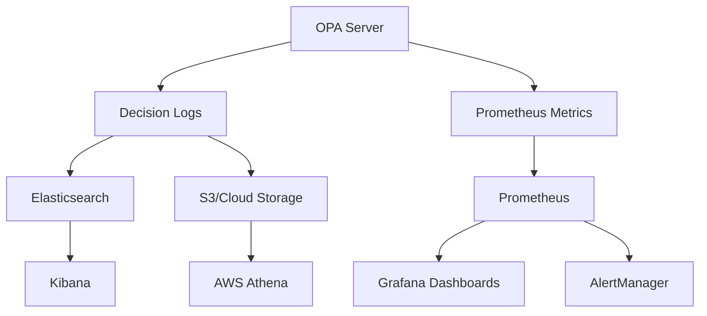
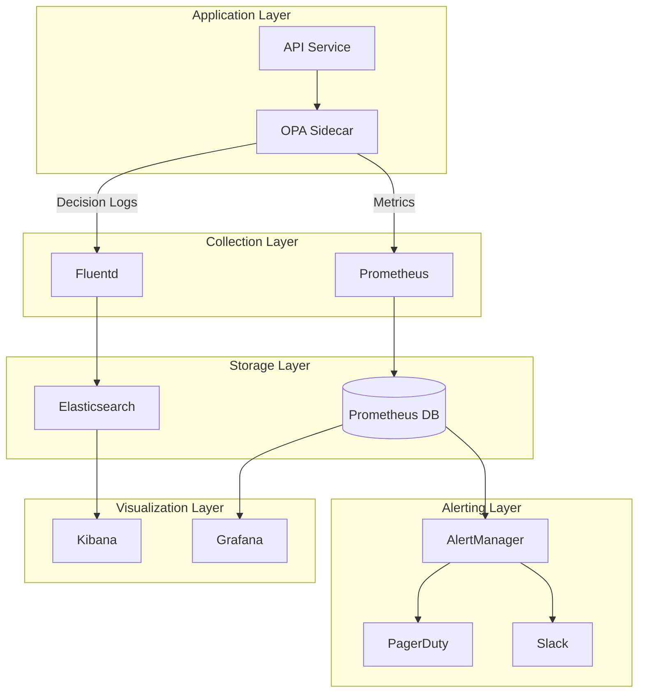

# How to Monitor OPA Policy Decisions

Author: [nawazdhandala](https://www.github.com/nawazdhandala)

Tags: OPA, Monitoring, Observability, Prometheus, Grafana, Security, DevOps

Description: Learn how to monitor OPA policy decisions using decision logs, Prometheus metrics, and alerting for complete policy observability.

---

Policy decisions are security events. Every allow and deny from OPA should be logged, measured, and monitored. This guide covers setting up comprehensive observability for OPA, from decision logs to real-time dashboards.

## Why Monitor Policy Decisions?

Monitoring OPA decisions helps you:

- Detect anomalous access patterns
- Audit who accessed what and when
- Measure policy performance
- Debug authorization issues
- Meet compliance requirements



## Decision Logs

Decision logs capture every policy evaluation with full context.

### Enable Decision Logging

```yaml
# opa-config.yaml
decision_logs:
  console: true  # Log to stdout (development)

  # Or send to a remote service
  service: log-service

  reporting:
    min_delay_seconds: 10
    max_delay_seconds: 30
    upload_size_limit_bytes: 32768

services:
  log-service:
    url: https://logs.example.com
    credentials:
      bearer:
        token: "${LOG_SERVICE_TOKEN}"
```

### Decision Log Structure

Each log entry contains:

```json
{
  "decision_id": "a1b2c3d4-e5f6-7890-abcd-ef1234567890",
  "labels": {
    "app": "api-gateway",
    "version": "1.2.3"
  },
  "path": "api/authz/allow",
  "input": {
    "user": {
      "id": "user123",
      "roles": ["viewer"]
    },
    "action": "delete",
    "resource": "documents"
  },
  "result": false,
  "timestamp": "2026-01-28T10:30:00.000Z",
  "metrics": {
    "timer_rego_query_eval_ns": 125000,
    "timer_server_handler_ns": 250000
  }
}
```

### Custom Decision Log Plugin

For advanced use cases, implement a custom plugin:

```go
// custom_plugin.go
package main

import (
    "context"
    "encoding/json"
    "github.com/open-policy-agent/opa/plugins"
    "github.com/open-policy-agent/opa/plugins/logs"
)

type CustomLogPlugin struct {
    manager *plugins.Manager
}

func (p *CustomLogPlugin) Start(ctx context.Context) error {
    return nil
}

func (p *CustomLogPlugin) Stop(ctx context.Context) {
}

func (p *CustomLogPlugin) Reconfigure(ctx context.Context, config interface{}) {
}

func (p *CustomLogPlugin) Log(ctx context.Context, event logs.EventV1) error {
    // Send to your logging backend
    data, _ := json.Marshal(event)

    // Example: Send to Kafka, Elasticsearch, etc.
    sendToBackend(data)

    return nil
}
```

## Prometheus Metrics

OPA exposes metrics in Prometheus format at `/metrics`.

### Key Metrics

```bash
# Request latency histogram
http_request_duration_seconds_bucket{handler="/v1/data/api/authz/allow",le="0.001"}
http_request_duration_seconds_bucket{handler="/v1/data/api/authz/allow",le="0.01"}
http_request_duration_seconds_bucket{handler="/v1/data/api/authz/allow",le="0.1"}

# Request count by status
http_request_count{code="200",handler="/v1/data/api/authz/allow",method="post"}
http_request_count{code="500",handler="/v1/data/api/authz/allow",method="post"}

# Policy evaluation time
opa_rego_query_eval_ns_total

# Bundle status
opa_bundle_loaded_bytes{name="main"}
opa_bundle_last_successful_activation{name="main"}
```

### Scrape Configuration

```yaml
# prometheus.yaml
scrape_configs:
  - job_name: 'opa'
    scrape_interval: 15s
    static_configs:
      - targets: ['opa:8181']
    relabel_configs:
      - source_labels: [__address__]
        target_label: instance
        regex: '([^:]+):\d+'
        replacement: '${1}'
```

### Kubernetes ServiceMonitor

```yaml
# servicemonitor.yaml
apiVersion: monitoring.coreos.com/v1
kind: ServiceMonitor
metadata:
  name: opa
  labels:
    app: opa
spec:
  selector:
    matchLabels:
      app: opa
  endpoints:
    - port: http
      path: /metrics
      interval: 15s
```

## Custom Metrics in Policies

Add custom counters within your policies:

```rego
# policy_with_metrics.rego
package api.authz

import rego.v1

# Track denied requests by reason
deny_reason["missing_role"] if {
    count(input.user.roles) == 0
}

deny_reason["insufficient_permissions"] if {
    count(input.user.roles) > 0
    not has_required_permission
}

deny_reason["resource_not_found"] if {
    not data.resources[input.resource_id]
}

# Main allow rule
default allow := false

allow if {
    count(deny_reason) == 0
    has_required_permission
}

has_required_permission if {
    role := input.user.roles[_]
    permission := data.role_permissions[role][_]
    permission.action == input.action
    permission.resource == input.resource
}
```

## Grafana Dashboards

### OPA Overview Dashboard

```json
{
  "dashboard": {
    "title": "OPA Policy Decisions",
    "panels": [
      {
        "title": "Decision Rate",
        "type": "graph",
        "targets": [
          {
            "expr": "sum(rate(http_request_count{handler=~\"/v1/data.*\"}[5m])) by (code)",
            "legendFormat": "{{code}}"
          }
        ]
      },
      {
        "title": "Decision Latency (p99)",
        "type": "graph",
        "targets": [
          {
            "expr": "histogram_quantile(0.99, sum(rate(http_request_duration_seconds_bucket{handler=~\"/v1/data.*\"}[5m])) by (le))",
            "legendFormat": "p99"
          }
        ]
      },
      {
        "title": "Allow vs Deny Rate",
        "type": "piechart",
        "targets": [
          {
            "expr": "sum(rate(opa_decision_allow_total[5m]))",
            "legendFormat": "Allow"
          },
          {
            "expr": "sum(rate(opa_decision_deny_total[5m]))",
            "legendFormat": "Deny"
          }
        ]
      },
      {
        "title": "Bundle Status",
        "type": "stat",
        "targets": [
          {
            "expr": "opa_bundle_last_successful_activation",
            "legendFormat": "Last Activation"
          }
        ]
      }
    ]
  }
}
```

### Dashboard Panels

Create panels for:

1. **Request Rate**: Decisions per second
2. **Latency Percentiles**: p50, p90, p99
3. **Error Rate**: Failed evaluations
4. **Bundle Health**: Last successful update
5. **Top Denied Resources**: Most common denials

## Alerting Rules

### Prometheus Alert Rules

```yaml
# opa-alerts.yaml
groups:
  - name: opa
    rules:
      # High error rate
      - alert: OPAHighErrorRate
        expr: |
          sum(rate(http_request_count{handler=~"/v1/data.*",code=~"5.."}[5m]))
          /
          sum(rate(http_request_count{handler=~"/v1/data.*"}[5m]))
          > 0.01
        for: 5m
        labels:
          severity: critical
        annotations:
          summary: "OPA error rate above 1%"
          description: "OPA is returning errors for {{ $value | humanizePercentage }} of requests"

      # High latency
      - alert: OPAHighLatency
        expr: |
          histogram_quantile(0.99,
            sum(rate(http_request_duration_seconds_bucket{handler=~"/v1/data.*"}[5m])) by (le)
          ) > 0.1
        for: 5m
        labels:
          severity: warning
        annotations:
          summary: "OPA p99 latency above 100ms"
          description: "OPA p99 latency is {{ $value | humanizeDuration }}"

      # Bundle not updating
      - alert: OPABundleStale
        expr: |
          time() - opa_bundle_last_successful_activation > 3600
        for: 10m
        labels:
          severity: warning
        annotations:
          summary: "OPA bundle not updated in over 1 hour"
          description: "Bundle {{ $labels.name }} last updated {{ $value | humanizeDuration }} ago"

      # Unusual deny rate
      - alert: OPAHighDenyRate
        expr: |
          sum(rate(opa_decision_deny_total[5m]))
          /
          sum(rate(opa_decision_total[5m]))
          > 0.5
        for: 15m
        labels:
          severity: warning
        annotations:
          summary: "More than 50% of OPA decisions are denies"
          description: "Deny rate is {{ $value | humanizePercentage }}"
```

## Centralized Logging

### Send Logs to Elasticsearch

```yaml
# opa-config-elasticsearch.yaml
decision_logs:
  service: elasticsearch
  reporting:
    min_delay_seconds: 5
    max_delay_seconds: 30

services:
  elasticsearch:
    url: https://elasticsearch.example.com
    credentials:
      bearer:
        token: "${ES_TOKEN}"
    headers:
      Content-Type: application/json
```

### Fluentd Sidecar

```yaml
# opa-with-fluentd.yaml
apiVersion: apps/v1
kind: Deployment
metadata:
  name: opa
spec:
  template:
    spec:
      containers:
        - name: opa
          image: openpolicyagent/opa:latest
          args:
            - "run"
            - "--server"
            - "--config-file=/config/config.yaml"
            - "--log-format=json"
          volumeMounts:
            - name: logs
              mountPath: /var/log/opa

        - name: fluentd
          image: fluent/fluentd:latest
          volumeMounts:
            - name: logs
              mountPath: /var/log/opa
            - name: fluentd-config
              mountPath: /fluentd/etc

      volumes:
        - name: logs
          emptyDir: {}
        - name: fluentd-config
          configMap:
            name: fluentd-config
```

### Fluentd Configuration

```xml
<!-- fluentd.conf -->
<source>
  @type tail
  path /var/log/opa/*.log
  pos_file /var/log/opa/opa.log.pos
  tag opa.decisions
  <parse>
    @type json
  </parse>
</source>

<filter opa.**>
  @type record_transformer
  <record>
    cluster "production"
    service "opa"
  </record>
</filter>

<match opa.**>
  @type elasticsearch
  host elasticsearch.logging.svc
  port 9200
  index_name opa-decisions
  <buffer>
    flush_interval 5s
  </buffer>
</match>
```

## Decision Analysis Queries

### Elasticsearch/Kibana Queries

Find denied requests by user:

```json
{
  "query": {
    "bool": {
      "must": [
        {"term": {"result": false}},
        {"range": {"timestamp": {"gte": "now-24h"}}}
      ]
    }
  },
  "aggs": {
    "by_user": {
      "terms": {"field": "input.user.id.keyword"}
    }
  }
}
```

Find suspicious patterns:

```json
{
  "query": {
    "bool": {
      "must": [
        {"term": {"result": false}},
        {"term": {"input.action": "delete"}}
      ],
      "filter": {
        "script": {
          "script": "doc['input.user.roles'].length == 0"
        }
      }
    }
  }
}
```

## Monitoring Architecture



## Best Practices

### 1. Sample Decision Logs in Production

Full logging can be expensive. Sample non-sensitive decisions:

```yaml
decision_logs:
  service: log-service
  reporting:
    min_delay_seconds: 30
    max_delay_seconds: 60
  # Log all denies, sample allows
  mask_decision:
    - "/input/sensitive_field"
```

### 2. Set Up SLOs

Define service level objectives for OPA:

- Availability: 99.9%
- p99 Latency: < 50ms
- Error Rate: < 0.1%

### 3. Monitor Bundle Health

Always alert on stale bundles - a bundle that stops updating means policies are not being applied correctly.

### 4. Correlate with Application Logs

Include a correlation ID in both application and OPA logs:

```javascript
// In your application
const decisionId = uuid();
const response = await opa.query({
    input: { ...input, correlation_id: decisionId }
});
logger.info('Authorization decision', { decisionId, result: response });
```

---

Monitoring OPA is not optional - it is a security requirement. Decision logs provide the audit trail, metrics power dashboards and alerts, and together they give you complete visibility into your authorization layer. Start with basic metrics and decision logging, then build out dashboards as you understand your traffic patterns.
