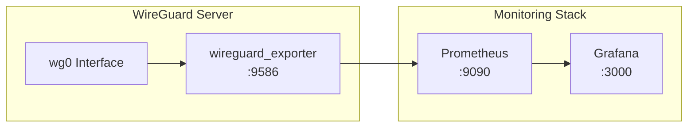
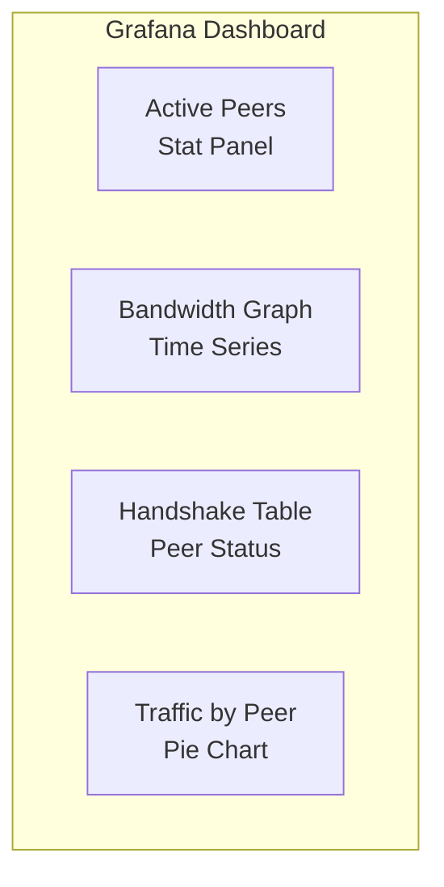
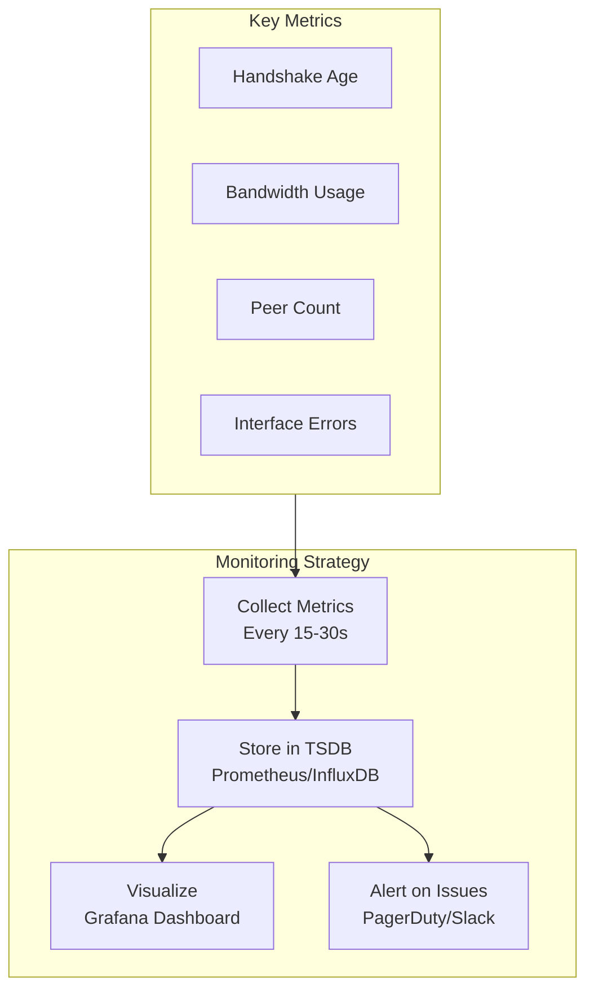

# How to Monitor WireGuard Connections

Author: [nawazdhandala](https://www.github.com/nawazdhandala)

Tags: WireGuard, VPN, Monitoring, Observability, Prometheus, Grafana

Description: Learn how to monitor WireGuard VPN connections using native tools, Prometheus exporters, and custom dashboards for visibility into your VPN infrastructure.

---

Running a WireGuard VPN without monitoring is flying blind. You need to know who is connected, how much traffic is flowing, and whether peers are healthy. This guide covers monitoring WireGuard from basic command-line checks to full observability with Prometheus and Grafana.

## WireGuard Native Monitoring

WireGuard provides built-in tools for checking connection status.

### Basic Status Commands

```bash
# Show all interfaces and peers
sudo wg show

# Output includes:
# - Interface public key and listening port
# - Peer public keys and endpoints
# - Allowed IPs for each peer
# - Latest handshake time
# - Data transfer statistics

# Show specific interface
sudo wg show wg0

# Show only peers
sudo wg show wg0 peers

# Show in parseable format
sudo wg show wg0 dump
```

### Understanding WireGuard Status Output

```bash
interface: wg0
  public key: abcd1234...
  private key: (hidden)
  listening port: 51820

peer: efgh5678...
  endpoint: 203.0.113.50:54321
  allowed ips: 10.10.0.2/32
  latest handshake: 45 seconds ago
  transfer: 125.45 MiB received, 89.23 MiB sent
  persistent keepalive: every 25 seconds
```

Key metrics to watch:
- **latest handshake**: Should be recent for active peers (within keepalive interval)
- **transfer**: Shows data volume in each direction
- **endpoint**: Client's current public IP and port

## Building a Monitoring Script

Create a script to collect WireGuard metrics.

```bash
#!/bin/bash
# wg-monitor.sh - Monitor WireGuard connections

INTERFACE=${1:-wg0}
LOG_FILE="/var/log/wireguard/connections.log"
ALERT_THRESHOLD=300  # Alert if handshake older than 5 minutes

mkdir -p /var/log/wireguard

echo "=== WireGuard Monitor - $(date) ===" | tee -a $LOG_FILE

# Parse wg show output
while read -r line; do
    if [[ $line == peer:* ]]; then
        PEER=$(echo $line | awk '{print $2}')
    elif [[ $line == *"latest handshake"* ]]; then
        HANDSHAKE=$line
        # Check for stale connections
        if [[ $line == *"minute"* ]] || [[ $line == *"hour"* ]] || [[ $line == *"day"* ]]; then
            echo "WARNING: Stale peer $PEER - $HANDSHAKE" | tee -a $LOG_FILE
        fi
    elif [[ $line == *"transfer:"* ]]; then
        TRANSFER=$line
        echo "Peer $PEER: $TRANSFER" | tee -a $LOG_FILE
    elif [[ $line == *"endpoint:"* ]]; then
        ENDPOINT=$(echo $line | awk '{print $2}')
        echo "Peer $PEER connected from: $ENDPOINT" | tee -a $LOG_FILE
    fi
done < <(sudo wg show $INTERFACE)
```

## Prometheus Integration

For production monitoring, export WireGuard metrics to Prometheus.



### Installing WireGuard Exporter

```bash
# Download the exporter
wget https://github.com/MindFlavor/prometheus_wireguard_exporter/releases/latest/download/prometheus_wireguard_exporter

# Make executable and move to path
chmod +x prometheus_wireguard_exporter
sudo mv prometheus_wireguard_exporter /usr/local/bin/

# Create systemd service
sudo tee /etc/systemd/system/wireguard-exporter.service << 'EOF'
[Unit]
Description=WireGuard Prometheus Exporter
After=network.target

[Service]
Type=simple
ExecStart=/usr/local/bin/prometheus_wireguard_exporter -a true
Restart=always
RestartSec=10

[Install]
WantedBy=multi-user.target
EOF

# Start the exporter
sudo systemctl daemon-reload
sudo systemctl enable wireguard-exporter
sudo systemctl start wireguard-exporter

# Verify metrics endpoint
curl http://localhost:9586/metrics
```

### Exported Metrics

The exporter provides these metrics:

```
# Bytes received from peer
wireguard_received_bytes_total{interface="wg0",public_key="abc123...",allowed_ips="10.10.0.2/32"} 125450000

# Bytes sent to peer
wireguard_sent_bytes_total{interface="wg0",public_key="abc123...",allowed_ips="10.10.0.2/32"} 89230000

# Latest handshake timestamp
wireguard_latest_handshake_seconds{interface="wg0",public_key="abc123...",allowed_ips="10.10.0.2/32"} 1706450123
```

### Prometheus Configuration

Add the WireGuard exporter to Prometheus.

```yaml
# prometheus.yml

scrape_configs:
  - job_name: 'wireguard'
    static_configs:
      - targets: ['wireguard-server:9586']
    scrape_interval: 30s
    relabel_configs:
      # Add friendly names using allowed_ips
      - source_labels: [allowed_ips]
        regex: '10\.10\.0\.(\d+)/32'
        target_label: peer_id
        replacement: 'peer_$1'
```

## Grafana Dashboard

Create a dashboard to visualize WireGuard metrics.

### Dashboard JSON

```json
{
  "title": "WireGuard VPN Monitoring",
  "panels": [
    {
      "title": "Active Peers",
      "type": "stat",
      "targets": [
        {
          "expr": "count(time() - wireguard_latest_handshake_seconds < 300)",
          "legendFormat": "Active Peers"
        }
      ]
    },
    {
      "title": "Total Bandwidth (Received)",
      "type": "graph",
      "targets": [
        {
          "expr": "rate(wireguard_received_bytes_total[5m])",
          "legendFormat": "{{allowed_ips}}"
        }
      ]
    },
    {
      "title": "Total Bandwidth (Sent)",
      "type": "graph",
      "targets": [
        {
          "expr": "rate(wireguard_sent_bytes_total[5m])",
          "legendFormat": "{{allowed_ips}}"
        }
      ]
    },
    {
      "title": "Peer Handshake Age",
      "type": "table",
      "targets": [
        {
          "expr": "time() - wireguard_latest_handshake_seconds",
          "legendFormat": "{{allowed_ips}}"
        }
      ]
    }
  ]
}
```

### Key Dashboard Panels



## Alert Rules

Configure Prometheus alerts for WireGuard issues.

```yaml
# wireguard-alerts.yml

groups:
  - name: wireguard
    rules:
      # Alert when peer has no recent handshake
      - alert: WireGuardPeerDown
        expr: (time() - wireguard_latest_handshake_seconds) > 300
        for: 5m
        labels:
          severity: warning
        annotations:
          summary: "WireGuard peer {{ $labels.allowed_ips }} has no recent handshake"
          description: "Peer {{ $labels.allowed_ips }} last handshake was {{ $value | humanizeDuration }} ago"

      # Alert when no peers are connected
      - alert: WireGuardNoPeers
        expr: count(wireguard_latest_handshake_seconds) == 0
        for: 5m
        labels:
          severity: critical
        annotations:
          summary: "WireGuard interface {{ $labels.interface }} has no peers"

      # Alert on high bandwidth usage
      - alert: WireGuardHighBandwidth
        expr: rate(wireguard_received_bytes_total[5m]) + rate(wireguard_sent_bytes_total[5m]) > 100000000
        for: 10m
        labels:
          severity: warning
        annotations:
          summary: "High bandwidth on WireGuard peer {{ $labels.allowed_ips }}"
          description: "Peer is using {{ $value | humanize }}B/s"

      # Alert when exporter is down
      - alert: WireGuardExporterDown
        expr: up{job="wireguard"} == 0
        for: 2m
        labels:
          severity: critical
        annotations:
          summary: "WireGuard exporter is not responding"
```

## Custom Metrics Collection

For additional metrics, create a custom exporter.

```python
#!/usr/bin/env python3
# wg_custom_exporter.py

import subprocess
import time
from prometheus_client import start_http_server, Gauge, Counter

# Define metrics
PEER_CONNECTED = Gauge(
    'wireguard_peer_connected',
    'Whether peer has recent handshake (1=yes, 0=no)',
    ['interface', 'peer', 'allowed_ips']
)

HANDSHAKE_AGE = Gauge(
    'wireguard_handshake_age_seconds',
    'Seconds since last handshake',
    ['interface', 'peer', 'allowed_ips']
)

BYTES_RECEIVED = Counter(
    'wireguard_bytes_received_total',
    'Total bytes received from peer',
    ['interface', 'peer', 'allowed_ips']
)

BYTES_SENT = Counter(
    'wireguard_bytes_sent_total',
    'Total bytes sent to peer',
    ['interface', 'peer', 'allowed_ips']
)

def parse_wg_output():
    """Parse wg show dump output"""
    result = subprocess.run(
        ['wg', 'show', 'all', 'dump'],
        capture_output=True,
        text=True
    )

    current_interface = None

    for line in result.stdout.strip().split('\n'):
        parts = line.split('\t')

        if len(parts) == 4:
            # Interface line
            current_interface = parts[0]
        elif len(parts) == 8:
            # Peer line
            peer_pubkey = parts[0][:16] + '...'  # Truncate for readability
            allowed_ips = parts[3]
            latest_handshake = int(parts[4]) if parts[4] != '0' else 0
            rx_bytes = int(parts[5])
            tx_bytes = int(parts[6])

            # Calculate handshake age
            if latest_handshake > 0:
                handshake_age = int(time.time()) - latest_handshake
                connected = 1 if handshake_age < 180 else 0
            else:
                handshake_age = -1
                connected = 0

            # Update metrics
            labels = {
                'interface': current_interface,
                'peer': peer_pubkey,
                'allowed_ips': allowed_ips
            }

            PEER_CONNECTED.labels(**labels).set(connected)
            HANDSHAKE_AGE.labels(**labels).set(handshake_age)

def main():
    # Start HTTP server on port 9587
    start_http_server(9587)
    print("WireGuard custom exporter running on :9587")

    while True:
        parse_wg_output()
        time.sleep(15)

if __name__ == '__main__':
    main()
```

## Logging WireGuard Events

Enable kernel logging for WireGuard debugging.

```bash
# Enable dynamic debug for WireGuard
echo 'module wireguard +p' | sudo tee /sys/kernel/debug/dynamic_debug/control

# View WireGuard kernel messages
sudo dmesg | grep wireguard

# Monitor in real-time
sudo dmesg -w | grep wireguard
```

### Centralizing Logs

Send WireGuard logs to your logging infrastructure.

```yaml
# filebeat.yml

filebeat.inputs:
  - type: journald
    id: wireguard-journal
    include_matches:
      - _SYSTEMD_UNIT=wg-quick@wg0.service

  - type: log
    paths:
      - /var/log/wireguard/*.log
    fields:
      service: wireguard
    fields_under_root: true

output.elasticsearch:
  hosts: ["elasticsearch:9200"]
  index: "wireguard-%{+yyyy.MM.dd}"
```

## Health Check Endpoint

Create an HTTP health check for WireGuard.

```python
#!/usr/bin/env python3
# wg_healthcheck.py

from flask import Flask, jsonify
import subprocess

app = Flask(__name__)

@app.route('/health')
def health():
    """Check WireGuard interface health"""
    try:
        result = subprocess.run(
            ['wg', 'show', 'wg0'],
            capture_output=True,
            text=True,
            timeout=5
        )

        if result.returncode == 0:
            return jsonify({
                'status': 'healthy',
                'interface': 'wg0',
                'message': 'WireGuard interface is up'
            }), 200
        else:
            return jsonify({
                'status': 'unhealthy',
                'interface': 'wg0',
                'message': result.stderr
            }), 503

    except Exception as e:
        return jsonify({
            'status': 'error',
            'message': str(e)
        }), 500

@app.route('/peers')
def peers():
    """Get connected peers status"""
    result = subprocess.run(
        ['wg', 'show', 'wg0', 'dump'],
        capture_output=True,
        text=True
    )

    peers = []
    for line in result.stdout.strip().split('\n')[1:]:  # Skip interface line
        parts = line.split('\t')
        if len(parts) >= 7:
            peers.append({
                'public_key': parts[0][:16] + '...',
                'endpoint': parts[2] if parts[2] != '(none)' else None,
                'allowed_ips': parts[3],
                'latest_handshake': int(parts[4]) if parts[4] != '0' else None,
                'rx_bytes': int(parts[5]),
                'tx_bytes': int(parts[6])
            })

    return jsonify({
        'peer_count': len(peers),
        'peers': peers
    })

if __name__ == '__main__':
    app.run(host='0.0.0.0', port=8080)
```

## Monitoring Best Practices



### Checklist

- Monitor handshake age for all peers (stale = disconnected)
- Track bandwidth per peer for capacity planning
- Alert when expected peers are missing
- Log connection events for audit trails
- Monitor the monitoring - ensure exporter is running
- Keep historical data for trend analysis

---

Monitoring WireGuard connections gives you visibility into your VPN infrastructure. Start with basic command-line checks, then add Prometheus metrics for alerting and Grafana dashboards for visualization. The combination of native WireGuard tools and modern observability platforms makes it easy to keep track of all your VPN peers and catch issues before users complain.
