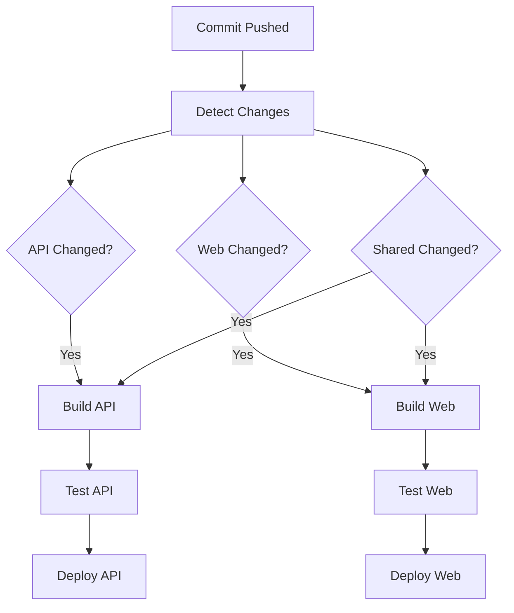

# How to Handle Monorepos with GitLab CI

Author: [nawazdhandala](https://www.github.com/nawazdhandala)

Tags: GitLab CI, Monorepo, CI/CD, Pipeline Optimization, DevOps

Description: Learn how to configure GitLab CI for monorepos with selective builds, change detection, and efficient pipeline strategies that scale with your codebase.

---

Monorepos combine multiple projects into a single repository. They simplify dependency management and code sharing but complicate CI/CD. Running every test for every commit doesn't scale. This guide shows you how to build efficient GitLab CI pipelines that only process what changed.

## Monorepo Challenges

A typical monorepo structure:

```
monorepo/
  services/
    api/
    web/
    worker/
  packages/
    shared-ui/
    shared-utils/
  infrastructure/
    terraform/
    kubernetes/
  .gitlab-ci.yml
```

Without optimization, every commit triggers builds for all services. In a large repo, this means hour-long pipelines when you only changed a README.

## Change Detection Basics

Use the `changes` keyword to run jobs only when specific files change.

```yaml
build-api:
  script:
    - cd services/api && npm run build
  rules:
    - changes:
        - services/api/**/*

build-web:
  script:
    - cd services/web && npm run build
  rules:
    - changes:
        - services/web/**/*

build-worker:
  script:
    - cd services/worker && npm run build
  rules:
    - changes:
        - services/worker/**/*
```

Each service only builds when its files change.

## Handling Shared Dependencies

When shared packages change, dependent services need to rebuild.

```yaml
build-api:
  script:
    - cd services/api && npm run build
  rules:
    - changes:
        - services/api/**/*
        - packages/shared-utils/**/*  # API depends on shared-utils

build-web:
  script:
    - cd services/web && npm run build
  rules:
    - changes:
        - services/web/**/*
        - packages/shared-ui/**/*     # Web depends on shared-ui
        - packages/shared-utils/**/*  # Web also depends on shared-utils
```

## Monorepo Pipeline Flow

Here's how selective pipelines work:



## Dynamic Pipeline Generation

For complex dependency graphs, generate the pipeline dynamically.

```yaml
stages:
  - detect
  - generate
  - trigger

detect-changes:
  stage: detect
  script:
    # Determine which services changed
    - |
      CHANGED_SERVICES=""
      if git diff --name-only HEAD~1 | grep -q "^services/api/"; then
        CHANGED_SERVICES="${CHANGED_SERVICES} api"
      fi
      if git diff --name-only HEAD~1 | grep -q "^services/web/"; then
        CHANGED_SERVICES="${CHANGED_SERVICES} web"
      fi
      if git diff --name-only HEAD~1 | grep -q "^services/worker/"; then
        CHANGED_SERVICES="${CHANGED_SERVICES} worker"
      fi

      # If shared packages changed, rebuild all consumers
      if git diff --name-only HEAD~1 | grep -q "^packages/"; then
        CHANGED_SERVICES="api web worker"
      fi

      echo "CHANGED_SERVICES=${CHANGED_SERVICES}" >> changes.env
  artifacts:
    reports:
      dotenv: changes.env

generate-pipeline:
  stage: generate
  needs:
    - detect-changes
  script:
    - |
      cat > generated-pipeline.yml << 'HEADER'
      stages:
        - build
        - test
        - deploy
      HEADER

      for service in ${CHANGED_SERVICES}; do
        cat >> generated-pipeline.yml << EOF

      build-${service}:
        stage: build
        script:
          - cd services/${service}
          - npm ci
          - npm run build
        artifacts:
          paths:
            - services/${service}/dist/

      test-${service}:
        stage: test
        script:
          - cd services/${service}
          - npm test
        needs:
          - build-${service}

      deploy-${service}:
        stage: deploy
        script:
          - ./deploy.sh ${service}
        needs:
          - test-${service}
        when: manual
      EOF
      done
  artifacts:
    paths:
      - generated-pipeline.yml

trigger-pipeline:
  stage: trigger
  trigger:
    include:
      - artifact: generated-pipeline.yml
        job: generate-pipeline
    strategy: depend
```

## Child Pipelines per Service

Use child pipelines for cleaner organization.

```yaml
# .gitlab-ci.yml
stages:
  - trigger

trigger-api:
  stage: trigger
  trigger:
    include: services/api/.gitlab-ci.yml
    strategy: depend
  rules:
    - changes:
        - services/api/**/*
        - packages/shared-utils/**/*

trigger-web:
  stage: trigger
  trigger:
    include: services/web/.gitlab-ci.yml
    strategy: depend
  rules:
    - changes:
        - services/web/**/*
        - packages/shared-ui/**/*
        - packages/shared-utils/**/*
```

Each service has its own pipeline file:

```yaml
# services/api/.gitlab-ci.yml
stages:
  - build
  - test
  - deploy

variables:
  SERVICE_PATH: services/api

build:
  stage: build
  script:
    - cd ${SERVICE_PATH}
    - npm ci
    - npm run build

test:
  stage: test
  script:
    - cd ${SERVICE_PATH}
    - npm test

deploy:
  stage: deploy
  script:
    - cd ${SERVICE_PATH}
    - npm run deploy
  when: manual
```

## Matrix Builds

Use parallel matrix for repetitive service configurations.

```yaml
stages:
  - build
  - test
  - deploy

.service-template:
  variables:
    SERVICE: ""
  before_script:
    - cd services/${SERVICE}
    - npm ci

build:
  extends: .service-template
  stage: build
  parallel:
    matrix:
      - SERVICE: [api, web, worker]
  script:
    - npm run build
  rules:
    - changes:
        - services/${SERVICE}/**/*
        - packages/**/*

test:
  extends: .service-template
  stage: test
  parallel:
    matrix:
      - SERVICE: [api, web, worker]
  script:
    - npm test
  needs:
    - job: build
      parallel:
        matrix:
          - SERVICE: ${SERVICE}
  rules:
    - changes:
        - services/${SERVICE}/**/*
        - packages/**/*
```

## Caching in Monorepos

Configure caching per service to avoid conflicts.

```yaml
.service-cache:
  cache:
    key: ${SERVICE}-${CI_COMMIT_REF_SLUG}
    paths:
      - services/${SERVICE}/node_modules/
    policy: pull-push

build-api:
  extends: .service-cache
  variables:
    SERVICE: api
  script:
    - cd services/api
    - npm ci
    - npm run build
```

For shared dependencies at the root:

```yaml
variables:
  npm_config_cache: "$CI_PROJECT_DIR/.npm"

cache:
  key: ${CI_COMMIT_REF_SLUG}
  paths:
    - .npm/
    - node_modules/
```

## Full Pipeline on Main Branch

Run comprehensive tests on the main branch regardless of changes.

```yaml
build-all:
  script:
    - npm run build:all
  rules:
    # Run on main regardless of changes
    - if: $CI_COMMIT_BRANCH == "main"
    # Run if CI config changes
    - changes:
        - .gitlab-ci.yml
        - .gitlab/**/*

build-api:
  script:
    - cd services/api && npm run build
  rules:
    # Always on main
    - if: $CI_COMMIT_BRANCH == "main"
    # On changes for other branches
    - changes:
        - services/api/**/*
```

## Dependency Graph Management

For complex interdependencies, maintain an explicit dependency map.

```yaml
# .gitlab/dependencies.yml
api:
  paths:
    - services/api/**/*
  depends_on:
    - shared-utils

web:
  paths:
    - services/web/**/*
  depends_on:
    - shared-ui
    - shared-utils

worker:
  paths:
    - services/worker/**/*
  depends_on:
    - shared-utils

shared-ui:
  paths:
    - packages/shared-ui/**/*
  depends_on: []

shared-utils:
  paths:
    - packages/shared-utils/**/*
  depends_on: []
```

```yaml
# Pipeline generation script
detect-affected:
  script:
    - |
      # Parse dependencies and compute affected services
      python3 << 'EOF'
      import yaml
      import subprocess

      # Get changed files
      result = subprocess.run(['git', 'diff', '--name-only', 'HEAD~1'], capture_output=True, text=True)
      changed_files = result.stdout.strip().split('\n')

      # Load dependency graph
      with open('.gitlab/dependencies.yml') as f:
          deps = yaml.safe_load(f)

      # Find directly changed services
      affected = set()
      for service, config in deps.items():
          for pattern in config['paths']:
              # Simple pattern matching
              prefix = pattern.replace('**/*', '')
              if any(f.startswith(prefix) for f in changed_files):
                  affected.add(service)

      # Propagate to dependents
      changed = True
      while changed:
          changed = False
          for service, config in deps.items():
              if service not in affected:
                  if any(dep in affected for dep in config.get('depends_on', [])):
                      affected.add(service)
                      changed = True

      print(f"AFFECTED_SERVICES={' '.join(affected)}")
      EOF
```

## Testing Shared Code

Ensure shared package changes are tested properly.

```yaml
test-shared-utils:
  script:
    - cd packages/shared-utils
    - npm test
  rules:
    - changes:
        - packages/shared-utils/**/*

# Integration tests for consumers
test-integration:
  script:
    - npm run test:integration
  rules:
    - changes:
        - packages/**/*  # Any shared package change
    - if: $CI_COMMIT_BRANCH == "main"
```

## Deployment Coordination

Deploy services in the correct order.

```yaml
stages:
  - build
  - test
  - deploy-infra
  - deploy-services
  - verify

deploy-database:
  stage: deploy-infra
  script:
    - ./infrastructure/deploy-database.sh
  rules:
    - changes:
        - infrastructure/database/**/*

deploy-api:
  stage: deploy-services
  script:
    - cd services/api && ./deploy.sh
  needs:
    - job: deploy-database
      optional: true  # Continue if DB didn't change
    - job: test-api
      optional: true  # Continue if API didn't change

deploy-web:
  stage: deploy-services
  script:
    - cd services/web && ./deploy.sh
  needs:
    - job: deploy-api
      optional: true
    - job: test-web
      optional: true
```

## Optimizing Large Monorepos

For very large repositories, additional optimizations help.

```yaml
variables:
  # Shallow clone for faster checkout
  GIT_DEPTH: 50
  # Sparse checkout if supported
  GIT_STRATEGY: fetch

# Use rules to skip entirely when nothing relevant changed
workflow:
  rules:
    - if: $CI_COMMIT_BRANCH == "main"
    - if: $CI_MERGE_REQUEST_IID
    - changes:
        - services/**/*
        - packages/**/*
        - infrastructure/**/*
```

---

Monorepo pipelines require balancing completeness with efficiency. Start with simple change detection using the `changes` keyword. Add dependency tracking as your services become more interconnected. Use child pipelines to keep configurations manageable. The goal is fast feedback for developers while maintaining confidence that changes won't break dependent services.
