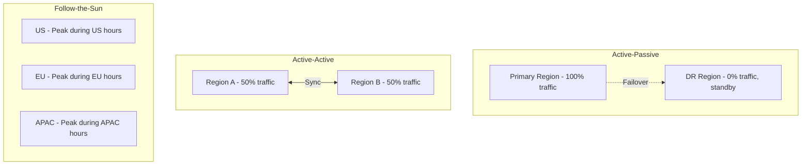
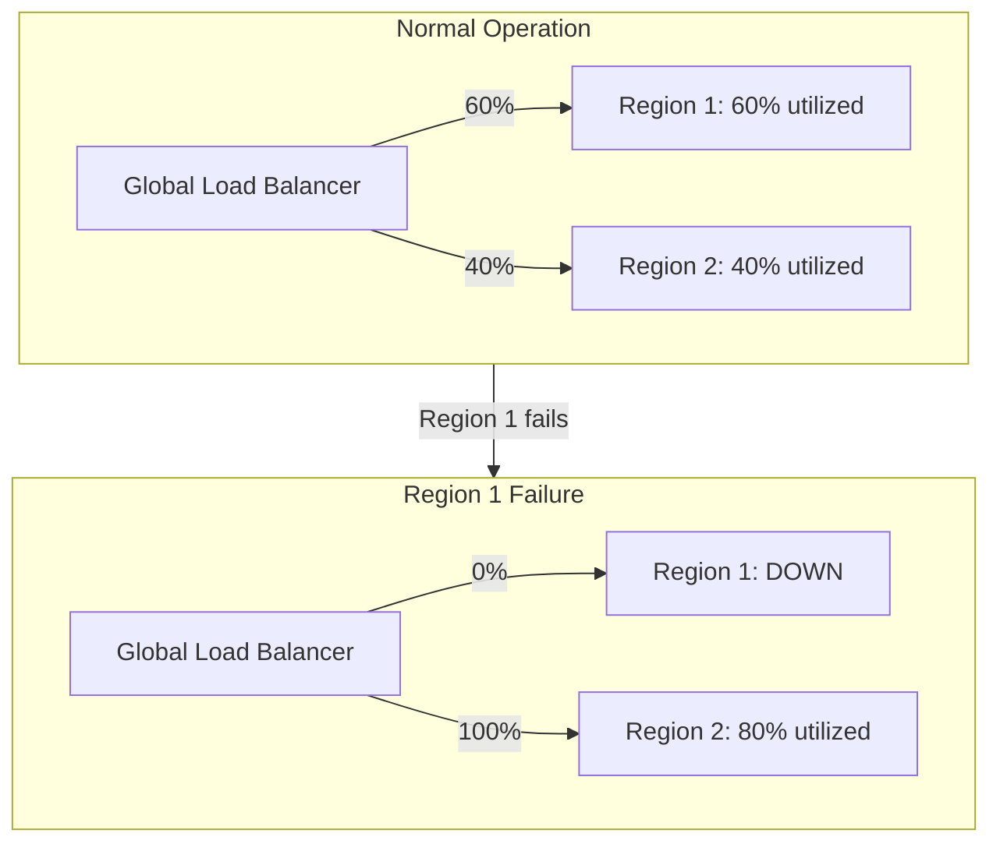
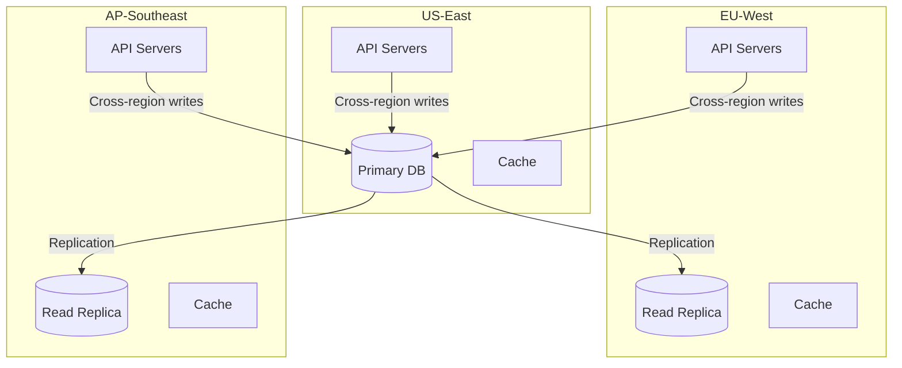

# How to Implement Multi-Region Capacity Planning

Author: [nawazdhandala](https://www.github.com/nawazdhandala)

Tags: Site Reliability Engineering, Capacity Planning, Multi-Region, High Availability, Disaster Recovery

Description: A comprehensive guide to planning and managing capacity across multiple geographic regions for resilience and performance.

---

## Why Multi-Region Capacity Planning is Complex

Running infrastructure in multiple regions adds significant complexity to capacity planning. You are no longer just asking "how much capacity do I need?" but also "where should that capacity be located?" and "how much redundancy is required?" This guide covers the strategies and tools for effective multi-region capacity management.

## Multi-Region Architecture Patterns

Before planning capacity, understand your architecture pattern.



Each pattern has different capacity implications:

```python
# multi_region_patterns.py - Define capacity requirements by pattern
from dataclasses import dataclass
from enum import Enum
from typing import List, Dict

class RegionPattern(Enum):
    ACTIVE_PASSIVE = "active_passive"
    ACTIVE_ACTIVE = "active_active"
    FOLLOW_THE_SUN = "follow_the_sun"
    REGION_ISOLATED = "region_isolated"

@dataclass
class RegionCapacityRequirement:
    region: str
    base_capacity_percent: float  # Percent of total traffic this region handles
    failover_capacity_percent: float  # Additional capacity needed to absorb failover
    peak_multiplier: float  # Peak vs average traffic ratio

    @property
    def total_required_capacity(self) -> float:
        """Total capacity as percentage of global traffic."""
        return (self.base_capacity_percent + self.failover_capacity_percent) * self.peak_multiplier

def calculate_region_capacity(
    pattern: RegionPattern,
    regions: List[str],
    global_peak_rps: int,
) -> Dict[str, RegionCapacityRequirement]:
    """Calculate capacity requirements for each region based on pattern."""

    requirements = {}

    if pattern == RegionPattern.ACTIVE_PASSIVE:
        # Primary handles all traffic, DR needs full failover capacity
        primary, dr = regions[0], regions[1]
        requirements[primary] = RegionCapacityRequirement(
            region=primary,
            base_capacity_percent=100,
            failover_capacity_percent=0,
            peak_multiplier=1.3,  # 30% headroom
        )
        requirements[dr] = RegionCapacityRequirement(
            region=dr,
            base_capacity_percent=0,
            failover_capacity_percent=100,  # Must handle full load on failover
            peak_multiplier=1.3,
        )

    elif pattern == RegionPattern.ACTIVE_ACTIVE:
        # Split traffic, each region needs capacity to absorb other
        region_count = len(regions)
        base_percent = 100 / region_count

        for region in regions:
            requirements[region] = RegionCapacityRequirement(
                region=region,
                base_capacity_percent=base_percent,
                failover_capacity_percent=base_percent,  # Can absorb one region's traffic
                peak_multiplier=1.2,
            )

    elif pattern == RegionPattern.FOLLOW_THE_SUN:
        # Traffic shifts based on time of day
        # US peaks at 50%, EU at 35%, APAC at 30% (overlap periods)
        peak_distribution = {
            "us-east": 50,
            "eu-west": 35,
            "ap-southeast": 30,
        }

        for region in regions:
            base = peak_distribution.get(region, 33)
            requirements[region] = RegionCapacityRequirement(
                region=region,
                base_capacity_percent=base,
                failover_capacity_percent=base * 0.5,  # Partial failover capacity
                peak_multiplier=1.4,  # Higher multiplier due to peak concentration
            )

    # Calculate actual RPS requirements
    for region, req in requirements.items():
        req.target_rps = int(
            global_peak_rps * (req.total_required_capacity / 100)
        )

    return requirements

# Example usage
requirements = calculate_region_capacity(
    pattern=RegionPattern.ACTIVE_ACTIVE,
    regions=["us-east", "eu-west", "ap-southeast"],
    global_peak_rps=100000,
)

for region, req in requirements.items():
    print(f"{region}: Base {req.base_capacity_percent}%, "
          f"Failover {req.failover_capacity_percent}%, "
          f"Target {req.target_rps} RPS")
```

## Step 1: Map Traffic Distribution

Understanding where your users are determines where capacity should be allocated.

```python
# traffic_distribution.py - Analyze and plan traffic distribution
from dataclasses import dataclass
from datetime import datetime
from typing import List, Dict, Tuple
import statistics

@dataclass
class RegionTrafficMetrics:
    region: str
    timestamp: datetime
    requests_per_second: float
    latency_p50_ms: float
    latency_p99_ms: float
    error_rate_percent: float

class TrafficDistributionAnalyzer:
    """Analyze traffic patterns across regions."""

    def __init__(self):
        self.metrics: List[RegionTrafficMetrics] = []

    def record_metrics(self, metrics: RegionTrafficMetrics):
        self.metrics.append(metrics)

    def get_distribution(self) -> Dict[str, float]:
        """Get current traffic distribution across regions."""
        region_totals: Dict[str, float] = {}

        for m in self.metrics:
            if m.region not in region_totals:
                region_totals[m.region] = 0
            region_totals[m.region] += m.requests_per_second

        total = sum(region_totals.values())
        if total == 0:
            return {}

        return {
            region: (rps / total) * 100
            for region, rps in region_totals.items()
        }

    def identify_peak_hours_by_region(self) -> Dict[str, List[int]]:
        """Identify peak traffic hours for each region."""
        region_hourly: Dict[str, Dict[int, List[float]]] = {}

        for m in self.metrics:
            if m.region not in region_hourly:
                region_hourly[m.region] = {h: [] for h in range(24)}

            hour = m.timestamp.hour
            region_hourly[m.region][hour].append(m.requests_per_second)

        peak_hours = {}
        for region, hourly_data in region_hourly.items():
            hourly_avgs = {
                h: statistics.mean(values) if values else 0
                for h, values in hourly_data.items()
            }
            avg_rps = statistics.mean(hourly_avgs.values())
            # Peak hours are those above average
            peak_hours[region] = [
                h for h, rps in hourly_avgs.items()
                if rps > avg_rps * 1.1
            ]

        return peak_hours

    def calculate_latency_impact(self) -> Dict[str, dict]:
        """Calculate latency metrics to inform capacity placement."""
        region_latencies: Dict[str, List[float]] = {}

        for m in self.metrics:
            if m.region not in region_latencies:
                region_latencies[m.region] = []
            region_latencies[m.region].append(m.latency_p99_ms)

        return {
            region: {
                "avg_p99_ms": statistics.mean(latencies),
                "max_p99_ms": max(latencies),
                "needs_local_capacity": statistics.mean(latencies) > 100,
            }
            for region, latencies in region_latencies.items()
        }
```

## Step 2: Plan Failover Capacity

Failover capacity must be ready before you need it.



```python
# failover_capacity.py - Plan and validate failover capacity
from dataclasses import dataclass
from typing import List, Dict, Optional

@dataclass
class RegionCapacity:
    region: str
    current_capacity_units: int  # e.g., number of instances
    current_utilization_percent: float
    max_utilization_percent: float  # Don't exceed this during failover
    scale_up_time_minutes: int  # Time to add capacity if needed

@dataclass
class FailoverScenario:
    failed_region: str
    traffic_to_redistribute: float  # Percentage of global traffic
    target_regions: List[str]
    feasible: bool
    capacity_gap: float  # Negative means excess capacity
    scale_up_required: bool
    estimated_degradation_percent: float

class FailoverCapacityPlanner:
    """Plan and validate failover capacity across regions."""

    def __init__(self, max_acceptable_degradation: float = 10.0):
        self.regions: Dict[str, RegionCapacity] = {}
        self.traffic_distribution: Dict[str, float] = {}
        self.max_acceptable_degradation = max_acceptable_degradation

    def add_region(self, capacity: RegionCapacity, traffic_percent: float):
        self.regions[capacity.region] = capacity
        self.traffic_distribution[capacity.region] = traffic_percent

    def simulate_failover(self, failed_region: str) -> FailoverScenario:
        """Simulate a region failure and calculate impact."""

        if failed_region not in self.regions:
            raise ValueError(f"Unknown region: {failed_region}")

        failed_traffic = self.traffic_distribution[failed_region]
        remaining_regions = [r for r in self.regions.keys() if r != failed_region]

        # Calculate available capacity in remaining regions
        total_available = 0
        total_current_load = 0

        for region_name in remaining_regions:
            region = self.regions[region_name]
            # Available = (max - current) capacity
            current_load = region.current_capacity_units * (region.current_utilization_percent / 100)
            max_load = region.current_capacity_units * (region.max_utilization_percent / 100)
            available = max_load - current_load
            total_available += available
            total_current_load += current_load

        # Calculate if we can absorb the failed region's traffic
        failed_load = failed_traffic  # Simplified: traffic percent = load units
        capacity_gap = failed_load - total_available

        # Calculate degradation if capacity is insufficient
        if capacity_gap > 0:
            degradation = (capacity_gap / (total_current_load + failed_load)) * 100
        else:
            degradation = 0

        return FailoverScenario(
            failed_region=failed_region,
            traffic_to_redistribute=failed_traffic,
            target_regions=remaining_regions,
            feasible=capacity_gap <= 0,
            capacity_gap=capacity_gap,
            scale_up_required=capacity_gap > 0,
            estimated_degradation_percent=degradation,
        )

    def generate_failover_matrix(self) -> List[FailoverScenario]:
        """Generate failover scenarios for all regions."""
        return [
            self.simulate_failover(region)
            for region in self.regions.keys()
        ]

    def recommend_capacity_adjustments(self) -> Dict[str, dict]:
        """Recommend capacity adjustments to ensure failover readiness."""

        recommendations = {}
        scenarios = self.generate_failover_matrix()

        for scenario in scenarios:
            if not scenario.feasible:
                for target_region in scenario.target_regions:
                    if target_region not in recommendations:
                        recommendations[target_region] = {
                            "additional_capacity_needed": 0,
                            "reason": [],
                        }

                    # Distribute gap across target regions
                    share = scenario.capacity_gap / len(scenario.target_regions)
                    recommendations[target_region]["additional_capacity_needed"] += share
                    recommendations[target_region]["reason"].append(
                        f"To handle {scenario.failed_region} failover"
                    )

        return recommendations

# Example usage
planner = FailoverCapacityPlanner()

planner.add_region(
    RegionCapacity("us-east", 100, 65, 85, 15),
    traffic_percent=45
)
planner.add_region(
    RegionCapacity("eu-west", 80, 55, 85, 20),
    traffic_percent=35
)
planner.add_region(
    RegionCapacity("ap-southeast", 50, 50, 85, 25),
    traffic_percent=20
)

# Test failover scenarios
for scenario in planner.generate_failover_matrix():
    status = "OK" if scenario.feasible else "CAPACITY GAP"
    print(f"If {scenario.failed_region} fails: {status}")
    if not scenario.feasible:
        print(f"  Gap: {scenario.capacity_gap:.1f} units")
        print(f"  Degradation: {scenario.estimated_degradation_percent:.1f}%")
```

## Step 3: Implement Cross-Region Scaling Policies

Coordinate scaling decisions across regions.

```python
# cross_region_scaling.py - Coordinate scaling across regions
from dataclasses import dataclass
from datetime import datetime
from typing import List, Dict, Optional
from enum import Enum

class ScalingAction(Enum):
    SCALE_UP = "scale_up"
    SCALE_DOWN = "scale_down"
    REBALANCE = "rebalance"
    NO_ACTION = "no_action"

@dataclass
class RegionScalingDecision:
    region: str
    action: ScalingAction
    target_capacity: int
    reason: str
    priority: int  # 1 = highest priority

@dataclass
class GlobalScalingPlan:
    timestamp: datetime
    decisions: List[RegionScalingDecision]
    total_capacity_change: int
    estimated_cost_change: float

class CrossRegionScaler:
    """Coordinate scaling decisions across regions."""

    def __init__(self, cost_per_unit: Dict[str, float]):
        self.cost_per_unit = cost_per_unit
        self.region_capacity: Dict[str, int] = {}
        self.region_utilization: Dict[str, float] = {}

    def update_metrics(self, region: str, capacity: int, utilization: float):
        self.region_capacity[region] = capacity
        self.region_utilization[region] = utilization

    def evaluate_scaling_need(self) -> GlobalScalingPlan:
        """Evaluate global scaling needs and create a coordinated plan."""

        decisions = []

        for region, utilization in self.region_utilization.items():
            capacity = self.region_capacity[region]

            if utilization > 75:
                # Scale up
                target = int(capacity * 1.25)
                decisions.append(RegionScalingDecision(
                    region=region,
                    action=ScalingAction.SCALE_UP,
                    target_capacity=target,
                    reason=f"Utilization at {utilization}% exceeds 75% threshold",
                    priority=1 if utilization > 85 else 2,
                ))
            elif utilization < 30:
                # Consider scale down, but check if other regions need failover capacity
                if self._can_safely_scale_down(region):
                    target = max(int(capacity * 0.75), self._minimum_capacity(region))
                    decisions.append(RegionScalingDecision(
                        region=region,
                        action=ScalingAction.SCALE_DOWN,
                        target_capacity=target,
                        reason=f"Utilization at {utilization}% below 30% threshold",
                        priority=3,
                    ))

        # Check for rebalancing opportunities
        rebalance = self._check_rebalancing()
        if rebalance:
            decisions.extend(rebalance)

        # Calculate totals
        total_change = sum(
            d.target_capacity - self.region_capacity.get(d.region, 0)
            for d in decisions
        )

        cost_change = sum(
            (d.target_capacity - self.region_capacity.get(d.region, 0))
            * self.cost_per_unit.get(d.region, 0)
            for d in decisions
        )

        return GlobalScalingPlan(
            timestamp=datetime.utcnow(),
            decisions=sorted(decisions, key=lambda d: d.priority),
            total_capacity_change=total_change,
            estimated_cost_change=cost_change,
        )

    def _can_safely_scale_down(self, region: str) -> bool:
        """Check if scaling down a region maintains failover capacity."""
        # Simplified check: ensure other regions can handle this region's load
        other_available = sum(
            cap * (1 - self.region_utilization.get(r, 0) / 100)
            for r, cap in self.region_capacity.items()
            if r != region
        )

        region_load = self.region_capacity[region] * (
            self.region_utilization.get(region, 0) / 100
        )

        return other_available > region_load

    def _minimum_capacity(self, region: str) -> int:
        """Calculate minimum capacity for a region based on failover needs."""
        # At minimum, need enough to handle 50% of another region's traffic
        other_max = max(
            cap for r, cap in self.region_capacity.items()
            if r != region
        ) if len(self.region_capacity) > 1 else 0

        return int(other_max * 0.5)

    def _check_rebalancing(self) -> Optional[List[RegionScalingDecision]]:
        """Check if traffic should be rebalanced across regions."""
        if len(self.region_utilization) < 2:
            return None

        utilizations = list(self.region_utilization.values())
        max_util = max(utilizations)
        min_util = min(utilizations)

        # Rebalance if spread is > 30%
        if max_util - min_util > 30:
            max_region = max(self.region_utilization, key=self.region_utilization.get)
            min_region = min(self.region_utilization, key=self.region_utilization.get)

            return [
                RegionScalingDecision(
                    region=max_region,
                    action=ScalingAction.REBALANCE,
                    target_capacity=self.region_capacity[max_region],
                    reason=f"Shift traffic from {max_region} ({max_util}%) to {min_region} ({min_util}%)",
                    priority=2,
                )
            ]

        return None
```

## Step 4: Monitor Cross-Region Dependencies

Track dependencies between regions to understand failure blast radius.



```python
# cross_region_dependencies.py - Track and analyze cross-region dependencies
from dataclasses import dataclass
from typing import List, Dict, Set
from enum import Enum

class DependencyType(Enum):
    DATABASE_REPLICATION = "database_replication"
    API_CALL = "api_call"
    MESSAGE_QUEUE = "message_queue"
    SHARED_STORAGE = "shared_storage"

@dataclass
class CrossRegionDependency:
    source_region: str
    target_region: str
    dependency_type: DependencyType
    service_name: str
    latency_sensitivity_ms: float
    failure_impact: str  # "degraded", "unavailable", "data_loss_risk"

class DependencyAnalyzer:
    """Analyze cross-region dependencies and their impact."""

    def __init__(self):
        self.dependencies: List[CrossRegionDependency] = []

    def add_dependency(self, dep: CrossRegionDependency):
        self.dependencies.append(dep)

    def get_region_dependencies(self, region: str) -> Dict[str, List[CrossRegionDependency]]:
        """Get all dependencies for a region, grouped by target."""
        outbound = [d for d in self.dependencies if d.source_region == region]
        inbound = [d for d in self.dependencies if d.target_region == region]

        return {
            "outbound": outbound,
            "inbound": inbound,
        }

    def analyze_region_failure_impact(self, failed_region: str) -> dict:
        """Analyze impact of a region failure on other regions."""

        # Find all dependencies on the failed region
        dependent_on_failed = [
            d for d in self.dependencies
            if d.target_region == failed_region
        ]

        impact_by_region: Dict[str, List[str]] = {}

        for dep in dependent_on_failed:
            if dep.source_region not in impact_by_region:
                impact_by_region[dep.source_region] = []

            impact_by_region[dep.source_region].append(
                f"{dep.service_name}: {dep.failure_impact}"
            )

        # Determine overall severity
        has_unavailable = any(
            d.failure_impact == "unavailable"
            for d in dependent_on_failed
        )
        has_data_loss = any(
            d.failure_impact == "data_loss_risk"
            for d in dependent_on_failed
        )

        if has_data_loss:
            severity = "critical"
        elif has_unavailable:
            severity = "high"
        else:
            severity = "medium"

        return {
            "failed_region": failed_region,
            "severity": severity,
            "affected_regions": list(impact_by_region.keys()),
            "impact_details": impact_by_region,
            "recommendations": self._generate_recommendations(dependent_on_failed),
        }

    def _generate_recommendations(
        self,
        dependencies: List[CrossRegionDependency]
    ) -> List[str]:
        recommendations = []

        # Check for single points of failure
        db_deps = [d for d in dependencies if d.dependency_type == DependencyType.DATABASE_REPLICATION]
        if db_deps:
            recommendations.append("Ensure database failover automation is tested")

        api_deps = [d for d in dependencies if d.dependency_type == DependencyType.API_CALL]
        if api_deps:
            recommendations.append("Implement circuit breakers for cross-region API calls")
            recommendations.append("Consider caching to reduce cross-region latency sensitivity")

        return recommendations

# Example: Map your cross-region dependencies
analyzer = DependencyAnalyzer()

analyzer.add_dependency(CrossRegionDependency(
    source_region="eu-west",
    target_region="us-east",
    dependency_type=DependencyType.DATABASE_REPLICATION,
    service_name="user-db",
    latency_sensitivity_ms=1000,
    failure_impact="degraded",  # Reads still work from replica
))

analyzer.add_dependency(CrossRegionDependency(
    source_region="eu-west",
    target_region="us-east",
    dependency_type=DependencyType.API_CALL,
    service_name="payment-service",
    latency_sensitivity_ms=100,
    failure_impact="unavailable",
))

# Analyze what happens if us-east fails
impact = analyzer.analyze_region_failure_impact("us-east")
print(f"Severity: {impact['severity']}")
for region, impacts in impact['impact_details'].items():
    print(f"  {region}: {impacts}")
```

## Multi-Region Capacity Dashboard Metrics

Track these metrics across all regions:

```yaml
# multi-region-metrics.yaml
capacity_metrics:
  - name: region_utilization
    description: "CPU/Memory utilization by region"
    alert_threshold: 75%

  - name: cross_region_latency
    description: "Latency between region pairs"
    alert_threshold: 100ms

  - name: replication_lag
    description: "Database replication lag"
    alert_threshold: 1000ms

  - name: failover_capacity_ratio
    description: "Available capacity / Failover requirement"
    alert_threshold: "< 1.0"

  - name: traffic_distribution_skew
    description: "Max region traffic / Expected region traffic"
    alert_threshold: 1.5

cost_metrics:
  - name: cost_per_region
    description: "Monthly infrastructure cost by region"

  - name: cost_per_request_by_region
    description: "Cost efficiency comparison"

  - name: unused_capacity_cost
    description: "Cost of capacity held for failover"
```

## Key Takeaways

Multi-region capacity planning requires understanding your architecture pattern, mapping traffic distribution, planning for failover, coordinating scaling decisions, and tracking cross-region dependencies. The complexity is worth it for systems that require high availability and low latency for a global user base. Integrate multi-region metrics into OneUptime to get a unified view of capacity across all regions and catch issues before they cascade.

---

Multi-region infrastructure is an investment in resilience. The capacity planning effort pays off when a region fails and your users barely notice because you planned for exactly that scenario.
