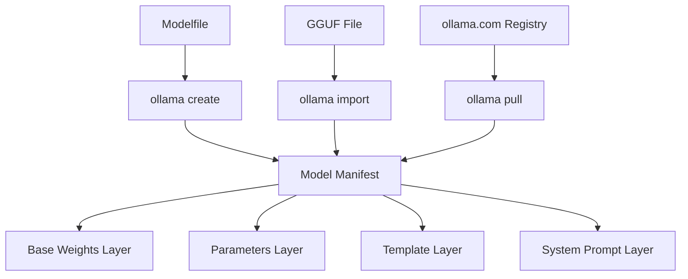

# How to Use Ollama with Custom Models

Author: [nawazdhandala](https://www.github.com/nawazdhandala)

Tags: Ollama, LLM, AI/ML, Custom Models, Machine Learning

Description: A practical guide to importing, creating, and fine-tuning custom models in Ollama for local LLM inference.

---

Ollama makes running large language models locally straightforward, but its real power emerges when you move beyond pre-built models. This guide walks through creating custom models using Modelfiles, importing GGUF weights, and building specialized model variants for your specific use cases.

## Understanding the Ollama Model Architecture

Before diving into custom models, it helps to understand how Ollama organizes model data. Each model consists of layers stored in a local registry, similar to how Docker manages container images.



## Creating a Custom Model with Modelfile

A Modelfile is the configuration that defines your custom model. It specifies the base model, system prompt, parameters, and template format.

```dockerfile
# Modelfile for a code review assistant
# Save this as Modelfile.codereview

# Start from a capable base model
FROM llama3.2:3b

# Set the system prompt that defines behavior
SYSTEM """
You are an expert code reviewer. When analyzing code:
1. Check for security vulnerabilities first
2. Identify performance bottlenecks
3. Suggest improvements for readability
4. Point out potential bugs or edge cases

Be direct and specific. Reference line numbers when possible.
Format your response with clear sections for each category.
"""

# Adjust inference parameters for code analysis
# Lower temperature for more deterministic output
PARAMETER temperature 0.3

# Increase context window for larger code files
PARAMETER num_ctx 8192

# Stop sequences to prevent rambling
PARAMETER stop "<|end|>"
PARAMETER stop "Human:"
```

Build the custom model with the create command:

```bash
# Create the model from the Modelfile
ollama create codereview -f Modelfile.codereview

# Verify the model was created
ollama list

# Test the new model
ollama run codereview "Review this Python function:
def get_user(id):
    query = f'SELECT * FROM users WHERE id = {id}'
    return db.execute(query)"
```

## Importing GGUF Models from Hugging Face

Many models on Hugging Face are available in GGUF format, which Ollama can import directly. This opens access to thousands of community-trained models.

```bash
# Download a GGUF model from Hugging Face
# Example: downloading a Mistral fine-tune
wget https://huggingface.co/TheBloke/Mistral-7B-Instruct-v0.2-GGUF/resolve/main/mistral-7b-instruct-v0.2.Q4_K_M.gguf

# Create a Modelfile that references the GGUF
cat > Modelfile.mistral << 'EOF'
FROM ./mistral-7b-instruct-v0.2.Q4_K_M.gguf

# Define the chat template for this model
TEMPLATE """
[INST] {{ .System }}

{{ .Prompt }} [/INST]
"""

SYSTEM "You are a helpful AI assistant."

PARAMETER temperature 0.7
PARAMETER top_p 0.9
EOF

# Import the model
ollama create mistral-custom -f Modelfile.mistral

# Run inference
ollama run mistral-custom "Explain kubernetes pods in simple terms"
```

## Building Specialized Model Variants

You can create multiple variants from the same base model, each optimized for different tasks.

```bash
# Create a technical writer variant
cat > Modelfile.techwriter << 'EOF'
FROM llama3.2:3b

SYSTEM """
You are a technical documentation writer. Your responses should:
- Use clear, concise language
- Include code examples where appropriate
- Structure content with headers and lists
- Avoid jargon unless necessary, and explain it when used
"""

PARAMETER temperature 0.5
PARAMETER num_ctx 4096
EOF

# Create a SQL expert variant
cat > Modelfile.sqlexpert << 'EOF'
FROM llama3.2:3b

SYSTEM """
You are a database expert specializing in SQL optimization.
When given a query or schema question:
- Analyze query performance implications
- Suggest appropriate indexes
- Provide optimized alternatives
- Explain the reasoning behind recommendations
Always format SQL with proper indentation.
"""

PARAMETER temperature 0.2
PARAMETER num_ctx 4096
EOF

# Build both variants
ollama create techwriter -f Modelfile.techwriter
ollama create sqlexpert -f Modelfile.sqlexpert
```

## Model Parameter Tuning

Understanding key parameters helps you dial in model behavior for your use case.

```dockerfile
# Modelfile with comprehensive parameter tuning
FROM llama3.2:3b

# Temperature: Controls randomness (0.0 = deterministic, 1.0 = creative)
PARAMETER temperature 0.7

# Top-p (nucleus sampling): Cumulative probability threshold
PARAMETER top_p 0.9

# Top-k: Number of top tokens to consider
PARAMETER top_k 40

# Context window size in tokens
PARAMETER num_ctx 4096

# Number of tokens to predict (-1 for unlimited)
PARAMETER num_predict 512

# Repeat penalty: Reduces repetition (1.0 = no penalty)
PARAMETER repeat_penalty 1.1

# Number of previous tokens to consider for repeat penalty
PARAMETER repeat_last_n 64

# Mirostat sampling (0 = disabled, 1 or 2 = enabled)
PARAMETER mirostat 0

# Seed for reproducible outputs (-1 for random)
PARAMETER seed -1
```

## Managing Custom Models

```bash
# List all models including custom ones
ollama list

# Show detailed model information
ollama show codereview

# Show just the Modelfile content
ollama show codereview --modelfile

# Copy a model to create variants
ollama cp codereview codereview-v2

# Remove a custom model
ollama rm codereview-v2

# Push to a registry (requires authentication)
ollama push username/codereview
```

## Creating Embedding Models

Custom embedding models are useful for RAG (Retrieval Augmented Generation) pipelines.

```bash
# Modelfile for custom embeddings
cat > Modelfile.embeddings << 'EOF'
FROM nomic-embed-text

# Embedding models typically need minimal customization
# but you can adjust the context window
PARAMETER num_ctx 8192
EOF

ollama create custom-embeddings -f Modelfile.embeddings

# Generate embeddings via API
curl http://localhost:11434/api/embeddings -d '{
  "model": "custom-embeddings",
  "prompt": "Your text to embed here"
}'
```

## Multi-Model Workflow Example

Here is a Python script that demonstrates using multiple custom models in a workflow:

```python
import requests
import json

OLLAMA_BASE = "http://localhost:11434"

def generate(model: str, prompt: str, system: str = None) -> str:
    """Send a generation request to Ollama."""
    payload = {
        "model": model,
        "prompt": prompt,
        "stream": False
    }
    if system:
        payload["system"] = system

    response = requests.post(
        f"{OLLAMA_BASE}/api/generate",
        json=payload,
        timeout=120
    )
    response.raise_for_status()
    return response.json()["response"]

def code_review_pipeline(code: str) -> dict:
    """
    Multi-stage code review using specialized models.
    Each model focuses on a different aspect.
    """
    results = {}

    # Stage 1: Security review
    results["security"] = generate(
        model="codereview",
        prompt=f"Focus only on security issues in this code:\n\n{code}"
    )

    # Stage 2: SQL optimization (if SQL detected)
    if "SELECT" in code.upper() or "INSERT" in code.upper():
        results["sql_analysis"] = generate(
            model="sqlexpert",
            prompt=f"Analyze the SQL in this code:\n\n{code}"
        )

    # Stage 3: Documentation suggestions
    results["documentation"] = generate(
        model="techwriter",
        prompt=f"Suggest documentation improvements for:\n\n{code}"
    )

    return results

# Example usage
code_sample = '''
def fetch_user_data(user_id):
    conn = sqlite3.connect("app.db")
    cursor = conn.cursor()
    cursor.execute(f"SELECT * FROM users WHERE id = {user_id}")
    return cursor.fetchone()
'''

review = code_review_pipeline(code_sample)
for category, feedback in review.items():
    print(f"\n=== {category.upper()} ===")
    print(feedback)
```

## Troubleshooting Custom Models

Common issues and their solutions:

```bash
# Issue: Model fails to load
# Check available memory
ollama ps
free -h

# Issue: Slow inference
# Try a smaller quantization
ollama pull llama3.2:3b-q4_0

# Issue: Poor output quality
# Review the Modelfile parameters
ollama show yourmodel --modelfile

# Issue: Template not working
# Test with explicit template
curl http://localhost:11434/api/generate -d '{
  "model": "yourmodel",
  "prompt": "test prompt",
  "raw": true,
  "template": "[INST] {{ .Prompt }} [/INST]"
}'

# Issue: Out of context errors
# Check current context size
ollama show yourmodel | grep num_ctx
```

---

Custom models transform Ollama from a simple model runner into a flexible platform for specialized AI applications. By combining GGUF imports with thoughtful Modelfile configuration, you can build purpose-built assistants that excel at specific tasks while running entirely on your local hardware. Start with a base model close to your use case, iterate on the system prompt and parameters, and test thoroughly before deploying to production workflows.
