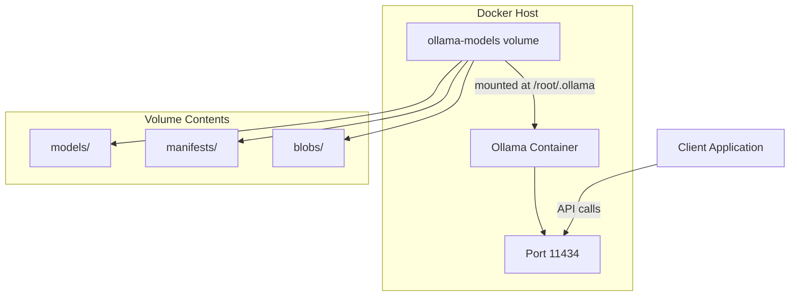
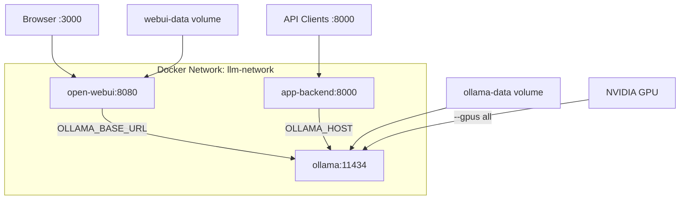

# How to Use Ollama with Docker

Author: [nawazdhandala](https://www.github.com/nawazdhandala)

Tags: Ollama, Docker, LLM, AI/ML, Containers, DevOps

Description: Deploy Ollama in Docker containers for reproducible local LLM inference with GPU passthrough and persistent model storage.

---

Running Ollama in Docker provides isolation, reproducibility, and easier deployment across different environments. This guide covers everything from basic container setup to GPU passthrough, multi-container architectures, and production-ready configurations.

## Basic Ollama Docker Setup

The official Ollama Docker image makes getting started simple:

```bash
# Pull the official image
docker pull ollama/ollama:latest

# Run Ollama with default settings
docker run -d \
  --name ollama \
  -p 11434:11434 \
  ollama/ollama

# Verify it's running
curl http://localhost:11434/api/tags

# Pull a model inside the container
docker exec ollama ollama pull llama3.2:3b

# Test inference
curl http://localhost:11434/api/generate -d '{
  "model": "llama3.2:3b",
  "prompt": "Hello, world!",
  "stream": false
}'
```

## Persistent Model Storage

Models downloaded inside containers disappear when the container is removed. Use volumes to persist them:

```bash
# Create a named volume for models
docker volume create ollama-models

# Run with persistent storage
docker run -d \
  --name ollama \
  -p 11434:11434 \
  -v ollama-models:/root/.ollama \
  ollama/ollama

# Alternatively, use a bind mount for easier inspection
mkdir -p ~/ollama-data
docker run -d \
  --name ollama \
  -p 11434:11434 \
  -v ~/ollama-data:/root/.ollama \
  ollama/ollama
```



## GPU Passthrough with NVIDIA

For GPU acceleration, you need the NVIDIA Container Toolkit installed on the host:

```bash
# Install NVIDIA Container Toolkit (Ubuntu/Debian)
curl -fsSL https://nvidia.github.io/libnvidia-container/gpgkey | \
  sudo gpg --dearmor -o /usr/share/keyrings/nvidia-container-toolkit-keyring.gpg

curl -s -L https://nvidia.github.io/libnvidia-container/stable/deb/nvidia-container-toolkit.list | \
  sed 's#deb https://#deb [signed-by=/usr/share/keyrings/nvidia-container-toolkit-keyring.gpg] https://#g' | \
  sudo tee /etc/apt/sources.list.d/nvidia-container-toolkit.list

sudo apt-get update
sudo apt-get install -y nvidia-container-toolkit
sudo nvidia-ctk runtime configure --runtime=docker
sudo systemctl restart docker

# Verify GPU access in Docker
docker run --rm --gpus all nvidia/cuda:12.0-base nvidia-smi
```

Now run Ollama with GPU access:

```bash
# Run with all GPUs
docker run -d \
  --name ollama-gpu \
  --gpus all \
  -p 11434:11434 \
  -v ollama-models:/root/.ollama \
  ollama/ollama

# Run with specific GPU
docker run -d \
  --name ollama-gpu \
  --gpus '"device=0"' \
  -p 11434:11434 \
  -v ollama-models:/root/.ollama \
  ollama/ollama

# Verify GPU is being used
docker exec ollama-gpu ollama ps
```

## Docker Compose Configuration

For more complex setups, use Docker Compose:

```yaml
# docker-compose.yml
version: '3.8'

services:
  ollama:
    image: ollama/ollama:latest
    container_name: ollama
    ports:
      - "11434:11434"
    volumes:
      - ollama-data:/root/.ollama
      - ./models:/models  # For custom Modelfiles
    environment:
      - OLLAMA_HOST=0.0.0.0
      - OLLAMA_ORIGINS=*
    deploy:
      resources:
        reservations:
          devices:
            - driver: nvidia
              count: all
              capabilities: [gpu]
    restart: unless-stopped
    healthcheck:
      test: ["CMD", "curl", "-f", "http://localhost:11434/api/tags"]
      interval: 30s
      timeout: 10s
      retries: 3

volumes:
  ollama-data:
```

Start the stack:

```bash
# Start in detached mode
docker compose up -d

# View logs
docker compose logs -f ollama

# Pull models
docker compose exec ollama ollama pull llama3.2:3b
docker compose exec ollama ollama pull nomic-embed-text

# Stop the stack
docker compose down
```

## Pre-loading Models at Startup

Create a custom image with models pre-loaded or use an init script:

```dockerfile
# Dockerfile.ollama-preloaded
FROM ollama/ollama:latest

# Script to pull models on first run
COPY <<'EOF' /entrypoint.sh
#!/bin/bash
set -e

# Start Ollama server in background
ollama serve &
SERVER_PID=$!

# Wait for server to be ready
until curl -s http://localhost:11434/api/tags > /dev/null 2>&1; do
    sleep 1
done

# Pull required models if not present
MODELS="llama3.2:3b nomic-embed-text"
for model in $MODELS; do
    if ! ollama list | grep -q "$model"; then
        echo "Pulling $model..."
        ollama pull "$model"
    fi
done

# Keep server running
wait $SERVER_PID
EOF

RUN chmod +x /entrypoint.sh

ENTRYPOINT ["/entrypoint.sh"]
```

Build and run:

```bash
docker build -f Dockerfile.ollama-preloaded -t ollama-preloaded .
docker run -d --name ollama --gpus all -p 11434:11434 ollama-preloaded
```

## Multi-Container Application Stack

Here is a complete stack with Ollama, a web UI, and an application backend:

```yaml
# docker-compose.full.yml
version: '3.8'

services:
  ollama:
    image: ollama/ollama:latest
    container_name: ollama
    volumes:
      - ollama-data:/root/.ollama
    environment:
      - OLLAMA_HOST=0.0.0.0
    deploy:
      resources:
        reservations:
          devices:
            - driver: nvidia
              count: all
              capabilities: [gpu]
    networks:
      - llm-network
    healthcheck:
      test: ["CMD", "curl", "-f", "http://localhost:11434/api/tags"]
      interval: 30s
      timeout: 10s
      retries: 3
    restart: unless-stopped

  open-webui:
    image: ghcr.io/open-webui/open-webui:main
    container_name: open-webui
    ports:
      - "3000:8080"
    environment:
      - OLLAMA_BASE_URL=http://ollama:11434
    volumes:
      - webui-data:/app/backend/data
    depends_on:
      ollama:
        condition: service_healthy
    networks:
      - llm-network
    restart: unless-stopped

  app-backend:
    build: ./backend
    container_name: app-backend
    ports:
      - "8000:8000"
    environment:
      - OLLAMA_HOST=http://ollama:11434
      - MODEL_NAME=llama3.2:3b
    depends_on:
      ollama:
        condition: service_healthy
    networks:
      - llm-network
    restart: unless-stopped

networks:
  llm-network:
    driver: bridge

volumes:
  ollama-data:
  webui-data:
```



## CPU-Only Deployment

Not every environment has GPUs. Ollama works on CPU, just slower:

```yaml
# docker-compose.cpu.yml
version: '3.8'

services:
  ollama:
    image: ollama/ollama:latest
    container_name: ollama-cpu
    ports:
      - "11434:11434"
    volumes:
      - ollama-data:/root/.ollama
    environment:
      - OLLAMA_HOST=0.0.0.0
      # Limit CPU usage
      - OLLAMA_NUM_PARALLEL=2
    deploy:
      resources:
        limits:
          cpus: '4'
          memory: 16G
    restart: unless-stopped

volumes:
  ollama-data:
```

Use smaller quantized models for CPU inference:

```bash
# Pull CPU-friendly quantized models
docker exec ollama-cpu ollama pull llama3.2:1b
docker exec ollama-cpu ollama pull phi3:mini
```

## Custom Modelfiles in Docker

Mount a directory containing Modelfiles and create custom models:

```bash
# Create a models directory with Modelfiles
mkdir -p ./custom-models

cat > ./custom-models/Modelfile.assistant << 'EOF'
FROM llama3.2:3b
SYSTEM "You are a helpful DevOps assistant."
PARAMETER temperature 0.7
EOF
```

```yaml
# docker-compose.yml addition
services:
  ollama:
    volumes:
      - ollama-data:/root/.ollama
      - ./custom-models:/custom-models:ro
```

```bash
# Create the custom model
docker exec ollama ollama create devops-assistant -f /custom-models/Modelfile.assistant
```

## Environment Variables Reference

Configure Ollama behavior through environment variables:

```yaml
services:
  ollama:
    environment:
      # API server binding
      - OLLAMA_HOST=0.0.0.0

      # Allowed origins for CORS
      - OLLAMA_ORIGINS=*

      # Model storage location (inside container)
      - OLLAMA_MODELS=/root/.ollama/models

      # Debug logging
      - OLLAMA_DEBUG=false

      # Concurrent model loading
      - OLLAMA_NUM_PARALLEL=4

      # Maximum loaded models in memory
      - OLLAMA_MAX_LOADED_MODELS=2

      # Keep models in memory (seconds, 0 = until memory pressure)
      - OLLAMA_KEEP_ALIVE=300
```

## Health Checks and Monitoring

Implement proper health checking for container orchestration:

```yaml
services:
  ollama:
    healthcheck:
      # Basic API availability check
      test: ["CMD", "curl", "-f", "http://localhost:11434/api/tags"]
      interval: 30s
      timeout: 10s
      retries: 3
      start_period: 60s  # Allow time for model loading
```

```bash
# Monitor container resources
docker stats ollama

# Check GPU utilization inside container
docker exec ollama nvidia-smi

# View Ollama logs
docker logs -f ollama

# Check loaded models
docker exec ollama ollama ps
```

## Backup and Migration

Backup your models and configurations:

```bash
# Backup the entire Ollama data directory
docker run --rm \
  -v ollama-data:/data:ro \
  -v $(pwd)/backup:/backup \
  alpine tar czf /backup/ollama-backup.tar.gz -C /data .

# Restore on another machine
docker volume create ollama-data
docker run --rm \
  -v ollama-data:/data \
  -v $(pwd)/backup:/backup:ro \
  alpine tar xzf /backup/ollama-backup.tar.gz -C /data

# Export a specific model
docker exec ollama ollama push myuser/mymodel
```

## Security Considerations

```yaml
# Production security settings
services:
  ollama:
    image: ollama/ollama:latest
    # Run as non-root (check image support)
    user: "1000:1000"
    # Read-only root filesystem
    read_only: true
    # Mount writable directories explicitly
    volumes:
      - ollama-data:/root/.ollama
    tmpfs:
      - /tmp
    # Limit capabilities
    cap_drop:
      - ALL
    # No new privileges
    security_opt:
      - no-new-privileges:true
    # Network isolation
    networks:
      - internal
```

---

Docker transforms Ollama from a local development tool into a deployable service. Use volumes for model persistence, GPU passthrough for performance, and Docker Compose for multi-service architectures. The containerized approach ensures your LLM inference environment is reproducible, isolated, and ready for production deployment. Start simple with the basic container, then layer on GPU support, custom models, and companion services as your needs grow.
