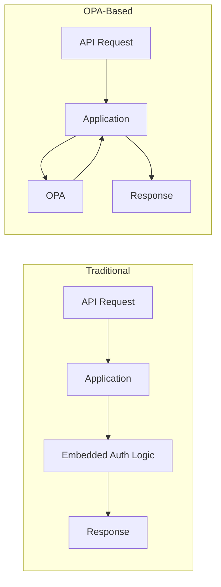
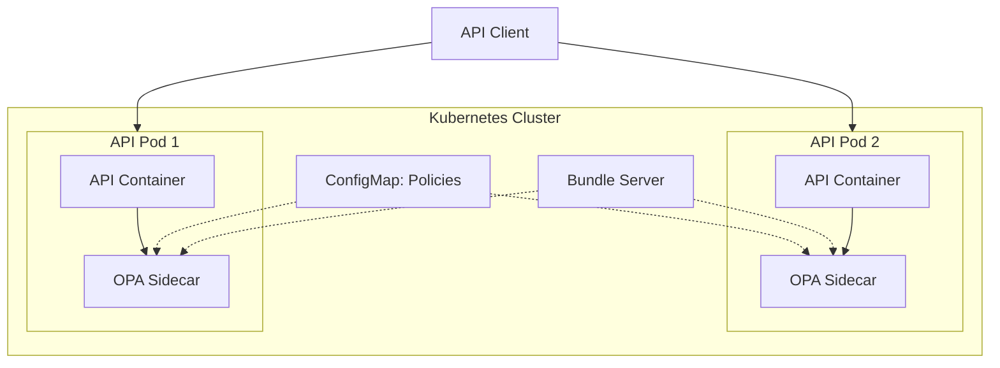

# How to Implement OPA for API Authorization

Author: [nawazdhandala](https://www.github.com/nawazdhandala)

Tags: OPA, Authorization, Security, API, Kubernetes, Policy-as-Code

Description: A practical guide to implementing fine-grained API authorization using Open Policy Agent with real-world examples and integration patterns.

---

Authorization is the gatekeeper that decides who can do what in your system. Open Policy Agent (OPA) decouples authorization logic from your application code, letting you define policies in a dedicated language called Rego. This guide walks through implementing OPA for API authorization from scratch.

## Why OPA for API Authorization?

Traditional authorization approaches embed logic directly in application code. This creates several problems:

- Authorization rules are scattered across services
- Changing policies requires code deployments
- Auditing becomes nearly impossible
- Testing authorization in isolation is difficult

OPA solves these by centralizing policy decisions.



## Setting Up OPA

### Running OPA as a Sidecar

Deploy OPA alongside your API service:

```yaml
# opa-deployment.yaml
apiVersion: apps/v1
kind: Deployment
metadata:
  name: api-with-opa
spec:
  replicas: 3
  selector:
    matchLabels:
      app: api
  template:
    metadata:
      labels:
        app: api
    spec:
      containers:
        # Your API container
        - name: api
          image: your-api:latest
          ports:
            - containerPort: 8080
          env:
            - name: OPA_URL
              value: "http://localhost:8181"

        # OPA sidecar
        - name: opa
          image: openpolicyagent/opa:latest
          args:
            - "run"
            - "--server"
            - "--addr=0.0.0.0:8181"
            - "/policies"
          ports:
            - containerPort: 8181
          volumeMounts:
            - name: policy-volume
              mountPath: /policies
      volumes:
        - name: policy-volume
          configMap:
            name: opa-policies
```

### Basic Policy Structure

OPA policies are written in Rego. Here is a foundational authorization policy:

```rego
# policy.rego
package api.authz

import rego.v1

# Default deny all requests
default allow := false

# Allow if user has required permission
allow if {
    # Extract user from input
    user := input.user

    # Extract requested action and resource
    action := input.action
    resource := input.resource

    # Check if user has permission
    has_permission(user, action, resource)
}

# Permission check using role-based access
has_permission(user, action, resource) if {
    # Get user's roles
    role := user.roles[_]

    # Get permissions for role
    permission := data.role_permissions[role][_]

    # Match action and resource
    permission.action == action
    permission.resource == resource
}
```

### Role Permissions Data

Define role permissions as data that OPA loads:

```json
{
  "role_permissions": {
    "admin": [
      {"action": "read", "resource": "users"},
      {"action": "write", "resource": "users"},
      {"action": "delete", "resource": "users"},
      {"action": "read", "resource": "orders"},
      {"action": "write", "resource": "orders"}
    ],
    "manager": [
      {"action": "read", "resource": "users"},
      {"action": "read", "resource": "orders"},
      {"action": "write", "resource": "orders"}
    ],
    "viewer": [
      {"action": "read", "resource": "users"},
      {"action": "read", "resource": "orders"}
    ]
  }
}
```

## Integrating OPA with Your API

### Node.js Integration

```javascript
// authMiddleware.js
const axios = require('axios');

const OPA_URL = process.env.OPA_URL || 'http://localhost:8181';

async function authorize(req, res, next) {
    // Build the input for OPA
    const input = {
        user: {
            id: req.user.id,
            roles: req.user.roles,
            department: req.user.department
        },
        action: mapMethodToAction(req.method),
        resource: extractResource(req.path),
        context: {
            ip: req.ip,
            timestamp: new Date().toISOString()
        }
    };

    try {
        // Query OPA for authorization decision
        const response = await axios.post(
            `${OPA_URL}/v1/data/api/authz/allow`,
            { input },
            { timeout: 100 } // Fast timeout for sidecar
        );

        if (response.data.result === true) {
            next();
        } else {
            res.status(403).json({
                error: 'Forbidden',
                message: 'You do not have permission to perform this action'
            });
        }
    } catch (error) {
        // Fail closed - deny on OPA errors
        console.error('OPA authorization error:', error.message);
        res.status(500).json({ error: 'Authorization service unavailable' });
    }
}

function mapMethodToAction(method) {
    const mapping = {
        'GET': 'read',
        'POST': 'write',
        'PUT': 'write',
        'PATCH': 'write',
        'DELETE': 'delete'
    };
    return mapping[method] || 'unknown';
}

function extractResource(path) {
    // Extract resource from path like /api/v1/users/123
    const parts = path.split('/').filter(Boolean);
    // Return the resource type (e.g., 'users')
    return parts[2] || 'unknown';
}

module.exports = { authorize };
```

### Python/FastAPI Integration

```python
# auth_middleware.py
import httpx
from fastapi import Request, HTTPException
from functools import wraps
import os

OPA_URL = os.getenv("OPA_URL", "http://localhost:8181")

async def check_authorization(request: Request, action: str, resource: str):
    """Query OPA for authorization decision."""

    # Build input for OPA
    input_data = {
        "input": {
            "user": {
                "id": request.state.user_id,
                "roles": request.state.user_roles,
                "attributes": request.state.user_attributes
            },
            "action": action,
            "resource": resource,
            "context": {
                "path": str(request.url.path),
                "method": request.method,
                "query_params": dict(request.query_params)
            }
        }
    }

    async with httpx.AsyncClient() as client:
        try:
            response = await client.post(
                f"{OPA_URL}/v1/data/api/authz/allow",
                json=input_data,
                timeout=0.1  # 100ms timeout
            )
            result = response.json()

            if not result.get("result", False):
                raise HTTPException(
                    status_code=403,
                    detail="Permission denied"
                )

        except httpx.RequestError as e:
            # Fail closed on OPA errors
            raise HTTPException(
                status_code=503,
                detail="Authorization service unavailable"
            )

# Decorator for route-level authorization
def require_permission(action: str, resource: str):
    def decorator(func):
        @wraps(func)
        async def wrapper(request: Request, *args, **kwargs):
            await check_authorization(request, action, resource)
            return await func(request, *args, **kwargs)
        return wrapper
    return decorator
```

## Advanced Authorization Patterns

### Attribute-Based Access Control (ABAC)

Go beyond roles with attribute-based policies:

```rego
# abac_policy.rego
package api.authz

import rego.v1

default allow := false

# Allow users to access their own data
allow if {
    input.action == "read"
    input.resource == "profile"
    input.resource_owner == input.user.id
}

# Allow managers to access data in their department
allow if {
    input.user.roles[_] == "manager"
    input.resource_department == input.user.department
}

# Allow access during business hours only for contractors
allow if {
    input.user.type == "contractor"
    is_business_hours(input.context.timestamp)
}

# Time-based helper function
is_business_hours(timestamp) if {
    hour := time.clock(time.parse_rfc3339_ns(timestamp))[0]
    hour >= 9
    hour < 17
}
```

### Resource-Level Permissions

Implement fine-grained resource access:

```rego
# resource_policy.rego
package api.authz

import rego.v1

default allow := false

# Check document-level permissions
allow if {
    input.action == "read"
    input.resource == "documents"

    # Get document metadata from external data
    doc := data.documents[input.resource_id]

    # Check if user is owner or in shared list
    doc.owner == input.user.id
}

allow if {
    input.action == "read"
    input.resource == "documents"

    doc := data.documents[input.resource_id]

    # Check shared access
    input.user.id == doc.shared_with[_]
}

allow if {
    input.action == "read"
    input.resource == "documents"

    doc := data.documents[input.resource_id]

    # Check if document is public
    doc.visibility == "public"
}
```

### Multi-Tenant Authorization

Handle tenant isolation:

```rego
# tenant_policy.rego
package api.authz

import rego.v1

default allow := false

# Ensure tenant isolation
allow if {
    # User must belong to the tenant
    input.user.tenant_id == input.tenant_id

    # Check role permissions within tenant
    has_tenant_permission(input.user, input.action, input.resource)
}

has_tenant_permission(user, action, resource) if {
    role := user.tenant_roles[_]
    permission := data.tenant_permissions[role][_]
    permission.action == action
    permission.resource == resource
}

# Super admin can access all tenants
allow if {
    input.user.is_super_admin == true
}
```

## Decision Logging

Configure OPA to log all authorization decisions:

```yaml
# opa-config.yaml
decision_logs:
  console: true
  reporting:
    min_delay_seconds: 10
    max_delay_seconds: 30
```

Run OPA with the config:

```bash
opa run --server --config-file=/config/opa-config.yaml /policies
```

## Testing Authorization Policies

### Unit Testing with OPA

```rego
# policy_test.rego
package api.authz_test

import rego.v1

import data.api.authz

# Test admin can read users
test_admin_read_users if {
    authz.allow with input as {
        "user": {"id": "admin1", "roles": ["admin"]},
        "action": "read",
        "resource": "users"
    }
    with data.role_permissions as {
        "admin": [{"action": "read", "resource": "users"}]
    }
}

# Test viewer cannot delete users
test_viewer_cannot_delete if {
    not authz.allow with input as {
        "user": {"id": "viewer1", "roles": ["viewer"]},
        "action": "delete",
        "resource": "users"
    }
    with data.role_permissions as {
        "viewer": [{"action": "read", "resource": "users"}]
    }
}

# Test unknown role is denied
test_unknown_role_denied if {
    not authz.allow with input as {
        "user": {"id": "user1", "roles": ["unknown"]},
        "action": "read",
        "resource": "users"
    }
}
```

Run tests:

```bash
opa test ./policies -v
```

## Performance Optimization

### Partial Evaluation

For high-traffic APIs, use partial evaluation to pre-compile policies:

```bash
# Compile policy for specific unknowns
curl -X POST http://localhost:8181/v1/compile \
  -H "Content-Type: application/json" \
  -d '{
    "query": "data.api.authz.allow == true",
    "unknowns": ["input.user"]
  }'
```

### Caching Decisions

Implement client-side caching for repeated queries:

```javascript
// authCache.js
const NodeCache = require('node-cache');

// Cache decisions for 60 seconds
const decisionCache = new NodeCache({ stdTTL: 60 });

function getCacheKey(input) {
    return JSON.stringify({
        userId: input.user.id,
        roles: input.user.roles,
        action: input.action,
        resource: input.resource
    });
}

async function authorizeWithCache(input) {
    const cacheKey = getCacheKey(input);

    // Check cache first
    const cached = decisionCache.get(cacheKey);
    if (cached !== undefined) {
        return cached;
    }

    // Query OPA
    const decision = await queryOPA(input);

    // Cache the decision
    decisionCache.set(cacheKey, decision);

    return decision;
}
```

## Deployment Architecture



---

OPA transforms authorization from scattered code into centralized, testable, and auditable policies. Start with basic RBAC, evolve to ABAC as your needs grow, and use decision logging to maintain compliance. The initial setup investment pays off quickly when you need to answer "who can access what and why" across your entire system.
