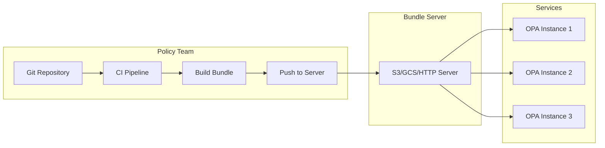
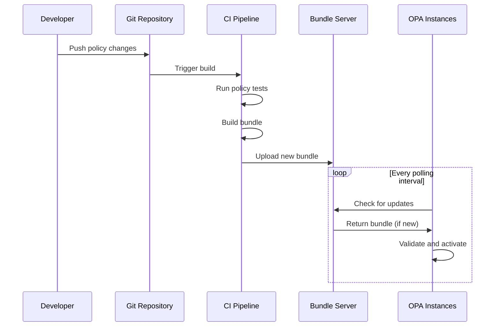

# How to Implement OPA Bundles

Author: [nawazdhandala](https://www.github.com/nawazdhandala)

Tags: OPA, Bundles, Policy-as-Code, DevOps, Kubernetes, Security

Description: Learn how to package, distribute, and update OPA policies at scale using bundles for centralized policy management.

---

Managing OPA policies across dozens of services and clusters becomes unwieldy fast. Bundles solve this by packaging policies into versioned artifacts that OPA instances pull automatically. This guide covers building, serving, and managing OPA bundles for production environments.

## What Are OPA Bundles?

Bundles are gzip-compressed tar archives containing:

- Rego policy files
- JSON/YAML data files
- A manifest file

OPA instances periodically fetch bundles from a server, enabling centralized policy updates without redeploying services.



## Bundle Structure

A typical bundle looks like this:

```
bundle/
  .manifest
  policy/
    authz/
      main.rego
      rbac.rego
    kubernetes/
      admission.rego
  data/
    roles.json
    permissions.json
```

### The Manifest File

The `.manifest` file defines bundle metadata:

```json
{
  "revision": "v1.2.3",
  "roots": ["policy", "data"],
  "wasm": [],
  "metadata": {
    "created_at": "2026-01-28T10:00:00Z",
    "created_by": "ci-pipeline"
  }
}
```

Key fields:
- **revision**: Version identifier for tracking updates
- **roots**: Namespaces this bundle owns (OPA rejects overlapping roots from multiple bundles)

## Building Bundles

### Manual Bundle Creation

```bash
# Create bundle directory structure
mkdir -p bundle/policy bundle/data

# Add policies
cat > bundle/policy/authz.rego << 'EOF'
package authz

import rego.v1

default allow := false

allow if {
    input.user.roles[_] == "admin"
}

allow if {
    input.user.roles[_] == data.required_roles[input.resource][input.action][_]
}
EOF

# Add data
cat > bundle/data/required_roles.json << 'EOF'
{
  "required_roles": {
    "documents": {
      "read": ["viewer", "editor", "admin"],
      "write": ["editor", "admin"],
      "delete": ["admin"]
    }
  }
}
EOF

# Create manifest
cat > bundle/.manifest << 'EOF'
{
  "revision": "v1.0.0",
  "roots": ["authz", "required_roles"]
}
EOF

# Build the bundle
tar -czvf bundle.tar.gz -C bundle .
```

### Using OPA to Build Bundles

OPA can build bundles directly:

```bash
# Build bundle from directory
opa build -b ./policy -o bundle.tar.gz

# Build with optimization (partial evaluation)
opa build -b ./policy -o bundle.tar.gz --optimize 1

# Build with signing
opa build -b ./policy -o bundle.tar.gz \
  --signing-key /path/to/private.key \
  --signing-alg RS256
```

### CI Pipeline for Bundle Building

```yaml
# .github/workflows/bundle.yaml
name: Build and Publish OPA Bundle

on:
  push:
    branches: [main]
    paths:
      - 'policies/**'
      - 'data/**'

jobs:
  build-bundle:
    runs-on: ubuntu-latest
    steps:
      - uses: actions/checkout@v4

      - name: Install OPA
        run: |
          curl -L -o opa https://openpolicyagent.org/downloads/latest/opa_linux_amd64
          chmod +x opa
          sudo mv opa /usr/local/bin/

      - name: Run Policy Tests
        run: opa test ./policies -v

      - name: Build Bundle
        run: |
          VERSION=$(git rev-parse --short HEAD)
          opa build -b ./policies -b ./data -o "bundle-${VERSION}.tar.gz"

          # Also create latest
          cp "bundle-${VERSION}.tar.gz" bundle-latest.tar.gz

      - name: Upload to S3
        env:
          AWS_ACCESS_KEY_ID: ${{ secrets.AWS_ACCESS_KEY_ID }}
          AWS_SECRET_ACCESS_KEY: ${{ secrets.AWS_SECRET_ACCESS_KEY }}
        run: |
          VERSION=$(git rev-parse --short HEAD)
          aws s3 cp "bundle-${VERSION}.tar.gz" s3://my-opa-bundles/
          aws s3 cp bundle-latest.tar.gz s3://my-opa-bundles/
```

## Serving Bundles

### Option 1: S3/GCS

Store bundles in cloud object storage:

```bash
# Upload to S3
aws s3 cp bundle.tar.gz s3://my-opa-bundles/bundle.tar.gz

# Upload to GCS
gsutil cp bundle.tar.gz gs://my-opa-bundles/bundle.tar.gz
```

### Option 2: HTTP Server

Use nginx or any HTTP server:

```nginx
# nginx.conf
server {
    listen 8080;

    location /bundles/ {
        alias /var/opa/bundles/;
        autoindex off;

        # Enable caching
        expires 5m;
        add_header Cache-Control "public, no-transform";
    }
}
```

### Option 3: OCI Registry

Push bundles to container registries:

```bash
# Using ORAS
oras push ghcr.io/myorg/opa-bundle:v1.0.0 \
  bundle.tar.gz:application/vnd.opa.bundle.layer.v1+gzip

# Pull the bundle
oras pull ghcr.io/myorg/opa-bundle:v1.0.0
```

## Configuring OPA to Use Bundles

### Basic Configuration

```yaml
# opa-config.yaml
services:
  bundle-server:
    url: https://bundle-server.example.com
    credentials:
      bearer:
        token: "${BUNDLE_TOKEN}"

bundles:
  authz:
    service: bundle-server
    resource: /bundles/authz/bundle.tar.gz
    polling:
      min_delay_seconds: 30
      max_delay_seconds: 120
```

### S3 Configuration

```yaml
# opa-config-s3.yaml
services:
  s3:
    url: https://my-opa-bundles.s3.amazonaws.com
    credentials:
      s3_signing:
        environment_credentials: {}

bundles:
  main:
    service: s3
    resource: bundle.tar.gz
    polling:
      min_delay_seconds: 60
      max_delay_seconds: 300
```

### Multiple Bundles

Load different bundles for different policy domains:

```yaml
# opa-config-multi.yaml
services:
  policy-server:
    url: https://policies.example.com

bundles:
  # Authorization policies
  authz:
    service: policy-server
    resource: /bundles/authz.tar.gz
    polling:
      min_delay_seconds: 60
      max_delay_seconds: 120

  # Kubernetes admission policies
  admission:
    service: policy-server
    resource: /bundles/admission.tar.gz
    polling:
      min_delay_seconds: 60
      max_delay_seconds: 120

  # Compliance policies
  compliance:
    service: policy-server
    resource: /bundles/compliance.tar.gz
    polling:
      min_delay_seconds: 300
      max_delay_seconds: 600
```

## Running OPA with Bundles

### Docker

```bash
docker run -d \
  --name opa \
  -p 8181:8181 \
  -v $(pwd)/opa-config.yaml:/config.yaml \
  -e BUNDLE_TOKEN=my-secret-token \
  openpolicyagent/opa:latest \
  run --server --config-file=/config.yaml
```

### Kubernetes Deployment

```yaml
# opa-deployment.yaml
apiVersion: apps/v1
kind: Deployment
metadata:
  name: opa
spec:
  replicas: 3
  selector:
    matchLabels:
      app: opa
  template:
    metadata:
      labels:
        app: opa
    spec:
      containers:
        - name: opa
          image: openpolicyagent/opa:latest
          args:
            - "run"
            - "--server"
            - "--addr=0.0.0.0:8181"
            - "--config-file=/config/config.yaml"
          ports:
            - containerPort: 8181
          volumeMounts:
            - name: config
              mountPath: /config
          env:
            - name: BUNDLE_TOKEN
              valueFrom:
                secretKeyRef:
                  name: opa-secrets
                  key: bundle-token
          livenessProbe:
            httpGet:
              path: /health
              port: 8181
            initialDelaySeconds: 5
          readinessProbe:
            httpGet:
              path: /health?bundles
              port: 8181
            initialDelaySeconds: 5
      volumes:
        - name: config
          configMap:
            name: opa-config
---
apiVersion: v1
kind: ConfigMap
metadata:
  name: opa-config
data:
  config.yaml: |
    services:
      bundle-server:
        url: https://policies.example.com
        credentials:
          bearer:
            token: "${BUNDLE_TOKEN}"

    bundles:
      main:
        service: bundle-server
        resource: /bundles/main.tar.gz
        polling:
          min_delay_seconds: 30
          max_delay_seconds: 120
```

## Bundle Signing and Verification

### Generate Signing Keys

```bash
# Generate RSA key pair
openssl genrsa -out private.pem 2048
openssl rsa -in private.pem -pubout -out public.pem
```

### Sign Bundles

```bash
# Build and sign
opa build -b ./policies \
  --signing-key private.pem \
  --signing-alg RS256 \
  -o signed-bundle.tar.gz
```

### Verify Bundles

Configure OPA to verify signatures:

```yaml
# opa-config-signed.yaml
services:
  bundle-server:
    url: https://policies.example.com

bundles:
  main:
    service: bundle-server
    resource: /bundles/signed-bundle.tar.gz
    signing:
      keyid: my-key

keys:
  my-key:
    algorithm: RS256
    key: |
      -----BEGIN PUBLIC KEY-----
      MIIBIjANBgkqhkiG9w0BAQEFAAOCAQ8AMIIBCgKCAQEA...
      -----END PUBLIC KEY-----
```

## Monitoring Bundle Updates

### Check Bundle Status

```bash
# Get bundle status via API
curl http://localhost:8181/v1/status | jq '.bundles'
```

Response:

```json
{
  "bundles": {
    "main": {
      "name": "main",
      "active_revision": "v1.2.3",
      "last_successful_download": "2026-01-28T10:30:00Z",
      "last_successful_activation": "2026-01-28T10:30:01Z"
    }
  }
}
```

### Health Checks

```bash
# Basic health
curl http://localhost:8181/health

# Health with bundle status
curl http://localhost:8181/health?bundles
```

### Prometheus Metrics

OPA exposes bundle metrics:

```
# Bundle download duration
opa_bundle_download_duration_seconds

# Bundle activation success/failure
opa_bundle_loaded_bytes
opa_bundle_last_successful_activation

# Bundle request count
opa_bundle_request_duration_seconds_count
```

## Bundle Update Workflow



## Rolling Back Bundles

### Version-Based Rollback

```bash
# Keep versioned bundles
aws s3 ls s3://my-opa-bundles/
# bundle-v1.0.0.tar.gz
# bundle-v1.1.0.tar.gz
# bundle-v1.2.0.tar.gz
# bundle-latest.tar.gz

# Rollback by updating latest symlink
aws s3 cp s3://my-opa-bundles/bundle-v1.1.0.tar.gz \
          s3://my-opa-bundles/bundle-latest.tar.gz
```

### Git-Based Rollback

```bash
# Revert the policy change in git
git revert HEAD

# CI will rebuild and push the previous version
git push origin main
```

## Best Practices

### 1. Use Semantic Versioning

```bash
# Tag releases
git tag v1.2.3
git push origin v1.2.3

# CI builds bundle with version
opa build -b ./policies -o "bundle-v1.2.3.tar.gz"
```

### 2. Separate Data from Policies

```
bundles/
  policies/        # Changes less frequently
    authz.rego
  data/            # Changes more frequently
    roles.json
```

### 3. Test Before Publishing

```bash
# Always run tests in CI
opa test ./policies -v

# Verify bundle can be loaded
opa run --server bundle.tar.gz &
curl http://localhost:8181/v1/data
```

### 4. Monitor Bundle Activation

Set up alerts for:
- Bundle download failures
- Activation failures
- Stale bundles (no updates in expected timeframe)

---

Bundles transform OPA from a per-service configuration into a centrally managed policy platform. Start with a single bundle, add signing for security, and expand to multiple bundles as your policy domains grow. The automation investment pays off when you can update authorization rules across your entire infrastructure with a single git push.
