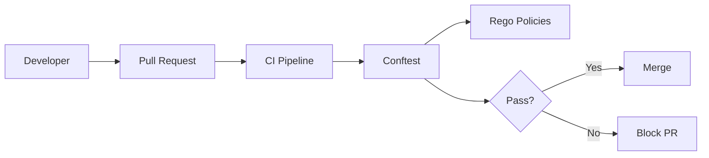
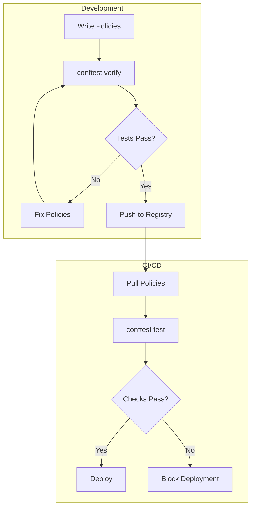

# How to Use OPA Conftest for Policy Testing

Author: [nawazdhandala](https://www.github.com/nawazdhandala)

Tags: OPA, Conftest, Policy Testing, DevOps, Security, CI/CD, Kubernetes

Description: Learn how to use Conftest to write and run policy tests against Kubernetes manifests, Terraform configs, and other structured data formats.

---

Conftest is a testing utility built on OPA that validates structured configuration files against policies written in Rego. It catches misconfigurations before they reach production by integrating policy checks into your CI/CD pipeline.

## Why Conftest?

Configuration files are code, and code needs tests. Conftest lets you:

- Enforce security baselines across all deployments
- Catch misconfigurations in pull requests
- Standardize resource configurations across teams
- Audit compliance automatically



## Installing Conftest

### macOS

```bash
brew install conftest
```

### Linux

```bash
LATEST=$(curl -s https://api.github.com/repos/open-policy-agent/conftest/releases/latest | grep tag_name | cut -d '"' -f 4 | sed 's/v//')
wget "https://github.com/open-policy-agent/conftest/releases/download/v${LATEST}/conftest_${LATEST}_Linux_x86_64.tar.gz"
tar xzf conftest_${LATEST}_Linux_x86_64.tar.gz
sudo mv conftest /usr/local/bin/
```

### Verify Installation

```bash
conftest --version
```

## Project Structure

Organize your policies in a `policy` directory:

```
project/
  policy/
    kubernetes.rego
    terraform.rego
    dockerfile.rego
  kubernetes/
    deployment.yaml
    service.yaml
  terraform/
    main.tf
```

## Writing Kubernetes Policies

### Basic Deny Rules

Create `policy/kubernetes.rego`:

```rego
# policy/kubernetes.rego
package main

import rego.v1

# Deny containers running as root
deny contains msg if {
    input.kind == "Deployment"
    container := input.spec.template.spec.containers[_]
    not container.securityContext.runAsNonRoot == true
    msg := sprintf("Container '%s' must set securityContext.runAsNonRoot to true", [container.name])
}

# Deny privileged containers
deny contains msg if {
    input.kind == "Deployment"
    container := input.spec.template.spec.containers[_]
    container.securityContext.privileged == true
    msg := sprintf("Container '%s' must not run in privileged mode", [container.name])
}

# Deny missing resource limits
deny contains msg if {
    input.kind == "Deployment"
    container := input.spec.template.spec.containers[_]
    not container.resources.limits
    msg := sprintf("Container '%s' must specify resource limits", [container.name])
}

# Deny missing resource requests
deny contains msg if {
    input.kind == "Deployment"
    container := input.spec.template.spec.containers[_]
    not container.resources.requests
    msg := sprintf("Container '%s' must specify resource requests", [container.name])
}
```

### Test Against a Manifest

Create a test deployment:

```yaml
# kubernetes/deployment.yaml
apiVersion: apps/v1
kind: Deployment
metadata:
  name: insecure-app
spec:
  replicas: 1
  selector:
    matchLabels:
      app: insecure
  template:
    metadata:
      labels:
        app: insecure
    spec:
      containers:
        - name: app
          image: nginx:latest
          # Missing: securityContext, resources
```

Run Conftest:

```bash
conftest test kubernetes/deployment.yaml
```

Output:

```
FAIL - kubernetes/deployment.yaml - main - Container 'app' must set securityContext.runAsNonRoot to true
FAIL - kubernetes/deployment.yaml - main - Container 'app' must specify resource limits
FAIL - kubernetes/deployment.yaml - main - Container 'app' must specify resource requests

3 tests, 0 passed, 0 warnings, 3 failures
```

## Warning Rules

Use `warn` for non-blocking suggestions:

```rego
# policy/kubernetes.rego
package main

import rego.v1

# Warn about latest tag usage
warn contains msg if {
    input.kind == "Deployment"
    container := input.spec.template.spec.containers[_]
    endswith(container.image, ":latest")
    msg := sprintf("Container '%s' uses 'latest' tag - consider using a specific version", [container.name])
}

# Warn about missing liveness probe
warn contains msg if {
    input.kind == "Deployment"
    container := input.spec.template.spec.containers[_]
    not container.livenessProbe
    msg := sprintf("Container '%s' has no liveness probe configured", [container.name])
}

# Warn about missing readiness probe
warn contains msg if {
    input.kind == "Deployment"
    container := input.spec.template.spec.containers[_]
    not container.readinessProbe
    msg := sprintf("Container '%s' has no readiness probe configured", [container.name])
}
```

## Testing Terraform Configurations

### Terraform Policy

Create `policy/terraform.rego`:

```rego
# policy/terraform.rego
package main

import rego.v1

# Deny public S3 buckets
deny contains msg if {
    resource := input.resource.aws_s3_bucket[name]
    resource.acl == "public-read"
    msg := sprintf("S3 bucket '%s' must not have public-read ACL", [name])
}

deny contains msg if {
    resource := input.resource.aws_s3_bucket[name]
    resource.acl == "public-read-write"
    msg := sprintf("S3 bucket '%s' must not have public-read-write ACL", [name])
}

# Deny unencrypted RDS instances
deny contains msg if {
    resource := input.resource.aws_db_instance[name]
    not resource.storage_encrypted == true
    msg := sprintf("RDS instance '%s' must have storage_encrypted enabled", [name])
}

# Deny EC2 instances without IMDSv2
deny contains msg if {
    resource := input.resource.aws_instance[name]
    not resource.metadata_options
    msg := sprintf("EC2 instance '%s' must configure metadata_options for IMDSv2", [name])
}

deny contains msg if {
    resource := input.resource.aws_instance[name]
    resource.metadata_options.http_tokens != "required"
    msg := sprintf("EC2 instance '%s' must require IMDSv2 (http_tokens = required)", [name])
}

# Deny security groups with 0.0.0.0/0 ingress on SSH
deny contains msg if {
    resource := input.resource.aws_security_group[name]
    ingress := resource.ingress[_]
    ingress.from_port <= 22
    ingress.to_port >= 22
    ingress.cidr_blocks[_] == "0.0.0.0/0"
    msg := sprintf("Security group '%s' allows SSH from 0.0.0.0/0", [name])
}
```

### Convert Terraform to JSON

Conftest works with JSON, so convert your Terraform:

```bash
# Convert HCL to JSON
terraform show -json plan.out > plan.json

# Or for .tf files
cat main.tf | conftest test --input hcl2 -
```

### Test Terraform Plan

```bash
# Generate plan
terraform plan -out=tfplan
terraform show -json tfplan > tfplan.json

# Test the plan
conftest test tfplan.json --policy policy/terraform.rego
```

## Testing Dockerfiles

### Dockerfile Policy

Create `policy/dockerfile.rego`:

```rego
# policy/dockerfile.rego
package main

import rego.v1

# Deny running as root
deny contains msg if {
    input[i].Cmd == "user"
    val := input[i].Value
    val[_] == "root"
    msg := "Dockerfile should not run as root user"
}

# Warn if no USER instruction
warn contains msg if {
    not user_defined
    msg := "Dockerfile does not specify a USER - will run as root"
}

user_defined if {
    input[_].Cmd == "user"
}

# Deny using latest tag in FROM
deny contains msg if {
    input[i].Cmd == "from"
    val := input[i].Value[0]
    endswith(val, ":latest")
    msg := sprintf("Base image '%s' uses latest tag - pin to specific version", [val])
}

deny contains msg if {
    input[i].Cmd == "from"
    val := input[i].Value[0]
    not contains(val, ":")
    msg := sprintf("Base image '%s' has no tag - pin to specific version", [val])
}

# Deny ADD when COPY would work (ADD has extra features that may be risky)
warn contains msg if {
    input[i].Cmd == "add"
    val := input[i].Value[0]
    not startswith(val, "http")
    not endswith(val, ".tar")
    not endswith(val, ".tar.gz")
    msg := "Use COPY instead of ADD for local files"
}

# Warn about apt-get without cleanup
warn contains msg if {
    input[i].Cmd == "run"
    val := concat(" ", input[i].Value)
    contains(val, "apt-get install")
    not contains(val, "rm -rf /var/lib/apt/lists")
    msg := "apt-get install should clean up /var/lib/apt/lists to reduce image size"
}
```

### Test Dockerfile

```bash
conftest test Dockerfile --parser dockerfile
```

## Multi-File Testing

Test multiple files at once:

```bash
# Test all YAML files in a directory
conftest test kubernetes/*.yaml

# Test with multiple policy directories
conftest test kubernetes/*.yaml --policy policy/ --policy custom-policy/

# Test different file types
conftest test \
  --policy policy/kubernetes.rego kubernetes/*.yaml \
  --policy policy/terraform.rego terraform/*.tf
```

## Output Formats

Conftest supports multiple output formats:

```bash
# Standard output (default)
conftest test deployment.yaml

# JSON output for CI/CD parsing
conftest test deployment.yaml --output json

# TAP format for test frameworks
conftest test deployment.yaml --output tap

# JUnit for Jenkins/CI integration
conftest test deployment.yaml --output junit
```

### JSON Output Example

```json
[
  {
    "filename": "deployment.yaml",
    "namespace": "main",
    "successes": 2,
    "failures": [
      {
        "msg": "Container 'app' must specify resource limits"
      }
    ],
    "warnings": [
      {
        "msg": "Container 'app' uses 'latest' tag"
      }
    ]
  }
]
```

## CI/CD Integration

### GitHub Actions

```yaml
# .github/workflows/conftest.yaml
name: Policy Tests

on:
  pull_request:
    paths:
      - 'kubernetes/**'
      - 'terraform/**'

jobs:
  conftest:
    runs-on: ubuntu-latest
    steps:
      - uses: actions/checkout@v4

      - name: Install Conftest
        run: |
          LATEST=$(curl -s https://api.github.com/repos/open-policy-agent/conftest/releases/latest | grep tag_name | cut -d '"' -f 4 | sed 's/v//')
          wget -q "https://github.com/open-policy-agent/conftest/releases/download/v${LATEST}/conftest_${LATEST}_Linux_x86_64.tar.gz"
          tar xzf conftest_${LATEST}_Linux_x86_64.tar.gz
          sudo mv conftest /usr/local/bin/

      - name: Test Kubernetes Manifests
        run: conftest test kubernetes/*.yaml --output github

      - name: Test Terraform
        run: |
          cd terraform
          terraform init
          terraform plan -out=tfplan
          terraform show -json tfplan > tfplan.json
          conftest test tfplan.json
```

### GitLab CI

```yaml
# .gitlab-ci.yml
conftest:
  image: openpolicyagent/conftest:latest
  stage: test
  script:
    - conftest test kubernetes/*.yaml --output junit > conftest-results.xml
  artifacts:
    reports:
      junit: conftest-results.xml
  only:
    changes:
      - kubernetes/**
      - policy/**
```

## Sharing Policies with Bundles

### Push Policies to OCI Registry

```bash
# Package and push policies
conftest push ghcr.io/myorg/policies:v1.0.0

# Pull policies in CI
conftest pull ghcr.io/myorg/policies:v1.0.0
conftest test deployment.yaml
```

### Policy Bundles Structure

```
policy-bundle/
  policy/
    kubernetes/
      security.rego
      resources.rego
    terraform/
      aws.rego
      security.rego
```

## Testing Your Policies

Write tests for your policies:

```rego
# policy/kubernetes_test.rego
package main

import rego.v1

# Test that secure deployments pass
test_secure_deployment_passes if {
    count(deny) == 0 with input as {
        "kind": "Deployment",
        "spec": {
            "template": {
                "spec": {
                    "containers": [{
                        "name": "app",
                        "image": "nginx:1.21.0",
                        "securityContext": {
                            "runAsNonRoot": true,
                            "privileged": false
                        },
                        "resources": {
                            "limits": {"cpu": "100m", "memory": "128Mi"},
                            "requests": {"cpu": "50m", "memory": "64Mi"}
                        }
                    }]
                }
            }
        }
    }
}

# Test that insecure deployments fail
test_privileged_container_denied if {
    count(deny) > 0 with input as {
        "kind": "Deployment",
        "spec": {
            "template": {
                "spec": {
                    "containers": [{
                        "name": "app",
                        "image": "nginx:1.21.0",
                        "securityContext": {
                            "privileged": true
                        }
                    }]
                }
            }
        }
    }
}
```

Run policy tests:

```bash
conftest verify --policy policy/
```

## Policy Verification Flow



---

Conftest brings the rigor of unit testing to configuration management. Start with a few critical security policies, expand coverage gradually, and integrate into your CI/CD pipeline. The goal is catching misconfigurations before they become incidents.
