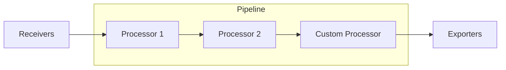
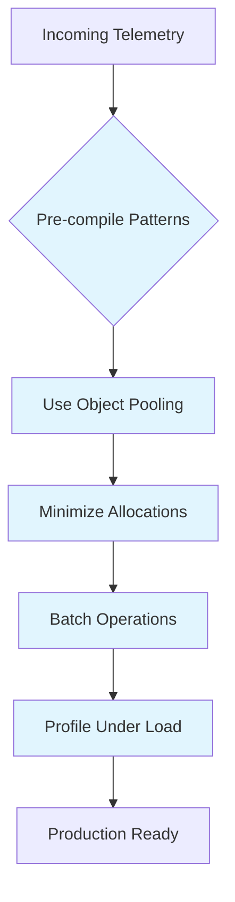

# How to Build OpenTelemetry Custom Processors

Author: [nawazdhandala](https://www.github.com/nawazdhandala)

Tags: OpenTelemetry, Observability, Custom Processors, Collector, Go, Telemetry Pipeline

Description: A practical guide to building custom processors for the OpenTelemetry Collector, enabling advanced data transformation, filtering, and enrichment in your telemetry pipeline.

---

The OpenTelemetry Collector comes with a rich set of built-in processors for common tasks like batching, filtering, and attribute manipulation. However, real-world observability requirements often demand custom logic that goes beyond what standard processors offer. Building custom processors gives you complete control over how telemetry data flows through your pipeline.

This guide walks through the architecture, implementation patterns, and best practices for creating production-ready custom processors.

## Understanding Processor Architecture

Before writing code, it helps to understand how processors fit into the Collector's data flow.



Processors operate on three signal types: traces, metrics, and logs. Each processor can handle one or more signal types, and they execute in the order defined in your pipeline configuration.

## Setting Up Your Development Environment

Start by creating a new Go module for your processor:

```bash
mkdir myprocessor
cd myprocessor
go mod init github.com/yourorg/myprocessor
```

Add the required OpenTelemetry dependencies:

```bash
go get go.opentelemetry.io/collector/component@latest
go get go.opentelemetry.io/collector/consumer@latest
go get go.opentelemetry.io/collector/processor@latest
go get go.opentelemetry.io/collector/pdata@latest
```

## Building a Trace Processor

Let's build a processor that adds deployment metadata to all spans based on service name patterns. This is useful when you have multiple environments or canary deployments.

### Define the Configuration

```go
// config.go
package deploymentprocessor

import (
    "go.opentelemetry.io/collector/component"
)

// Config holds the configuration for the deployment processor
type Config struct {
    // ServicePatterns maps regex patterns to deployment metadata
    ServicePatterns map[string]DeploymentInfo `mapstructure:"service_patterns"`

    // DefaultDeployment is used when no pattern matches
    DefaultDeployment DeploymentInfo `mapstructure:"default_deployment"`
}

// DeploymentInfo contains metadata to add to spans
type DeploymentInfo struct {
    Environment string `mapstructure:"environment"`
    Region      string `mapstructure:"region"`
    Version     string `mapstructure:"version"`
    Canary      bool   `mapstructure:"canary"`
}

// Validate checks if the configuration is valid
func (cfg *Config) Validate() error {
    // Add validation logic here
    return nil
}

var _ component.Config = (*Config)(nil)
```

### Implement the Factory

The factory creates processor instances and defines default configuration:

```go
// factory.go
package deploymentprocessor

import (
    "context"

    "go.opentelemetry.io/collector/component"
    "go.opentelemetry.io/collector/consumer"
    "go.opentelemetry.io/collector/processor"
)

const (
    typeStr   = "deployment"
    stability = component.StabilityLevelDevelopment
)

// NewFactory creates a new processor factory
func NewFactory() processor.Factory {
    return processor.NewFactory(
        component.MustNewType(typeStr),
        createDefaultConfig,
        processor.WithTraces(createTracesProcessor, stability),
    )
}

func createDefaultConfig() component.Config {
    return &Config{
        ServicePatterns: make(map[string]DeploymentInfo),
        DefaultDeployment: DeploymentInfo{
            Environment: "unknown",
            Region:      "unknown",
        },
    }
}

func createTracesProcessor(
    ctx context.Context,
    set processor.Settings,
    cfg component.Config,
    nextConsumer consumer.Traces,
) (processor.Traces, error) {
    processorCfg := cfg.(*Config)
    return newDeploymentProcessor(set.Logger, processorCfg, nextConsumer)
}
```

### Implement the Processor Logic

```go
// processor.go
package deploymentprocessor

import (
    "context"
    "regexp"
    "sync"

    "go.opentelemetry.io/collector/consumer"
    "go.opentelemetry.io/collector/pdata/pcommon"
    "go.opentelemetry.io/collector/pdata/ptrace"
    "go.uber.org/zap"
)

type deploymentProcessor struct {
    logger       *zap.Logger
    config       *Config
    nextConsumer consumer.Traces

    // Compiled regex patterns for efficiency
    patterns     map[*regexp.Regexp]DeploymentInfo
    patternsMu   sync.RWMutex
}

func newDeploymentProcessor(
    logger *zap.Logger,
    config *Config,
    nextConsumer consumer.Traces,
) (*deploymentProcessor, error) {
    dp := &deploymentProcessor{
        logger:       logger,
        config:       config,
        nextConsumer: nextConsumer,
        patterns:     make(map[*regexp.Regexp]DeploymentInfo),
    }

    // Pre-compile regex patterns
    for pattern, info := range config.ServicePatterns {
        compiled, err := regexp.Compile(pattern)
        if err != nil {
            return nil, err
        }
        dp.patterns[compiled] = info
    }

    return dp, nil
}

// Capabilities returns the consumer capabilities
func (dp *deploymentProcessor) Capabilities() consumer.Capabilities {
    return consumer.Capabilities{MutatesData: true}
}

// ConsumeTraces processes trace data
func (dp *deploymentProcessor) ConsumeTraces(ctx context.Context, td ptrace.Traces) error {
    resourceSpans := td.ResourceSpans()

    for i := 0; i < resourceSpans.Len(); i++ {
        rs := resourceSpans.At(i)
        resource := rs.Resource()

        // Get service name from resource attributes
        serviceName := ""
        if val, ok := resource.Attributes().Get("service.name"); ok {
            serviceName = val.Str()
        }

        // Find matching deployment info
        deploymentInfo := dp.findDeploymentInfo(serviceName)

        // Add deployment attributes to all spans in this resource
        scopeSpans := rs.ScopeSpans()
        for j := 0; j < scopeSpans.Len(); j++ {
            spans := scopeSpans.At(j).Spans()
            for k := 0; k < spans.Len(); k++ {
                dp.enrichSpan(spans.At(k), deploymentInfo)
            }
        }
    }

    return dp.nextConsumer.ConsumeTraces(ctx, td)
}

func (dp *deploymentProcessor) findDeploymentInfo(serviceName string) DeploymentInfo {
    dp.patternsMu.RLock()
    defer dp.patternsMu.RUnlock()

    for pattern, info := range dp.patterns {
        if pattern.MatchString(serviceName) {
            dp.logger.Debug("matched service pattern",
                zap.String("service", serviceName),
                zap.String("pattern", pattern.String()),
            )
            return info
        }
    }

    return dp.config.DefaultDeployment
}

func (dp *deploymentProcessor) enrichSpan(span ptrace.Span, info DeploymentInfo) {
    attrs := span.Attributes()
    attrs.PutStr("deployment.environment", info.Environment)
    attrs.PutStr("deployment.region", info.Region)

    if info.Version != "" {
        attrs.PutStr("deployment.version", info.Version)
    }

    if info.Canary {
        attrs.PutBool("deployment.canary", true)
    }
}

// Start is called when the processor starts
func (dp *deploymentProcessor) Start(ctx context.Context, host component.Host) error {
    dp.logger.Info("deployment processor started")
    return nil
}

// Shutdown is called when the processor stops
func (dp *deploymentProcessor) Shutdown(ctx context.Context) error {
    dp.logger.Info("deployment processor stopped")
    return nil
}
```

## Building a Metrics Processor

Let's create a processor that calculates derived metrics from existing ones. This example computes error rates from request count and error count metrics.

```go
// metrics_processor.go
package errorrateprocessor

import (
    "context"
    "strings"
    "sync"
    "time"

    "go.opentelemetry.io/collector/consumer"
    "go.opentelemetry.io/collector/pdata/pcommon"
    "go.opentelemetry.io/collector/pdata/pmetric"
    "go.uber.org/zap"
)

type errorRateProcessor struct {
    logger       *zap.Logger
    nextConsumer consumer.Metrics

    // Cache for computing rates
    requestCounts map[string]float64
    errorCounts   map[string]float64
    mu            sync.Mutex
}

func (erp *errorRateProcessor) ConsumeMetrics(ctx context.Context, md pmetric.Metrics) error {
    erp.mu.Lock()
    defer erp.mu.Unlock()

    resourceMetrics := md.ResourceMetrics()

    for i := 0; i < resourceMetrics.Len(); i++ {
        rm := resourceMetrics.At(i)
        scopeMetrics := rm.ScopeMetrics()

        for j := 0; j < scopeMetrics.Len(); j++ {
            sm := scopeMetrics.At(j)
            metrics := sm.Metrics()

            // First pass: collect counts
            for k := 0; k < metrics.Len(); k++ {
                metric := metrics.At(k)
                erp.processMetric(metric)
            }

            // Second pass: add derived error rate metrics
            erp.addDerivedMetrics(sm)
        }
    }

    return erp.nextConsumer.ConsumeMetrics(ctx, md)
}

func (erp *errorRateProcessor) processMetric(metric pmetric.Metric) {
    name := metric.Name()

    // Look for request and error count metrics
    if strings.HasSuffix(name, ".request.count") {
        erp.extractCounterValue(metric, erp.requestCounts)
    } else if strings.HasSuffix(name, ".error.count") {
        erp.extractCounterValue(metric, erp.errorCounts)
    }
}

func (erp *errorRateProcessor) extractCounterValue(metric pmetric.Metric, cache map[string]float64) {
    if metric.Type() != pmetric.MetricTypeSum {
        return
    }

    sum := metric.Sum()
    dataPoints := sum.DataPoints()

    for i := 0; i < dataPoints.Len(); i++ {
        dp := dataPoints.At(i)
        key := erp.buildKey(metric.Name(), dp.Attributes())

        switch dp.ValueType() {
        case pmetric.NumberDataPointValueTypeDouble:
            cache[key] = dp.DoubleValue()
        case pmetric.NumberDataPointValueTypeInt:
            cache[key] = float64(dp.IntValue())
        }
    }
}

func (erp *errorRateProcessor) buildKey(name string, attrs pcommon.Map) string {
    // Build a unique key from metric name and attributes
    var sb strings.Builder
    sb.WriteString(name)

    attrs.Range(func(k string, v pcommon.Value) bool {
        sb.WriteString("|")
        sb.WriteString(k)
        sb.WriteString("=")
        sb.WriteString(v.AsString())
        return true
    })

    return sb.String()
}

func (erp *errorRateProcessor) addDerivedMetrics(sm pmetric.ScopeMetrics) {
    // Calculate error rates where we have both request and error counts
    for requestKey, requestCount := range erp.requestCounts {
        // Convert request key to error key
        errorKey := strings.Replace(requestKey, ".request.count", ".error.count", 1)

        if errorCount, ok := erp.errorCounts[errorKey]; ok && requestCount > 0 {
            errorRate := (errorCount / requestCount) * 100.0

            // Create a new gauge metric for error rate
            newMetric := sm.Metrics().AppendEmpty()
            newMetric.SetName(strings.Replace(
                strings.Split(requestKey, "|")[0],
                ".request.count",
                ".error.rate",
                1,
            ))
            newMetric.SetUnit("%")
            newMetric.SetDescription("Calculated error rate percentage")

            gauge := newMetric.SetEmptyGauge()
            dp := gauge.DataPoints().AppendEmpty()
            dp.SetDoubleValue(errorRate)
            dp.SetTimestamp(pcommon.NewTimestampFromTime(time.Now()))

            erp.logger.Debug("created error rate metric",
                zap.Float64("rate", errorRate),
                zap.Float64("requests", requestCount),
                zap.Float64("errors", errorCount),
            )
        }
    }
}
```

## Building a Log Processor

Here's a processor that extracts structured data from log messages and adds them as attributes:

```go
// log_processor.go
package logparserprocessor

import (
    "context"
    "encoding/json"
    "regexp"

    "go.opentelemetry.io/collector/consumer"
    "go.opentelemetry.io/collector/pdata/plog"
    "go.uber.org/zap"
)

type Config struct {
    // Patterns to extract from log body
    Patterns []PatternConfig `mapstructure:"patterns"`

    // ParseJSON attempts to parse JSON log bodies
    ParseJSON bool `mapstructure:"parse_json"`
}

type PatternConfig struct {
    Name    string `mapstructure:"name"`
    Pattern string `mapstructure:"pattern"`
    Target  string `mapstructure:"target"` // attribute name for extracted value
}

type logParserProcessor struct {
    logger       *zap.Logger
    config       *Config
    nextConsumer consumer.Logs
    patterns     []compiledPattern
}

type compiledPattern struct {
    name    string
    regex   *regexp.Regexp
    target  string
}

func (lpp *logParserProcessor) ConsumeLogs(ctx context.Context, ld plog.Logs) error {
    resourceLogs := ld.ResourceLogs()

    for i := 0; i < resourceLogs.Len(); i++ {
        rl := resourceLogs.At(i)
        scopeLogs := rl.ScopeLogs()

        for j := 0; j < scopeLogs.Len(); j++ {
            logs := scopeLogs.At(j).LogRecords()

            for k := 0; k < logs.Len(); k++ {
                lpp.processLogRecord(logs.At(k))
            }
        }
    }

    return lpp.nextConsumer.ConsumeLogs(ctx, ld)
}

func (lpp *logParserProcessor) processLogRecord(lr plog.LogRecord) {
    body := lr.Body().AsString()
    attrs := lr.Attributes()

    // Try JSON parsing first
    if lpp.config.ParseJSON {
        var jsonData map[string]interface{}
        if err := json.Unmarshal([]byte(body), &jsonData); err == nil {
            lpp.flattenJSON("", jsonData, attrs)
            return
        }
    }

    // Apply regex patterns
    for _, pattern := range lpp.patterns {
        matches := pattern.regex.FindStringSubmatch(body)
        if len(matches) > 1 {
            // Use first capture group
            attrs.PutStr(pattern.target, matches[1])
            lpp.logger.Debug("extracted pattern",
                zap.String("pattern", pattern.name),
                zap.String("value", matches[1]),
            )
        }
    }
}

func (lpp *logParserProcessor) flattenJSON(prefix string, data map[string]interface{}, attrs plog.LogRecord) {
    // Implementation flattens nested JSON into dot-notation attributes
    // e.g., {"user": {"id": 123}} becomes "user.id" = "123"
}
```

## Building Your Custom Collector

To use your custom processor, you need to build a custom Collector distribution:

```go
// main.go
package main

import (
    "log"

    "go.opentelemetry.io/collector/component"
    "go.opentelemetry.io/collector/otelcol"

    // Standard components
    "go.opentelemetry.io/collector/receiver/otlpreceiver"
    "go.opentelemetry.io/collector/exporter/otlpexporter"
    "go.opentelemetry.io/collector/processor/batchprocessor"

    // Your custom processor
    "github.com/yourorg/deploymentprocessor"
)

func main() {
    factories, err := components()
    if err != nil {
        log.Fatalf("failed to build components: %v", err)
    }

    info := component.BuildInfo{
        Command:     "custom-collector",
        Description: "Custom OpenTelemetry Collector",
        Version:     "1.0.0",
    }

    settings := otelcol.CollectorSettings{
        BuildInfo: info,
        Factories: factories,
    }

    cmd := otelcol.NewCommand(settings)
    if err := cmd.Execute(); err != nil {
        log.Fatalf("collector failed: %v", err)
    }
}

func components() (otelcol.Factories, error) {
    var err error
    factories := otelcol.Factories{}

    factories.Receivers, err = component.MakeReceiverFactoryMap(
        otlpreceiver.NewFactory(),
    )
    if err != nil {
        return otelcol.Factories{}, err
    }

    factories.Processors, err = component.MakeProcessorFactoryMap(
        batchprocessor.NewFactory(),
        deploymentprocessor.NewFactory(), // Your custom processor
    )
    if err != nil {
        return otelcol.Factories{}, err
    }

    factories.Exporters, err = component.MakeExporterFactoryMap(
        otlpexporter.NewFactory(),
    )
    if err != nil {
        return otelcol.Factories{}, err
    }

    return factories, nil
}
```

## Configuration Example

Once built, configure your processor in the Collector config:

```yaml
receivers:
  otlp:
    protocols:
      grpc:
        endpoint: 0.0.0.0:4317
      http:
        endpoint: 0.0.0.0:4318

processors:
  batch:
    send_batch_size: 512
    timeout: 5s

  deployment:
    service_patterns:
      ".*-canary$":
        environment: production
        region: us-east-1
        canary: true
      ".*-staging$":
        environment: staging
        region: us-west-2
      "payment-.*":
        environment: production
        region: us-east-1
        version: "2.1.0"
    default_deployment:
      environment: production
      region: us-east-1

exporters:
  otlphttp:
    endpoint: "https://oneuptime.com/otlp"
    encoding: json
    headers:
      "x-oneuptime-token": "${ONEUPTIME_TOKEN}"

service:
  pipelines:
    traces:
      receivers: [otlp]
      processors: [deployment, batch]
      exporters: [otlphttp]
```

## Testing Your Processor

Write comprehensive tests for your processor:

```go
// processor_test.go
package deploymentprocessor

import (
    "context"
    "testing"

    "github.com/stretchr/testify/assert"
    "github.com/stretchr/testify/require"
    "go.opentelemetry.io/collector/consumer/consumertest"
    "go.opentelemetry.io/collector/pdata/ptrace"
    "go.uber.org/zap"
)

func TestDeploymentProcessor(t *testing.T) {
    config := &Config{
        ServicePatterns: map[string]DeploymentInfo{
            ".*-canary$": {
                Environment: "production",
                Canary:      true,
            },
        },
        DefaultDeployment: DeploymentInfo{
            Environment: "unknown",
        },
    }

    sink := new(consumertest.TracesSink)
    processor, err := newDeploymentProcessor(zap.NewNop(), config, sink)
    require.NoError(t, err)

    // Create test traces
    td := ptrace.NewTraces()
    rs := td.ResourceSpans().AppendEmpty()
    rs.Resource().Attributes().PutStr("service.name", "checkout-canary")

    span := rs.ScopeSpans().AppendEmpty().Spans().AppendEmpty()
    span.SetName("test-span")

    // Process traces
    err = processor.ConsumeTraces(context.Background(), td)
    require.NoError(t, err)

    // Verify results
    require.Equal(t, 1, sink.SpanCount())

    processedSpan := sink.AllTraces()[0].ResourceSpans().At(0).ScopeSpans().At(0).Spans().At(0)

    env, ok := processedSpan.Attributes().Get("deployment.environment")
    assert.True(t, ok)
    assert.Equal(t, "production", env.Str())

    canary, ok := processedSpan.Attributes().Get("deployment.canary")
    assert.True(t, ok)
    assert.True(t, canary.Bool())
}

func BenchmarkDeploymentProcessor(b *testing.B) {
    config := &Config{
        ServicePatterns: map[string]DeploymentInfo{
            "service-[0-9]+": {Environment: "prod"},
        },
        DefaultDeployment: DeploymentInfo{Environment: "unknown"},
    }

    sink := new(consumertest.TracesSink)
    processor, _ := newDeploymentProcessor(zap.NewNop(), config, sink)

    td := createTestTraces(100) // Helper to create 100 spans

    b.ResetTimer()
    for i := 0; i < b.N; i++ {
        _ = processor.ConsumeTraces(context.Background(), td)
    }
}
```

## Performance Considerations

When building production processors, keep these guidelines in mind:



**Key optimizations:**

1. Pre-compile regex patterns during initialization, not per-request
2. Use sync.Pool for frequently allocated objects
3. Avoid string concatenation in hot paths - use strings.Builder
4. Process data in place when possible rather than creating copies
5. Use buffered channels for async operations
6. Profile with pprof under realistic load

## Error Handling Best Practices

Processors should handle errors gracefully without dropping telemetry:

```go
func (dp *deploymentProcessor) ConsumeTraces(ctx context.Context, td ptrace.Traces) error {
    // Always attempt to forward data, even if processing fails partially
    var processingErrors []error

    resourceSpans := td.ResourceSpans()
    for i := 0; i < resourceSpans.Len(); i++ {
        if err := dp.processResourceSpan(resourceSpans.At(i)); err != nil {
            processingErrors = append(processingErrors, err)
            dp.logger.Warn("failed to process resource span",
                zap.Int("index", i),
                zap.Error(err),
            )
            // Continue processing other spans
        }
    }

    // Always forward to next consumer
    if err := dp.nextConsumer.ConsumeTraces(ctx, td); err != nil {
        return err
    }

    // Log but don't fail on processing errors
    if len(processingErrors) > 0 {
        dp.logger.Warn("some spans had processing errors",
            zap.Int("error_count", len(processingErrors)),
        )
    }

    return nil
}
```

---

Building custom processors unlocks the full potential of OpenTelemetry's extensible architecture. Whether you need specialized data transformation, business logic enrichment, or integration with proprietary systems, custom processors provide a clean, maintainable way to extend your telemetry pipeline. Start with simple processors, write thorough tests, and profile under load before deploying to production.
