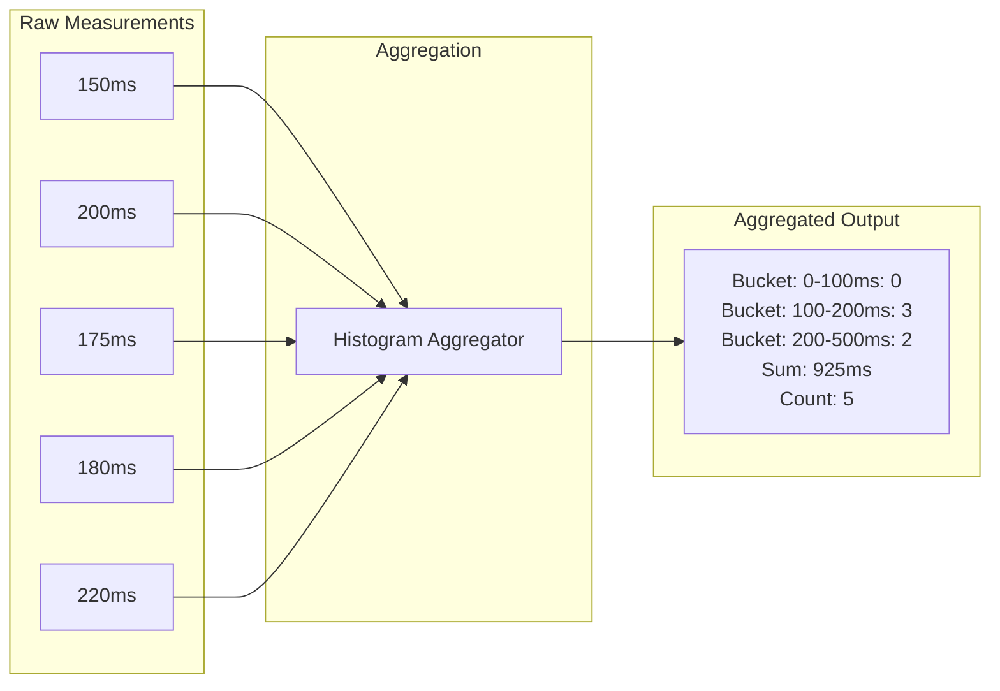
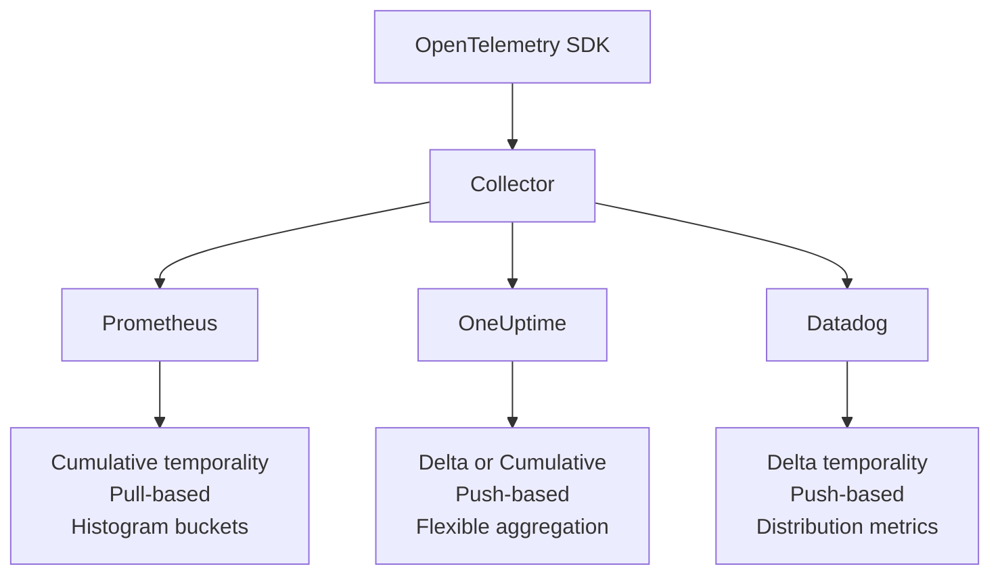

# How to Implement OpenTelemetry Metric Aggregation

Author: [nawazdhandala](https://www.github.com/nawazdhandala)

Tags: OpenTelemetry, Metrics, Aggregation, Observability, Collector, Prometheus, Performance Monitoring

Description: Learn how to implement metric aggregation in OpenTelemetry to reduce cardinality, optimize storage costs, and create meaningful derived metrics from raw telemetry data.

---

Metrics are the backbone of production monitoring. But raw metrics at high cardinality can quickly overwhelm storage systems and make dashboards unusable. OpenTelemetry provides powerful aggregation capabilities that let you transform raw measurements into actionable, cost-effective metrics.

This guide covers aggregation strategies at both the SDK level and in the Collector, with practical examples you can apply immediately.

## Understanding Metric Aggregation

Aggregation transforms individual measurements into statistical summaries. Instead of storing every single HTTP request latency value, you store aggregated views like histograms, averages, or percentiles.



## SDK-Level Aggregation

The OpenTelemetry SDK performs aggregation before exporting metrics. You can configure aggregation through Views.

### Configuring Views in Node.js

```javascript
// metrics-setup.js
const { MeterProvider, View, Aggregation } = require('@opentelemetry/sdk-metrics');
const { OTLPMetricExporter } = require('@opentelemetry/exporter-metrics-otlp-http');
const { Resource } = require('@opentelemetry/resources');

// Define custom histogram bucket boundaries for latency metrics
const latencyView = new View({
  instrumentName: 'http.server.duration',
  instrumentType: 'Histogram',
  aggregation: Aggregation.ExplicitBucketHistogram({
    boundaries: [5, 10, 25, 50, 100, 250, 500, 1000, 2500, 5000, 10000]
  })
});

// Aggregate request counts with specific attributes only
const requestCountView = new View({
  instrumentName: 'http.server.request.count',
  // Only keep these attributes, drop all others
  attributeKeys: ['http.method', 'http.status_code', 'http.route']
});

// Create custom aggregation for memory metrics
const memoryView = new View({
  instrumentName: 'process.memory.*',
  instrumentType: 'Gauge',
  aggregation: Aggregation.LastValue()
});

const meterProvider = new MeterProvider({
  resource: new Resource({
    'service.name': 'order-service',
    'deployment.environment': process.env.NODE_ENV
  }),
  views: [latencyView, requestCountView, memoryView],
  readers: [
    new PeriodicExportingMetricReader({
      exporter: new OTLPMetricExporter({
        url: process.env.OTEL_EXPORTER_OTLP_ENDPOINT + '/v1/metrics'
      }),
      exportIntervalMillis: 15000
    })
  ]
});

module.exports = { meterProvider };
```

### Configuring Views in Python

```python
# metrics_config.py
from opentelemetry import metrics
from opentelemetry.sdk.metrics import MeterProvider
from opentelemetry.sdk.metrics.export import PeriodicExportingMetricReader
from opentelemetry.sdk.metrics.view import View, ExplicitBucketHistogramAggregation
from opentelemetry.exporter.otlp.proto.grpc.metric_exporter import OTLPMetricExporter

# Custom histogram boundaries for database query latencies
db_latency_view = View(
    instrument_name="db.query.duration",
    aggregation=ExplicitBucketHistogramAggregation(
        boundaries=[1, 5, 10, 25, 50, 100, 250, 500, 1000, 5000]
    )
)

# Drop high-cardinality attributes from cache metrics
cache_view = View(
    instrument_name="cache.*",
    attribute_keys=["cache.type", "cache.hit"]  # Keep only these
)

# Configure the meter provider with views
exporter = OTLPMetricExporter(endpoint="localhost:4317", insecure=True)
reader = PeriodicExportingMetricReader(exporter, export_interval_millis=10000)

provider = MeterProvider(
    metric_readers=[reader],
    views=[db_latency_view, cache_view]
)
metrics.set_meter_provider(provider)

# Now create metrics
meter = metrics.get_meter("order-service")

# This histogram will use our custom bucket boundaries
db_duration = meter.create_histogram(
    name="db.query.duration",
    description="Database query latency",
    unit="ms"
)

# Record a measurement
db_duration.record(42.5, {"db.operation": "SELECT", "db.table": "orders"})
```

### Configuring Views in Go

```go
// metrics.go
package main

import (
    "context"
    "time"

    "go.opentelemetry.io/otel"
    "go.opentelemetry.io/otel/exporters/otlp/otlpmetric/otlpmetricgrpc"
    "go.opentelemetry.io/otel/sdk/metric"
    "go.opentelemetry.io/otel/sdk/resource"
    semconv "go.opentelemetry.io/otel/semconv/v1.21.0"
)

func initMetrics() (*metric.MeterProvider, error) {
    ctx := context.Background()

    exporter, err := otlpmetricgrpc.New(ctx,
        otlpmetricgrpc.WithEndpoint("localhost:4317"),
        otlpmetricgrpc.WithInsecure(),
    )
    if err != nil {
        return nil, err
    }

    res, _ := resource.New(ctx,
        resource.WithAttributes(
            semconv.ServiceName("payment-service"),
            semconv.DeploymentEnvironment("production"),
        ),
    )

    // Define custom histogram boundaries for payment processing times
    paymentLatencyView := metric.NewView(
        metric.Instrument{
            Name: "payment.process.duration",
            Kind: metric.InstrumentKindHistogram,
        },
        metric.Stream{
            Aggregation: metric.AggregationExplicitBucketHistogram{
                Boundaries: []float64{10, 25, 50, 100, 250, 500, 1000, 2500, 5000},
            },
        },
    )

    // Reduce cardinality by dropping user_id from metrics
    userMetricsView := metric.NewView(
        metric.Instrument{
            Name: "user.*",
        },
        metric.Stream{
            // Only keep these attributes
            AttributeFilter: func(kv attribute.KeyValue) bool {
                allowedKeys := map[string]bool{
                    "user.type":   true,
                    "user.region": true,
                }
                return allowedKeys[string(kv.Key)]
            },
        },
    )

    provider := metric.NewMeterProvider(
        metric.WithResource(res),
        metric.WithReader(metric.NewPeriodicReader(exporter,
            metric.WithInterval(15*time.Second),
        )),
        metric.WithView(paymentLatencyView, userMetricsView),
    )

    otel.SetMeterProvider(provider)
    return provider, nil
}
```

## Collector-Level Aggregation

The OpenTelemetry Collector can perform additional aggregation after receiving metrics from your applications.

### Using the Metrics Transform Processor

```yaml
# collector-config.yaml
receivers:
  otlp:
    protocols:
      grpc:
        endpoint: 0.0.0.0:4317
      http:
        endpoint: 0.0.0.0:4318

processors:
  # Batch metrics for efficient export
  batch:
    send_batch_size: 1000
    timeout: 10s

  # Transform and aggregate metrics
  metricstransform:
    transforms:
      # Aggregate HTTP metrics by removing high-cardinality labels
      - include: http.server.duration
        action: update
        operations:
          # Remove user_id and session_id labels
          - action: delete_label_value
            label: user_id
          - action: delete_label_value
            label: session_id

      # Combine multiple metrics into one
      - include: ^(http_requests_total|grpc_requests_total)$
        match_type: regexp
        action: combine
        new_name: requests_total
        submatch_case: lower
        operations:
          - action: add_label
            new_label: protocol
            new_value: "{{.OriginalName}}"

      # Create aggregated service-level metrics
      - include: http.server.request.count
        action: insert
        new_name: service.request.rate
        operations:
          - action: aggregate_labels
            label_set: [service.name, deployment.environment]
            aggregation_type: sum

  # Group metrics by attributes for efficient storage
  groupbyattrs:
    keys:
      - service.name
      - deployment.environment
      - host.name

exporters:
  otlphttp:
    endpoint: "https://oneuptime.com/otlp"
    encoding: json
    headers:
      "x-oneuptime-token": "${ONEUPTIME_TOKEN}"

  prometheus:
    endpoint: "0.0.0.0:8889"
    namespace: myapp

service:
  pipelines:
    metrics:
      receivers: [otlp]
      processors: [metricstransform, groupbyattrs, batch]
      exporters: [otlphttp, prometheus]
```

### Advanced Aggregation with the Aggregate Processor

For more complex aggregation scenarios, use a custom processor or the aggregate processor:

```yaml
processors:
  # Experimental aggregate processor
  experimental_metricsgeneration:
    rules:
      # Calculate error rate from request and error counts
      - name: http.error.rate
        type: calculate
        metric1: http.server.error.count
        metric2: http.server.request.count
        operation: divide

      # Calculate average latency
      - name: http.latency.avg
        type: calculate
        metric1: http.server.duration.sum
        metric2: http.server.duration.count
        operation: divide
```

## Temporal Aggregation Strategies

Choose the right aggregation temporality based on your use case:

```mermaid
flowchart TD
    subgraph Cumulative Temporality
        C1[T1: Count=10] --> C2[T2: Count=25]
        C2 --> C3[T3: Count=42]
    end

    subgraph Delta Temporality
        D1[T1: Delta=10] --> D2[T2: Delta=15]
        D2 --> D3[T3: Delta=17]
    end

    Note1[Cumulative: Total since start\nBetter for Prometheus] --- Cumulative Temporality
    Note2[Delta: Change since last export\nBetter for streaming systems] --- Delta Temporality
```

### Configuring Temporality

```javascript
// Node.js: Configure delta temporality for specific metrics
const { AggregationTemporality } = require('@opentelemetry/sdk-metrics');

const exporter = new OTLPMetricExporter({
  url: 'http://localhost:4318/v1/metrics',
  temporalityPreference: AggregationTemporality.DELTA
});

// Or configure per-instrument-type
const customExporter = new OTLPMetricExporter({
  url: 'http://localhost:4318/v1/metrics',
  temporalitySelector: (instrumentType) => {
    switch (instrumentType) {
      case InstrumentType.COUNTER:
      case InstrumentType.HISTOGRAM:
        return AggregationTemporality.DELTA;
      default:
        return AggregationTemporality.CUMULATIVE;
    }
  }
});
```

## Cardinality Management

High cardinality is the enemy of metric systems. Here's how to manage it effectively:

### Attribute Filtering

```javascript
// Filter out high-cardinality attributes at instrumentation time
const meter = meterProvider.getMeter('api-service');

const requestCounter = meter.createCounter('http.requests', {
  description: 'Total HTTP requests'
});

function recordRequest(req, res) {
  // Good: bounded cardinality
  const attributes = {
    'http.method': req.method,
    'http.route': normalizeRoute(req.path),  // /users/:id not /users/12345
    'http.status_code': Math.floor(res.statusCode / 100) * 100  // 200, 300, 400, 500
  };

  // Bad: unbounded cardinality - don't do this
  // attributes['user.id'] = req.userId;
  // attributes['request.id'] = req.id;

  requestCounter.add(1, attributes);
}

function normalizeRoute(path) {
  // Convert /users/12345 to /users/:id
  return path
    .replace(/\/\d+/g, '/:id')
    .replace(/\/[a-f0-9-]{36}/g, '/:uuid');
}
```

### Cardinality Limits in Views

```python
# Python: Limit cardinality through views
from opentelemetry.sdk.metrics.view import View

# Only allow specific attribute values
allowed_status_view = View(
    instrument_name="http.server.request.count",
    attribute_keys=["http.method", "http.status_code"],
    # Further limit by only keeping certain status codes
)

# Or use the collector's filter processor
```

### Collector-Level Cardinality Control

```yaml
processors:
  filter:
    metrics:
      # Drop metrics with too many unique label combinations
      exclude:
        match_type: expr
        expressions:
          - 'Label("user_id") != ""'
          - 'Label("session_id") != ""'
          - 'Label("request_id") != ""'

  attributes:
    actions:
      # Hash high-cardinality values to reduce uniqueness
      - key: client.ip
        action: hash
      # Truncate long values
      - key: http.url
        action: truncate
        max_length: 100
```

## Creating Derived Metrics

Derive new metrics from existing ones for deeper insights:

```go
// Go: Create derived metrics programmatically
package metrics

import (
    "context"
    "sync"
    "time"

    "go.opentelemetry.io/otel"
    "go.opentelemetry.io/otel/metric"
)

type DerivedMetrics struct {
    meter          metric.Meter
    requestCount   metric.Int64Counter
    errorCount     metric.Int64Counter
    errorRateGauge metric.Float64ObservableGauge

    mu            sync.RWMutex
    totalRequests int64
    totalErrors   int64
}

func NewDerivedMetrics() *DerivedMetrics {
    meter := otel.Meter("derived-metrics")

    dm := &DerivedMetrics{
        meter: meter,
    }

    // Create base counters
    dm.requestCount, _ = meter.Int64Counter("http.requests.total",
        metric.WithDescription("Total HTTP requests"),
    )

    dm.errorCount, _ = meter.Int64Counter("http.errors.total",
        metric.WithDescription("Total HTTP errors"),
    )

    // Create derived gauge that calculates error rate
    dm.errorRateGauge, _ = meter.Float64ObservableGauge(
        "http.error.rate",
        metric.WithDescription("Current error rate percentage"),
        metric.WithFloat64Callback(dm.calculateErrorRate),
    )

    return dm
}

func (dm *DerivedMetrics) calculateErrorRate(ctx context.Context, observer metric.Float64Observer) error {
    dm.mu.RLock()
    defer dm.mu.RUnlock()

    if dm.totalRequests == 0 {
        observer.Observe(0)
        return nil
    }

    rate := float64(dm.totalErrors) / float64(dm.totalRequests) * 100
    observer.Observe(rate)
    return nil
}

func (dm *DerivedMetrics) RecordRequest(ctx context.Context, isError bool, attrs ...metric.AddOption) {
    dm.mu.Lock()
    dm.totalRequests++
    if isError {
        dm.totalErrors++
    }
    dm.mu.Unlock()

    dm.requestCount.Add(ctx, 1, attrs...)
    if isError {
        dm.errorCount.Add(ctx, 1, attrs...)
    }
}
```

## Aggregation for Different Backends

Different backends have different aggregation preferences:



### Multi-Backend Configuration

```yaml
# Collector config for multiple backends
receivers:
  otlp:
    protocols:
      grpc:
      http:

processors:
  batch:

  # Convert temporality for Prometheus
  cumulativetodelta:
    include:
      match_type: strict
      metrics:
        - http.server.request.count
        - http.server.duration

exporters:
  prometheus:
    endpoint: "0.0.0.0:8889"
    # Prometheus expects cumulative

  otlphttp/oneuptime:
    endpoint: "https://oneuptime.com/otlp"
    encoding: json
    headers:
      "x-oneuptime-token": "${ONEUPTIME_TOKEN}"

service:
  pipelines:
    metrics/prometheus:
      receivers: [otlp]
      processors: [batch]
      exporters: [prometheus]

    metrics/oneuptime:
      receivers: [otlp]
      processors: [cumulativetodelta, batch]
      exporters: [otlphttp/oneuptime]
```

## Performance Optimization

Aggregation impacts performance. Here are optimization strategies:

```javascript
// Node.js: Optimize metric recording
const meter = meterProvider.getMeter('high-perf-service');

// Use synchronous instruments for hot paths
const requestLatency = meter.createHistogram('request.latency', {
  description: 'Request latency in milliseconds',
  unit: 'ms'
});

// Pre-create attribute objects to avoid allocation in hot path
const attributeCache = new Map();

function getAttributes(method, route, status) {
  const key = `${method}:${route}:${status}`;

  if (!attributeCache.has(key)) {
    attributeCache.set(key, {
      'http.method': method,
      'http.route': route,
      'http.status_code': status
    });
  }

  return attributeCache.get(key);
}

// In request handler - minimal allocation
function handleRequest(req, res) {
  const start = process.hrtime.bigint();

  // ... handle request ...

  const duration = Number(process.hrtime.bigint() - start) / 1e6;
  const attrs = getAttributes(req.method, req.route, res.statusCode);
  requestLatency.record(duration, attrs);
}
```

### Collector Performance Tuning

```yaml
processors:
  batch:
    # Larger batches = fewer exports = better throughput
    send_batch_size: 10000
    send_batch_max_size: 15000
    timeout: 30s

  memory_limiter:
    check_interval: 1s
    limit_mib: 1000
    spike_limit_mib: 200

service:
  telemetry:
    metrics:
      level: detailed
      address: 0.0.0.0:8888
```

---

Effective metric aggregation is the key to sustainable observability. By aggregating early at the SDK level, managing cardinality through views, and leveraging the Collector's transformation capabilities, you can build a metrics pipeline that scales with your infrastructure while keeping costs under control. Start with sensible defaults, monitor your cardinality, and iterate based on what actually helps during incidents.
