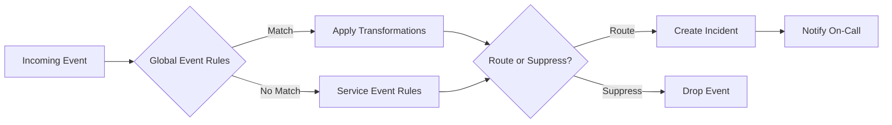
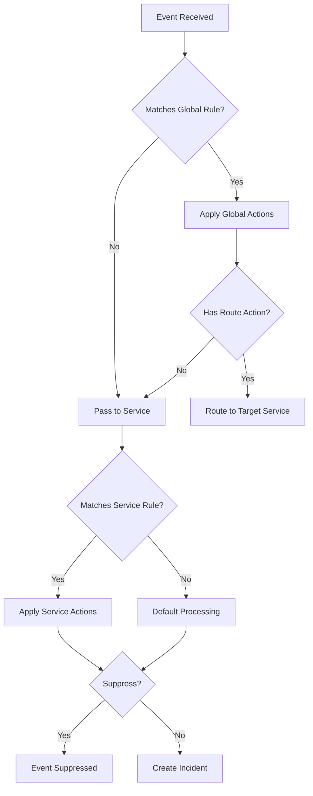

# How to Implement PagerDuty Event Rules

Author: [nawazdhandala](https://www.github.com/nawazdhandala)

Tags: PagerDuty, Event Rules, Incident Management, Alert Routing, Automation

Description: Learn how to configure PagerDuty event rules to route, suppress, and transform alerts for better incident management.

---

## What Are Event Rules?

Event rules in PagerDuty let you control how incoming events are processed before they create incidents. You can route alerts to specific services, suppress noise, enrich event data, and set severity levels based on conditions you define.

## Event Rules Architecture



## Setting Up Global Event Rules

Global event rules process events before they reach individual services. Navigate to **Services > Event Rules** in your PagerDuty dashboard.

### Basic Rule Structure

```json
{
  "rule": {
    "condition": {
      "expression": {
        "and": [
          {
            "field": "severity",
            "op": "equals",
            "value": "critical"
          },
          {
            "field": "custom_details.environment",
            "op": "equals",
            "value": "production"
          }
        ]
      }
    },
    "actions": {
      "route_to": "PSERVICE123",
      "severity": "critical",
      "annotate": {
        "notes": "Production critical alert - immediate response required"
      }
    }
  }
}
```

## Common Event Rule Patterns

### Route by Environment

Separate production and staging alerts to different services:

```json
{
  "rules": [
    {
      "condition": {
        "expression": {
          "field": "custom_details.environment",
          "op": "equals",
          "value": "production"
        }
      },
      "actions": {
        "route_to": "PROD_SERVICE_ID"
      }
    },
    {
      "condition": {
        "expression": {
          "field": "custom_details.environment",
          "op": "equals",
          "value": "staging"
        }
      },
      "actions": {
        "route_to": "STAGING_SERVICE_ID",
        "severity": "warning"
      }
    }
  ]
}
```

### Suppress Known Issues

Prevent noisy alerts from creating incidents during maintenance:

```json
{
  "condition": {
    "expression": {
      "and": [
        {
          "field": "summary",
          "op": "contains",
          "value": "disk space warning"
        },
        {
          "field": "custom_details.host",
          "op": "matches",
          "value": "backup-server-*"
        }
      ]
    }
  },
  "actions": {
    "suppress": true,
    "suppress_until": "2026-02-01T00:00:00Z"
  }
}
```

### Dynamic Severity Assignment

```json
{
  "rules": [
    {
      "condition": {
        "expression": {
          "field": "custom_details.error_rate",
          "op": "greater_than",
          "value": 50
        }
      },
      "actions": {
        "severity": "critical"
      }
    },
    {
      "condition": {
        "expression": {
          "field": "custom_details.error_rate",
          "op": "greater_than",
          "value": 25
        }
      },
      "actions": {
        "severity": "error"
      }
    }
  ]
}
```

## Event Rule Processing Flow



## Using the Events API with Rules

Send events that your rules can process:

```python
import requests
import json

def send_pagerduty_event(routing_key, summary, severity, custom_details):
    """
    Send an event to PagerDuty Events API v2

    Args:
        routing_key: Integration key for the service
        summary: Brief description of the event
        severity: One of critical, error, warning, info
        custom_details: Dict with additional context for event rules
    """
    url = "https://events.pagerduty.com/v2/enqueue"

    payload = {
        "routing_key": routing_key,
        "event_action": "trigger",
        "dedup_key": f"{custom_details.get('service')}-{custom_details.get('check')}",
        "payload": {
            "summary": summary,
            "severity": severity,
            "source": custom_details.get("host", "unknown"),
            "custom_details": custom_details
        }
    }

    response = requests.post(url, json=payload)
    return response.json()

# Example: Send an event with fields your rules can match
send_pagerduty_event(
    routing_key="YOUR_ROUTING_KEY",
    summary="High CPU usage on web-server-01",
    severity="warning",
    custom_details={
        "environment": "production",
        "service": "web-api",
        "check": "cpu_usage",
        "host": "web-server-01",
        "cpu_percent": 92,
        "region": "us-east-1"
    }
)
```

## Service-Level Event Rules

Service event rules apply only to events already routed to that service. Configure them under **Services > Your Service > Event Rules**.

```json
{
  "service_rules": [
    {
      "condition": {
        "expression": {
          "field": "custom_details.alert_type",
          "op": "equals",
          "value": "heartbeat"
        }
      },
      "actions": {
        "severity": "info",
        "suppress": {
          "threshold_value": 5,
          "threshold_time_unit": "minutes"
        }
      }
    }
  ]
}
```

## Event Enrichment

Add context to events automatically:

```json
{
  "condition": {
    "expression": {
      "field": "custom_details.service",
      "op": "equals",
      "value": "payment-api"
    }
  },
  "actions": {
    "annotate": {
      "notes": "Payment service - check Stripe dashboard"
    },
    "extractions": [
      {
        "source": "custom_details.transaction_id",
        "target": "links",
        "template": "https://dashboard.stripe.com/payments/{{value}}"
      }
    ],
    "priority": "P1"
  }
}
```

## Best Practices

1. Start with broad rules and refine based on actual traffic patterns
2. Use descriptive dedup_keys to prevent duplicate incidents
3. Test rules in a staging service before applying to production
4. Document the purpose of each rule for team members
5. Review suppression rules monthly to avoid missing real issues
6. Use event enrichment to add runbook links and dashboard URLs

## Debugging Event Rules

When rules do not behave as expected, check the event log:

```bash
# Use PagerDuty CLI to view recent events
pd event list --since "1 hour ago" --service-id PSERVICE123

# Check rule evaluation in the web UI
# Navigate to Services > Event Rules > Rule Tester
```

---

Event rules transform PagerDuty from a simple alerting tool into an intelligent incident routing system. By thoughtfully configuring rules, you reduce alert fatigue, ensure the right team gets notified, and add valuable context that speeds up resolution. Start with your noisiest alert sources and build rules incrementally.
