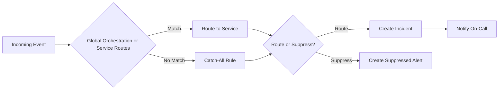
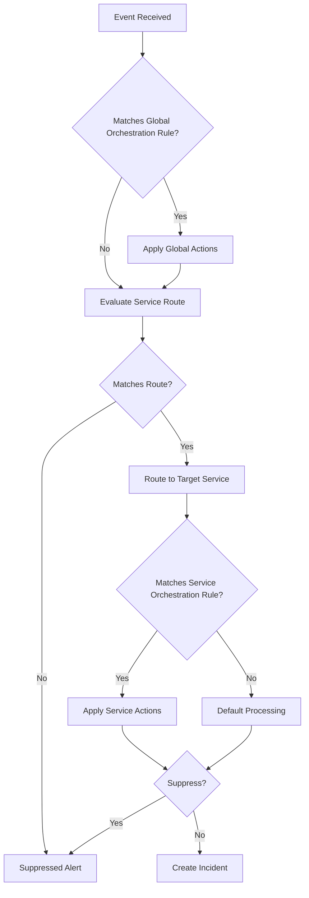

# How to Implement PagerDuty Event Rules

Author: [nawazdhandala](https://www.github.com/nawazdhandala)

Tags: PagerDuty, Event Rules, Incident Management, Alert Routing, Automation

Description: Learn how to configure PagerDuty event rules to route, suppress, and transform alerts for better incident management.

---

## What Are Event Rules?

PagerDuty's legacy Rulesets and Event Rules pages reached end-of-life on January 31, 2025. For new configurations, use Event Orchestration rules to control how incoming events are processed before they create incidents. You can route alerts to specific services, suppress noise, enrich event data, and set severity levels based on conditions you define.

## Event Rules Architecture


```mermaid
flowchart LR
    A[Incoming Event] --> B{Global Orchestration or Service Routes}
    B -->|Match| C[Route to Service]
    B -->|No Match| D[Catch-All Rule]
    C --> E{Route or Suppress?}
    D --> E
    E -->|Route| F[Create Incident]
    E -->|Suppress| G[Create Suppressed Alert]
    F --> H[Notify On-Call]
```

## Setting Up Global Event Rules

Global Orchestration rules process events before they reach individual services. Navigate to **AIOps > Event Orchestration** and create a Global Orchestration or Global Integration, then use the **Global Orchestration** or **Service Routes** tab depending on whether you are transforming the event or routing it to a service.

### Basic Rule Structure

```json
{
  "orchestration_path": {
    "sets": [
      {
        "id": "start",
        "rules": [
          {
            "label": "Route production critical alerts",
            "conditions": [
              {
                "expression": "event.severity matches 'critical' and event.custom_details.environment matches 'production'"
              }
            ],
            "actions": {
              "route_to": "PSERVICE123"
            }
          }
        ]
      }
    ]
  }
}
```

## Common Event Rule Patterns

### Route by Environment

Separate production and staging alerts to different services:

```json
{
  "orchestration_path": {
    "sets": [
      {
        "id": "start",
        "rules": [
          {
            "label": "Production alerts",
            "conditions": [
              {
                "expression": "event.custom_details.environment matches 'production'"
              }
            ],
            "actions": {
              "route_to": "PROD_SERVICE_ID"
            }
          },
          {
            "label": "Staging alerts",
            "conditions": [
              {
                "expression": "event.custom_details.environment matches 'staging'"
              }
            ],
            "actions": {
              "route_to": "STAGING_SERVICE_ID"
            }
          }
        ]
      }
    ]
  }
}
```

### Suppress Known Issues

Prevent noisy alerts from creating incidents:

```json
{
  "orchestration_path": {
    "sets": [
      {
        "id": "start",
        "rules": [
          {
            "label": "Suppress backup disk warnings",
            "conditions": [
              {
                "expression": "event.summary matches part 'disk space warning' and event.custom_details.host matches regex 'backup-server-.*'"
              }
            ],
            "actions": {
              "suppress": true
            }
          }
        ]
      }
    ]
  }
}
```

### Dynamic Severity Assignment

```json
{
  "orchestration_path": {
    "sets": [
      {
        "id": "start",
        "rules": [
          {
            "label": "Critical error rate",
            "conditions": [
              {
                "expression": "event.custom_details.error_rate > 50"
              }
            ],
            "actions": {
              "severity": "critical"
            }
          },
          {
            "label": "Error rate warning",
            "conditions": [
              {
                "expression": "event.custom_details.error_rate > 25"
              }
            ],
            "actions": {
              "severity": "error"
            }
          }
        ]
      }
    ]
  }
}
```

## Event Rule Processing Flow


```mermaid
flowchart TD
    A[Event Received] --> B{Matches Global Orchestration Rule?}
    B -->|Yes| C[Apply Global Actions]
    B -->|No| D[Evaluate Service Route]
    C --> D
    D --> E{Matches Route?}
    E -->|Yes| F[Route to Target Service]
    E -->|No| K[Suppressed Alert by Catch-All]
    F --> G{Matches Service Orchestration Rule?}
    G -->|Yes| H[Apply Service Actions]
    G -->|No| I[Default Processing]
    H --> J{Suppress?}
    I --> J
    J -->|Yes| K[Suppressed Alert]
    J -->|No| L[Create Incident]
```

## Using the Events API with Rules

Send events that your rules can process:

```python
import requests

def send_pagerduty_event(routing_key, summary, severity, custom_details):
    """
    Send an event to PagerDuty Events API v2

    Args:
        routing_key: Integration key for the service
        summary: Brief description of the event
        severity: One of critical, error, warning, info
        custom_details: Dict with additional context for event rules
    """
    url = "https://events.pagerduty.com/v2/enqueue"

    payload = {
        "routing_key": routing_key,
        "event_action": "trigger",
        "dedup_key": f"{custom_details.get('service')}-{custom_details.get('check')}",
        "payload": {
            "summary": summary,
            "severity": severity,
            "source": custom_details.get("host", "unknown"),
            "custom_details": custom_details
        }
    }

    response = requests.post(url, json=payload)
    response.raise_for_status()
    return response.json()

# Example: Send an event with fields your rules can match

send_pagerduty_event(
    routing_key="YOUR_ROUTING_KEY",
    summary="High CPU usage on web-server-01",
    severity="warning",
    custom_details={
        "environment": "production",
        "service": "web-api",
        "check": "cpu_usage",
        "host": "web-server-01",
        "cpu_percent": 92,
        "region": "us-east-1"
    }
)
```

## Service-Level Event Rules

Service Orchestration rules apply only to events already routed to that service. Configure them under **Services > Service Directory > Your Service > Settings > Event Management > Service Orchestration Rules**.

```json
{
  "orchestration_path": {
    "sets": [
      {
        "id": "start",
        "rules": [
          {
            "label": "Suppress heartbeat alerts",
            "conditions": [
              {
                "expression": "event.custom_details.alert_type matches 'heartbeat'"
              }
            ],
            "actions": {
              "severity": "info",
              "suppress": true
            }
          }
        ]
      }
    ]
  }
}
```

## Event Enrichment

Add context to events automatically:

```json
{
  "orchestration_path": {
    "sets": [
      {
        "id": "start",
        "rules": [
          {
            "label": "Enrich payment alerts",
            "conditions": [
              {
                "expression": "event.custom_details.service matches 'payment-api'"
              }
            ],
            "actions": {
              "annotate": "Payment service - check Stripe dashboard",
              "priority": "P1"
            }
          }
        ]
      }
    ]
  }
}
```

## Best Practices

1. Start with broad rules and refine based on actual traffic patterns
2. Use descriptive dedup_keys to prevent duplicate incidents
3. Test rules in a staging service before applying to production
4. Document the purpose of each rule for team members
5. Review suppression rules monthly to avoid missing real issues
6. Use event enrichment to add runbook links and dashboard URLs

## Debugging Event Rules

When rules do not behave as expected, check the event log:

```bash
# Use PagerDuty CLI to view recent log entries
pd log --since "1 hour ago" --json

# Check rule evaluation in the web UI
# Navigate to AIOps > Event Orchestration and inspect the matching orchestration or service route
```

---

Event Orchestration rules transform PagerDuty from a simple alerting tool into an intelligent incident routing system. By thoughtfully configuring rules, you reduce alert fatigue, ensure the right team gets notified, and add valuable context that speeds up resolution. Start with your noisiest alert sources and build rules incrementally.
