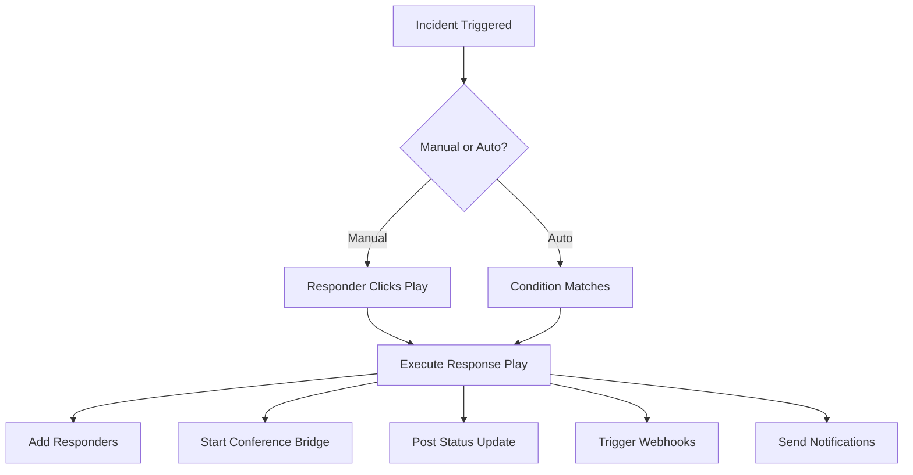
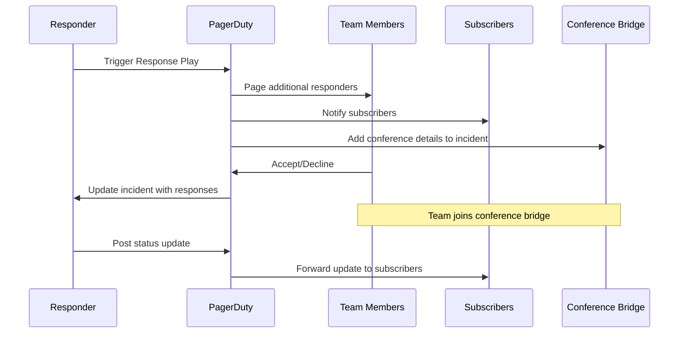
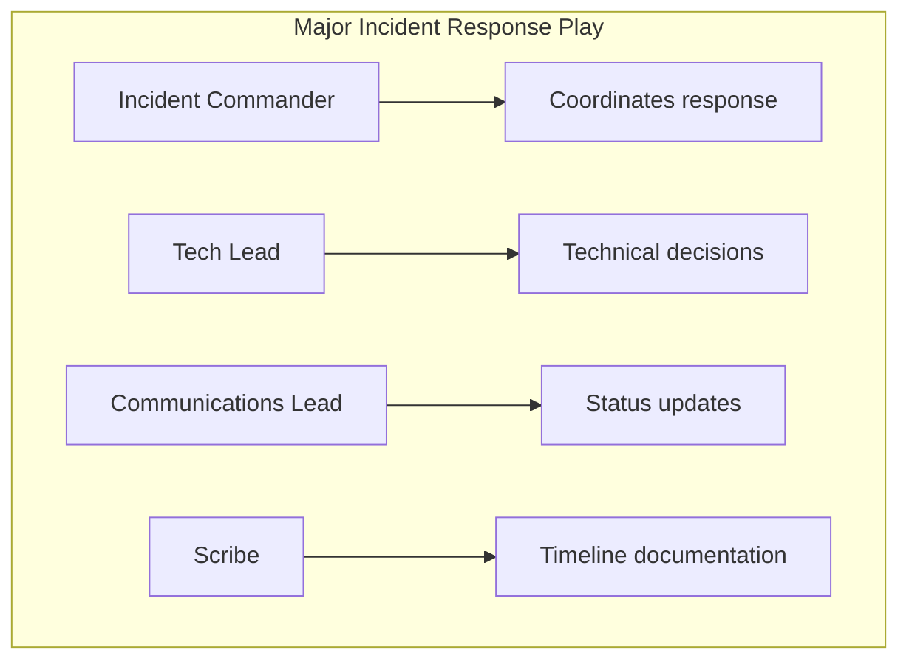

# How to Implement PagerDuty Response Plays

Author: [nawazdhandala](https://www.github.com/nawazdhandala)

Tags: PagerDuty, Response Plays, Incident Response, Automation, Runbooks

Description: Learn how to create and use PagerDuty Response Plays to automate incident response actions and mobilize teams quickly.

---

## What Are Response Plays?

Response Plays are pre-configured sets of actions that can be triggered during an incident. They automate the repetitive steps of incident response: adding responders, starting conference calls, posting to status pages, and running custom webhooks. Instead of manually coordinating during a crisis, you activate a response play with one click.

## Response Play Architecture



## Creating a Response Play

Navigate to **Automation > Response Plays** or use the API:

```python
import requests

def create_response_play(api_key, name, description, actions):
    """
    Create a Response Play in PagerDuty

    Args:
        api_key: PagerDuty API key with write access
        name: Name of the response play
        description: What this play does and when to use it
        actions: List of actions to execute
    """
    url = "https://api.pagerduty.com/response_plays"

    headers = {
        "Authorization": f"Token token={api_key}",
        "Content-Type": "application/json"
    }

    payload = {
        "response_play": {
            "type": "response_play",
            "name": name,
            "description": description,
            "team": None,  # Available to all teams
            "subscribers": actions.get("subscribers", []),
            "subscribers_message": actions.get("message", ""),
            "responders": actions.get("responders", []),
            "responders_message": actions.get("responders_message", ""),
            "runnability": "services",
            "conference_number": actions.get("conference_number"),
            "conference_url": actions.get("conference_url")
        }
    }

    response = requests.post(url, headers=headers, json=payload)
    return response.json()

# Example: Create a major incident response play
create_response_play(
    api_key="YOUR_API_KEY",
    name="Major Incident Response",
    description="Mobilize the full incident response team for P1 incidents",
    actions={
        "responders": [
            {"type": "user_reference", "id": "PUSER001"},  # Incident Commander
            {"type": "user_reference", "id": "PUSER002"},  # Tech Lead
            {"type": "escalation_policy_reference", "id": "PPOLICY01"}  # On-call team
        ],
        "responders_message": "Major incident declared. Please join the bridge immediately.",
        "subscribers": [
            {"type": "user_reference", "id": "PUSER003"},  # VP Engineering
            {"type": "team_reference", "id": "PTEAM001"}  # Stakeholder team
        ],
        "message": "A major incident has been declared. Updates will be posted to this channel.",
        "conference_number": "+1-555-123-4567,,12345#",
        "conference_url": "https://meet.yourcompany.com/incident-bridge"
    }
)
```

## Common Response Play Patterns

### 1. Major Incident Mobilization

```json
{
  "name": "P1 - Major Incident",
  "description": "Full team mobilization for customer-impacting outages",
  "responders": [
    {"type": "user_reference", "id": "INCIDENT_COMMANDER"},
    {"type": "escalation_policy_reference", "id": "PLATFORM_ONCALL"},
    {"type": "escalation_policy_reference", "id": "SRE_ONCALL"}
  ],
  "responders_message": "P1 incident declared. Join the bridge now.",
  "subscribers": [
    {"type": "team_reference", "id": "ENGINEERING_LEADERSHIP"},
    {"type": "team_reference", "id": "CUSTOMER_SUCCESS"}
  ],
  "conference_number": "+1-555-123-4567,,99999#",
  "conference_url": "https://zoom.us/j/incident-bridge"
}
```

### 2. Security Incident Response

```json
{
  "name": "Security Incident",
  "description": "Engage security team and initiate containment procedures",
  "responders": [
    {"type": "escalation_policy_reference", "id": "SECURITY_ONCALL"},
    {"type": "user_reference", "id": "CISO"},
    {"type": "escalation_policy_reference", "id": "PLATFORM_ONCALL"}
  ],
  "responders_message": "Security incident detected. Join secure bridge immediately. Do not discuss in public channels.",
  "subscribers": [
    {"type": "user_reference", "id": "CEO"},
    {"type": "user_reference", "id": "LEGAL_COUNSEL"}
  ],
  "conference_url": "https://secure-meet.yourcompany.com/security-incident"
}
```

### 3. Database Incident

```json
{
  "name": "Database Emergency",
  "description": "Engage DBA team for database-related incidents",
  "responders": [
    {"type": "escalation_policy_reference", "id": "DBA_ONCALL"},
    {"type": "user_reference", "id": "DATABASE_ARCHITECT"}
  ],
  "responders_message": "Database incident - need DBA expertise on the bridge.",
  "conference_number": "+1-555-123-4567,,33333#"
}
```

## Response Play Execution Flow



## Triggering Response Plays

### Manual Trigger via UI

1. Open the incident
2. Click "Run a Play"
3. Select the appropriate response play
4. Confirm execution

### Trigger via API

```python
def run_response_play(api_key, incident_id, response_play_id, from_email):
    """
    Run a response play on an existing incident

    Args:
        api_key: PagerDuty API key
        incident_id: The incident to run the play on
        response_play_id: ID of the response play to execute
        from_email: Email of the user triggering the play
    """
    url = f"https://api.pagerduty.com/response_plays/{response_play_id}/run"

    headers = {
        "Authorization": f"Token token={api_key}",
        "Content-Type": "application/json",
        "From": from_email
    }

    payload = {
        "incident": {
            "id": incident_id,
            "type": "incident_reference"
        }
    }

    response = requests.post(url, headers=headers, json=payload)
    return response.json()

# Run a response play when you detect a major incident
run_response_play(
    api_key="YOUR_API_KEY",
    incident_id="P123ABC",
    response_play_id="PPLAY001",
    from_email="oncall@yourcompany.com"
)
```

### Auto-Trigger Based on Conditions

Use Event Orchestration to automatically run response plays:

```json
{
  "orchestration_rule": {
    "condition": {
      "and": [
        {
          "field": "incident.priority.name",
          "op": "equals",
          "value": "P1"
        },
        {
          "field": "incident.service.name",
          "op": "contains",
          "value": "payment"
        }
      ]
    },
    "actions": {
      "run_response_play": {
        "response_play_id": "PPLAY_MAJOR_INCIDENT"
      }
    }
  }
}
```

## Building Effective Response Plays

### Role-Based Responders

Define clear roles for each response play:



### Escalation Paths

```python
def create_tiered_response_plays(api_key):
    """
    Create a set of response plays for different severity levels
    """
    plays = [
        {
            "name": "Tier 1 - Initial Response",
            "description": "First-line team engagement",
            "responders": [
                {"type": "escalation_policy_reference", "id": "PRIMARY_ONCALL"}
            ]
        },
        {
            "name": "Tier 2 - Escalated Response",
            "description": "Bring in senior engineers",
            "responders": [
                {"type": "escalation_policy_reference", "id": "SENIOR_ONCALL"},
                {"type": "user_reference", "id": "TEAM_LEAD"}
            ]
        },
        {
            "name": "Tier 3 - All Hands",
            "description": "Full team mobilization",
            "responders": [
                {"type": "team_reference", "id": "ENTIRE_ENGINEERING_TEAM"}
            ],
            "subscribers": [
                {"type": "team_reference", "id": "EXECUTIVE_TEAM"}
            ]
        }
    ]

    for play in plays:
        create_response_play(api_key, play["name"], play["description"], play)
```

## Integrating with Conference Bridges

### Static Conference Bridge

```json
{
  "conference_number": "+1-555-123-4567,,12345#",
  "conference_url": "https://zoom.us/j/1234567890"
}
```

### Dynamic Conference Creation

Use webhooks to create a new conference for each incident:

```python
from flask import Flask, request
import requests

app = Flask(__name__)

@app.route("/create-conference", methods=["POST"])
def create_conference():
    """
    Webhook endpoint that creates a Zoom meeting for incidents
    """
    incident = request.json.get("event", {}).get("data", {})

    # Create a Zoom meeting via Zoom API
    zoom_meeting = create_zoom_meeting(
        topic=f"Incident: {incident['title']}",
        duration=60
    )

    # Update the incident with conference details
    update_incident_conference(
        incident_id=incident["id"],
        conference_url=zoom_meeting["join_url"],
        conference_number=zoom_meeting["dial_in"]
    )

    return {"status": "conference created"}
```

## Best Practices

1. Name response plays clearly so responders can choose the right one quickly
2. Keep responder lists focused - too many people creates confusion
3. Include clear instructions in responder messages
4. Test response plays during non-incident times
5. Review and update plays quarterly as team structure changes
6. Document which play to use for which scenario in your runbooks

## Measuring Response Play Effectiveness

Track these metrics:

- Time from incident to response play activation
- Time from activation to all responders joining
- Number of incidents where plays were used vs manual coordination
- Mean time to resolve for incidents with vs without plays

---

Response Plays transform chaotic incident response into a structured, repeatable process. By pre-configuring who needs to be engaged and how to reach them, you remove decision-making overhead during the stressful moments of an outage. Start with one play for your most common incident type, measure its impact, and expand from there.
