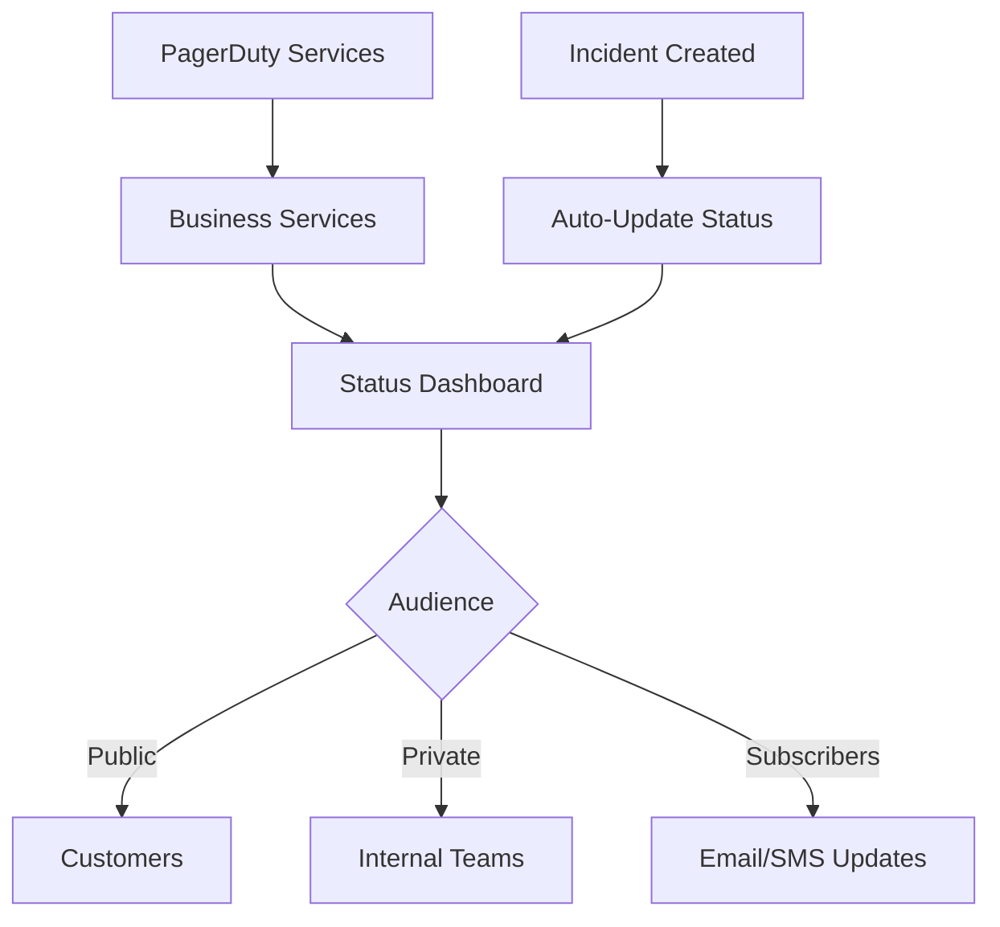
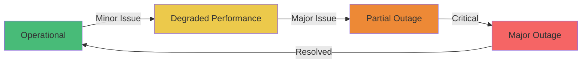
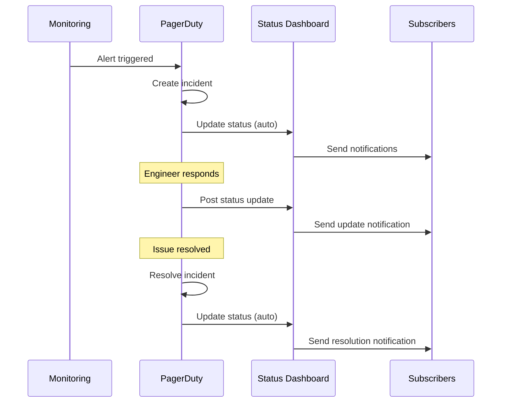

# How to Use PagerDuty Status Dashboard

Author: [nawazdhandala](https://www.github.com/nawazdhandala)

Tags: PagerDuty, Status Dashboard, Incident Communication, Status Page, Stakeholder Updates

Description: Learn how to configure and use PagerDuty Status Dashboard to communicate service health to stakeholders and customers.

---

## What Is PagerDuty Status Dashboard?

PagerDuty Status Dashboard provides a public or private view of your service health. It connects directly to your incident data, automatically updating status when incidents occur. This eliminates the manual work of keeping a status page current during outages.

## Status Dashboard Architecture



## Setting Up Your First Status Dashboard

### Step 1: Create Business Services

Business services represent customer-facing capabilities. Navigate to **Services > Business Services** and create services that map to what your users care about.

```yaml
# Example business service structure
business_services:
  - name: "Web Application"
    description: "Customer-facing web portal"
    technical_services:
      - web-frontend
      - api-gateway
      - auth-service

  - name: "Payment Processing"
    description: "Credit card and invoice payments"
    technical_services:
      - payment-api
      - stripe-integration
      - billing-service

  - name: "API Platform"
    description: "Public REST and GraphQL APIs"
    technical_services:
      - api-gateway
      - rate-limiter
      - documentation-service
```

### Step 2: Configure the Status Dashboard

Navigate to **Status > Status Dashboard** and configure your dashboard settings:

```json
{
  "dashboard": {
    "name": "Acme Corp System Status",
    "subdomain": "status.acme.com",
    "theme": {
      "logo_url": "https://acme.com/logo.png",
      "primary_color": "#2D3748",
      "secondary_color": "#4A5568"
    },
    "visibility": "public",
    "business_services": [
      "Web Application",
      "Payment Processing",
      "API Platform"
    ]
  }
}
```

## Status Levels and Their Meaning



| Status | Description | Typical Trigger |
|--------|-------------|-----------------|
| Operational | All systems functioning normally | No active incidents |
| Degraded Performance | Slower than usual, but functional | Warning-level incident |
| Partial Outage | Some features unavailable | Error-level incident |
| Major Outage | Service completely unavailable | Critical incident |

## Automating Status Updates

### Link Incidents to Business Services

When creating services, map them to business services for automatic status updates:

```python
import requests

def link_service_to_business_service(api_key, service_id, business_service_id):
    """
    Link a technical service to a business service
    for automatic status dashboard updates
    """
    url = f"https://api.pagerduty.com/business_services/{business_service_id}/service_dependencies"

    headers = {
        "Authorization": f"Token token={api_key}",
        "Content-Type": "application/json"
    }

    payload = {
        "relationships": [
            {
                "supporting_service": {
                    "id": service_id,
                    "type": "service"
                },
                "dependent_service": {
                    "id": business_service_id,
                    "type": "business_service"
                }
            }
        ]
    }

    response = requests.post(url, headers=headers, json=payload)
    return response.json()
```

### Configure Impact Mapping

Define how incident severity affects displayed status:

```json
{
  "impact_mapping": {
    "critical": "major_outage",
    "high": "partial_outage",
    "low": "degraded_performance",
    "info": "operational"
  },
  "auto_resolve_delay_minutes": 5
}
```

## Managing Subscriber Notifications

### Enable Subscriptions

Allow users to subscribe for updates via email, SMS, or webhook:

```python
def configure_subscription_options(api_key, dashboard_id):
    """
    Enable subscription options for status dashboard
    """
    url = f"https://api.pagerduty.com/status_dashboards/{dashboard_id}/subscriptions/config"

    headers = {
        "Authorization": f"Token token={api_key}",
        "Content-Type": "application/json"
    }

    payload = {
        "subscription_config": {
            "email_enabled": True,
            "sms_enabled": True,
            "webhook_enabled": True,
            "components": ["all"],
            "notification_types": [
                "incident_created",
                "incident_updated",
                "incident_resolved",
                "maintenance_scheduled",
                "maintenance_started",
                "maintenance_completed"
            ]
        }
    }

    response = requests.put(url, headers=headers, json=payload)
    return response.json()
```

### Send Manual Updates

Post updates during incidents to keep stakeholders informed:

```python
def post_status_update(api_key, incident_id, message, status):
    """
    Post a manual status update during an incident

    Args:
        api_key: PagerDuty API key
        incident_id: ID of the active incident
        message: Update message for subscribers
        status: Current status (investigating, identified, monitoring, resolved)
    """
    url = f"https://api.pagerduty.com/incidents/{incident_id}/status_updates"

    headers = {
        "Authorization": f"Token token={api_key}",
        "Content-Type": "application/json"
    }

    payload = {
        "status_update": {
            "message": message,
            "status": status
        }
    }

    response = requests.post(url, headers=headers, json=payload)
    return response.json()

# Example usage during an incident
post_status_update(
    api_key="YOUR_API_KEY",
    incident_id="P123ABC",
    message="We have identified the root cause as a database connection pool exhaustion. "
            "Engineering is deploying a fix. ETA 15 minutes.",
    status="identified"
)
```

## Scheduled Maintenance Windows

Communicate planned downtime proactively:

```python
def create_maintenance_window(api_key, dashboard_id, title, start_time, end_time, services):
    """
    Create a scheduled maintenance window
    """
    url = f"https://api.pagerduty.com/maintenance_windows"

    headers = {
        "Authorization": f"Token token={api_key}",
        "Content-Type": "application/json"
    }

    payload = {
        "maintenance_window": {
            "type": "maintenance_window",
            "start_time": start_time,
            "end_time": end_time,
            "description": title,
            "services": [{"id": sid, "type": "service_reference"} for sid in services]
        }
    }

    response = requests.post(url, headers=headers, json=payload)
    return response.json()

# Schedule a maintenance window
create_maintenance_window(
    api_key="YOUR_API_KEY",
    dashboard_id="DASHBOARD_ID",
    title="Database migration - expect 30 minutes of read-only mode",
    start_time="2026-02-01T02:00:00Z",
    end_time="2026-02-01T02:30:00Z",
    services=["PSVC001", "PSVC002"]
)
```

## Status Dashboard Update Flow



## Private vs Public Dashboards

### Public Dashboard

- Accessible without authentication
- Suitable for customer-facing status
- Include only business-level information
- Hide internal service names

### Private Dashboard

- Requires authentication
- Shows detailed technical status
- Includes internal service dependencies
- Links to incident details

```json
{
  "private_dashboard": {
    "visibility": "private",
    "allowed_domains": ["@acme.com"],
    "sso_enabled": true,
    "detail_level": "full",
    "show_technical_services": true,
    "include_incident_links": true
  }
}
```

## Best Practices

1. Use business service names that customers understand
2. Keep status descriptions jargon-free for public dashboards
3. Post regular updates during incidents, even if just to say you are still investigating
4. Schedule maintenance windows at least 24 hours in advance
5. Review subscriber notification frequency to avoid alert fatigue
6. Test the dashboard appearance across devices before launch

---

A well-maintained status dashboard builds trust with customers and reduces support ticket volume during incidents. By connecting it to your PagerDuty services, you automate the tedious parts while retaining control over communication. Start with your most customer-visible services and expand coverage as you refine your incident communication process.
