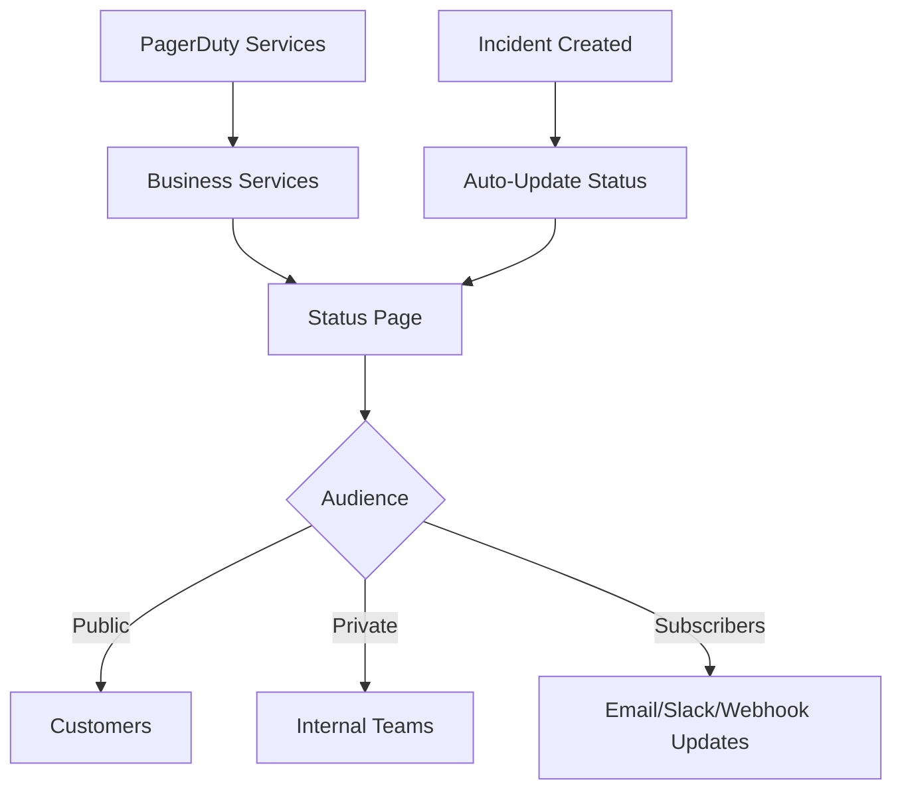
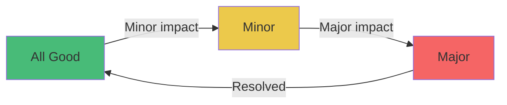
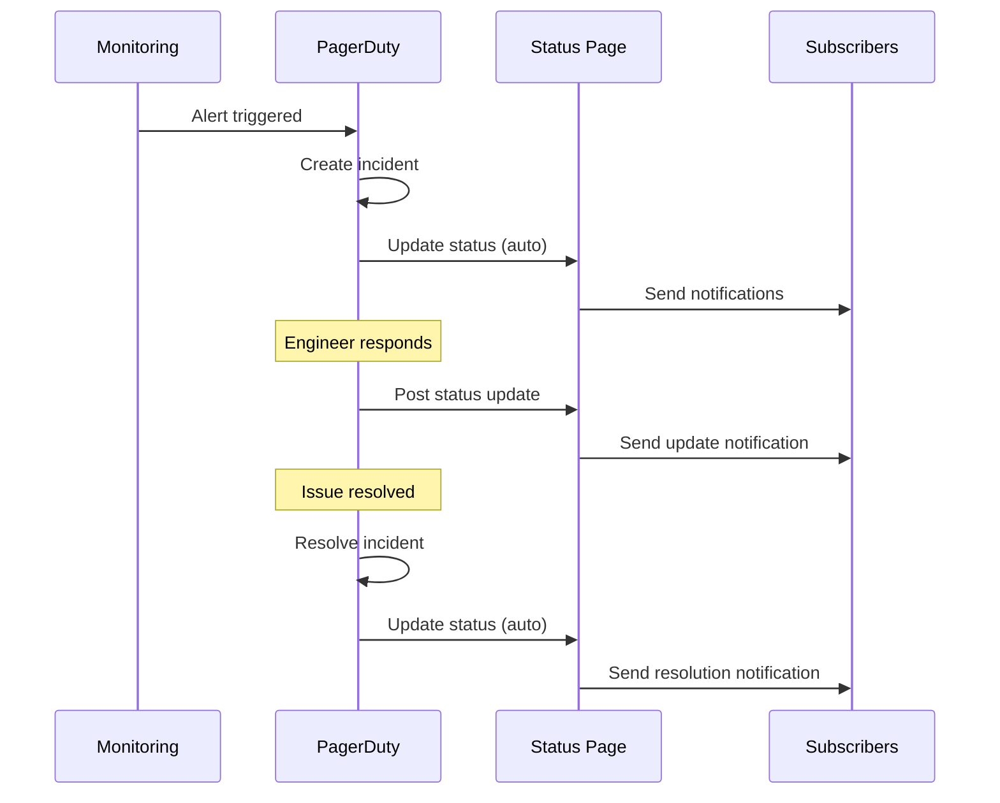

# How to Use PagerDuty Status Dashboard

Author: [nawazdhandala](https://www.github.com/nawazdhandala)

Tags: PagerDuty, Status Dashboard, Incident Communication, Status Page, Stakeholder Updates

Description: Learn how to configure and use PagerDuty Status Dashboard to communicate service health to stakeholders and customers.

---

## What Are PagerDuty Status Pages?

PagerDuty Status Pages provide public, private, and internal views of your service health. They use business services and incident priority to help communicate status when incidents occur. This reduces the manual work of keeping stakeholders informed during outages.

## Status Pages Architecture


```mermaid
flowchart TD
    A[PagerDuty Services] --> B[Business Services]
    B --> C[Status Page]
    C --> D{Audience}
    D -->|Public| E[Customers]
    D -->|Private| F[Internal Teams]
    D -->|Subscribers| G[Email/Slack/Webhook Updates]

    H[Incident Created] --> I[Auto-Update Status]
    I --> C
```

## Setting Up Your First Status Page

### Step 1: Create Business Services

Business services represent customer-facing capabilities. Navigate to **Services > Business Services** and create services that map to what your users care about.

```yaml
# Example business service structure

business_services:
  - name: "Web Application"
    description: "Customer-facing web portal"
    technical_services:
      - web-frontend
      - api-gateway
      - auth-service

  - name: "Payment Processing"
    description: "Credit card and invoice payments"
    technical_services:
      - payment-api
      - stripe-integration
      - billing-service

  - name: "API Platform"
    description: "Public REST and GraphQL APIs"
    technical_services:
      - api-gateway
      - rate-limiter
      - documentation-service
```

### Step 2: Configure the Status Page

Navigate to **Status > External Status Page**, create a new status page, and configure settings like this:

```json
{
  "status_page": {
    "name": "Acme Corp System Status",
    "simple_url": "acme",
    "custom_url": "status.acme.com",
    "theme": {
      "logo_url": "https://acme.com/logo.png",
      "primary_color": "#2D3748",
      "secondary_color": "#4A5568"
    },
    "status_page_type": "public",
    "business_services": [
      "Web Application",
      "Payment Processing",
      "API Platform"
    ]
  }
}
```

## Status Levels and Their Meaning


```mermaid
flowchart LR
    A[All Good] -->|Minor impact| B[Minor]
    B -->|Major impact| C[Major]
    C -->|Resolved| A

    style A fill:#48BB78
    style B fill:#ECC94B
    style C fill:#F56565
```

| Status | Description | Typical Trigger |
|--------|-------------|-----------------|
| All Good | Services are functioning normally | No active customer impact |
| Minor | Some degradation or limited impact | Lower-priority impacting incident |
| Major | Significant customer-facing impact | P1 or P2 impacting incident |

## Automating Status Updates

### Link Incidents to Business Services

When creating services, map them to business services for automatic status updates:

```python
import requests

def link_service_to_business_service(api_key, service_id, business_service_id):
    """
    Link a technical service to a business service
    for automatic status page updates
    """
    url = "https://api.pagerduty.com/service_dependencies/associate"

    headers = {
        "Authorization": f"Token token={api_key}",
        "Accept": "application/vnd.pagerduty+json;version=2",
        "Content-Type": "application/json"
    }

    payload = {
        "relationships": [
            {
                "supporting_service": {
                    "id": service_id,
                    "type": "service"
                },
                "dependent_service": {
                    "id": business_service_id,
                    "type": "business_service"
                }
            }
        ]
    }

    response = requests.post(url, headers=headers, json=payload)
    return response.json()
```

### Configure Impact Mapping

PagerDuty External Status Pages consider incidents with P1 or P2 priority impacting by default. You can adjust the account-wide incident priority settings to restrict or include a wider set of incident priorities:

```json
{
  "impact_policy": {
    "P1": "impacting",
    "P2": "impacting",
    "P3": "not_impacting",
    "P4": "not_impacting",
    "P5": "not_impacting"
  }
}
```

## Managing Subscriber Notifications

### Enable Subscriptions

Allow users to subscribe for updates via email or webhook:

```python
def create_status_page_subscription(api_key, status_page_id, contact, channel="email"):
    """
    Subscribe an email address or webhook URL to a status page
    """
    url = f"https://api.pagerduty.com/status_pages/{status_page_id}/subscriptions"

    headers = {
        "Authorization": f"Token token={api_key}",
        "Accept": "application/vnd.pagerduty+json;version=2",
        "Content-Type": "application/json"
    }

    payload = {
        "subscription": {
            "type": "status_page_subscription",
            "channel": channel,
            "contact": contact,
            "status_page": {
                "id": status_page_id,
                "type": "status_page"
            },
            "subscribable_object": {
                "id": status_page_id,
                "type": "status_page"
            }
        }
    }

    response = requests.post(url, headers=headers, json=payload)
    return response.json()
```

### Send Manual Updates

Post updates during incidents to keep stakeholders informed:

```python
def post_status_update(api_key, incident_id, message, from_email):
    """
    Post a manual status update during an incident

    Args:
        api_key: PagerDuty API key
        incident_id: ID of the active incident
        message: Update message for subscribers
        from_email: Email address of the PagerDuty user posting the update
    """
    url = f"https://api.pagerduty.com/incidents/{incident_id}/status_updates"

    headers = {
        "Authorization": f"Token token={api_key}",
        "Accept": "application/vnd.pagerduty+json;version=2",
        "From": from_email,
        "Content-Type": "application/json"
    }

    payload = {
        "message": message
    }

    response = requests.post(url, headers=headers, json=payload)
    return response.json()

# Example usage during an incident
post_status_update(
    api_key="YOUR_API_KEY",
    incident_id="P123ABC",
    message="We have identified the root cause as a database connection pool exhaustion. "
            "Engineering is deploying a fix. ETA 15 minutes.",
    from_email="responder@example.com"
)
```

## Scheduled Maintenance Windows

Communicate planned downtime proactively:

```python
def create_maintenance_notice(
    api_key,
    status_page_id,
    title,
    message,
    start_time,
    end_time,
    status_id,
    severity_id,
    impacted_service_ids
):
    """
    Create a scheduled maintenance notice on a status page
    """
    url = f"https://api.pagerduty.com/status_pages/{status_page_id}/posts"

    headers = {
        "Authorization": f"Token token={api_key}",
        "Accept": "application/vnd.pagerduty+json;version=2",
        "Content-Type": "application/json"
    }

    payload = {
        "post": {
            "type": "status_page_post",
            "title": title,
            "post_type": "maintenance",
            "starts_at": start_time,
            "ends_at": end_time,
            "status_page": {
                "id": status_page_id,
                "type": "status_page"
            },
            "updates": [
                {
                    "type": "status_page_post_update",
                    "message": message,
                    "status": {
                        "id": status_id,
                        "type": "status_page_status"
                    },
                    "severity": {
                        "id": severity_id,
                        "type": "status_page_severity"
                    },
                    "update_frequency_ms": None,
                    "notify_subscribers": True,
                    "impacted_services": [
                        {
                            "id": service_id,
                            "type": "status_page_service"
                        }
                        for service_id in impacted_service_ids
                    ],
                    "post": {
                        "id": "",
                        "type": "status_page_post"
                    }
                }
            ]
        }
    }

    response = requests.post(url, headers=headers, json=payload)
    return response.json()

# Schedule a maintenance window
create_maintenance_notice(
    api_key="YOUR_API_KEY",
    status_page_id="PSTATUS001",
    title="Database migration - expect 30 minutes of read-only mode",
    message="We will perform a scheduled database migration during this window.",
    start_time="2026-02-01T02:00:00Z",
    end_time="2026-02-01T02:30:00Z",
    status_id="STATUS_ID_FROM_LIST_STATUSES",
    severity_id="SEVERITY_ID_FROM_LIST_SEVERITIES",
    impacted_service_ids=["PSVC001", "PSVC002"]
)
```

## Status Page Update Flow


```mermaid
sequenceDiagram
    participant M as Monitoring
    participant P as PagerDuty
    participant S as Status Page
    participant U as Subscribers

    M->>P: Alert triggered
    P->>P: Create incident
    P->>S: Update status (auto)
    S->>U: Send notifications

    Note over P: Engineer responds
    P->>S: Post status update
    S->>U: Send update notification

    Note over P: Issue resolved
    P->>P: Resolve incident
    P->>S: Update status (auto)
    S->>U: Send resolution notification
```

## Private vs Public Status Pages

### Public Status Page

- Accessible without authentication
- Suitable for customer-facing status
- Include only business-level information
- Hide internal service names

### Private Status Page

- Uses OpenID SSO for authenticated access
- Suitable for internal teams, partners, or key customers
- Can provide audience-specific views
- Shows the business services selected for each audience

```json
{
  "private_status_page": {
    "status_page_type": "private",
    "authentication": "OpenID SSO",
    "audiences": [
      {
        "name": "Acme employees",
        "group_claim": "employees",
        "business_services": ["Web Application", "Payment Processing"]
      }
    ]
  }
}
```

## Best Practices

1. Use business service names that customers understand
2. Keep status descriptions jargon-free for public status pages
3. Post regular updates during incidents, even if just to say you are still investigating
4. Schedule maintenance windows at least 24 hours in advance
5. Review subscriber notification frequency to avoid alert fatigue
6. Test the status page appearance across devices before launch

---

A well-maintained status page builds trust with customers and reduces support ticket volume during incidents. By connecting it to your PagerDuty services, you automate the tedious parts while retaining control over communication. Start with your most customer-visible services and expand coverage as you refine your incident communication process.
