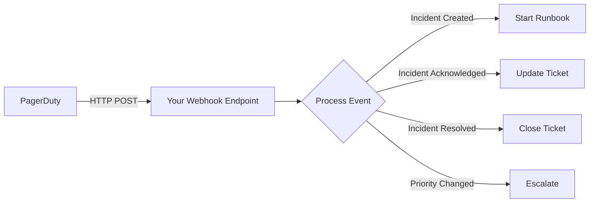
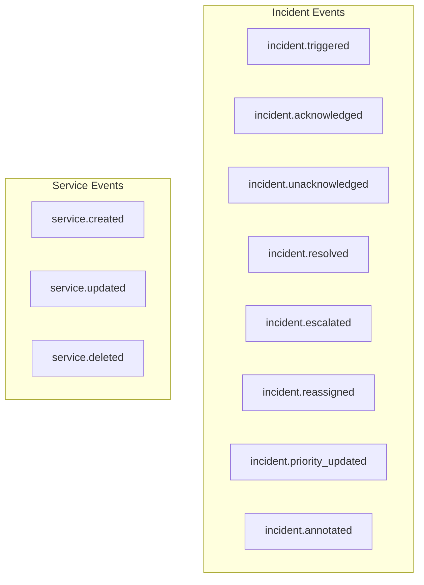

# How to Configure PagerDuty Webhooks

Author: [nawazdhandala](https://www.github.com/nawazdhandala)

Tags: PagerDuty, Webhooks, Integration, Automation, API

Description: Learn how to configure PagerDuty webhooks to integrate incident data with external systems and automate your response workflows.

---

## What Are PagerDuty Webhooks?

Webhooks allow PagerDuty to send real-time HTTP POST requests to your endpoints when incidents occur. You can use them to trigger automation, update external systems, send custom notifications, or build integrations with tools PagerDuty does not natively support.

## Webhook Architecture



## Setting Up a Webhook

### Step 1: Create the Webhook Extension

Navigate to **Integrations > Extensions > Add Extension** or configure via API:

```python
import requests

def create_webhook(api_key, service_id, endpoint_url, events):
    """
    Create a webhook extension for a PagerDuty service

    Args:
        api_key: PagerDuty API key
        service_id: Service to attach the webhook to
        endpoint_url: Your webhook endpoint URL
        events: List of event types to subscribe to
    """
    url = "https://api.pagerduty.com/extensions"

    headers = {
        "Authorization": f"Token token={api_key}",
        "Content-Type": "application/json"
    }

    payload = {
        "extension": {
            "type": "extension",
            "name": "Custom Webhook",
            "extension_schema": {
                "id": "PJFWPEP",  # Generic V3 Webhooks schema ID
                "type": "extension_schema_reference"
            },
            "endpoint_url": endpoint_url,
            "extension_objects": [
                {
                    "id": service_id,
                    "type": "service_reference"
                }
            ],
            "config": {
                "events": events
            }
        }
    }

    response = requests.post(url, headers=headers, json=payload)
    return response.json()

# Create a webhook for incident lifecycle events
create_webhook(
    api_key="YOUR_API_KEY",
    service_id="PSERVICE123",
    endpoint_url="https://api.yourcompany.com/pagerduty/webhook",
    events=[
        "incident.triggered",
        "incident.acknowledged",
        "incident.resolved",
        "incident.escalated",
        "incident.priority_updated"
    ]
)
```

## Webhook Payload Structure

PagerDuty sends JSON payloads with this structure:

```json
{
  "event": {
    "id": "01CQDWN6HZQZ1RFXJZQWXM1G0Y",
    "event_type": "incident.triggered",
    "resource_type": "incident",
    "occurred_at": "2026-01-28T14:30:00.000Z",
    "data": {
      "id": "P123ABC",
      "type": "incident",
      "html_url": "https://yourcompany.pagerduty.com/incidents/P123ABC",
      "number": 42,
      "title": "High CPU usage on production web servers",
      "status": "triggered",
      "urgency": "high",
      "priority": {
        "id": "P1",
        "name": "Critical"
      },
      "service": {
        "id": "PSERVICE123",
        "name": "Production Web App"
      },
      "assignments": [
        {
          "assignee": {
            "id": "PUSER001",
            "name": "Jane Doe",
            "email": "jane@company.com"
          }
        }
      ],
      "created_at": "2026-01-28T14:30:00.000Z"
    }
  }
}
```

## Building a Webhook Handler

### Python Flask Example

```python
from flask import Flask, request, jsonify
import hmac
import hashlib
import json

app = Flask(__name__)

WEBHOOK_SECRET = "your_webhook_signing_secret"

def verify_signature(payload, signature):
    """
    Verify the webhook signature to ensure it came from PagerDuty
    """
    expected = hmac.new(
        WEBHOOK_SECRET.encode(),
        payload,
        hashlib.sha256
    ).hexdigest()

    return hmac.compare_digest(f"v1={expected}", signature)

@app.route("/pagerduty/webhook", methods=["POST"])
def handle_pagerduty_webhook():
    # Verify signature
    signature = request.headers.get("X-PagerDuty-Signature")
    if not verify_signature(request.data, signature):
        return jsonify({"error": "Invalid signature"}), 401

    event = request.json.get("event", {})
    event_type = event.get("event_type")
    incident = event.get("data", {})

    # Route to appropriate handler
    handlers = {
        "incident.triggered": handle_triggered,
        "incident.acknowledged": handle_acknowledged,
        "incident.resolved": handle_resolved,
        "incident.escalated": handle_escalated,
    }

    handler = handlers.get(event_type)
    if handler:
        handler(incident)

    return jsonify({"status": "processed"}), 200

def handle_triggered(incident):
    """Handle new incident creation"""
    print(f"New incident: {incident['title']}")

    # Create a ticket in your ticketing system
    create_jira_ticket(
        title=incident["title"],
        description=f"PagerDuty incident: {incident['html_url']}",
        priority=incident.get("priority", {}).get("name", "Medium")
    )

    # Post to a custom Slack channel
    notify_stakeholders(
        message=f"Incident triggered: {incident['title']}",
        url=incident["html_url"]
    )

def handle_acknowledged(incident):
    """Handle incident acknowledgment"""
    assignee = incident.get("assignments", [{}])[0].get("assignee", {})
    print(f"Incident acknowledged by {assignee.get('name')}")

    # Update ticket status
    update_ticket_status(
        incident_id=incident["id"],
        status="In Progress",
        assignee=assignee.get("email")
    )

def handle_resolved(incident):
    """Handle incident resolution"""
    print(f"Incident resolved: {incident['title']}")

    # Close the ticket
    close_ticket(incident_id=incident["id"])

    # Trigger post-incident review workflow
    schedule_postmortem(incident_id=incident["id"])

def handle_escalated(incident):
    """Handle incident escalation"""
    print(f"Incident escalated: {incident['title']}")

    # Page additional team members
    notify_management(incident)

if __name__ == "__main__":
    app.run(port=3000)
```

### Node.js Express Example

```javascript
const express = require('express');
const crypto = require('crypto');

const app = express();
app.use(express.json());

const WEBHOOK_SECRET = process.env.PAGERDUTY_WEBHOOK_SECRET;

// Middleware to verify PagerDuty signature
function verifySignature(req, res, next) {
  const signature = req.headers['x-pagerduty-signature'];
  const payload = JSON.stringify(req.body);

  const expected = 'v1=' + crypto
    .createHmac('sha256', WEBHOOK_SECRET)
    .update(payload)
    .digest('hex');

  if (!crypto.timingSafeEqual(Buffer.from(expected), Buffer.from(signature))) {
    return res.status(401).json({ error: 'Invalid signature' });
  }

  next();
}

app.post('/pagerduty/webhook', verifySignature, (req, res) => {
  const { event } = req.body;
  const eventType = event.event_type;
  const incident = event.data;

  console.log(`Received ${eventType} for incident ${incident.id}`);

  switch (eventType) {
    case 'incident.triggered':
      handleTriggered(incident);
      break;
    case 'incident.acknowledged':
      handleAcknowledged(incident);
      break;
    case 'incident.resolved':
      handleResolved(incident);
      break;
    default:
      console.log(`Unhandled event type: ${eventType}`);
  }

  res.json({ status: 'processed' });
});

async function handleTriggered(incident) {
  // Example: Create a GitHub issue for tracking
  await createGitHubIssue({
    title: `[Incident] ${incident.title}`,
    body: `PagerDuty incident triggered.\n\nLink: ${incident.html_url}`,
    labels: ['incident', incident.urgency]
  });
}

async function handleAcknowledged(incident) {
  // Update external tracking
  await updateIncidentTracker(incident.id, 'acknowledged');
}

async function handleResolved(incident) {
  // Close external tracking
  await closeIncidentTracker(incident.id);
}

app.listen(3000, () => {
  console.log('Webhook handler running on port 3000');
});
```

## Webhook Event Types



| Event Type | Description |
|------------|-------------|
| incident.triggered | New incident created |
| incident.acknowledged | Incident acknowledged by responder |
| incident.unacknowledged | Acknowledgment timed out |
| incident.resolved | Incident marked resolved |
| incident.escalated | Incident escalated to next level |
| incident.reassigned | Incident assigned to different user |
| incident.priority_updated | Incident priority changed |
| incident.annotated | Note added to incident |

## Handling Webhook Failures

### Retry Logic

PagerDuty retries failed webhooks with exponential backoff. Your endpoint should:

```python
@app.route("/pagerduty/webhook", methods=["POST"])
def handle_webhook():
    try:
        # Process the webhook
        process_event(request.json)
        return jsonify({"status": "ok"}), 200
    except TemporaryError as e:
        # Return 5xx to trigger retry
        return jsonify({"error": str(e)}), 503
    except PermanentError as e:
        # Return 4xx to stop retries
        return jsonify({"error": str(e)}), 400
```

### Idempotency

Handle duplicate deliveries gracefully:

```python
import redis

redis_client = redis.Redis()

def process_event_idempotently(event):
    """
    Process webhook event only once using Redis for deduplication
    """
    event_id = event["event"]["id"]

    # Check if already processed
    if redis_client.get(f"processed:{event_id}"):
        return {"status": "already_processed"}

    # Process the event
    result = process_event(event)

    # Mark as processed with 24-hour TTL
    redis_client.setex(f"processed:{event_id}", 86400, "1")

    return result
```

## Testing Webhooks Locally

Use ngrok to expose your local server:

```bash
# Start your local webhook handler
python webhook_handler.py

# In another terminal, expose it via ngrok
ngrok http 3000

# Use the ngrok URL in PagerDuty webhook configuration
# https://abc123.ngrok.io/pagerduty/webhook
```

## Best Practices

1. Always verify webhook signatures to prevent spoofing
2. Respond quickly with 200 OK, then process asynchronously
3. Implement idempotency to handle duplicate deliveries
4. Log all incoming webhooks for debugging
5. Set up monitoring on your webhook endpoint
6. Use a message queue for complex processing workflows

---

PagerDuty webhooks unlock powerful automation possibilities by connecting your incident management to any system with an HTTP endpoint. Start with simple use cases like updating a ticketing system, then expand to more sophisticated workflows as you identify repetitive manual tasks in your incident response process.
