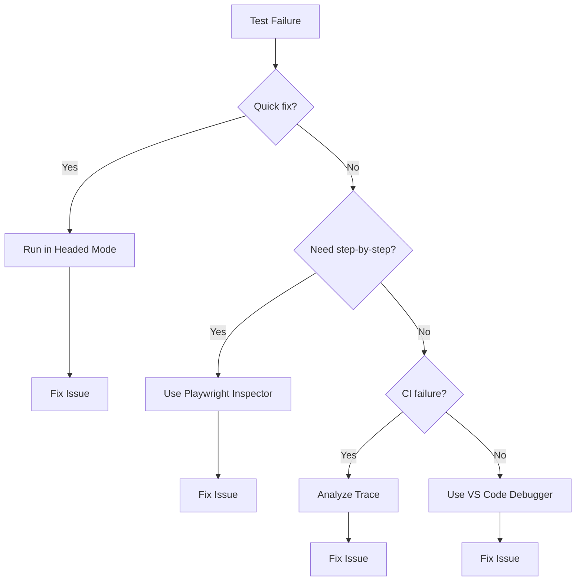
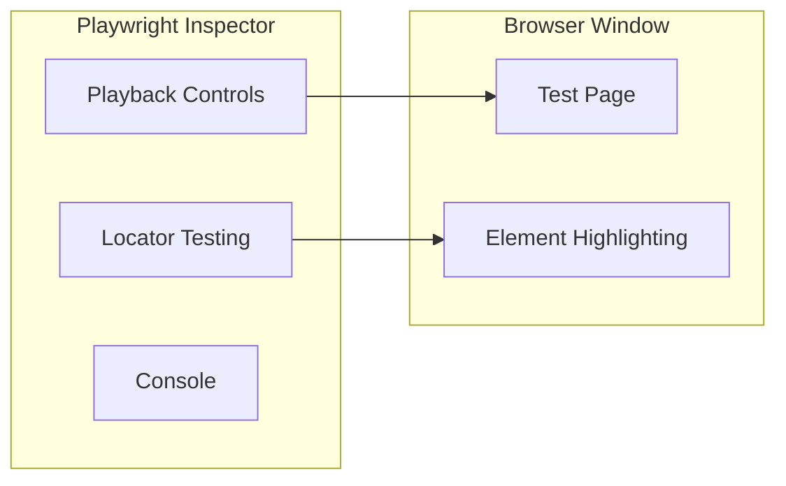

# How to Debug Playwright Test Failures

Author: [nawazdhandala](https://github.com/nawazdhandala)

Tags: Playwright, Testing, Debugging, E2E Testing, Test Automation, Troubleshooting

Description: Learn practical techniques to debug Playwright test failures using headed mode, breakpoints, Playwright Inspector, and trace analysis.

---

Test failures are inevitable. What separates efficient debugging from hours of frustration is knowing which tools to use and when. Playwright provides multiple debugging approaches, from watching tests run in real-time to stepping through code with breakpoints.

## Debugging Workflow Overview



## Running Tests in Headed Mode

The simplest debugging technique. Watch your test execute in a real browser.

```bash
# Run all tests with visible browser
npx playwright test --headed

# Run a specific test file
npx playwright test tests/login.spec.ts --headed

# Run a specific test by name
npx playwright test -g "should login successfully" --headed
```

Slow down execution to see what is happening:

```bash
# Add delay between actions (milliseconds)
npx playwright test --headed --slowmo=500
```

Or configure slowMo in playwright.config.ts:

```typescript
// playwright.config.ts
import { defineConfig } from '@playwright/test';

export default defineConfig({
  use: {
    // Slow down by 100ms between actions
    launchOptions: {
      slowMo: 100,
    },
  },
});
```

## Using the Playwright Inspector

The Playwright Inspector is an interactive debugging tool that lets you step through tests, inspect selectors, and see live DOM state.

```bash
# Launch test with Playwright Inspector
npx playwright test --debug

# Debug a specific test
npx playwright test tests/checkout.spec.ts --debug
```

The Inspector provides:
- Step over, step into, resume controls
- Live selector testing
- DOM element highlighting
- Console access



## Adding Breakpoints in Code

Use `page.pause()` to stop execution and open the Inspector at a specific point.

```typescript
// tests/checkout.spec.ts
import { test, expect } from '@playwright/test';

test('checkout flow', async ({ page }) => {
  await page.goto('/products');
  await page.getByText('Product A').click();
  await page.getByRole('button', { name: 'Add to cart' }).click();

  // Pause here to inspect cart state
  await page.pause();

  await page.goto('/cart');
  await expect(page.getByText('Product A')).toBeVisible();

  // Pause before payment
  await page.pause();

  await page.getByRole('button', { name: 'Checkout' }).click();
});
```

When execution pauses, you can:
- Inspect the current page state
- Test selectors in the Inspector console
- Step through remaining actions
- Resume execution

## Debugging with VS Code

Playwright integrates with VS Code for full debugging capabilities.

### Setting Up VS Code Debugging

Create a launch configuration:

```json
// .vscode/launch.json
{
  "version": "0.2.0",
  "configurations": [
    {
      "name": "Debug Playwright Tests",
      "type": "node",
      "request": "launch",
      "program": "${workspaceFolder}/node_modules/.bin/playwright",
      "args": ["test", "--headed", "${file}"],
      "cwd": "${workspaceFolder}",
      "console": "integratedTerminal"
    },
    {
      "name": "Debug Current Test",
      "type": "node",
      "request": "launch",
      "program": "${workspaceFolder}/node_modules/.bin/playwright",
      "args": ["test", "--headed", "-g", "${selectedText}"],
      "cwd": "${workspaceFolder}",
      "console": "integratedTerminal"
    }
  ]
}
```

### Using the Playwright VS Code Extension

Install the official Playwright extension for enhanced debugging:

1. Set breakpoints by clicking line numbers
2. Right-click a test and select "Debug Test"
3. Use the Debug panel to step through code
4. Inspect variables and call stack

```typescript
// tests/form.spec.ts
import { test, expect } from '@playwright/test';

test('form submission', async ({ page }) => {
  await page.goto('/contact');

  // Set a breakpoint on this line in VS Code
  const emailInput = page.getByLabel('Email');
  await emailInput.fill('test@example.com');

  // Inspect emailInput variable while paused
  const messageInput = page.getByLabel('Message');
  await messageInput.fill('Hello world');

  await page.getByRole('button', { name: 'Submit' }).click();

  // Check response in debugger
  await expect(page.getByText('Thank you')).toBeVisible();
});
```

## Debugging Selector Issues

Most test failures involve selectors. Use these techniques to diagnose selector problems.

### Testing Selectors in the Browser

```typescript
// tests/selector-debug.spec.ts
import { test, expect } from '@playwright/test';

test('debug selectors', async ({ page }) => {
  await page.goto('/dashboard');

  // Method 1: Use page.pause() and test in Inspector
  await page.pause();

  // Method 2: Log selector matches
  const buttons = page.getByRole('button');
  console.log('Button count:', await buttons.count());

  // Method 3: Evaluate selector in browser console
  const elements = await page.evaluate(() => {
    return document.querySelectorAll('button').length;
  });
  console.log('Native selector count:', elements);
});
```

### Using Playwright Codegen for Selector Discovery

Generate selectors by recording interactions:

```bash
# Open codegen and interact with your page
npx playwright codegen http://localhost:3000
```

Codegen shows you the selectors Playwright would use, helping you understand why your selector might not work.

## Debugging Timing Issues

Flaky tests often have timing problems. Here is how to diagnose them.

### Adding Verbose Waiting

```typescript
// tests/timing-debug.spec.ts
import { test, expect } from '@playwright/test';

test('debug timing', async ({ page }) => {
  await page.goto('/dashboard');

  // Wait for network to settle
  await page.waitForLoadState('networkidle');
  console.log('Network idle');

  // Wait for specific element with timeout info
  const start = Date.now();
  await page.waitForSelector('[data-testid="data-loaded"]', {
    state: 'visible',
    timeout: 10000,
  });
  console.log(`Element appeared after ${Date.now() - start}ms`);

  // Check if element is in viewport
  const element = page.getByTestId('important-button');
  const isVisible = await element.isVisible();
  const boundingBox = await element.boundingBox();
  console.log('Visible:', isVisible, 'BoundingBox:', boundingBox);
});
```

### Debugging Race Conditions

```typescript
// tests/race-condition.spec.ts
import { test, expect } from '@playwright/test';

test('debug race condition', async ({ page }) => {
  // Enable request logging
  page.on('request', request => {
    console.log('Request:', request.method(), request.url());
  });

  page.on('response', response => {
    console.log('Response:', response.status(), response.url());
  });

  await page.goto('/dashboard');

  // Wait for the specific API call to complete
  const responsePromise = page.waitForResponse(
    response => response.url().includes('/api/data') && response.status() === 200
  );

  await page.getByRole('button', { name: 'Load data' }).click();

  const response = await responsePromise;
  console.log('API response received:', await response.json());

  // Now the data should be ready
  await expect(page.getByTestId('data-item')).toBeVisible();
});
```

## Debugging Network Issues

Capture and analyze network traffic during test execution.

```typescript
// tests/network-debug.spec.ts
import { test, expect } from '@playwright/test';

test('debug network requests', async ({ page }) => {
  const requests: string[] = [];
  const responses: { url: string; status: number }[] = [];
  const errors: string[] = [];

  // Log all requests
  page.on('request', request => {
    requests.push(`${request.method()} ${request.url()}`);
  });

  // Log all responses
  page.on('response', response => {
    responses.push({
      url: response.url(),
      status: response.status(),
    });
  });

  // Log request failures
  page.on('requestfailed', request => {
    errors.push(`FAILED: ${request.url()} - ${request.failure()?.errorText}`);
  });

  await page.goto('/app');
  await page.getByRole('button', { name: 'Fetch data' }).click();
  await page.waitForLoadState('networkidle');

  // Output collected data
  console.log('Requests made:', requests);
  console.log('Responses received:', responses);
  console.log('Failed requests:', errors);

  // Check for expected API calls
  const apiCallMade = requests.some(r => r.includes('/api/data'));
  expect(apiCallMade).toBe(true);
});
```

## Debugging Console Errors

Capture browser console output to find JavaScript errors.

```typescript
// tests/console-debug.spec.ts
import { test, expect } from '@playwright/test';

test('debug console errors', async ({ page }) => {
  const consoleLogs: { type: string; text: string }[] = [];
  const pageErrors: string[] = [];

  // Capture console messages
  page.on('console', msg => {
    consoleLogs.push({
      type: msg.type(),
      text: msg.text(),
    });

    // Log errors immediately
    if (msg.type() === 'error') {
      console.log('Console error:', msg.text());
    }
  });

  // Capture page crashes and errors
  page.on('pageerror', error => {
    pageErrors.push(error.message);
    console.log('Page error:', error.message);
  });

  await page.goto('/app');
  await page.getByRole('button', { name: 'Trigger action' }).click();

  // Wait for potential async errors
  await page.waitForTimeout(1000);

  // Report findings
  console.log('All console logs:', consoleLogs);
  console.log('Page errors:', pageErrors);

  // Assert no errors occurred
  const errorLogs = consoleLogs.filter(log => log.type === 'error');
  expect(errorLogs).toHaveLength(0);
  expect(pageErrors).toHaveLength(0);
});
```

## Debugging CI Failures

When tests pass locally but fail in CI, use these techniques.

### Screenshot on Failure

```typescript
// playwright.config.ts
import { defineConfig } from '@playwright/test';

export default defineConfig({
  use: {
    screenshot: 'only-on-failure',
    video: 'retain-on-failure',
    trace: 'on-first-retry',
  },
  retries: process.env.CI ? 2 : 0,
});
```

### Custom Failure Handler

```typescript
// tests/with-debug-info.spec.ts
import { test, expect } from '@playwright/test';

test.afterEach(async ({ page }, testInfo) => {
  if (testInfo.status !== 'passed') {
    // Capture additional debug info on failure
    const debugInfo = {
      url: page.url(),
      title: await page.title(),
      viewportSize: page.viewportSize(),
      timestamp: new Date().toISOString(),
    };

    console.log('Test failed. Debug info:', JSON.stringify(debugInfo, null, 2));

    // Capture HTML snapshot
    const html = await page.content();
    await testInfo.attach('page-html', {
      body: html,
      contentType: 'text/html',
    });

    // Capture all visible text
    const visibleText = await page.evaluate(() => document.body.innerText);
    await testInfo.attach('visible-text', {
      body: visibleText,
      contentType: 'text/plain',
    });
  }
});

test('example test', async ({ page }) => {
  await page.goto('/dashboard');
  await expect(page.getByText('Welcome')).toBeVisible();
});
```

### Environment Comparison

```typescript
// tests/env-debug.spec.ts
import { test, expect } from '@playwright/test';

test.beforeAll(async () => {
  console.log('Environment:', {
    nodeVersion: process.version,
    platform: process.platform,
    ci: process.env.CI,
    baseUrl: process.env.BASE_URL,
    timezone: Intl.DateTimeFormat().resolvedOptions().timeZone,
  });
});

test('timezone-sensitive test', async ({ page }) => {
  await page.goto('/schedule');

  // Log browser timezone
  const browserTimezone = await page.evaluate(
    () => Intl.DateTimeFormat().resolvedOptions().timeZone
  );
  console.log('Browser timezone:', browserTimezone);

  // Continue with test
});
```

## Creating a Debug Helper

Build a reusable debug utility for your tests.

```typescript
// utils/debugHelper.ts
import { Page, TestInfo } from '@playwright/test';

export class DebugHelper {
  constructor(private page: Page, private testInfo: TestInfo) {}

  async captureState(label: string): Promise<void> {
    const state = {
      label,
      url: this.page.url(),
      timestamp: new Date().toISOString(),
    };

    console.log(`[DEBUG] ${label}:`, state);

    await this.testInfo.attach(`debug-${label}`, {
      body: JSON.stringify(state, null, 2),
      contentType: 'application/json',
    });

    await this.page.screenshot({
      path: `debug-screenshots/${label}-${Date.now()}.png`,
    });
  }

  async logElement(selector: string): Promise<void> {
    const element = this.page.locator(selector);
    const count = await element.count();

    console.log(`[DEBUG] Selector "${selector}":`, {
      count,
      visible: count > 0 ? await element.first().isVisible() : false,
      enabled: count > 0 ? await element.first().isEnabled() : false,
    });
  }

  async waitAndLog(selector: string, timeout = 5000): Promise<void> {
    const start = Date.now();
    try {
      await this.page.waitForSelector(selector, { timeout });
      console.log(`[DEBUG] "${selector}" found after ${Date.now() - start}ms`);
    } catch (error) {
      console.log(`[DEBUG] "${selector}" NOT found after ${timeout}ms`);
      await this.captureState(`timeout-${selector.replace(/[^a-z0-9]/gi, '-')}`);
      throw error;
    }
  }
}
```

```typescript
// tests/with-debug-helper.spec.ts
import { test, expect } from '@playwright/test';
import { DebugHelper } from '../utils/debugHelper';

test('complex flow with debugging', async ({ page }, testInfo) => {
  const debug = new DebugHelper(page, testInfo);

  await page.goto('/wizard');
  await debug.captureState('initial-load');

  await page.getByRole('button', { name: 'Start' }).click();
  await debug.waitAndLog('[data-testid="step-1"]');

  await page.getByLabel('Name').fill('Test User');
  await debug.logElement('[data-testid="next-button"]');

  await page.getByTestId('next-button').click();
  await debug.captureState('after-step-1');

  await expect(page.getByTestId('step-2')).toBeVisible();
});
```

---

Effective debugging comes down to choosing the right tool for the situation. For quick visual checks, use headed mode with slowMo. For interactive exploration, use the Playwright Inspector or page.pause(). For CI failures, rely on traces and screenshots. Build up a debugging toolkit with helper utilities, and you will spend less time scratching your head and more time shipping reliable tests.
