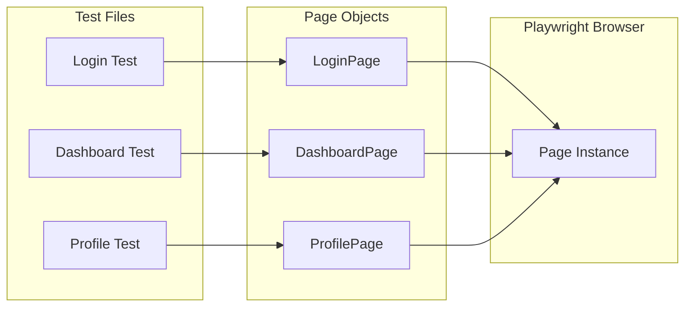
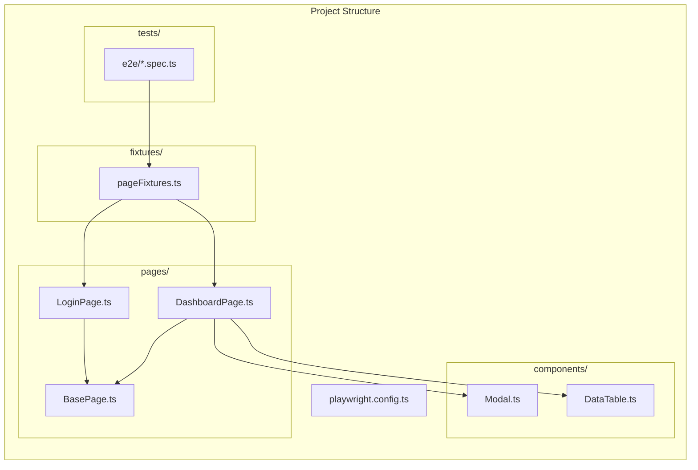

# How to Implement Playwright Page Object Pattern

Author: [nawazdhandala](https://github.com/nawazdhandala)

Tags: Playwright, Testing, Page Object Pattern, E2E Testing, Test Automation, TypeScript

Description: Learn how to implement the Page Object Pattern in Playwright to create maintainable, reusable, and scalable end-to-end tests.

---

The Page Object Pattern is a design pattern that creates an abstraction layer between your test code and the page-specific code. Instead of scattering selectors and page interactions throughout your tests, you encapsulate them in dedicated classes. This approach makes tests more readable, reduces duplication, and simplifies maintenance when UI changes occur.

## Why Use the Page Object Pattern

When you write Playwright tests without any structure, you end up with selectors and interactions scattered across test files. A simple button class change can break dozens of tests. The Page Object Pattern solves this by centralizing page interactions in one place.



## Basic Page Object Structure

Start with a base page class that provides common functionality all pages will need.

```typescript
// pages/BasePage.ts
import { Page, Locator } from '@playwright/test';

export class BasePage {
  readonly page: Page;

  constructor(page: Page) {
    this.page = page;
  }

  // Navigate to a specific URL
  async navigate(path: string): Promise<void> {
    await this.page.goto(path);
  }

  // Wait for page to be fully loaded
  async waitForPageLoad(): Promise<void> {
    await this.page.waitForLoadState('networkidle');
  }

  // Get page title
  async getTitle(): Promise<string> {
    return this.page.title();
  }

  // Take a screenshot with a descriptive name
  async screenshot(name: string): Promise<void> {
    await this.page.screenshot({ path: `screenshots/${name}.png` });
  }
}
```

## Creating a Login Page Object

The login page is a common starting point. Notice how all selectors are defined as class properties, making them easy to update.

```typescript
// pages/LoginPage.ts
import { Page, Locator, expect } from '@playwright/test';
import { BasePage } from './BasePage';

export class LoginPage extends BasePage {
  // Define all selectors as readonly properties
  readonly emailInput: Locator;
  readonly passwordInput: Locator;
  readonly loginButton: Locator;
  readonly errorMessage: Locator;
  readonly forgotPasswordLink: Locator;
  readonly rememberMeCheckbox: Locator;

  constructor(page: Page) {
    super(page);

    // Initialize locators - update these when UI changes
    this.emailInput = page.getByLabel('Email');
    this.passwordInput = page.getByLabel('Password');
    this.loginButton = page.getByRole('button', { name: 'Sign in' });
    this.errorMessage = page.getByTestId('login-error');
    this.forgotPasswordLink = page.getByRole('link', { name: 'Forgot password?' });
    this.rememberMeCheckbox = page.getByLabel('Remember me');
  }

  // Navigate to login page
  async goto(): Promise<void> {
    await this.navigate('/login');
    await this.waitForPageLoad();
  }

  // Perform login with credentials
  async login(email: string, password: string): Promise<void> {
    await this.emailInput.fill(email);
    await this.passwordInput.fill(password);
    await this.loginButton.click();
  }

  // Login with remember me option
  async loginWithRememberMe(email: string, password: string): Promise<void> {
    await this.emailInput.fill(email);
    await this.passwordInput.fill(password);
    await this.rememberMeCheckbox.check();
    await this.loginButton.click();
  }

  // Get error message text
  async getErrorMessage(): Promise<string> {
    await this.errorMessage.waitFor({ state: 'visible' });
    return this.errorMessage.textContent() ?? '';
  }

  // Check if login form is visible
  async isVisible(): Promise<boolean> {
    return this.loginButton.isVisible();
  }

  // Verify successful login by checking redirect
  async expectSuccessfulLogin(): Promise<void> {
    await expect(this.page).toHaveURL(/\/dashboard/);
  }
}
```

## Creating a Dashboard Page Object

After login, users typically land on a dashboard. This page object demonstrates handling more complex interactions.

```typescript
// pages/DashboardPage.ts
import { Page, Locator, expect } from '@playwright/test';
import { BasePage } from './BasePage';

export class DashboardPage extends BasePage {
  readonly welcomeMessage: Locator;
  readonly userMenu: Locator;
  readonly logoutButton: Locator;
  readonly navigationMenu: Locator;
  readonly notificationBell: Locator;
  readonly notificationCount: Locator;
  readonly searchInput: Locator;

  constructor(page: Page) {
    super(page);

    this.welcomeMessage = page.getByTestId('welcome-message');
    this.userMenu = page.getByTestId('user-menu');
    this.logoutButton = page.getByRole('button', { name: 'Logout' });
    this.navigationMenu = page.getByRole('navigation');
    this.notificationBell = page.getByTestId('notification-bell');
    this.notificationCount = page.getByTestId('notification-count');
    this.searchInput = page.getByPlaceholder('Search...');
  }

  async goto(): Promise<void> {
    await this.navigate('/dashboard');
    await this.waitForPageLoad();
  }

  // Get the welcome message text
  async getWelcomeText(): Promise<string> {
    return this.welcomeMessage.textContent() ?? '';
  }

  // Open user dropdown menu
  async openUserMenu(): Promise<void> {
    await this.userMenu.click();
    // Wait for menu animation
    await this.page.waitForTimeout(300);
  }

  // Perform logout
  async logout(): Promise<void> {
    await this.openUserMenu();
    await this.logoutButton.click();
    await expect(this.page).toHaveURL(/\/login/);
  }

  // Navigate using sidebar menu
  async navigateTo(menuItem: string): Promise<void> {
    await this.navigationMenu.getByRole('link', { name: menuItem }).click();
    await this.waitForPageLoad();
  }

  // Get notification count
  async getNotificationCount(): Promise<number> {
    const text = await this.notificationCount.textContent();
    return parseInt(text ?? '0', 10);
  }

  // Perform search
  async search(query: string): Promise<void> {
    await this.searchInput.fill(query);
    await this.searchInput.press('Enter');
    await this.waitForPageLoad();
  }

  // Verify dashboard is loaded
  async expectLoaded(): Promise<void> {
    await expect(this.welcomeMessage).toBeVisible();
    await expect(this.navigationMenu).toBeVisible();
  }
}
```

## Handling Components with Reusable Page Objects

Many applications have reusable components like modals, tables, or forms. Create component classes for these.

```typescript
// components/Modal.ts
import { Page, Locator } from '@playwright/test';

export class Modal {
  readonly page: Page;
  readonly container: Locator;
  readonly title: Locator;
  readonly closeButton: Locator;
  readonly confirmButton: Locator;
  readonly cancelButton: Locator;

  constructor(page: Page, testId: string = 'modal') {
    this.page = page;
    this.container = page.getByTestId(testId);
    this.title = this.container.getByRole('heading');
    this.closeButton = this.container.getByRole('button', { name: 'Close' });
    this.confirmButton = this.container.getByRole('button', { name: 'Confirm' });
    this.cancelButton = this.container.getByRole('button', { name: 'Cancel' });
  }

  async waitForOpen(): Promise<void> {
    await this.container.waitFor({ state: 'visible' });
  }

  async waitForClose(): Promise<void> {
    await this.container.waitFor({ state: 'hidden' });
  }

  async close(): Promise<void> {
    await this.closeButton.click();
    await this.waitForClose();
  }

  async confirm(): Promise<void> {
    await this.confirmButton.click();
    await this.waitForClose();
  }

  async cancel(): Promise<void> {
    await this.cancelButton.click();
    await this.waitForClose();
  }

  async getTitle(): Promise<string> {
    return this.title.textContent() ?? '';
  }
}
```

```typescript
// components/DataTable.ts
import { Page, Locator } from '@playwright/test';

export class DataTable {
  readonly page: Page;
  readonly table: Locator;
  readonly rows: Locator;
  readonly headers: Locator;
  readonly emptyState: Locator;
  readonly pagination: Locator;

  constructor(page: Page, tableTestId: string = 'data-table') {
    this.page = page;
    this.table = page.getByTestId(tableTestId);
    this.rows = this.table.locator('tbody tr');
    this.headers = this.table.locator('thead th');
    this.emptyState = this.table.getByTestId('empty-state');
    this.pagination = page.getByTestId('pagination');
  }

  async getRowCount(): Promise<number> {
    return this.rows.count();
  }

  async getRowByIndex(index: number): Promise<Locator> {
    return this.rows.nth(index);
  }

  async getCellValue(rowIndex: number, columnIndex: number): Promise<string> {
    const row = this.rows.nth(rowIndex);
    const cell = row.locator('td').nth(columnIndex);
    return cell.textContent() ?? '';
  }

  async clickRowAction(rowIndex: number, actionName: string): Promise<void> {
    const row = this.rows.nth(rowIndex);
    await row.getByRole('button', { name: actionName }).click();
  }

  async sortByColumn(columnName: string): Promise<void> {
    await this.headers.filter({ hasText: columnName }).click();
  }

  async goToPage(pageNumber: number): Promise<void> {
    await this.pagination.getByRole('button', { name: String(pageNumber) }).click();
  }

  async isEmpty(): Promise<boolean> {
    return this.emptyState.isVisible();
  }
}
```

## Composing Page Objects with Components

Use composition to include components in page objects.

```typescript
// pages/UsersPage.ts
import { Page, Locator, expect } from '@playwright/test';
import { BasePage } from './BasePage';
import { DataTable } from '../components/DataTable';
import { Modal } from '../components/Modal';

export class UsersPage extends BasePage {
  readonly addUserButton: Locator;
  readonly searchInput: Locator;
  readonly userTable: DataTable;
  readonly deleteModal: Modal;

  constructor(page: Page) {
    super(page);

    this.addUserButton = page.getByRole('button', { name: 'Add User' });
    this.searchInput = page.getByPlaceholder('Search users...');

    // Compose with reusable components
    this.userTable = new DataTable(page, 'users-table');
    this.deleteModal = new Modal(page, 'delete-confirmation');
  }

  async goto(): Promise<void> {
    await this.navigate('/users');
    await this.waitForPageLoad();
  }

  async searchUsers(query: string): Promise<void> {
    await this.searchInput.fill(query);
    await this.searchInput.press('Enter');
    await this.page.waitForLoadState('networkidle');
  }

  async deleteUserByIndex(index: number): Promise<void> {
    await this.userTable.clickRowAction(index, 'Delete');
    await this.deleteModal.waitForOpen();
    await this.deleteModal.confirm();
  }

  async getUserCount(): Promise<number> {
    return this.userTable.getRowCount();
  }

  async expectUserInTable(email: string): Promise<void> {
    const row = this.userTable.rows.filter({ hasText: email });
    await expect(row).toBeVisible();
  }
}
```

## Writing Tests with Page Objects

Now tests become clean and readable.

```typescript
// tests/login.spec.ts
import { test, expect } from '@playwright/test';
import { LoginPage } from '../pages/LoginPage';
import { DashboardPage } from '../pages/DashboardPage';

test.describe('Login functionality', () => {
  let loginPage: LoginPage;
  let dashboardPage: DashboardPage;

  test.beforeEach(async ({ page }) => {
    loginPage = new LoginPage(page);
    dashboardPage = new DashboardPage(page);
    await loginPage.goto();
  });

  test('should login successfully with valid credentials', async () => {
    await loginPage.login('user@example.com', 'password123');
    await loginPage.expectSuccessfulLogin();
    await dashboardPage.expectLoaded();

    const welcomeText = await dashboardPage.getWelcomeText();
    expect(welcomeText).toContain('Welcome');
  });

  test('should show error with invalid credentials', async () => {
    await loginPage.login('invalid@example.com', 'wrongpassword');

    const errorMessage = await loginPage.getErrorMessage();
    expect(errorMessage).toContain('Invalid email or password');
  });

  test('should logout successfully', async () => {
    await loginPage.login('user@example.com', 'password123');
    await dashboardPage.expectLoaded();
    await dashboardPage.logout();

    expect(await loginPage.isVisible()).toBe(true);
  });
});
```

```typescript
// tests/users.spec.ts
import { test, expect } from '@playwright/test';
import { LoginPage } from '../pages/LoginPage';
import { UsersPage } from '../pages/UsersPage';

test.describe('User management', () => {
  let loginPage: LoginPage;
  let usersPage: UsersPage;

  test.beforeEach(async ({ page }) => {
    loginPage = new LoginPage(page);
    usersPage = new UsersPage(page);

    // Login first
    await loginPage.goto();
    await loginPage.login('admin@example.com', 'adminpass');
    await usersPage.goto();
  });

  test('should display users in table', async () => {
    const userCount = await usersPage.getUserCount();
    expect(userCount).toBeGreaterThan(0);
  });

  test('should search for users', async () => {
    await usersPage.searchUsers('john');
    await usersPage.expectUserInTable('john@example.com');
  });

  test('should delete a user', async () => {
    const initialCount = await usersPage.getUserCount();
    await usersPage.deleteUserByIndex(0);

    const newCount = await usersPage.getUserCount();
    expect(newCount).toBe(initialCount - 1);
  });
});
```

## Using Fixtures for Page Object Injection

Playwright fixtures can automatically provide page objects to tests.

```typescript
// fixtures/pageFixtures.ts
import { test as base } from '@playwright/test';
import { LoginPage } from '../pages/LoginPage';
import { DashboardPage } from '../pages/DashboardPage';
import { UsersPage } from '../pages/UsersPage';

// Declare fixture types
type PageFixtures = {
  loginPage: LoginPage;
  dashboardPage: DashboardPage;
  usersPage: UsersPage;
  authenticatedPage: DashboardPage;
};

// Extend base test with page object fixtures
export const test = base.extend<PageFixtures>({
  loginPage: async ({ page }, use) => {
    const loginPage = new LoginPage(page);
    await use(loginPage);
  },

  dashboardPage: async ({ page }, use) => {
    const dashboardPage = new DashboardPage(page);
    await use(dashboardPage);
  },

  usersPage: async ({ page }, use) => {
    const usersPage = new UsersPage(page);
    await use(usersPage);
  },

  // Fixture that provides already authenticated state
  authenticatedPage: async ({ page }, use) => {
    const loginPage = new LoginPage(page);
    const dashboardPage = new DashboardPage(page);

    await loginPage.goto();
    await loginPage.login('user@example.com', 'password123');
    await dashboardPage.expectLoaded();

    await use(dashboardPage);
  },
});

export { expect } from '@playwright/test';
```

```typescript
// tests/dashboard.spec.ts
import { test, expect } from '../fixtures/pageFixtures';

test.describe('Dashboard with fixtures', () => {
  test('should load dashboard after login', async ({ loginPage, dashboardPage }) => {
    await loginPage.goto();
    await loginPage.login('user@example.com', 'password123');
    await dashboardPage.expectLoaded();
  });

  test('should show notifications', async ({ authenticatedPage }) => {
    // Already logged in via fixture
    const count = await authenticatedPage.getNotificationCount();
    expect(count).toBeGreaterThanOrEqual(0);
  });
});
```

## Project Structure

Organize your page objects in a clear folder structure.

```
tests/
  e2e/
    login.spec.ts
    dashboard.spec.ts
    users.spec.ts
pages/
  BasePage.ts
  LoginPage.ts
  DashboardPage.ts
  UsersPage.ts
components/
  Modal.ts
  DataTable.ts
  Form.ts
fixtures/
  pageFixtures.ts
  testData.ts
playwright.config.ts
```



## Best Practices

When implementing the Page Object Pattern, keep these principles in mind:

1. **Single Responsibility**: Each page object should represent one page or component
2. **No Assertions in Page Objects**: Keep assertions in test files, not page objects (except for wait conditions)
3. **Meaningful Method Names**: Use action-oriented names like `login()`, `submitForm()`, `deleteUser()`
4. **Return Types**: Methods that navigate should return the new page object
5. **Lazy Initialization**: Initialize locators in the constructor, but interact with elements in methods

```typescript
// Example of returning new page object on navigation
async clickCreateAccount(): Promise<RegistrationPage> {
  await this.createAccountLink.click();
  return new RegistrationPage(this.page);
}
```

---

The Page Object Pattern transforms chaotic test code into maintainable, readable tests. By encapsulating page interactions in dedicated classes, you create a single source of truth for selectors and behaviors. When the UI changes, you update one file instead of hunting through dozens of tests. Combined with Playwright fixtures, this pattern enables clean, scalable test automation that your team will actually enjoy working with.
