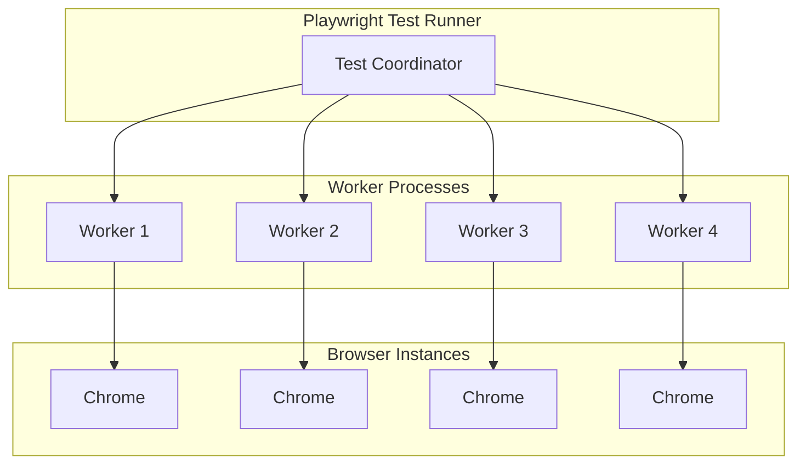
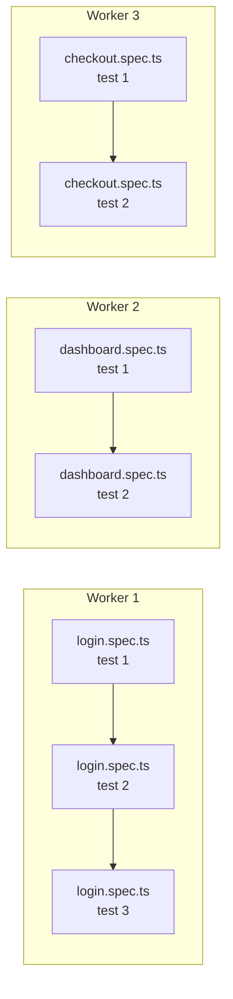
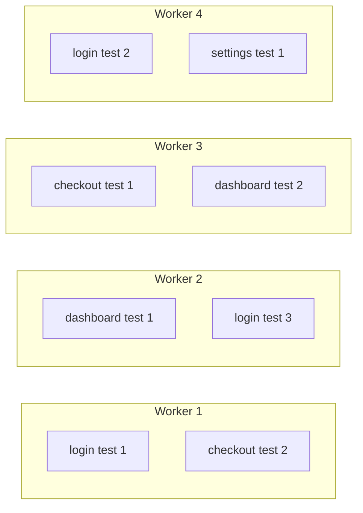
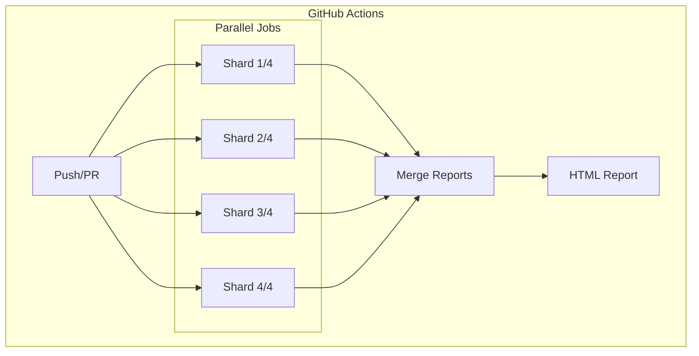
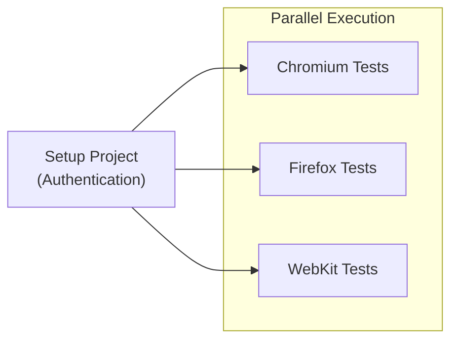

# How to Configure Playwright Parallel Execution

Author: [nawazdhandala](https://github.com/nawazdhandala)

Tags: Playwright, Testing, Parallel Testing, E2E Testing, Performance, CI/CD

Description: Learn how to configure Playwright parallel test execution to reduce test suite runtime while maintaining test isolation and reliability.

---

Running tests in parallel can dramatically reduce your test suite execution time. A test suite that takes 30 minutes sequentially might complete in 5 minutes with proper parallelization. Playwright supports parallelism at multiple levels, from running test files concurrently to executing individual tests within a file simultaneously.

## Understanding Playwright Parallelism

Playwright uses worker processes to run tests in parallel. Each worker is an independent process with its own browser instance, ensuring complete test isolation.



## Basic Parallel Configuration

Configure the number of parallel workers in your Playwright config.

```typescript
// playwright.config.ts
import { defineConfig } from '@playwright/test';

export default defineConfig({
  // Number of parallel workers
  // Use 50% of CPU cores by default
  workers: process.env.CI ? 4 : '50%',

  // Fail the build on CI if tests are flaky
  forbidOnly: !!process.env.CI,

  // Retry failed tests
  retries: process.env.CI ? 2 : 0,
});
```

Worker configuration options:

| Value | Behavior |
|-------|----------|
| `1` | Run tests sequentially |
| `4` | Use exactly 4 workers |
| `'50%'` | Use half of available CPU cores |
| `'100%'` | Use all CPU cores |
| `undefined` | Default to half of CPU cores |

## Parallel Modes

Playwright offers different parallelization strategies depending on your needs.

### File-Level Parallelism (Default)

By default, Playwright runs test files in parallel, but tests within a file run sequentially.

```typescript
// playwright.config.ts
import { defineConfig } from '@playwright/test';

export default defineConfig({
  workers: 4,
  // This is the default - tests in a file run sequentially
  fullyParallel: false,
});
```



### Fully Parallel Mode

Enable fully parallel mode to run individual tests concurrently, regardless of which file they belong to.

```typescript
// playwright.config.ts
import { defineConfig } from '@playwright/test';

export default defineConfig({
  workers: 4,
  // Run all tests in parallel
  fullyParallel: true,
});
```



### Per-File Parallel Configuration

Override parallelism for specific test files.

```typescript
// tests/independent-tests.spec.ts
import { test, expect } from '@playwright/test';

// Enable parallel execution for tests in this file
test.describe.configure({ mode: 'parallel' });

test('test 1', async ({ page }) => {
  // Runs in parallel with test 2 and 3
});

test('test 2', async ({ page }) => {
  // Runs in parallel with test 1 and 3
});

test('test 3', async ({ page }) => {
  // Runs in parallel with test 1 and 2
});
```

```typescript
// tests/sequential-tests.spec.ts
import { test, expect } from '@playwright/test';

// Force sequential execution for tests in this file
test.describe.configure({ mode: 'serial' });

test('step 1 - create user', async ({ page }) => {
  // Must run first
});

test('step 2 - configure user', async ({ page }) => {
  // Depends on step 1
});

test('step 3 - verify user', async ({ page }) => {
  // Depends on step 2
});
```

## Test Isolation Strategies

Parallel tests must be isolated. They cannot share state or depend on each other.

### Isolating Database State

```typescript
// fixtures/dbFixture.ts
import { test as base } from '@playwright/test';
import { v4 as uuidv4 } from 'uuid';

type DbFixture = {
  testId: string;
  testUser: { email: string; id: string };
};

export const test = base.extend<DbFixture>({
  // Generate unique test ID for isolation
  testId: async ({}, use) => {
    await use(uuidv4());
  },

  // Create isolated test user
  testUser: async ({ testId }, use) => {
    const user = {
      email: `test-${testId}@example.com`,
      id: testId,
    };

    // Create user in database
    await createTestUser(user);

    // Provide user to test
    await use(user);

    // Cleanup after test
    await deleteTestUser(user.id);
  },
});

export { expect } from '@playwright/test';
```

```typescript
// tests/user-flow.spec.ts
import { test, expect } from '../fixtures/dbFixture';

test.describe.configure({ mode: 'parallel' });

test('user can update profile', async ({ page, testUser }) => {
  // Each parallel test gets its own user
  await page.goto('/login');
  await page.getByLabel('Email').fill(testUser.email);
  // ...
});

test('user can change password', async ({ page, testUser }) => {
  // Different isolated user, no conflicts
  await page.goto('/login');
  await page.getByLabel('Email').fill(testUser.email);
  // ...
});
```

### Isolating Browser State

Each worker gets a fresh browser context by default. For additional isolation within a worker:

```typescript
// tests/isolated-contexts.spec.ts
import { test, expect } from '@playwright/test';

test.describe.configure({ mode: 'parallel' });

test('test with fresh context', async ({ browser }) => {
  // Create a completely fresh context
  const context = await browser.newContext();
  const page = await context.newPage();

  await page.goto('/app');
  // ... test code

  await context.close();
});

test('test with specific viewport', async ({ browser }) => {
  const context = await browser.newContext({
    viewport: { width: 375, height: 667 },
    userAgent: 'Mobile Safari',
  });
  const page = await context.newPage();

  await page.goto('/app');
  // ... test code

  await context.close();
});
```

## Sharding for CI/CD

Distribute tests across multiple CI machines using sharding.

```typescript
// playwright.config.ts
import { defineConfig } from '@playwright/test';

export default defineConfig({
  workers: 4,
  fullyParallel: true,
});
```

Run sharded tests:

```bash
# Machine 1: Run first third of tests
npx playwright test --shard=1/3

# Machine 2: Run second third of tests
npx playwright test --shard=2/3

# Machine 3: Run final third of tests
npx playwright test --shard=3/3
```

### GitHub Actions Sharding

```yaml
# .github/workflows/e2e.yml
name: E2E Tests

on: [push, pull_request]

jobs:
  test:
    runs-on: ubuntu-latest
    strategy:
      fail-fast: false
      matrix:
        shard: [1, 2, 3, 4]

    steps:
      - uses: actions/checkout@v4

      - uses: actions/setup-node@v4
        with:
          node-version: 20

      - name: Install dependencies
        run: npm ci

      - name: Install Playwright
        run: npx playwright install --with-deps

      - name: Run tests
        run: npx playwright test --shard=${{ matrix.shard }}/4

      - name: Upload test results
        if: always()
        uses: actions/upload-artifact@v4
        with:
          name: test-results-${{ matrix.shard }}
          path: test-results/
          retention-days: 7

  merge-reports:
    needs: test
    runs-on: ubuntu-latest
    if: always()

    steps:
      - uses: actions/checkout@v4

      - uses: actions/setup-node@v4
        with:
          node-version: 20

      - name: Install dependencies
        run: npm ci

      - name: Download all test results
        uses: actions/download-artifact@v4
        with:
          pattern: test-results-*
          merge-multiple: true
          path: all-test-results/

      - name: Merge reports
        run: npx playwright merge-reports --reporter=html ./all-test-results

      - name: Upload merged report
        uses: actions/upload-artifact@v4
        with:
          name: playwright-report
          path: playwright-report/
          retention-days: 30
```



## Project-Based Parallelism

Run tests against multiple configurations in parallel using projects.

```typescript
// playwright.config.ts
import { defineConfig, devices } from '@playwright/test';

export default defineConfig({
  workers: 4,
  fullyParallel: true,

  projects: [
    // Desktop browsers
    {
      name: 'chromium',
      use: { ...devices['Desktop Chrome'] },
    },
    {
      name: 'firefox',
      use: { ...devices['Desktop Firefox'] },
    },
    {
      name: 'webkit',
      use: { ...devices['Desktop Safari'] },
    },

    // Mobile browsers
    {
      name: 'mobile-chrome',
      use: { ...devices['Pixel 5'] },
    },
    {
      name: 'mobile-safari',
      use: { ...devices['iPhone 12'] },
    },
  ],
});
```

Run specific projects:

```bash
# Run only Chromium tests
npx playwright test --project=chromium

# Run desktop browsers only
npx playwright test --project=chromium --project=firefox --project=webkit
```

## Optimizing Parallel Performance

### Balancing Test Duration

Playwright distributes tests to workers as they become available. Long-running tests can create bottlenecks.

```typescript
// Split long tests into smaller ones
// Before: One 60-second test
test('full user journey', async ({ page }) => {
  // 60 seconds of testing
});

// After: Multiple shorter tests
test.describe('user journey', () => {
  test('registration', async ({ page }) => {
    // 15 seconds
  });

  test('profile setup', async ({ page }) => {
    // 15 seconds
  });

  test('first purchase', async ({ page }) => {
    // 15 seconds
  });

  test('checkout', async ({ page }) => {
    // 15 seconds
  });
});
```

### Resource-Aware Configuration

Adjust workers based on available resources.

```typescript
// playwright.config.ts
import { defineConfig } from '@playwright/test';
import os from 'os';

const cpuCount = os.cpus().length;

export default defineConfig({
  workers: process.env.CI
    ? Math.min(4, cpuCount)  // Limit to 4 in CI
    : Math.max(1, Math.floor(cpuCount / 2)),  // Half locally

  // Limit memory-intensive projects
  projects: [
    {
      name: 'chromium',
      use: {
        launchOptions: {
          args: ['--disable-dev-shm-usage'], // Reduce memory in Docker
        },
      },
    },
  ],
});
```

### Grouping Related Tests

Use test tags to run related tests together.

```typescript
// tests/smoke.spec.ts
import { test, expect } from '@playwright/test';

test('login @smoke', async ({ page }) => {});
test('dashboard loads @smoke', async ({ page }) => {});
test('can create item @smoke', async ({ page }) => {});
```

```bash
# Run only smoke tests with high parallelism
npx playwright test --grep @smoke --workers=8

# Run all except smoke tests
npx playwright test --grep-invert @smoke
```

## Handling Shared Resources

When tests need to share expensive resources, use project dependencies.

```typescript
// playwright.config.ts
import { defineConfig } from '@playwright/test';

export default defineConfig({
  projects: [
    {
      name: 'setup',
      testMatch: /global.setup\.ts/,
    },
    {
      name: 'chromium',
      dependencies: ['setup'],  // Wait for setup
      use: {
        storageState: 'playwright/.auth/user.json',
      },
    },
    {
      name: 'firefox',
      dependencies: ['setup'],  // Wait for setup
      use: {
        storageState: 'playwright/.auth/user.json',
      },
    },
  ],
});
```

```typescript
// global.setup.ts
import { test as setup, expect } from '@playwright/test';

setup('authenticate', async ({ page }) => {
  await page.goto('/login');
  await page.getByLabel('Email').fill('user@example.com');
  await page.getByLabel('Password').fill('password123');
  await page.getByRole('button', { name: 'Sign in' }).click();

  await expect(page.getByText('Welcome')).toBeVisible();

  // Save authentication state
  await page.context().storageState({ path: 'playwright/.auth/user.json' });
});
```



## Monitoring Parallel Execution

Track parallel execution performance.

```typescript
// playwright.config.ts
import { defineConfig } from '@playwright/test';

export default defineConfig({
  workers: 4,

  reporter: [
    ['list'],
    ['json', { outputFile: 'test-results/results.json' }],
    ['html', { open: 'never' }],
  ],

  // Output timing info
  reportSlowTests: {
    max: 5,      // Report 5 slowest tests
    threshold: 15000,  // If longer than 15 seconds
  },
});
```

---

Parallel execution is essential for maintaining fast feedback loops as your test suite grows. Start with file-level parallelism, ensure your tests are properly isolated, then progressively enable fully parallel mode and sharding. Monitor execution times, split long tests, and use project dependencies for shared setup. With proper configuration, you can run hundreds of tests in minutes instead of hours.
