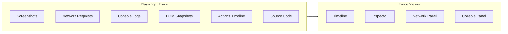
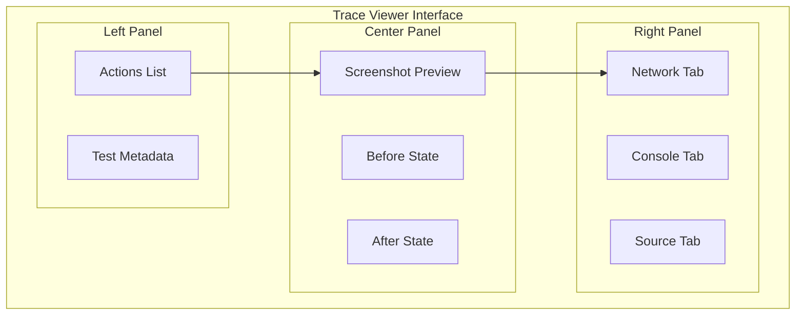

# How to Use Playwright Tracing

Author: [nawazdhandala](https://github.com/nawazdhandala)

Tags: Playwright, Testing, Tracing, Debugging, E2E Testing, Test Automation

Description: Learn how to use Playwright's built-in tracing feature to capture detailed test execution data including screenshots, network requests, and DOM snapshots.

---

Playwright tracing captures a complete record of your test execution. This includes screenshots at every action, network requests, console logs, and DOM snapshots. When a test fails in CI or behaves unexpectedly, traces give you the full picture without having to reproduce the issue locally.

## What Playwright Traces Capture

A Playwright trace is a ZIP file containing everything that happened during test execution:



## Basic Tracing Setup

Enable tracing in your Playwright configuration for all tests.

```typescript
// playwright.config.ts
import { defineConfig } from '@playwright/test';

export default defineConfig({
  use: {
    // Capture trace on first retry of failed test
    trace: 'on-first-retry',
  },
});
```

The `trace` option accepts several values:

| Value | Behavior |
|-------|----------|
| `'off'` | No traces recorded |
| `'on'` | Record trace for every test |
| `'on-first-retry'` | Record trace only on first retry after failure |
| `'retain-on-failure'` | Record trace but only keep on failure |

For CI environments, `'on-first-retry'` is typically the best choice. It avoids the overhead of tracing passing tests while ensuring you have traces for failures.

## Configuring Trace Options

Fine-tune what gets captured in traces.

```typescript
// playwright.config.ts
import { defineConfig } from '@playwright/test';

export default defineConfig({
  use: {
    trace: {
      mode: 'on-first-retry',
      // Capture screenshots in trace
      screenshots: true,
      // Capture DOM snapshots
      snapshots: true,
      // Capture source code in trace
      sources: true,
    },
  },
});
```

## Programmatic Tracing

Start and stop traces manually for specific scenarios.

```typescript
// tests/checkout.spec.ts
import { test, expect } from '@playwright/test';

test('complete checkout flow', async ({ page, context }) => {
  // Start tracing before the critical flow
  await context.tracing.start({
    screenshots: true,
    snapshots: true,
    sources: true,
  });

  try {
    // Perform checkout steps
    await page.goto('/cart');
    await page.getByRole('button', { name: 'Checkout' }).click();
    await page.getByLabel('Card number').fill('4242424242424242');
    await page.getByLabel('Expiry').fill('12/25');
    await page.getByLabel('CVC').fill('123');
    await page.getByRole('button', { name: 'Pay now' }).click();

    await expect(page.getByText('Payment successful')).toBeVisible();
  } finally {
    // Stop and save trace regardless of test outcome
    await context.tracing.stop({
      path: 'traces/checkout-flow.zip',
    });
  }
});
```

## Tracing Specific Test Sections

Capture traces for critical sections while skipping less important parts.

```typescript
// tests/user-journey.spec.ts
import { test, expect } from '@playwright/test';

test('user registration and first purchase', async ({ page, context }) => {
  // Section 1: Registration (trace this)
  await context.tracing.start({ screenshots: true, snapshots: true });

  await page.goto('/register');
  await page.getByLabel('Email').fill('newuser@example.com');
  await page.getByLabel('Password').fill('SecurePass123!');
  await page.getByRole('button', { name: 'Create account' }).click();
  await expect(page.getByText('Welcome')).toBeVisible();

  await context.tracing.stop({ path: 'traces/registration.zip' });

  // Section 2: Browse products (no trace needed)
  await page.goto('/products');
  await page.getByText('Featured Product').click();

  // Section 3: Checkout (trace this critical flow)
  await context.tracing.start({ screenshots: true, snapshots: true });

  await page.getByRole('button', { name: 'Add to cart' }).click();
  await page.goto('/checkout');
  await page.getByRole('button', { name: 'Complete purchase' }).click();
  await expect(page.getByText('Order confirmed')).toBeVisible();

  await context.tracing.stop({ path: 'traces/first-purchase.zip' });
});
```

## Creating Trace Chunks

For long-running tests, create multiple trace chunks to avoid large files.

```typescript
// tests/long-workflow.spec.ts
import { test, expect } from '@playwright/test';

test('multi-step workflow', async ({ page, context }) => {
  const steps = [
    { name: 'login', fn: async () => {
      await page.goto('/login');
      await page.getByLabel('Email').fill('user@example.com');
      await page.getByLabel('Password').fill('password123');
      await page.getByRole('button', { name: 'Sign in' }).click();
    }},
    { name: 'configure-settings', fn: async () => {
      await page.goto('/settings');
      await page.getByLabel('Theme').selectOption('dark');
      await page.getByRole('button', { name: 'Save' }).click();
    }},
    { name: 'create-project', fn: async () => {
      await page.goto('/projects/new');
      await page.getByLabel('Project name').fill('My Project');
      await page.getByRole('button', { name: 'Create' }).click();
    }},
  ];

  for (const step of steps) {
    await context.tracing.start({ screenshots: true, snapshots: true });

    try {
      await step.fn();
    } finally {
      await context.tracing.stop({
        path: `traces/${step.name}-${Date.now()}.zip`,
      });
    }
  }
});
```

## Viewing Traces

Open traces in the Playwright Trace Viewer.

```bash
# Open a specific trace file
npx playwright show-trace traces/checkout-flow.zip

# Open trace from test results
npx playwright show-trace test-results/checkout-complete-checkout-flow/trace.zip
```

The Trace Viewer provides several panels:



## CI Integration

Configure traces in CI to capture failures automatically.

```typescript
// playwright.config.ts
import { defineConfig } from '@playwright/test';

export default defineConfig({
  use: {
    // Only trace on CI
    trace: process.env.CI ? 'on-first-retry' : 'off',
  },

  // Retry failed tests once
  retries: process.env.CI ? 1 : 0,

  // Configure reporter to include trace links
  reporter: process.env.CI
    ? [['html', { open: 'never' }], ['github']]
    : [['html']],
});
```

### GitHub Actions Example

```yaml
# .github/workflows/e2e.yml
name: E2E Tests

on: [push, pull_request]

jobs:
  test:
    runs-on: ubuntu-latest

    steps:
      - uses: actions/checkout@v4

      - uses: actions/setup-node@v4
        with:
          node-version: 20

      - name: Install dependencies
        run: npm ci

      - name: Install Playwright browsers
        run: npx playwright install --with-deps

      - name: Run tests
        run: npx playwright test

      - name: Upload traces on failure
        if: failure()
        uses: actions/upload-artifact@v4
        with:
          name: playwright-traces
          path: test-results/
          retention-days: 7

      - name: Upload HTML report
        if: always()
        uses: actions/upload-artifact@v4
        with:
          name: playwright-report
          path: playwright-report/
          retention-days: 7
```

## Trace Fixtures for Automatic Capture

Create a custom fixture that automatically captures traces on failure.

```typescript
// fixtures/traceFixture.ts
import { test as base } from '@playwright/test';
import * as fs from 'fs';
import * as path from 'path';

export const test = base.extend({
  // Auto-tracing fixture
  autoTrace: [async ({ context }, use, testInfo) => {
    // Start tracing
    await context.tracing.start({
      screenshots: true,
      snapshots: true,
      sources: true,
    });

    // Run the test
    await use();

    // Determine trace path based on test outcome
    const tracePath = path.join(
      'traces',
      testInfo.status === 'passed' ? 'passed' : 'failed',
      `${testInfo.titlePath.join('-').replace(/\s+/g, '-')}.zip`
    );

    // Ensure directory exists
    fs.mkdirSync(path.dirname(tracePath), { recursive: true });

    // Stop tracing and save
    await context.tracing.stop({ path: tracePath });

    // Attach trace to test report
    await testInfo.attach('trace', {
      path: tracePath,
      contentType: 'application/zip',
    });
  }, { auto: true }],
});

export { expect } from '@playwright/test';
```

```typescript
// tests/with-auto-trace.spec.ts
import { test, expect } from '../fixtures/traceFixture';

test('automatically traced test', async ({ page }) => {
  await page.goto('/dashboard');
  await expect(page.getByText('Welcome')).toBeVisible();
  // Trace is automatically captured and saved
});
```

## Analyzing Network Activity in Traces

Traces capture all network requests, making it easy to debug API issues.

```typescript
// tests/api-dependent.spec.ts
import { test, expect } from '@playwright/test';

test('handles API errors gracefully', async ({ page, context }) => {
  await context.tracing.start({
    screenshots: true,
    snapshots: true,
  });

  // Mock API to return error
  await page.route('**/api/users', (route) => {
    route.fulfill({
      status: 500,
      body: JSON.stringify({ error: 'Internal server error' }),
    });
  });

  await page.goto('/users');

  // Verify error handling
  await expect(page.getByText('Failed to load users')).toBeVisible();
  await expect(page.getByRole('button', { name: 'Retry' })).toBeVisible();

  await context.tracing.stop({ path: 'traces/api-error-handling.zip' });
});
```

In the trace viewer, the Network tab shows:
- Request URL and method
- Response status and timing
- Request and response headers
- Request and response body

## Comparing Before and After States

Traces capture DOM snapshots before and after each action. This is invaluable for debugging flaky tests.

```typescript
// tests/form-interaction.spec.ts
import { test, expect } from '@playwright/test';

test('form validation shows errors', async ({ page, context }) => {
  await context.tracing.start({ screenshots: true, snapshots: true });

  await page.goto('/contact');

  // Submit empty form - trace captures state before and after
  await page.getByRole('button', { name: 'Submit' }).click();

  // Validation errors should appear
  await expect(page.getByText('Email is required')).toBeVisible();
  await expect(page.getByText('Message is required')).toBeVisible();

  // Fill valid data - trace shows form state change
  await page.getByLabel('Email').fill('test@example.com');
  await page.getByLabel('Message').fill('Hello world');

  // Submit again - trace captures successful submission
  await page.getByRole('button', { name: 'Submit' }).click();

  await expect(page.getByText('Message sent')).toBeVisible();

  await context.tracing.stop({ path: 'traces/form-validation.zip' });
});
```

## Trace Storage and Cleanup

Manage trace files to avoid disk space issues.

```typescript
// scripts/cleanup-traces.ts
import * as fs from 'fs';
import * as path from 'path';

const TRACES_DIR = 'traces';
const MAX_AGE_DAYS = 7;

function cleanupOldTraces(): void {
  const maxAgeMs = MAX_AGE_DAYS * 24 * 60 * 60 * 1000;
  const now = Date.now();

  function processDirectory(dir: string): void {
    if (!fs.existsSync(dir)) return;

    const entries = fs.readdirSync(dir, { withFileTypes: true });

    for (const entry of entries) {
      const fullPath = path.join(dir, entry.name);

      if (entry.isDirectory()) {
        processDirectory(fullPath);
        // Remove empty directories
        if (fs.readdirSync(fullPath).length === 0) {
          fs.rmdirSync(fullPath);
        }
      } else if (entry.name.endsWith('.zip')) {
        const stats = fs.statSync(fullPath);
        if (now - stats.mtimeMs > maxAgeMs) {
          fs.unlinkSync(fullPath);
          console.log(`Deleted old trace: ${fullPath}`);
        }
      }
    }
  }

  processDirectory(TRACES_DIR);
}

cleanupOldTraces();
```

Add to your CI pipeline:

```yaml
- name: Cleanup old traces
  run: npx ts-node scripts/cleanup-traces.ts
```

## Trace Viewer Keyboard Shortcuts

Navigate traces efficiently with keyboard shortcuts:

| Shortcut | Action |
|----------|--------|
| `Arrow Left/Right` | Navigate between actions |
| `Ctrl/Cmd + F` | Search in trace |
| `Ctrl/Cmd + G` | Go to specific time |
| `Space` | Play/pause timeline |
| `Escape` | Close dialogs |

---

Playwright tracing transforms debugging from guesswork into investigation. Instead of adding console.log statements and re-running tests, you get a complete recording of what happened. Screenshots show exactly what the user saw, network logs reveal API issues, and DOM snapshots let you inspect elements at any point in time. Enable tracing in CI, download traces from failed runs, and debug with confidence.
