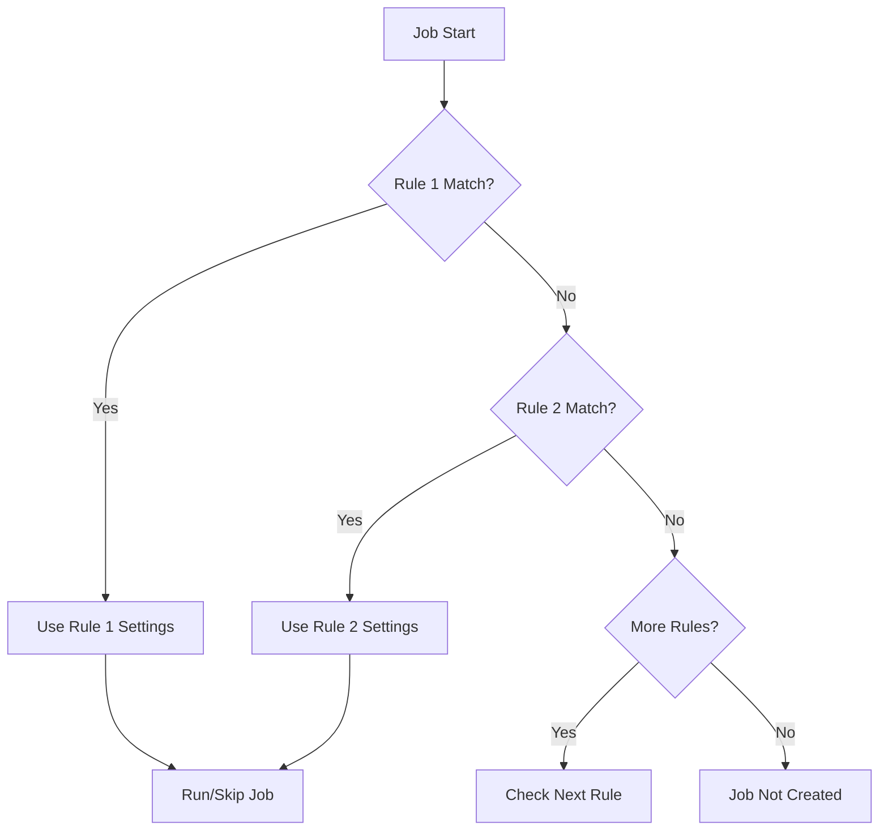

# How to Use Rules for Conditional Jobs in GitLab CI

Author: [nawazdhandala](https://www.github.com/nawazdhandala)

Tags: GitLab CI, Rules, Conditional Jobs, CI/CD, Pipeline Logic

Description: Learn how to use rules in GitLab CI to control when jobs run based on branches, file changes, variables, and complex conditions for optimized pipelines.

---

Not every job needs to run on every commit. Running deployment jobs on feature branches wastes resources. Running all tests when only documentation changed wastes time. GitLab CI rules let you control exactly when jobs execute. This guide covers rules syntax, common patterns, and advanced conditional logic.

## Rules vs Only/Except

GitLab CI has two systems for conditional jobs. The older `only/except` keywords are being phased out in favor of the more powerful `rules` keyword.

Rules advantages:
- More expressive conditions
- Support for `if`, `changes`, and `exists`
- Ability to set variables conditionally
- Clearer precedence and combination logic

Always use `rules` for new pipelines.

## Basic Rules Syntax

Rules evaluate conditions in order. The first matching rule determines the job's behavior.

```yaml
deploy:
  script:
    - ./deploy.sh
  rules:
    # Run on main branch
    - if: $CI_COMMIT_BRANCH == "main"
    # Run on tags
    - if: $CI_COMMIT_TAG
    # Don't run otherwise (implicit)
```

Each rule can specify:
- `if`: Condition expression
- `changes`: File path patterns
- `exists`: Check if files exist
- `when`: When to run (on_success, manual, never, delayed)
- `allow_failure`: Whether failure blocks the pipeline
- `variables`: Variables to set when this rule matches

## Condition Expressions

The `if` keyword supports various comparisons.

```yaml
job:
  rules:
    # Equality
    - if: $CI_COMMIT_BRANCH == "main"

    # Inequality
    - if: $CI_COMMIT_BRANCH != "develop"

    # Regex match
    - if: $CI_COMMIT_BRANCH =~ /^feature\//

    # Regex not match
    - if: $CI_COMMIT_BRANCH !~ /^release\//

    # Variable exists (not empty)
    - if: $DEPLOY_TOKEN

    # Variable is null or empty
    - if: $OPTIONAL_VAR == null

    # Combined conditions with &&
    - if: $CI_COMMIT_BRANCH == "main" && $CI_PIPELINE_SOURCE == "push"

    # Combined conditions with ||
    - if: $CI_COMMIT_TAG || $CI_COMMIT_BRANCH == "main"

    # Parentheses for grouping
    - if: ($CI_COMMIT_BRANCH == "main" || $CI_COMMIT_TAG) && $RUN_DEPLOY == "true"
```

## Rules Flow

Here's how GitLab evaluates rules:



## File Change Rules

Run jobs only when specific files change.

```yaml
test-frontend:
  script:
    - npm test
  rules:
    # Run when frontend files change
    - changes:
        - frontend/**/*
        - package.json
        - package-lock.json

test-backend:
  script:
    - go test ./...
  rules:
    # Run when backend files change
    - changes:
        - backend/**/*
        - go.mod
        - go.sum

deploy-docs:
  script:
    - ./deploy-docs.sh
  rules:
    # Run when documentation changes
    - changes:
        - docs/**/*
        - "*.md"
```

Note: `changes` only works in pipelines triggered by push events or merge request events. For scheduled pipelines, the rule always matches.

## Compare Against Specific Branches

Control what branch file changes are compared against.

```yaml
test:
  rules:
    - if: $CI_PIPELINE_SOURCE == "merge_request_event"
      changes:
        compare_to: refs/heads/main
        paths:
          - src/**/*
```

## File Existence Rules

Check if files exist before running.

```yaml
docker-build:
  script:
    - docker build -t app .
  rules:
    # Only run if Dockerfile exists
    - exists:
        - Dockerfile

helm-deploy:
  script:
    - helm upgrade app ./chart
  rules:
    # Only run if Helm chart exists
    - exists:
        - chart/Chart.yaml
```

## Common Patterns

### Run on Main and Tags

```yaml
deploy:
  rules:
    - if: $CI_COMMIT_BRANCH == "main"
    - if: $CI_COMMIT_TAG
```

### Run on Merge Requests

```yaml
test:
  rules:
    - if: $CI_PIPELINE_SOURCE == "merge_request_event"
```

### Run on Merge Requests AND Default Branch

```yaml
test:
  rules:
    - if: $CI_PIPELINE_SOURCE == "merge_request_event"
    - if: $CI_COMMIT_BRANCH == $CI_DEFAULT_BRANCH
```

### Skip Draft Merge Requests

```yaml
expensive-tests:
  rules:
    - if: $CI_MERGE_REQUEST_TITLE =~ /^Draft:/
      when: never
    - if: $CI_PIPELINE_SOURCE == "merge_request_event"
```

### Manual Production Deploy

```yaml
deploy-production:
  rules:
    - if: $CI_COMMIT_TAG =~ /^v\d+\.\d+\.\d+$/
      when: manual
```

### Skip CI with Commit Message

```yaml
test:
  rules:
    - if: $CI_COMMIT_MESSAGE =~ /\[skip ci\]/
      when: never
    - when: on_success
```

## Setting Variables with Rules

Set different variables based on conditions.

```yaml
deploy:
  script:
    - ./deploy.sh $ENVIRONMENT
  rules:
    - if: $CI_COMMIT_BRANCH == "main"
      variables:
        ENVIRONMENT: production
        REPLICAS: "5"
    - if: $CI_COMMIT_BRANCH == "develop"
      variables:
        ENVIRONMENT: staging
        REPLICAS: "2"
    - if: $CI_MERGE_REQUEST_IID
      variables:
        ENVIRONMENT: review
        REPLICAS: "1"
```

## Default Rule Behavior

Always include a default rule to make behavior explicit.

```yaml
# Without default - job won't run if no rule matches
deploy:
  rules:
    - if: $CI_COMMIT_BRANCH == "main"

# With explicit default - job runs in all other cases
deploy:
  rules:
    - if: $CI_COMMIT_BRANCH == "main"
      variables:
        ENV: production
    - when: on_success
      variables:
        ENV: development
```

## Combining Conditions

Use `&&` and `||` for complex logic.

```yaml
deploy:
  rules:
    # Deploy if: (main branch OR tag) AND not scheduled
    - if: ($CI_COMMIT_BRANCH == "main" || $CI_COMMIT_TAG) && $CI_PIPELINE_SOURCE != "schedule"
```

For very complex conditions, use workflow rules to set variables.

```yaml
workflow:
  rules:
    - if: $CI_COMMIT_BRANCH == "main"
      variables:
        IS_PRODUCTION: "true"
    - if: $CI_COMMIT_BRANCH == "develop"
      variables:
        IS_STAGING: "true"
    - when: always

deploy-production:
  rules:
    - if: $IS_PRODUCTION == "true"

deploy-staging:
  rules:
    - if: $IS_STAGING == "true"
```

## Rules with Multiple Conditions

A rule matches when ALL its conditions are true.

```yaml
deploy:
  rules:
    # Both must be true: main branch AND changes in src/
    - if: $CI_COMMIT_BRANCH == "main"
      changes:
        - src/**/*
```

## Pipeline Source Values

The `$CI_PIPELINE_SOURCE` variable indicates how the pipeline started.

```yaml
job:
  rules:
    # Regular push
    - if: $CI_PIPELINE_SOURCE == "push"

    # Merge request
    - if: $CI_PIPELINE_SOURCE == "merge_request_event"

    # Scheduled pipeline
    - if: $CI_PIPELINE_SOURCE == "schedule"

    # Triggered via API
    - if: $CI_PIPELINE_SOURCE == "api"

    # Triggered via trigger token
    - if: $CI_PIPELINE_SOURCE == "trigger"

    # Web UI manual trigger
    - if: $CI_PIPELINE_SOURCE == "web"

    # Parent pipeline trigger
    - if: $CI_PIPELINE_SOURCE == "pipeline"
```

## Preventing Duplicate Pipelines

Avoid running both merge request and branch pipelines.

```yaml
workflow:
  rules:
    # Run merge request pipelines
    - if: $CI_PIPELINE_SOURCE == "merge_request_event"
    # Run branch pipelines only for main
    - if: $CI_COMMIT_BRANCH == "main"
    # Run tag pipelines
    - if: $CI_COMMIT_TAG
```

Or use the interruptible pattern:

```yaml
workflow:
  rules:
    - if: $CI_COMMIT_BRANCH && $CI_OPEN_MERGE_REQUESTS && $CI_PIPELINE_SOURCE == "push"
      when: never
    - when: always
```

## Debugging Rules

When rules don't behave as expected:

```yaml
debug-job:
  script:
    - echo "Pipeline source: $CI_PIPELINE_SOURCE"
    - echo "Commit branch: $CI_COMMIT_BRANCH"
    - echo "Commit tag: $CI_COMMIT_TAG"
    - echo "MR IID: $CI_MERGE_REQUEST_IID"
  rules:
    - when: always  # Always run for debugging
```

Use the CI Lint tool in GitLab to validate your rules before merging.

## Best Practices

1. **Be explicit**: Always include a default rule
2. **Order matters**: Put more specific rules first
3. **Test rules**: Verify behavior on different branches and triggers
4. **Document complex rules**: Add comments explaining the logic
5. **Use workflow rules**: Set variables at the pipeline level for cleaner job rules

```yaml
# Well-documented rules
deploy:
  rules:
    # Production: manual deploy on version tags
    - if: $CI_COMMIT_TAG =~ /^v\d+\.\d+\.\d+$/
      when: manual

    # Staging: auto-deploy on main
    - if: $CI_COMMIT_BRANCH == "main"
      variables:
        ENVIRONMENT: staging

    # Review: auto-deploy on merge requests
    - if: $CI_PIPELINE_SOURCE == "merge_request_event"
      variables:
        ENVIRONMENT: review
```

---

Rules give you precise control over pipeline execution. Start with simple branch-based rules, add file change detection for optimization, and combine conditions for complex workflows. The key is making your pipeline efficient by running only what's needed for each commit.
