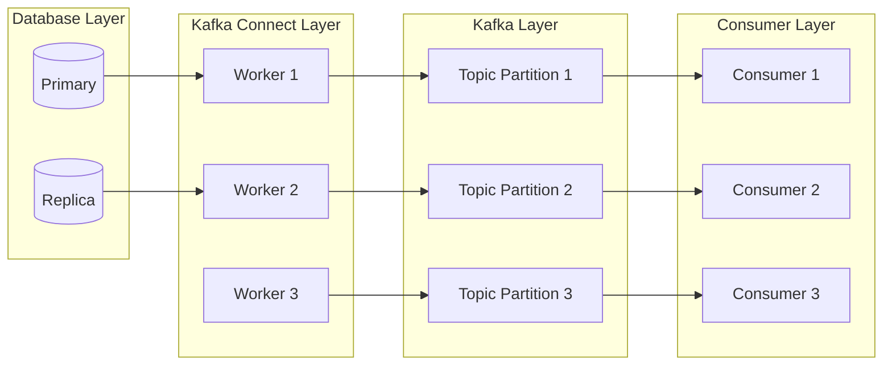
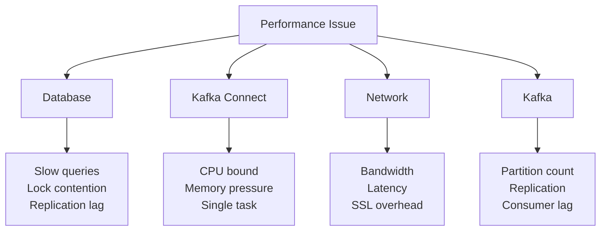
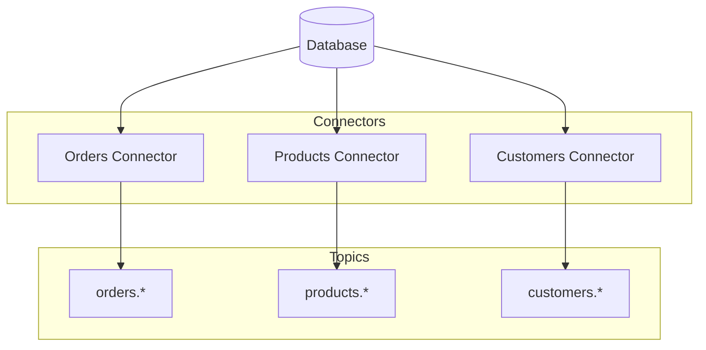

# How to Scale Debezium Deployments

Author: [nawazdhandala](https://www.github.com/nawazdhandala)

Tags: Debezium, Scaling, Kafka Connect, High Availability, Performance, Change Data Capture, Kubernetes

Description: Learn strategies to scale Debezium deployments for high throughput, including task parallelism, Kafka Connect clusters, and Kubernetes deployments.

---

> Production CDC pipelines handle millions of events per hour. A single Debezium connector may not keep up with high-volume databases. Learn how to scale your Debezium deployment horizontally and vertically for reliable, high-throughput change data capture.

Scaling Debezium requires understanding where bottlenecks occur and how to address them.

---

## Overview

Debezium scaling involves multiple layers: the database, Kafka Connect workers, Kafka partitions, and consumers.



---

## Identifying Bottlenecks

### Measuring Current Performance

Before scaling, measure current throughput and identify bottlenecks:

```bash
# Check connector lag
curl -s http://localhost:8083/connectors/inventory-connector/status | jq '.tasks[0]'

# Monitor events per second
kafka-consumer-groups --bootstrap-server kafka:9092 \
  --describe --group connect-inventory-connector

# Check JMX metrics
# MilliSecondsBehindSource
# NumberOfEventsFiltered
# TotalNumberOfEventsSeen
```

### Common Bottlenecks



---

## Vertical Scaling

### JVM Tuning

Optimize Kafka Connect JVM settings:

```bash
# Increase heap size for high-throughput connectors
export KAFKA_HEAP_OPTS="-Xms4g -Xmx4g"

# Use G1GC for large heaps
export KAFKA_JVM_OPTS="-XX:+UseG1GC -XX:MaxGCPauseMillis=200 -XX:G1HeapRegionSize=16m"

# Enable JMX for monitoring
export KAFKA_JMX_OPTS="-Dcom.sun.management.jmxremote -Dcom.sun.management.jmxremote.port=9999"
```

Docker Compose configuration:

```yaml
# docker-compose.yml
services:
  kafka-connect:
    image: debezium/connect:2.5
    environment:
      KAFKA_HEAP_OPTS: "-Xms4g -Xmx4g"
      KAFKA_OPTS: "-XX:+UseG1GC -XX:MaxGCPauseMillis=200"
    deploy:
      resources:
        limits:
          cpus: '4'
          memory: 8G
        reservations:
          cpus: '2'
          memory: 4G
```

### Connector Configuration Tuning

Optimize connector settings for throughput:

```json
{
  "name": "high-throughput-connector",
  "config": {
    "connector.class": "io.debezium.connector.postgresql.PostgresConnector",

    "max.batch.size": "4096",
    "max.queue.size": "16384",
    "max.queue.size.in.bytes": "0",

    "poll.interval.ms": "100",

    "snapshot.fetch.size": "10240",
    "snapshot.max.threads": "4",

    "incremental.snapshot.chunk.size": "2048",

    "heartbeat.interval.ms": "10000"
  }
}
```

---

## Horizontal Scaling

### Kafka Connect Cluster

Deploy multiple Kafka Connect workers for high availability and load distribution:

```yaml
# docker-compose.yml
version: '3.8'
services:
  kafka-connect-1:
    image: debezium/connect:2.5
    environment:
      BOOTSTRAP_SERVERS: kafka:9092
      GROUP_ID: connect-cluster
      CONFIG_STORAGE_TOPIC: connect-configs
      OFFSET_STORAGE_TOPIC: connect-offsets
      STATUS_STORAGE_TOPIC: connect-status
      CONFIG_STORAGE_REPLICATION_FACTOR: 3
      OFFSET_STORAGE_REPLICATION_FACTOR: 3
      STATUS_STORAGE_REPLICATION_FACTOR: 3
    ports:
      - "8083:8083"

  kafka-connect-2:
    image: debezium/connect:2.5
    environment:
      BOOTSTRAP_SERVERS: kafka:9092
      GROUP_ID: connect-cluster
      CONFIG_STORAGE_TOPIC: connect-configs
      OFFSET_STORAGE_TOPIC: connect-offsets
      STATUS_STORAGE_TOPIC: connect-status
      CONFIG_STORAGE_REPLICATION_FACTOR: 3
      OFFSET_STORAGE_REPLICATION_FACTOR: 3
      STATUS_STORAGE_REPLICATION_FACTOR: 3
    ports:
      - "8084:8083"

  kafka-connect-3:
    image: debezium/connect:2.5
    environment:
      BOOTSTRAP_SERVERS: kafka:9092
      GROUP_ID: connect-cluster
      CONFIG_STORAGE_TOPIC: connect-configs
      OFFSET_STORAGE_TOPIC: connect-offsets
      STATUS_STORAGE_TOPIC: connect-status
      CONFIG_STORAGE_REPLICATION_FACTOR: 3
      OFFSET_STORAGE_REPLICATION_FACTOR: 3
      STATUS_STORAGE_REPLICATION_FACTOR: 3
    ports:
      - "8085:8083"
```

### Task Parallelism

For databases that support it, use multiple tasks:

```json
{
  "name": "parallel-connector",
  "config": {
    "connector.class": "io.debezium.connector.postgresql.PostgresConnector",
    "tasks.max": "4",

    "table.include.list": "inventory.orders,inventory.products,inventory.customers,inventory.shipments"
  }
}
```

Note: PostgreSQL logical replication limits parallelism. For true parallelism, consider:

1. **Multiple connectors** for different tables
2. **Sharded databases** with separate connectors per shard
3. **Read replicas** for snapshot operations

---

## Multi-Connector Strategy

### Splitting by Table

Deploy separate connectors for different table groups:

```json
{
  "name": "orders-connector",
  "config": {
    "connector.class": "io.debezium.connector.postgresql.PostgresConnector",
    "slot.name": "orders_slot",
    "publication.name": "orders_pub",
    "table.include.list": "inventory.orders,inventory.order_items",
    "topic.prefix": "orders"
  }
}
```

```json
{
  "name": "products-connector",
  "config": {
    "connector.class": "io.debezium.connector.postgresql.PostgresConnector",
    "slot.name": "products_slot",
    "publication.name": "products_pub",
    "table.include.list": "inventory.products,inventory.categories",
    "topic.prefix": "products"
  }
}
```



### Managing Multiple Connectors

Script to manage multiple connectors:

```bash
#!/bin/bash
# manage-connectors.sh

CONNECT_URL="${CONNECT_URL:-http://localhost:8083}"
ACTION="${1:-status}"

CONNECTORS=(
  "orders-connector"
  "products-connector"
  "customers-connector"
)

case $ACTION in
  status)
    for CONNECTOR in "${CONNECTORS[@]}"; do
      STATUS=$(curl -sf "${CONNECT_URL}/connectors/${CONNECTOR}/status" | jq -r '.connector.state')
      echo "${CONNECTOR}: ${STATUS}"
    done
    ;;

  pause)
    for CONNECTOR in "${CONNECTORS[@]}"; do
      curl -X PUT "${CONNECT_URL}/connectors/${CONNECTOR}/pause"
      echo "Paused ${CONNECTOR}"
    done
    ;;

  resume)
    for CONNECTOR in "${CONNECTORS[@]}"; do
      curl -X PUT "${CONNECT_URL}/connectors/${CONNECTOR}/resume"
      echo "Resumed ${CONNECTOR}"
    done
    ;;

  restart)
    for CONNECTOR in "${CONNECTORS[@]}"; do
      curl -X POST "${CONNECT_URL}/connectors/${CONNECTOR}/restart"
      echo "Restarted ${CONNECTOR}"
    done
    ;;
esac
```

---

## Kubernetes Deployment

### Kafka Connect on Kubernetes

Deploy scalable Kafka Connect using Kubernetes:

```yaml
# kafka-connect-deployment.yaml
apiVersion: apps/v1
kind: Deployment
metadata:
  name: kafka-connect
  labels:
    app: kafka-connect
spec:
  replicas: 3
  selector:
    matchLabels:
      app: kafka-connect
  template:
    metadata:
      labels:
        app: kafka-connect
    spec:
      containers:
      - name: kafka-connect
        image: debezium/connect:2.5
        ports:
        - containerPort: 8083
        env:
        - name: BOOTSTRAP_SERVERS
          value: "kafka-headless:9092"
        - name: GROUP_ID
          value: "connect-cluster"
        - name: CONFIG_STORAGE_TOPIC
          value: "connect-configs"
        - name: OFFSET_STORAGE_TOPIC
          value: "connect-offsets"
        - name: STATUS_STORAGE_TOPIC
          value: "connect-status"
        - name: CONFIG_STORAGE_REPLICATION_FACTOR
          value: "3"
        - name: OFFSET_STORAGE_REPLICATION_FACTOR
          value: "3"
        - name: STATUS_STORAGE_REPLICATION_FACTOR
          value: "3"
        - name: KAFKA_HEAP_OPTS
          value: "-Xms2g -Xmx2g"
        resources:
          requests:
            memory: "2Gi"
            cpu: "1000m"
          limits:
            memory: "4Gi"
            cpu: "2000m"
        livenessProbe:
          httpGet:
            path: /connectors
            port: 8083
          initialDelaySeconds: 60
          periodSeconds: 30
        readinessProbe:
          httpGet:
            path: /connectors
            port: 8083
          initialDelaySeconds: 30
          periodSeconds: 10
---
apiVersion: v1
kind: Service
metadata:
  name: kafka-connect
spec:
  selector:
    app: kafka-connect
  ports:
  - port: 8083
    targetPort: 8083
  type: ClusterIP
```

### Horizontal Pod Autoscaler

Auto-scale based on CPU usage:

```yaml
# kafka-connect-hpa.yaml
apiVersion: autoscaling/v2
kind: HorizontalPodAutoscaler
metadata:
  name: kafka-connect-hpa
spec:
  scaleTargetRef:
    apiVersion: apps/v1
    kind: Deployment
    name: kafka-connect
  minReplicas: 3
  maxReplicas: 10
  metrics:
  - type: Resource
    resource:
      name: cpu
      target:
        type: Utilization
        averageUtilization: 70
  - type: Resource
    resource:
      name: memory
      target:
        type: Utilization
        averageUtilization: 80
  behavior:
    scaleDown:
      stabilizationWindowSeconds: 300
      policies:
      - type: Pods
        value: 1
        periodSeconds: 60
    scaleUp:
      stabilizationWindowSeconds: 60
      policies:
      - type: Pods
        value: 2
        periodSeconds: 60
```

### Strimzi Kafka Connect

Use Strimzi operator for Kubernetes-native management:

```yaml
# kafka-connect-strimzi.yaml
apiVersion: kafka.strimzi.io/v1beta2
kind: KafkaConnect
metadata:
  name: debezium-connect
  annotations:
    strimzi.io/use-connector-resources: "true"
spec:
  version: 3.6.0
  replicas: 3
  bootstrapServers: kafka-cluster-kafka-bootstrap:9092
  config:
    group.id: debezium-connect
    offset.storage.topic: connect-offsets
    config.storage.topic: connect-configs
    status.storage.topic: connect-status
    config.storage.replication.factor: 3
    offset.storage.replication.factor: 3
    status.storage.replication.factor: 3
  build:
    output:
      type: docker
      image: my-registry/debezium-connect:latest
    plugins:
    - name: debezium-postgres
      artifacts:
      - type: tgz
        url: https://repo1.maven.org/maven2/io/debezium/debezium-connector-postgres/2.5.0.Final/debezium-connector-postgres-2.5.0.Final-plugin.tar.gz
  resources:
    requests:
      memory: 2Gi
      cpu: 1000m
    limits:
      memory: 4Gi
      cpu: 2000m
```

---

## Kafka Partition Scaling

### Increasing Partitions

More partitions enable higher consumer parallelism:

```bash
# Increase partitions for a topic
kafka-topics --bootstrap-server kafka:9092 \
  --alter \
  --topic inventory.public.orders \
  --partitions 12
```

### Partition Strategy

Configure Debezium to use appropriate partitioning:

```json
{
  "name": "partitioned-connector",
  "config": {
    "connector.class": "io.debezium.connector.postgresql.PostgresConnector",

    "topic.creation.default.partitions": "12",
    "topic.creation.default.replication.factor": "3",

    "transforms": "partition",
    "transforms.partition.type": "io.debezium.transforms.PartitionRouting",
    "transforms.partition.partition.payload.fields": "after.customer_id",
    "transforms.partition.partition.topic.num": "12"
  }
}
```

---

## Consumer Scaling

### Parallel Consumers

Scale consumers to match partition count:

```python
# parallel_consumer.py
from kafka import KafkaConsumer
from concurrent.futures import ThreadPoolExecutor
import threading

class ParallelConsumer:
    def __init__(self, topic: str, bootstrap_servers: str, group_id: str, num_workers: int):
        self.topic = topic
        self.bootstrap_servers = bootstrap_servers
        self.group_id = group_id
        self.num_workers = num_workers
        self.consumers = []
        self.executor = ThreadPoolExecutor(max_workers=num_workers)

    def start(self):
        """Start parallel consumers"""
        for i in range(self.num_workers):
            future = self.executor.submit(self._consume, i)

    def _consume(self, worker_id: int):
        """Consumer worker function"""
        consumer = KafkaConsumer(
            self.topic,
            bootstrap_servers=self.bootstrap_servers,
            group_id=self.group_id,
            auto_offset_reset='earliest',
            enable_auto_commit=True
        )

        print(f"Worker {worker_id} started, assigned partitions: {consumer.assignment()}")

        for message in consumer:
            self._process_message(worker_id, message)

    def _process_message(self, worker_id: int, message):
        """Process a single message"""
        print(f"Worker {worker_id} processing message from partition {message.partition}")
        # Process the message

# Usage
consumer = ParallelConsumer(
    topic='inventory.public.orders',
    bootstrap_servers='kafka:9092',
    group_id='order-processor',
    num_workers=4
)
consumer.start()
```

---

## Monitoring Scaled Deployments

### Metrics Dashboard

Track key scaling metrics:

```yaml
# prometheus-alerts.yml
groups:
- name: debezium-scaling
  rules:
  - alert: HighConnectorLag
    expr: debezium_streaming_millisecondsbehindSource > 60000
    for: 5m
    labels:
      severity: warning
    annotations:
      summary: "High replication lag detected"
      description: "Connector {{ $labels.server }} is {{ $value | humanizeDuration }} behind"

  - alert: ConnectorTaskImbalance
    expr: stddev by (connector) (kafka_connect_connector_task_metrics_offset_commit_completion_rate) > 100
    for: 10m
    labels:
      severity: warning
    annotations:
      summary: "Task imbalance detected"
      description: "Tasks for {{ $labels.connector }} have uneven throughput"

  - alert: WorkerOverloaded
    expr: kafka_connect_worker_metrics_task_count > 20
    for: 5m
    labels:
      severity: warning
    annotations:
      summary: "Kafka Connect worker overloaded"
      description: "Worker has too many tasks assigned"
```

### Load Balancer Health Check

```bash
#!/bin/bash
# health-check.sh

CONNECT_URLS=(
  "http://kafka-connect-1:8083"
  "http://kafka-connect-2:8083"
  "http://kafka-connect-3:8083"
)

for URL in "${CONNECT_URLS[@]}"; do
  RESPONSE=$(curl -sf "${URL}/" 2>&1)
  if [ $? -eq 0 ]; then
    TASK_COUNT=$(curl -sf "${URL}/connectors" | jq 'length')
    echo "OK: ${URL} - ${TASK_COUNT} connectors"
  else
    echo "FAIL: ${URL} - Not responding"
  fi
done
```

---

## Best Practices

### Scaling Checklist

1. **Measure before scaling** - identify actual bottlenecks
2. **Scale incrementally** - add capacity gradually
3. **Monitor continuously** - track metrics after changes
4. **Plan for failure** - ensure HA at each layer
5. **Document configuration** - track all scaling changes

### Resource Planning

| Throughput | Connect Workers | Memory per Worker | Tasks |
|------------|-----------------|-------------------|-------|
| 1K events/sec | 1 | 2GB | 1 |
| 10K events/sec | 2 | 4GB | 2-4 |
| 100K events/sec | 4+ | 4-8GB | 4-8 |
| 1M events/sec | 8+ | 8GB | 8-16 |

---

## Conclusion

Scaling Debezium deployments requires a multi-layered approach:

- **Vertical scaling** - JVM tuning and connector configuration
- **Horizontal scaling** - Kafka Connect clusters and multiple connectors
- **Kafka scaling** - partition count and consumer parallelism
- **Kubernetes** - automated scaling and management

Key takeaways:

- Identify bottlenecks before scaling
- Use multiple connectors for table-level parallelism
- Scale Kafka partitions for consumer parallelism
- Monitor continuously to detect capacity issues

---

*Scaling your CDC infrastructure? [OneUptime](https://oneuptime.com) provides monitoring for high-throughput Debezium deployments with capacity planning insights.*
