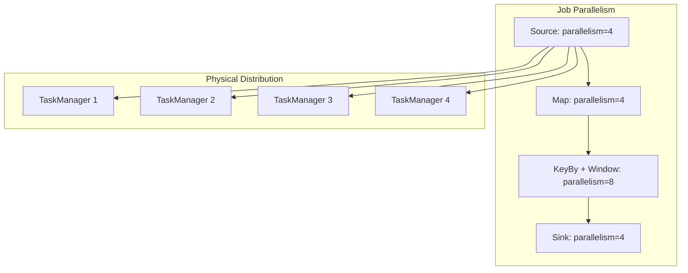
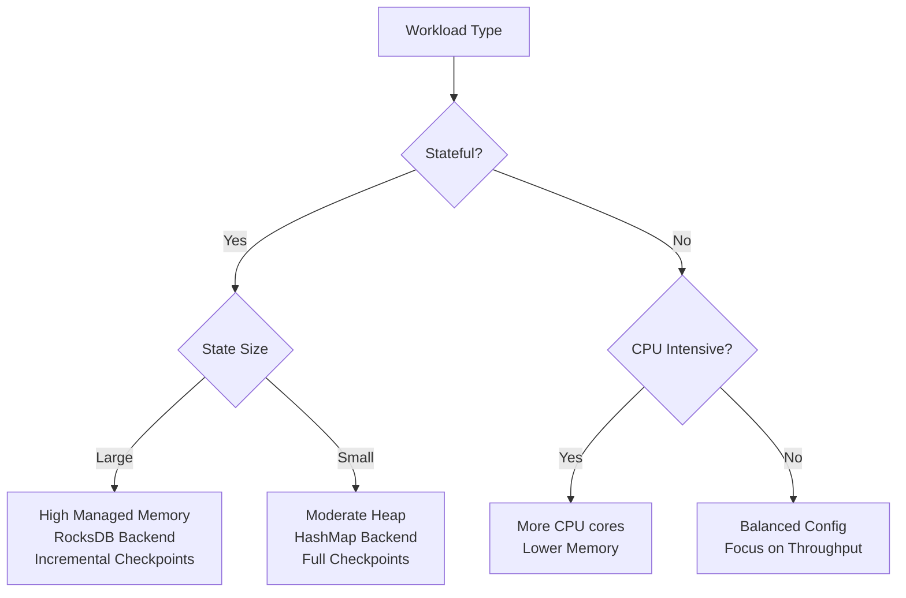
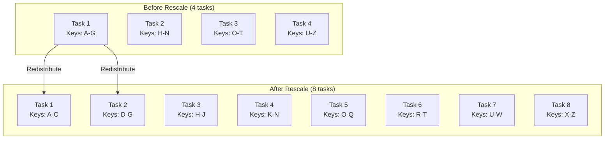
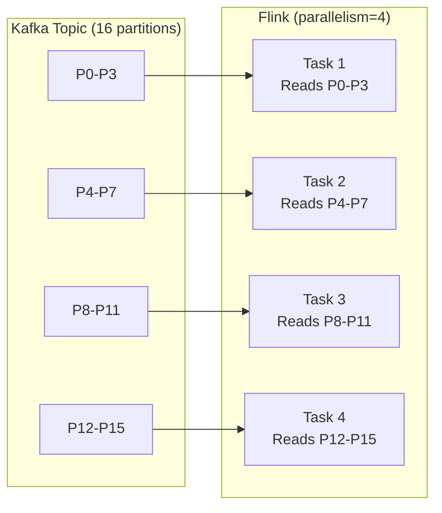
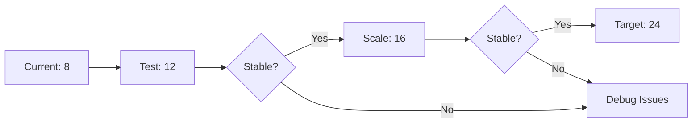

# How to Scale Flink Deployments

Author: [nawazdhandala](https://www.github.com/nawazdhandala)

Tags: Apache Flink, Scaling, Kubernetes, Stream Processing, Performance, Real-Time

Description: A practical guide to scaling Apache Flink deployments, covering horizontal and vertical scaling strategies, Kubernetes autoscaling, and performance optimization techniques.

---

> As data volumes grow, your Flink jobs need to scale accordingly. This guide covers strategies for scaling Flink deployments from handling megabytes to petabytes of streaming data, while maintaining low latency and high reliability.

Scaling Flink isn't just about adding more resources. It requires understanding your workload characteristics, identifying bottlenecks, and applying the right scaling strategy. Whether you're running on Kubernetes, YARN, or standalone clusters, the principles remain the same.

---

## Understanding Flink's Parallelism Model

Before scaling, understand how Flink distributes work:



Key concepts:
- **Parallelism**: Number of parallel instances of an operator
- **Task Slots**: Execution slots in each TaskManager
- **Operator Chains**: Fused operators for efficiency

---

## Horizontal Scaling: Adding More Parallelism

The most common scaling approach is increasing parallelism.

### Setting Parallelism Correctly

```java
import org.apache.flink.streaming.api.environment.StreamExecutionEnvironment;

public class ScalableJob {
    public static void main(String[] args) throws Exception {
        StreamExecutionEnvironment env = StreamExecutionEnvironment.getExecutionEnvironment();

        // Set default parallelism from configuration or parameter
        // This affects all operators unless overridden
        int parallelism = Integer.parseInt(
            args.length > 0 ? args[0] : "8"
        );
        env.setParallelism(parallelism);

        // Source parallelism should match Kafka partitions
        // No benefit from higher parallelism than partitions
        DataStream<String> source = env.fromSource(
            kafkaSource,
            WatermarkStrategy.noWatermarks(),
            "Kafka Source"
        ).setParallelism(16);  // Match 16 Kafka partitions

        // Stateless operators can match source parallelism
        DataStream<Event> parsed = source
            .map(new JsonParser())
            .setParallelism(16);  // Keep same parallelism

        // Keyed operations can have different parallelism
        // Consider number of unique keys and state size
        DataStream<Result> aggregated = parsed
            .keyBy(Event::getUserId)
            .window(TumblingEventTimeWindows.of(Time.minutes(5)))
            .aggregate(new MetricsAggregator())
            .setParallelism(32);  // More parallelism for heavy aggregation

        // Sink parallelism depends on downstream system
        aggregated.sinkTo(postgresSink)
            .setParallelism(8);  // Limited by DB connection pool

        env.execute("Scalable Analytics Job");
    }
}
```

### Parallelism Guidelines

| Operator Type | Parallelism Strategy |
|--------------|----------------------|
| Kafka Source | Match partition count |
| Stateless Maps/Filters | Match source or higher |
| Keyed Operations | Based on key cardinality and state |
| Windows | Based on window count and computation |
| Database Sink | Limited by connection pool |

---

## Vertical Scaling: TaskManager Resources

Sometimes you need bigger TaskManagers rather than more of them.

### Memory Configuration

```yaml
# flink-conf.yaml for large-state workloads

# Total memory for the TaskManager process
taskmanager.memory.process.size: 16384m

# JVM Heap - for user code objects
taskmanager.memory.jvm-heap.size: 4096m

# Managed Memory - for state backends, sorting, caching
# RocksDB uses this for block cache and write buffers
taskmanager.memory.managed.fraction: 0.4
taskmanager.memory.managed.size: 6553m

# Network Memory - for shuffle buffers
taskmanager.memory.network.fraction: 0.1
taskmanager.memory.network.min: 256mb
taskmanager.memory.network.max: 2048mb

# Task slots per TaskManager
# More slots = more parallelism per TM but shared resources
taskmanager.numberOfTaskSlots: 4
```

### Memory Sizing by Workload



```yaml
# Workload-specific configurations

# High-throughput stateless processing
taskmanager.memory.process.size: 4096m
taskmanager.memory.jvm-heap.size: 2048m
taskmanager.memory.managed.fraction: 0.1
taskmanager.numberOfTaskSlots: 8

# Large state with RocksDB
taskmanager.memory.process.size: 32768m
taskmanager.memory.jvm-heap.size: 4096m
taskmanager.memory.managed.fraction: 0.5
taskmanager.numberOfTaskSlots: 2

# Mixed workload
taskmanager.memory.process.size: 8192m
taskmanager.memory.jvm-heap.size: 2048m
taskmanager.memory.managed.fraction: 0.3
taskmanager.numberOfTaskSlots: 4
```

---

## Scaling on Kubernetes

Kubernetes provides flexible scaling options for Flink.

### Reactive Scaling Mode

Flink's reactive mode automatically adjusts parallelism based on available TaskManagers:

```yaml
# flink-conf.yaml
scheduler-mode: reactive

# Job parallelism scales with TaskManager count
# Add TMs = automatic parallelism increase
```

```yaml
# Kubernetes Deployment with HPA
apiVersion: apps/v1
kind: Deployment
metadata:
  name: flink-taskmanager
spec:
  replicas: 4  # Starting replicas
  selector:
    matchLabels:
      app: flink
      component: taskmanager
  template:
    metadata:
      labels:
        app: flink
        component: taskmanager
    spec:
      containers:
      - name: taskmanager
        image: flink:1.17
        resources:
          requests:
            memory: "4Gi"
            cpu: "2"
          limits:
            memory: "4Gi"
            cpu: "2"
        env:
        - name: FLINK_PROPERTIES
          value: |
            taskmanager.numberOfTaskSlots: 2
            taskmanager.memory.process.size: 4096m
---
apiVersion: autoscaling/v2
kind: HorizontalPodAutoscaler
metadata:
  name: flink-taskmanager-hpa
spec:
  scaleTargetRef:
    apiVersion: apps/v1
    kind: Deployment
    name: flink-taskmanager
  minReplicas: 2
  maxReplicas: 20
  metrics:
  - type: Resource
    resource:
      name: cpu
      target:
        type: Utilization
        averageUtilization: 70
  - type: Pods
    pods:
      metric:
        name: flink_taskmanager_job_task_busyTimeMsPerSecond
      target:
        type: AverageValue
        averageValue: 800  # Scale up if tasks are busy >80% of time
  behavior:
    scaleUp:
      stabilizationWindowSeconds: 60
      policies:
      - type: Pods
        value: 2
        periodSeconds: 60
    scaleDown:
      stabilizationWindowSeconds: 300
      policies:
      - type: Pods
        value: 1
        periodSeconds: 120
```

### Flink Kubernetes Operator

The Flink Kubernetes Operator simplifies deployment and scaling:

```yaml
apiVersion: flink.apache.org/v1beta1
kind: FlinkDeployment
metadata:
  name: analytics-job
spec:
  image: my-registry/flink-analytics:1.0
  flinkVersion: v1_17
  flinkConfiguration:
    taskmanager.numberOfTaskSlots: "2"
    state.backend: rocksdb
    state.checkpoints.dir: s3://bucket/checkpoints
  serviceAccount: flink
  jobManager:
    resource:
      memory: "2048m"
      cpu: 1
  taskManager:
    resource:
      memory: "4096m"
      cpu: 2
  job:
    jarURI: local:///opt/flink/jobs/analytics.jar
    parallelism: 8
    upgradeMode: savepoint
    state: running
---
# Autoscaler configuration
apiVersion: flink.apache.org/v1beta1
kind: FlinkDeployment
metadata:
  name: autoscaled-job
spec:
  # ... base config ...
  flinkConfiguration:
    # Enable autoscaler
    kubernetes.operator.job.autoscaler.enabled: "true"
    kubernetes.operator.job.autoscaler.stabilization.interval: "1m"
    kubernetes.operator.job.autoscaler.metrics.window: "5m"
    # Scale based on busy time
    kubernetes.operator.job.autoscaler.target.utilization: "0.7"
    kubernetes.operator.job.autoscaler.scale.up.grace.period: "2m"
    kubernetes.operator.job.autoscaler.scale.down.grace.period: "10m"
  taskManager:
    resource:
      memory: "4096m"
      cpu: 2
    replicas: 2  # Minimum
```

---

## Scaling State

Large state requires special consideration when scaling.

### State Redistribution on Rescale



### Configuring for Rescaling

```java
// Use max parallelism for future scaling flexibility
env.setMaxParallelism(256);  // Can scale up to 256 without savepoint issues

// Max parallelism must be set BEFORE first deployment
// Cannot be changed without starting fresh
// Set higher than you expect to need

// Rule of thumb:
// maxParallelism = nextPowerOfTwo(expectedMaxParallelism * 1.5)
```

### State TTL for Bounded Growth

```java
import org.apache.flink.api.common.state.StateTtlConfig;
import org.apache.flink.api.common.time.Time;

// Configure state TTL to prevent unbounded growth
StateTtlConfig ttlConfig = StateTtlConfig
    .newBuilder(Time.days(7))  // State expires after 7 days
    .setUpdateType(StateTtlConfig.UpdateType.OnCreateAndWrite)
    .setStateVisibility(StateTtlConfig.StateVisibility.NeverReturnExpired)
    // Clean up expired state during checkpoints
    .cleanupInRocksdbCompactFilter(1000)
    .build();

// Apply to state descriptor
ValueStateDescriptor<UserProfile> descriptor =
    new ValueStateDescriptor<>("userProfile", UserProfile.class);
descriptor.enableTimeToLive(ttlConfig);
```

---

## Network Scaling

Network configuration affects throughput significantly.

### Buffer Configuration

```yaml
# flink-conf.yaml

# Network buffers for data exchange
taskmanager.memory.network.min: 256mb
taskmanager.memory.network.max: 2gb
taskmanager.memory.network.fraction: 0.1

# Exclusive buffers per channel (reduce for many channels)
taskmanager.network.memory.buffers-per-channel: 2

# Floating buffers shared across channels
taskmanager.network.memory.floating-buffers-per-gate: 8

# Buffer size (larger = better throughput, worse latency)
taskmanager.memory.segment-size: 32kb
```

### Optimizing Shuffles

```java
// Reduce shuffles by using broadcast for small data
DataStream<Config> configStream = env.fromElements(loadConfig());
DataStream<Event> events = ...;

// Broadcast small dataset to all parallel tasks
BroadcastStream<Config> broadcastConfig = configStream.broadcast(configDescriptor);

DataStream<Result> result = events
    .connect(broadcastConfig)
    .process(new ConfiguredProcessor());

// Use reinterpretAsKeyedStream to avoid unnecessary shuffles
// When you know data is already partitioned correctly
DataStream<Event> prePartitioned = ...;  // Already partitioned by userId
KeyedStream<Event, String> keyed = DataStreamUtils
    .reinterpretAsKeyedStream(prePartitioned, Event::getUserId);
```

---

## Scaling Kafka Integration

Match Flink parallelism with Kafka topology:

```java
// Kafka Source with partition discovery
KafkaSource<String> source = KafkaSource.<String>builder()
    .setBootstrapServers("kafka:9092")
    .setTopics("events")
    .setGroupId("flink-consumer")
    // Enable partition discovery for dynamic scaling
    .setProperty("partition.discovery.interval.ms", "30000")
    .setStartingOffsets(OffsetsInitializer.committedOffsets())
    .setValueOnlyDeserializer(new SimpleStringSchema())
    .build();

// Parallelism should match or be multiple of partitions
// 16 partitions -> parallelism of 16 or 32
DataStream<String> events = env.fromSource(
    source,
    WatermarkStrategy.noWatermarks(),
    "Kafka Source"
).setParallelism(16);
```

### Kafka Partition Scaling



---

## Performance Monitoring for Scaling Decisions

Use metrics to determine when and how to scale:

```java
public class ScalingMetrics extends RichMapFunction<Event, Event> {
    private transient Histogram processingLatency;
    private transient Meter throughput;
    private transient Gauge<Long> backlogSize;

    private final AtomicLong pendingRecords = new AtomicLong(0);

    @Override
    public void open(Configuration parameters) {
        MetricGroup metrics = getRuntimeContext().getMetricGroup();

        // Processing latency histogram
        processingLatency = metrics.histogram(
            "processingLatency",
            new DropwizardHistogramWrapper(
                new com.codahale.metrics.Histogram(
                    new SlidingWindowReservoir(1000)
                )
            )
        );

        // Throughput meter
        throughput = metrics.meter("throughput", new DropwizardMeterWrapper(
            new com.codahale.metrics.Meter()
        ));

        // Backlog gauge for scaling decisions
        backlogSize = metrics.gauge("backlogSize", () -> pendingRecords.get());
    }

    @Override
    public Event map(Event event) {
        long start = System.nanoTime();

        pendingRecords.incrementAndGet();

        // Processing logic
        Event result = process(event);

        pendingRecords.decrementAndGet();

        // Record metrics
        processingLatency.update((System.nanoTime() - start) / 1_000_000);
        throughput.markEvent();

        return result;
    }
}
```

### Scaling Decision Matrix

```yaml
# Prometheus alerting rules for scaling decisions

groups:
  - name: flink_scaling
    rules:
      # Scale up indicators
      - alert: FlinkHighBackpressure
        expr: |
          avg(flink_taskmanager_job_task_backPressuredTimeMsPerSecond) > 500
        for: 5m
        labels:
          action: scale_up
        annotations:
          summary: "High backpressure detected - consider scaling up"

      - alert: FlinkHighCpuUtilization
        expr: |
          avg(flink_taskmanager_Status_JVM_CPU_Load) > 0.8
        for: 5m
        labels:
          action: scale_up
        annotations:
          summary: "High CPU utilization - consider scaling up"

      - alert: FlinkKafkaLagIncreasing
        expr: |
          rate(flink_taskmanager_job_task_operator_KafkaSourceReader_KafkaConsumer_records_lag_max[5m]) > 1000
        for: 5m
        labels:
          action: scale_up
        annotations:
          summary: "Kafka consumer lag increasing - consider scaling up"

      # Scale down indicators
      - alert: FlinkLowUtilization
        expr: |
          avg(flink_taskmanager_job_task_busyTimeMsPerSecond) < 200
        for: 30m
        labels:
          action: scale_down
        annotations:
          summary: "Low task utilization - consider scaling down"
```

---

## Scaling Best Practices

### 1. Plan for Max Parallelism Early

```java
// Set before first deployment - cannot be changed later
env.setMaxParallelism(512);

// Allows scaling from 1 to 512 without state issues
// Actual parallelism can be any value up to max
```

### 2. Use Savepoints for Scaling

```bash
# Create savepoint before scaling
flink savepoint <job-id> s3://bucket/savepoints/pre-scale

# Stop job
flink cancel <job-id>

# Restart with new parallelism
flink run -s s3://bucket/savepoints/pre-scale \
    -p 32 \  # New parallelism
    my-job.jar
```

### 3. Scale Incrementally



### 4. Monitor After Scaling

```java
// Key metrics to watch after scaling:
// - Checkpoint duration (should decrease)
// - Processing latency (should decrease)
// - Resource utilization (should balance)
// - Consumer lag (should decrease)

// Alert if metrics don't improve within 15 minutes
// May need to rollback or adjust configuration
```

---

## Troubleshooting Scaling Issues

### Issue: Uneven Load After Scaling

```java
// Symptom: Some tasks busy, others idle
// Cause: Data skew with keyBy

// Solution 1: Add salt to keys
DataStream<Event> salted = events
    .map(e -> {
        int salt = ThreadLocalRandom.current().nextInt(10);
        return new SaltedEvent(e, e.getKey() + "_" + salt);
    })
    .keyBy(SaltedEvent::getSaltedKey);

// Solution 2: Two-phase aggregation
DataStream<Event> preAggregated = events
    .keyBy(e -> e.getKey() + "_" + (e.hashCode() % 10))  // Local aggregation
    .window(TumblingEventTimeWindows.of(Time.seconds(10)))
    .reduce(new LocalReducer());

DataStream<Result> finalResult = preAggregated
    .keyBy(Event::getOriginalKey)  // Final aggregation
    .window(TumblingEventTimeWindows.of(Time.seconds(10)))
    .reduce(new GlobalReducer());
```

### Issue: Slow Restarts After Scaling

```yaml
# Symptom: Job takes long to restart from savepoint
# Cause: State redistribution

# Solution: Use RocksDB incremental restore
state.backend.rocksdb.rescaling.use-delete-files-in-range: true

# Also consider local recovery for faster restarts
state.backend.local-recovery: true
taskmanager.state.local.root-dirs: /local/state
```

---

## Conclusion

Scaling Flink deployments effectively requires:

1. Understanding your workload characteristics before choosing a scaling strategy
2. Setting appropriate max parallelism early to allow future scaling
3. Using Kubernetes operators and autoscaling for dynamic workloads
4. Monitoring key metrics to make data-driven scaling decisions
5. Testing scaling changes incrementally with savepoints

The combination of horizontal scaling (more parallelism) and vertical scaling (bigger TaskManagers) gives you flexibility to handle any workload. Start with the simplest approach that works, and add complexity only when needed.

---

*Ready to scale your streaming infrastructure? [OneUptime](https://oneuptime.com) provides comprehensive monitoring for Flink deployments, including resource utilization tracking, performance metrics, and intelligent alerting to help you make informed scaling decisions. Start your free trial today.*

**Related Reading:**
- [How to Implement Flink Exactly-Once Processing](https://oneuptime.com/blog/post/2026-01-28-flink-exactly-once-processing/view)
- [How to Debug Flink Job Failures](https://oneuptime.com/blog/post/2026-01-28-debug-flink-job-failures/view)
