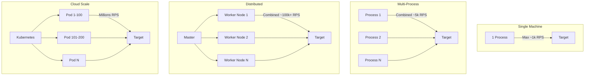
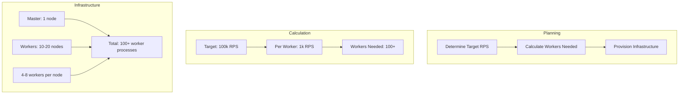
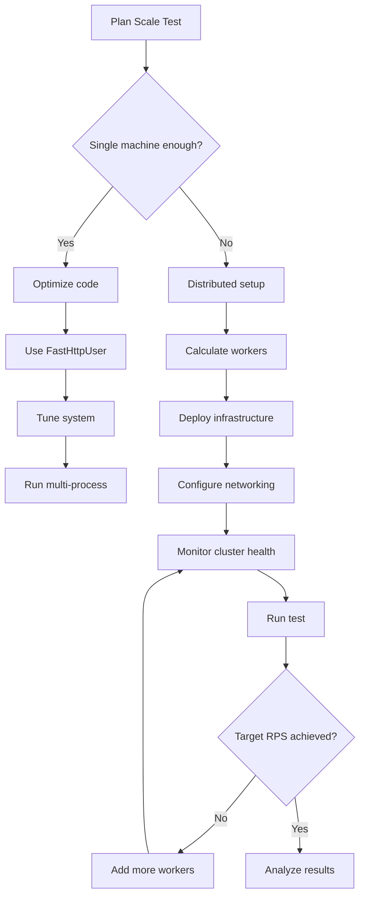

# How to Scale Locust Load Tests

Author: [nawazdhandala](https://www.github.com/nawazdhandala)

Tags: Locust, Scalability, Load Testing, Performance Testing, Kubernetes, Distributed Systems

Description: Learn strategies for scaling Locust to generate massive load, from optimizing single machines to orchestrating thousands of workers.

---

When testing high-traffic systems, a single Locust instance often cannot generate enough load. You might need thousands or millions of requests per second to realistically stress your infrastructure. Scaling Locust requires understanding its architecture, optimizing for throughput, and deploying across multiple machines.

This guide covers techniques from quick wins on a single machine to enterprise-scale distributed deployments capable of generating millions of concurrent connections.

---

## Scaling Architecture Overview



---

## Optimizing Single Machine Performance

Before scaling out, maximize single-machine performance:

### Use FastHttpUser

```python
# locustfile.py - High performance user class
from locust import task, between
from locust.contrib.fasthttp import FastHttpUser

class HighThroughputUser(FastHttpUser):
    """
    FastHttpUser uses geventhttpclient instead of requests.
    Typically 5-10x faster for simple requests.
    """
    wait_time = between(0.1, 0.5)

    # Connection settings
    connection_timeout = 10.0
    network_timeout = 30.0

    @task
    def fast_request(self):
        self.client.get("/api/fast-endpoint")
```

### Minimize Response Processing

```python
# locustfile.py - Optimized response handling
from locust import HttpUser, task, between

class OptimizedUser(HttpUser):
    wait_time = between(0.5, 1)

    @task
    def minimal_processing(self):
        # Don't parse JSON if you don't need it
        response = self.client.get("/api/data")

        # Only check status code
        if response.status_code != 200:
            response.failure(f"Status {response.status_code}")

    @task
    def skip_response_body(self):
        # For throughput testing, skip reading body
        with self.client.get("/api/large-response",
                            stream=True,
                            catch_response=True) as response:
            if response.status_code == 200:
                response.success()
            else:
                response.failure(f"Status {response.status_code}")
```

### System Tuning

```bash
#!/bin/bash
# system-tune.sh - Optimize system for high throughput

# Increase file descriptor limits
ulimit -n 65535

# TCP optimizations
sudo sysctl -w net.core.somaxconn=65535
sudo sysctl -w net.ipv4.tcp_max_syn_backlog=65535
sudo sysctl -w net.ipv4.ip_local_port_range="1024 65535"
sudo sysctl -w net.ipv4.tcp_tw_reuse=1
sudo sysctl -w net.core.netdev_max_backlog=65535

# Increase socket buffer sizes
sudo sysctl -w net.core.rmem_max=16777216
sudo sysctl -w net.core.wmem_max=16777216

echo "System tuned for high throughput"
```

---

## Multi-Process Scaling

Run multiple Locust processes on a single machine:

```python
# locustfile.py - Multi-process aware configuration
from locust import HttpUser, task, between, events
import os

# Detect worker number from environment or process
WORKER_ID = os.getenv('LOCUST_WORKER_ID', os.getpid())

@events.init.add_listener
def on_init(environment, **kwargs):
    print(f"Worker {WORKER_ID} initialized")

class LoadUser(HttpUser):
    wait_time = between(0.5, 1)

    def on_start(self):
        # Use worker ID to partition test data
        self.user_offset = int(WORKER_ID) * 1000

    @task
    def api_request(self):
        # Each worker uses different user IDs to avoid conflicts
        user_id = self.user_offset + (id(self) % 1000)
        self.client.get(f"/api/users/{user_id}")
```

Launch script for multi-process:

```bash
#!/bin/bash
# start-multi-process.sh

HOST="https://api.example.com"
WORKERS_PER_MACHINE=${WORKERS_PER_MACHINE:-$(nproc)}

echo "Starting $WORKERS_PER_MACHINE workers"

# Start master
locust --master --host=$HOST &
MASTER_PID=$!
sleep 2

# Start workers
for i in $(seq 1 $WORKERS_PER_MACHINE); do
    LOCUST_WORKER_ID=$i locust --worker --master-host=127.0.0.1 &
    echo "Started worker $i"
done

echo "All workers started. Master PID: $MASTER_PID"
echo "Web UI: http://localhost:8089"

wait
```

---

## Distributed Scaling Strategy



### Capacity Planning Formula

```
Workers Needed = (Target RPS / RPS per Worker) * Safety Factor

Where:
- RPS per Worker: ~500-2000 depending on request complexity
- Safety Factor: 1.2-1.5 for headroom
```

Example: For 50,000 RPS with 1,000 RPS per worker:
```
Workers = (50,000 / 1,000) * 1.3 = 65 workers
```

---

## Kubernetes Scaling

### Horizontal Pod Autoscaler

```yaml
# locust-worker-hpa.yaml
apiVersion: autoscaling/v2
kind: HorizontalPodAutoscaler
metadata:
  name: locust-worker-hpa
spec:
  scaleTargetRef:
    apiVersion: apps/v1
    kind: Deployment
    name: locust-worker
  minReplicas: 10
  maxReplicas: 100
  metrics:
  - type: Resource
    resource:
      name: cpu
      target:
        type: Utilization
        averageUtilization: 70
  behavior:
    scaleUp:
      stabilizationWindowSeconds: 30
      policies:
      - type: Pods
        value: 10
        periodSeconds: 60
    scaleDown:
      stabilizationWindowSeconds: 300
```

### Worker Deployment with Resource Limits

```yaml
# locust-worker-deployment.yaml
apiVersion: apps/v1
kind: Deployment
metadata:
  name: locust-worker
  labels:
    app: locust
    role: worker
spec:
  replicas: 50
  selector:
    matchLabels:
      app: locust
      role: worker
  template:
    metadata:
      labels:
        app: locust
        role: worker
    spec:
      affinity:
        podAntiAffinity:
          preferredDuringSchedulingIgnoredDuringExecution:
          - weight: 100
            podAffinityTerm:
              labelSelector:
                matchLabels:
                  app: locust
                  role: worker
              topologyKey: kubernetes.io/hostname
      containers:
      - name: locust
        image: locustio/locust:2.20.0
        args:
          - "--worker"
          - "--master-host=locust-master"
        resources:
          requests:
            cpu: "500m"
            memory: "512Mi"
          limits:
            cpu: "2000m"
            memory: "2Gi"
        env:
        - name: LOCUST_LOCUSTFILE
          value: "/mnt/locust/locustfile.py"
        volumeMounts:
        - name: locust-scripts
          mountPath: /mnt/locust
      volumes:
      - name: locust-scripts
        configMap:
          name: locust-scripts
```

### Master with Persistent Storage

```yaml
# locust-master-deployment.yaml
apiVersion: apps/v1
kind: Deployment
metadata:
  name: locust-master
spec:
  replicas: 1
  selector:
    matchLabels:
      app: locust
      role: master
  template:
    metadata:
      labels:
        app: locust
        role: master
    spec:
      containers:
      - name: locust
        image: locustio/locust:2.20.0
        args:
          - "--master"
          - "--host=https://api.example.com"
          - "--expect-workers=50"
          - "--csv=/data/results"
        ports:
        - containerPort: 8089
          name: web
        - containerPort: 5557
          name: master
        resources:
          requests:
            cpu: "1000m"
            memory: "2Gi"
          limits:
            cpu: "2000m"
            memory: "4Gi"
        volumeMounts:
        - name: locust-scripts
          mountPath: /mnt/locust
        - name: results
          mountPath: /data
      volumes:
      - name: locust-scripts
        configMap:
          name: locust-scripts
      - name: results
        persistentVolumeClaim:
          claimName: locust-results-pvc
```

---

## Dynamic Scaling Script

Scale workers based on target load:

```python
#!/usr/bin/env python3
# scale_locust.py - Dynamic Locust scaling

import subprocess
import sys
import time

def get_current_replicas(deployment):
    """Get current replica count."""
    result = subprocess.run(
        ["kubectl", "get", "deployment", deployment,
         "-o", "jsonpath={.spec.replicas}"],
        capture_output=True, text=True
    )
    return int(result.stdout) if result.stdout else 0

def scale_deployment(deployment, replicas):
    """Scale Kubernetes deployment."""
    print(f"Scaling {deployment} to {replicas} replicas")
    subprocess.run([
        "kubectl", "scale", "deployment", deployment,
        f"--replicas={replicas}"
    ])

def wait_for_ready(deployment, expected, timeout=300):
    """Wait for deployment to reach expected replicas."""
    start = time.time()
    while time.time() - start < timeout:
        result = subprocess.run(
            ["kubectl", "get", "deployment", deployment,
             "-o", "jsonpath={.status.readyReplicas}"],
            capture_output=True, text=True
        )
        ready = int(result.stdout) if result.stdout else 0
        print(f"Ready: {ready}/{expected}")
        if ready >= expected:
            return True
        time.sleep(10)
    return False

def calculate_workers(target_rps, rps_per_worker=1000):
    """Calculate required workers for target RPS."""
    workers = int(target_rps / rps_per_worker * 1.3)  # 30% buffer
    return max(workers, 5)  # Minimum 5 workers

if __name__ == "__main__":
    target_rps = int(sys.argv[1]) if len(sys.argv) > 1 else 10000

    workers_needed = calculate_workers(target_rps)
    print(f"Target RPS: {target_rps}")
    print(f"Workers needed: {workers_needed}")

    # Scale workers
    scale_deployment("locust-worker", workers_needed)

    # Wait for workers to be ready
    if wait_for_ready("locust-worker", workers_needed):
        print("Scaling complete. Workers ready.")
    else:
        print("Warning: Timeout waiting for workers")
```

---

## Load Generation Patterns

### Ramp-Up Pattern

```python
# locustfile.py - Staged ramp-up
from locust import HttpUser, task, between, LoadTestShape

class StepLoadShape(LoadTestShape):
    """
    Step load pattern:
    - Start with 100 users
    - Add 100 users every 2 minutes
    - Cap at 1000 users
    """

    step_time = 120  # 2 minutes per step
    step_load = 100  # Add 100 users per step
    spawn_rate = 10  # Users per second during spawn
    max_users = 1000

    def tick(self):
        run_time = self.get_run_time()

        current_step = int(run_time // self.step_time) + 1
        target_users = min(current_step * self.step_load, self.max_users)

        return (target_users, self.spawn_rate)

class ApiUser(HttpUser):
    wait_time = between(1, 2)

    @task
    def api_request(self):
        self.client.get("/api/data")
```

### Spike Pattern

```python
# locustfile.py - Spike load pattern
from locust import HttpUser, task, between, LoadTestShape

class SpikeLoadShape(LoadTestShape):
    """
    Spike pattern to test autoscaling:
    - Baseline: 100 users
    - Spike to 1000 users for 2 minutes
    - Return to baseline
    """

    def tick(self):
        run_time = self.get_run_time()

        # Normal load
        if run_time < 300:  # First 5 minutes
            return (100, 10)

        # Spike
        elif run_time < 420:  # Minutes 5-7
            return (1000, 100)

        # Recovery
        elif run_time < 720:  # Minutes 7-12
            return (100, 50)

        # End test
        else:
            return None

class ApiUser(HttpUser):
    wait_time = between(0.5, 1)

    @task
    def api_request(self):
        self.client.get("/api/data")
```

---

## Monitoring Scaled Tests

```python
# locustfile.py - Monitoring for scaled tests
from locust import HttpUser, task, between, events
import time
import psutil
import threading

class ScaleMonitor:
    """Monitor cluster health during scaled tests."""

    def __init__(self):
        self.running = False
        self.stats = []

    def start(self, environment):
        self.running = True
        self.environment = environment
        self.thread = threading.Thread(target=self._monitor_loop, daemon=True)
        self.thread.start()

    def stop(self):
        self.running = False

    def _monitor_loop(self):
        while self.running:
            stats = self.environment.stats.total

            snapshot = {
                'timestamp': time.time(),
                'users': len(self.environment.runner.user_greenlets) if self.environment.runner else 0,
                'rps': stats.current_rps,
                'failures_per_s': stats.current_fail_per_sec,
                'avg_response': stats.avg_response_time,
                'p95_response': stats.get_response_time_percentile(0.95),
                'cpu_percent': psutil.cpu_percent(),
                'memory_mb': psutil.Process().memory_info().rss / 1024 / 1024
            }

            self.stats.append(snapshot)

            # Alert on concerning metrics
            if snapshot['cpu_percent'] > 90:
                print(f"WARNING: High CPU usage: {snapshot['cpu_percent']}%")

            if snapshot['failures_per_s'] > snapshot['rps'] * 0.01:
                print(f"WARNING: Failure rate above 1%")

            time.sleep(10)

    def report(self):
        if not self.stats:
            return

        print("\n=== Scale Test Summary ===")
        max_users = max(s['users'] for s in self.stats)
        max_rps = max(s['rps'] for s in self.stats)
        avg_cpu = sum(s['cpu_percent'] for s in self.stats) / len(self.stats)

        print(f"Peak Users: {max_users}")
        print(f"Peak RPS: {max_rps:.0f}")
        print(f"Average CPU: {avg_cpu:.1f}%")

monitor = ScaleMonitor()

@events.test_start.add_listener
def on_start(environment, **kwargs):
    monitor.start(environment)

@events.test_stop.add_listener
def on_stop(environment, **kwargs):
    monitor.stop()
    monitor.report()

class ApiUser(HttpUser):
    wait_time = between(0.5, 1)

    @task
    def api_request(self):
        self.client.get("/api/data")
```

---

## Scaling Checklist



---

Scaling Locust is about understanding bottlenecks at each level. Start by optimizing a single process with FastHttpUser and minimal response processing. When you hit single-machine limits, go multi-process. For enterprise-scale testing, deploy to Kubernetes with auto-scaling workers. The key is measuring actual throughput at each step and scaling infrastructure proportionally. Remember that your test infrastructure should not become the bottleneck - always monitor worker CPU and memory alongside your target system metrics.

---

OneUptime helps you understand if your scaling efforts match production reality. Compare Locust load test results against actual production metrics to validate that your synthetic tests accurately predict real-world performance under load.
