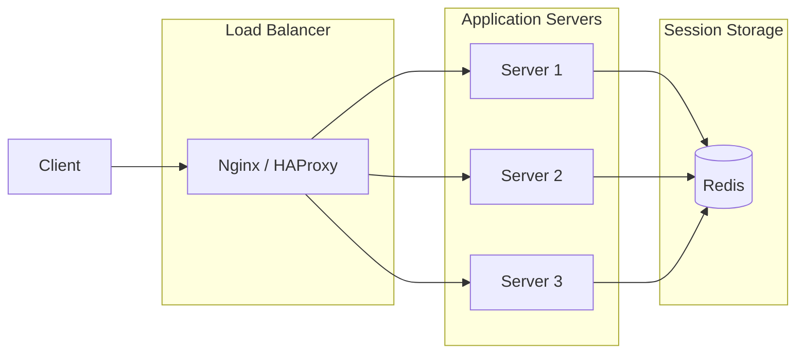

# How to Build Session Storage with Redis

Author: [nawazdhandala](https://www.github.com/nawazdhandala)

Tags: Redis, Session Storage, Authentication, Node.js, Express, Security

Description: Learn how to implement secure, scalable session storage with Redis. This guide covers session management, Express integration, security best practices, and handling distributed deployments.

---

HTTP is stateless, but web applications need to remember users between requests. Session storage bridges this gap by associating user data with a unique identifier stored in a cookie. Redis is an excellent choice for sessions because it is fast, supports TTL for automatic expiration, and works across multiple application servers.

## Why Redis for Sessions?

Traditional file-based or memory-based sessions have problems at scale:

- **Memory sessions**: Lost when server restarts, cannot share across instances
- **File sessions**: Slow I/O, hard to share across servers
- **Database sessions**: Added load on primary database, slower than needed

Redis solves all of these:
- Persistent across server restarts
- Shared across all application instances
- Sub-millisecond response times
- Built-in TTL for automatic cleanup



## Basic Session Store Implementation

Let's build a session store from scratch to understand the fundamentals.

```javascript
// session-store.js
// Custom Redis session store implementation
const Redis = require('ioredis');
const crypto = require('crypto');

const redis = new Redis({
  host: process.env.REDIS_HOST || 'localhost',
  port: process.env.REDIS_PORT || 6379,
  password: process.env.REDIS_PASSWORD,
});

class SessionStore {
  constructor(options = {}) {
    this.prefix = options.prefix || 'sess:';
    this.ttl = options.ttl || 86400; // 24 hours default
    this.secret = options.secret || process.env.SESSION_SECRET;

    if (!this.secret) {
      throw new Error('Session secret is required');
    }
  }

  // Generate a cryptographically secure session ID
  generateSessionId() {
    return crypto.randomBytes(32).toString('hex');
  }

  // Create a signed session ID to prevent tampering
  signSessionId(sessionId) {
    const signature = crypto
      .createHmac('sha256', this.secret)
      .update(sessionId)
      .digest('base64')
      .replace(/[=]+$/, ''); // Remove padding

    return `${sessionId}.${signature}`;
  }

  // Verify and extract session ID from signed value
  verifySessionId(signedId) {
    const [sessionId, signature] = signedId.split('.');

    if (!sessionId || !signature) {
      return null;
    }

    const expectedSig = crypto
      .createHmac('sha256', this.secret)
      .update(sessionId)
      .digest('base64')
      .replace(/[=]+$/, '');

    // Use timing-safe comparison to prevent timing attacks
    const sigBuffer = Buffer.from(signature);
    const expectedBuffer = Buffer.from(expectedSig);

    if (sigBuffer.length !== expectedBuffer.length) {
      return null;
    }

    if (!crypto.timingSafeEqual(sigBuffer, expectedBuffer)) {
      return null;
    }

    return sessionId;
  }

  // Get session data
  async get(sessionId) {
    const key = this.prefix + sessionId;
    const data = await redis.get(key);

    if (!data) {
      return null;
    }

    try {
      return JSON.parse(data);
    } catch (e) {
      console.error('Failed to parse session data:', e);
      return null;
    }
  }

  // Set session data
  async set(sessionId, data, ttl = this.ttl) {
    const key = this.prefix + sessionId;
    const serialized = JSON.stringify(data);

    await redis.setex(key, ttl, serialized);
  }

  // Update session without changing TTL
  async update(sessionId, data) {
    const key = this.prefix + sessionId;

    // Get current TTL
    const ttl = await redis.ttl(key);

    if (ttl > 0) {
      const serialized = JSON.stringify(data);
      await redis.setex(key, ttl, serialized);
    }
  }

  // Touch session (refresh TTL without changing data)
  async touch(sessionId, ttl = this.ttl) {
    const key = this.prefix + sessionId;
    await redis.expire(key, ttl);
  }

  // Destroy session
  async destroy(sessionId) {
    const key = this.prefix + sessionId;
    await redis.del(key);
  }

  // Create new session
  async create(data = {}) {
    const sessionId = this.generateSessionId();
    const signedId = this.signSessionId(sessionId);

    await this.set(sessionId, {
      ...data,
      createdAt: Date.now(),
    });

    return signedId;
  }

  // Get all sessions for a user (for "log out everywhere" feature)
  async getUserSessions(userId) {
    const pattern = `${this.prefix}*`;
    const sessions = [];
    let cursor = '0';

    do {
      const [newCursor, keys] = await redis.scan(cursor, 'MATCH', pattern, 'COUNT', 100);
      cursor = newCursor;

      for (const key of keys) {
        const data = await redis.get(key);
        if (data) {
          const session = JSON.parse(data);
          if (session.userId === userId) {
            sessions.push({
              sessionId: key.replace(this.prefix, ''),
              ...session,
            });
          }
        }
      }
    } while (cursor !== '0');

    return sessions;
  }

  // Destroy all sessions for a user
  async destroyUserSessions(userId) {
    const sessions = await this.getUserSessions(userId);
    const keys = sessions.map((s) => this.prefix + s.sessionId);

    if (keys.length > 0) {
      await redis.del(...keys);
    }

    return sessions.length;
  }
}

module.exports = SessionStore;
```

## Express Middleware Integration

Here's how to integrate the session store with Express.

```javascript
// session-middleware.js
// Express session middleware using Redis store
const SessionStore = require('./session-store');
const cookie = require('cookie');

function sessionMiddleware(options = {}) {
  const store = new SessionStore({
    prefix: options.prefix || 'sess:',
    ttl: options.ttl || 86400,
    secret: options.secret,
  });

  const cookieName = options.cookieName || 'session_id';
  const cookieOptions = {
    httpOnly: true,
    secure: options.secure !== false && process.env.NODE_ENV === 'production',
    sameSite: options.sameSite || 'lax',
    maxAge: (options.ttl || 86400) * 1000,
    path: '/',
    ...options.cookie,
  };

  return async function session(req, res, next) {
    // Parse cookies
    const cookies = cookie.parse(req.headers.cookie || '');
    const signedSessionId = cookies[cookieName];

    let sessionId = null;
    let sessionData = null;

    // Try to load existing session
    if (signedSessionId) {
      sessionId = store.verifySessionId(signedSessionId);

      if (sessionId) {
        sessionData = await store.get(sessionId);
      }
    }

    // Create new session if none exists
    if (!sessionData) {
      const newSignedId = await store.create({});
      sessionId = store.verifySessionId(newSignedId);
      sessionData = await store.get(sessionId);

      // Set cookie with new session ID
      res.setHeader('Set-Cookie', cookie.serialize(cookieName, newSignedId, cookieOptions));
    }

    // Attach session to request
    req.session = sessionData;
    req.sessionId = sessionId;

    // Method to save session changes
    req.session.save = async function () {
      await store.set(sessionId, req.session, options.ttl);
    };

    // Method to regenerate session (after login)
    req.session.regenerate = async function (data = {}) {
      // Destroy old session
      await store.destroy(sessionId);

      // Create new session
      const newSignedId = await store.create(data);
      const newSessionId = store.verifySessionId(newSignedId);
      const newData = await store.get(newSessionId);

      // Update request
      req.session = newData;
      req.sessionId = newSessionId;

      // Set new cookie
      res.setHeader('Set-Cookie', cookie.serialize(cookieName, newSignedId, cookieOptions));

      return newData;
    };

    // Method to destroy session (logout)
    req.session.destroy = async function () {
      await store.destroy(sessionId);
      req.session = null;
      req.sessionId = null;

      // Clear cookie
      res.setHeader('Set-Cookie', cookie.serialize(cookieName, '', {
        ...cookieOptions,
        maxAge: 0,
      }));
    };

    // Auto-save on response end
    const originalEnd = res.end;
    res.end = function (...args) {
      if (req.session && sessionId) {
        // Save asynchronously, don't block response
        store.set(sessionId, req.session, options.ttl).catch((err) => {
          console.error('Failed to save session:', err);
        });
      }
      originalEnd.apply(res, args);
    };

    next();
  };
}

module.exports = sessionMiddleware;
```

## Complete Express Application

```javascript
// app.js
// Express app with Redis sessions
const express = require('express');
const sessionMiddleware = require('./session-middleware');

const app = express();
app.use(express.json());

// Session configuration
app.use(sessionMiddleware({
  secret: process.env.SESSION_SECRET || 'your-secret-key-change-in-production',
  ttl: 7 * 24 * 60 * 60, // 7 days
  prefix: 'myapp:sess:',
  cookieName: 'sid',
  secure: process.env.NODE_ENV === 'production',
}));

// Login endpoint
app.post('/login', async (req, res) => {
  const { username, password } = req.body;

  // Validate credentials (simplified)
  const user = await authenticateUser(username, password);

  if (!user) {
    return res.status(401).json({ error: 'Invalid credentials' });
  }

  // Regenerate session to prevent session fixation
  await req.session.regenerate({
    userId: user.id,
    username: user.username,
    role: user.role,
    loginAt: Date.now(),
  });

  res.json({
    message: 'Logged in successfully',
    user: { id: user.id, username: user.username },
  });
});

// Logout endpoint
app.post('/logout', async (req, res) => {
  await req.session.destroy();
  res.json({ message: 'Logged out successfully' });
});

// Protected route example
app.get('/profile', requireAuth, (req, res) => {
  res.json({
    userId: req.session.userId,
    username: req.session.username,
    sessionCreated: req.session.createdAt,
  });
});

// Auth middleware
function requireAuth(req, res, next) {
  if (!req.session || !req.session.userId) {
    return res.status(401).json({ error: 'Authentication required' });
  }
  next();
}

// Simulated auth function
async function authenticateUser(username, password) {
  // In real app, check database
  if (username === 'admin' && password === 'password') {
    return { id: 1, username: 'admin', role: 'admin' };
  }
  return null;
}

const PORT = process.env.PORT || 3000;
app.listen(PORT, () => console.log(`Server running on port ${PORT}`));
```

## Session Security Best Practices

```javascript
// security.js
// Security enhancements for session management
const SessionStore = require('./session-store');

class SecureSessionStore extends SessionStore {
  constructor(options = {}) {
    super(options);

    // Security settings
    this.maxAge = options.maxAge || 7 * 24 * 60 * 60; // 7 days absolute max
    this.idleTimeout = options.idleTimeout || 30 * 60; // 30 min idle timeout
    this.maxSessionsPerUser = options.maxSessionsPerUser || 5;
  }

  // Create session with security metadata
  async create(data = {}) {
    const sessionId = this.generateSessionId();
    const signedId = this.signSessionId(sessionId);
    const now = Date.now();

    await this.set(sessionId, {
      ...data,
      createdAt: now,
      lastActivity: now,
      userAgent: data.userAgent || null,
      ipAddress: data.ipAddress || null,
    });

    // Enforce max sessions per user
    if (data.userId) {
      await this.enforceSessionLimit(data.userId, sessionId);
    }

    return signedId;
  }

  // Get session with activity check
  async get(sessionId) {
    const data = await super.get(sessionId);

    if (!data) {
      return null;
    }

    const now = Date.now();

    // Check absolute expiration
    if (now - data.createdAt > this.maxAge * 1000) {
      await this.destroy(sessionId);
      return null;
    }

    // Check idle timeout
    if (now - data.lastActivity > this.idleTimeout * 1000) {
      await this.destroy(sessionId);
      return null;
    }

    // Update last activity
    data.lastActivity = now;
    await this.update(sessionId, data);

    return data;
  }

  // Validate session context (IP, User-Agent)
  async validateContext(sessionId, context) {
    const data = await super.get(sessionId);

    if (!data) {
      return { valid: false, reason: 'Session not found' };
    }

    // Strict IP validation (optional, can break with mobile users)
    if (data.ipAddress && context.ipAddress !== data.ipAddress) {
      // Log suspicious activity
      console.warn(`IP mismatch for session ${sessionId}: ${data.ipAddress} vs ${context.ipAddress}`);

      // You might want to just log instead of invalidating
      // await this.destroy(sessionId);
      // return { valid: false, reason: 'IP address changed' };
    }

    // User-Agent validation
    if (data.userAgent && context.userAgent !== data.userAgent) {
      console.warn(`User-Agent mismatch for session ${sessionId}`);
      // Similar handling as IP
    }

    return { valid: true };
  }

  // Enforce maximum sessions per user
  async enforceSessionLimit(userId, currentSessionId) {
    const sessions = await this.getUserSessions(userId);

    if (sessions.length >= this.maxSessionsPerUser) {
      // Sort by last activity, oldest first
      sessions.sort((a, b) => a.lastActivity - b.lastActivity);

      // Remove oldest sessions until under limit
      const toRemove = sessions.slice(0, sessions.length - this.maxSessionsPerUser + 1);

      for (const session of toRemove) {
        if (session.sessionId !== currentSessionId) {
          await this.destroy(session.sessionId);
        }
      }
    }
  }

  // Record session activity for audit
  async recordActivity(sessionId, action, details = {}) {
    const key = `${this.prefix}activity:${sessionId}`;
    const entry = JSON.stringify({
      action,
      details,
      timestamp: Date.now(),
    });

    // Keep last 100 activities per session
    await redis.lpush(key, entry);
    await redis.ltrim(key, 0, 99);
    await redis.expire(key, this.maxAge);
  }
}

module.exports = SecureSessionStore;
```

## Handling Distributed Deployments

```javascript
// distributed-sessions.js
// Session handling for distributed deployments
const Redis = require('ioredis');

// Use Redis Cluster for high availability
const cluster = new Redis.Cluster([
  { host: '192.168.1.10', port: 7001 },
  { host: '192.168.1.11', port: 7002 },
  { host: '192.168.1.12', port: 7003 },
], {
  redisOptions: {
    password: process.env.REDIS_PASSWORD,
  },
  scaleReads: 'slave', // Read from replicas for scaling
});

class DistributedSessionStore {
  constructor(redis, options = {}) {
    this.redis = redis;
    this.prefix = options.prefix || 'sess:';
    this.ttl = options.ttl || 86400;
    this.secret = options.secret;
  }

  // Use hash tags to ensure session data is on same node
  getKey(sessionId) {
    // {sess} hash tag ensures related keys go to same slot
    return `{sess}:${this.prefix}${sessionId}`;
  }

  async get(sessionId) {
    const key = this.getKey(sessionId);
    const data = await this.redis.get(key);
    return data ? JSON.parse(data) : null;
  }

  async set(sessionId, data, ttl = this.ttl) {
    const key = this.getKey(sessionId);
    await this.redis.setex(key, ttl, JSON.stringify(data));
  }

  // Store session with associated data (user info, permissions, etc.)
  async setWithMeta(sessionId, sessionData, metaData) {
    const sessionKey = this.getKey(sessionId);
    const metaKey = `{sess}:meta:${sessionId}`;

    // Use pipeline for atomic multi-key operation
    const pipeline = this.redis.pipeline();
    pipeline.setex(sessionKey, this.ttl, JSON.stringify(sessionData));
    pipeline.setex(metaKey, this.ttl, JSON.stringify(metaData));
    await pipeline.exec();
  }
}

module.exports = DistributedSessionStore;
```

## Monitoring Session Health

```javascript
// session-monitor.js
// Monitor session storage health
const Redis = require('ioredis');
const redis = new Redis();

async function getSessionStats(prefix = 'sess:') {
  let cursor = '0';
  let totalSessions = 0;
  let activeSessions = 0;
  const ttlBuckets = {
    expired: 0,
    lessThan1h: 0,
    lessThan1d: 0,
    moreThan1d: 0,
  };

  do {
    const [newCursor, keys] = await redis.scan(cursor, 'MATCH', `${prefix}*`, 'COUNT', 1000);
    cursor = newCursor;
    totalSessions += keys.length;

    for (const key of keys) {
      const ttl = await redis.ttl(key);

      if (ttl < 0) {
        ttlBuckets.expired++;
      } else if (ttl < 3600) {
        ttlBuckets.lessThan1h++;
        activeSessions++;
      } else if (ttl < 86400) {
        ttlBuckets.lessThan1d++;
        activeSessions++;
      } else {
        ttlBuckets.moreThan1d++;
        activeSessions++;
      }
    }
  } while (cursor !== '0');

  return {
    totalSessions,
    activeSessions,
    ttlDistribution: ttlBuckets,
  };
}

// Express endpoint for monitoring
app.get('/admin/sessions/stats', requireAdmin, async (req, res) => {
  const stats = await getSessionStats('myapp:sess:');
  res.json(stats);
});
```

## Summary

| Feature | Implementation |
|---------|---------------|
| Session creation | Generate secure random ID, sign with HMAC |
| Storage | Redis SETEX with TTL |
| Security | HTTP-only cookies, CSRF protection, session regeneration |
| Scaling | Redis Cluster with hash tags |
| Cleanup | Automatic via Redis TTL |
| Logout everywhere | Track user sessions, bulk delete |

Redis session storage gives you the speed and reliability needed for production applications. The automatic TTL handling eliminates the need for cleanup jobs, while the shared storage enables horizontal scaling across multiple application servers.
