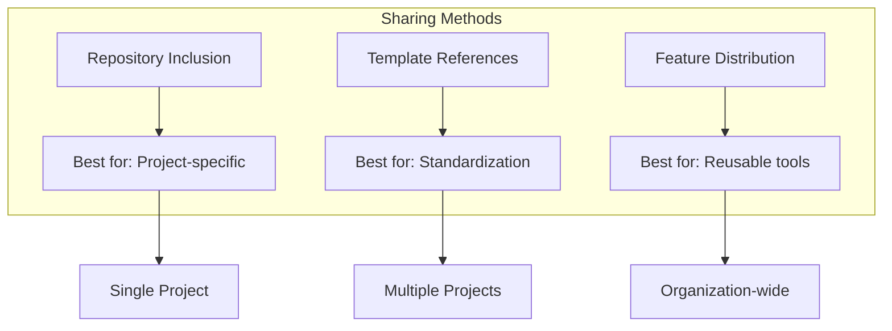
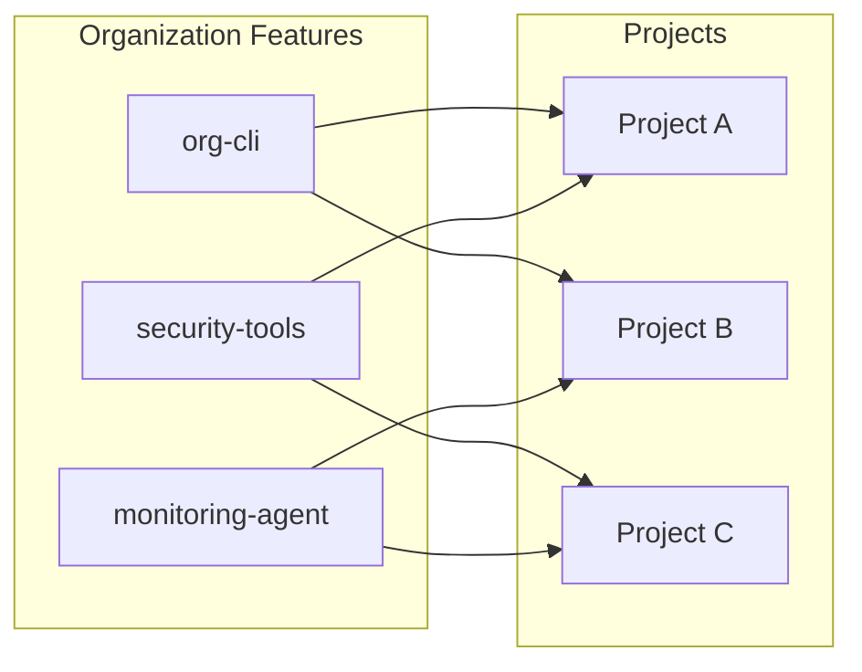
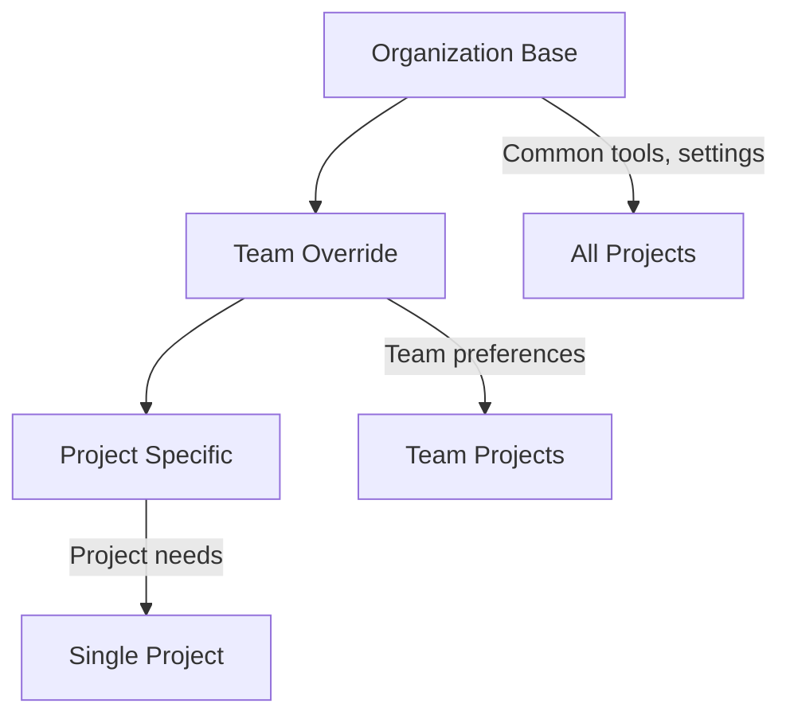

# How to Share Dev Container Configurations

Author: [nawazdhandala](https://www.github.com/nawazdhandala)

Tags: Dev Containers, Docker, VS Code, Team Collaboration, DevOps, Configuration Management

Description: Learn strategies for sharing Dev Container configurations across projects and teams, from repository-based sharing to centralized template registries.

---

You have spent hours perfecting your Dev Container setup. Your teammates are still running setup scripts that break half the time. The solution is sharing your Dev Container configuration, but doing it right requires understanding the different distribution methods and when to use each one.

## Sharing Methods Overview



## Method 1: Repository Inclusion

The simplest approach is including `.devcontainer` directly in your project repository.

### Standard Structure

```
your-project/
  .devcontainer/
    devcontainer.json
    Dockerfile
    docker-compose.yml
    scripts/
      post-create.sh
  src/
  package.json
  README.md
```

### Comprehensive devcontainer.json

```json
{
  "name": "Project Development",
  "build": {
    "dockerfile": "Dockerfile",
    "context": "..",
    "args": {
      "NODE_VERSION": "20"
    }
  },

  "features": {
    "ghcr.io/devcontainers/features/git:1": {},
    "ghcr.io/devcontainers/features/github-cli:1": {}
  },

  "customizations": {
    "vscode": {
      "extensions": [
        "dbaeumer.vscode-eslint",
        "esbenp.prettier-vscode",
        "ms-azuretools.vscode-docker"
      ],
      "settings": {
        "editor.formatOnSave": true,
        "editor.codeActionsOnSave": {
          "source.fixAll.eslint": "explicit"
        }
      }
    }
  },

  "forwardPorts": [3000, 5432],
  "postCreateCommand": ".devcontainer/scripts/post-create.sh",
  "remoteUser": "node"
}
```

### Documenting the Dev Container

Add a section to your project README for discoverability.

```markdown
## Development Environment

This project includes a Dev Container configuration for consistent development.

### Prerequisites
- Docker Desktop
- VS Code with Dev Containers extension

### Getting Started
1. Clone the repository
2. Open in VS Code
3. Click "Reopen in Container" when prompted
4. Wait for container build (first time only)

### Available Services
- Frontend: http://localhost:3000
- Database: localhost:5432

### Troubleshooting
Run `.devcontainer/scripts/reset.sh` to rebuild from scratch.
```

## Method 2: Template References

Reference shared templates from a central repository. New projects can start with a consistent base.

### Creating a Template Repository

```
org-devcontainer-templates/
  templates/
    nodejs/
      .devcontainer/
        devcontainer.json
        Dockerfile
      README.md
    python/
      .devcontainer/
        devcontainer.json
        Dockerfile
      README.md
    go/
      .devcontainer/
        devcontainer.json
      README.md
```

### Template Configuration

```json
{
  // templates/nodejs/.devcontainer/devcontainer.json
  "name": "Org Node.js Standard",
  "image": "ghcr.io/yourorg/devcontainer-nodejs:20",

  "features": {
    "ghcr.io/yourorg/devcontainer-features/org-tools:1": {},
    "ghcr.io/devcontainers/features/git:1": {}
  },

  "customizations": {
    "vscode": {
      "extensions": [
        "dbaeumer.vscode-eslint",
        "esbenp.prettier-vscode",
        "yourorg.vscode-extension"
      ],
      "settings": {
        "editor.formatOnSave": true,
        "[javascript]": {
          "editor.defaultFormatter": "esbenp.prettier-vscode"
        }
      }
    }
  },

  "containerEnv": {
    "NPM_REGISTRY": "https://npm.yourorg.com"
  },

  "remoteUser": "node"
}
```

### Using Templates in New Projects

```bash
# Clone template into new project
npx degit yourorg/devcontainer-templates/templates/nodejs/.devcontainer .devcontainer

# Or use GitHub template repository feature
gh repo create my-new-project --template yourorg/nodejs-template
```

## Method 3: Custom Features

Package reusable functionality as Dev Container Features that any project can reference.



### Feature Structure

```
org-devcontainer-features/
  src/
    org-cli/
      devcontainer-feature.json
      install.sh
    security-tools/
      devcontainer-feature.json
      install.sh
```

### devcontainer-feature.json

```json
{
  "id": "org-cli",
  "version": "1.2.0",
  "name": "Organization CLI Tools",
  "description": "Internal CLI tools and configurations",
  "documentationURL": "https://docs.yourorg.com/dev-tools",

  "options": {
    "version": {
      "type": "string",
      "default": "latest",
      "description": "CLI version to install"
    },
    "includePlugins": {
      "type": "boolean",
      "default": true,
      "description": "Install standard plugins"
    }
  },

  "installsAfter": [
    "ghcr.io/devcontainers/features/common-utils"
  ]
}
```

### install.sh

```bash
#!/bin/bash
set -e

VERSION="${VERSION:-latest}"
INCLUDE_PLUGINS="${INCLUDEPLUGINS:-true}"

echo "Installing org-cli version: $VERSION"

# Download and install CLI
curl -fsSL https://releases.yourorg.com/cli/install.sh | bash -s -- --version "$VERSION"

# Install plugins if requested
if [ "$INCLUDE_PLUGINS" = "true" ]; then
  org-cli plugin install standard-pack
fi

# Configure for development
org-cli config set environment development
org-cli config set telemetry false

echo "org-cli installed successfully"
```

### Publishing Features

```yaml
# .github/workflows/publish-features.yml
name: Publish Features

on:
  push:
    branches: [main]
    paths:
      - 'src/**'

jobs:
  publish:
    runs-on: ubuntu-latest
    steps:
      - uses: actions/checkout@v4

      - name: Publish Features
        uses: devcontainers/action@v1
        with:
          publish-features: true
          base-path-to-features: src
        env:
          GITHUB_TOKEN: ${{ secrets.GITHUB_TOKEN }}
```

### Using Custom Features

```json
{
  "features": {
    "ghcr.io/yourorg/devcontainer-features/org-cli:1": {
      "version": "2.0.0",
      "includePlugins": true
    },
    "ghcr.io/yourorg/devcontainer-features/security-tools:1": {}
  }
}
```

## Method 4: Pre-built Images

Build and publish container images with all tools pre-installed for faster startup.

### Base Image Dockerfile

```dockerfile
# Dockerfile for ghcr.io/yourorg/devcontainer-nodejs
FROM mcr.microsoft.com/devcontainers/javascript-node:20

# Organization CA certificates
COPY certs/org-ca.crt /usr/local/share/ca-certificates/
RUN update-ca-certificates

# Standard development tools
RUN npm install -g \
    typescript \
    ts-node \
    prettier \
    eslint \
    @yourorg/cli

# Security scanning tools
RUN curl -sfL https://raw.githubusercontent.com/aquasecurity/trivy/main/contrib/install.sh | sh

# Configure npm for internal registry
RUN npm config set registry https://npm.yourorg.com

# Default shell customizations
COPY .bashrc.additions /home/node/.bashrc.additions
RUN cat /home/node/.bashrc.additions >> /home/node/.bashrc
```

### Publishing Images

```yaml
# .github/workflows/publish-images.yml
name: Publish Dev Container Images

on:
  push:
    branches: [main]
  schedule:
    - cron: '0 0 * * 0'  # Weekly rebuild for security updates

jobs:
  build:
    runs-on: ubuntu-latest
    strategy:
      matrix:
        variant: [nodejs, python, go]
    steps:
      - uses: actions/checkout@v4

      - name: Login to GHCR
        uses: docker/login-action@v3
        with:
          registry: ghcr.io
          username: ${{ github.actor }}
          password: ${{ secrets.GITHUB_TOKEN }}

      - name: Build and Push
        uses: docker/build-push-action@v5
        with:
          context: ./images/${{ matrix.variant }}
          push: true
          tags: |
            ghcr.io/yourorg/devcontainer-${{ matrix.variant }}:latest
            ghcr.io/yourorg/devcontainer-${{ matrix.variant }}:${{ github.sha }}
```

### Using Pre-built Images

```json
{
  "name": "Fast Start Development",
  "image": "ghcr.io/yourorg/devcontainer-nodejs:latest",

  // Only add project-specific configuration
  "postCreateCommand": "npm install"
}
```

## Configuration Inheritance

Layer configurations for flexibility across teams.



### Base Configuration

```json
{
  // .devcontainer/base/devcontainer.json
  "name": "Org Base",
  "image": "ghcr.io/yourorg/devcontainer-base:latest",

  "features": {
    "ghcr.io/yourorg/features/org-tools:1": {}
  },

  "customizations": {
    "vscode": {
      "settings": {
        "editor.formatOnSave": true,
        "files.trimTrailingWhitespace": true
      }
    }
  }
}
```

### Team Override with Docker Compose

```yaml
# .devcontainer/docker-compose.yml
version: '3.8'

services:
  app:
    # Extend base image
    build:
      context: .
      dockerfile: Dockerfile
      args:
        BASE_IMAGE: ghcr.io/yourorg/devcontainer-base:latest

    volumes:
      - ../..:/workspace:cached

    environment:
      - TEAM=platform
```

```dockerfile
# .devcontainer/Dockerfile
ARG BASE_IMAGE
FROM ${BASE_IMAGE}

# Team-specific additions
RUN npm install -g @team/toolkit
```

### Project-Specific Layer

```json
{
  // .devcontainer/devcontainer.json
  "name": "My Project",
  "dockerComposeFile": "docker-compose.yml",
  "service": "app",
  "workspaceFolder": "/workspace",

  // Add to base extensions
  "customizations": {
    "vscode": {
      "extensions": [
        "ms-azuretools.vscode-docker"
      ]
    }
  },

  // Project-specific ports
  "forwardPorts": [3000, 8080],

  // Project setup
  "postCreateCommand": "npm install && npm run db:migrate"
}
```

## Versioning Strategies

Control updates and maintain stability.

### Semantic Versioning for Features

```json
{
  "features": {
    // Pin to major version - get minor updates
    "ghcr.io/yourorg/features/org-cli:1": {},

    // Pin to exact version - no automatic updates
    "ghcr.io/yourorg/features/security-tools:1.2.3": {},

    // Latest - always newest (risky)
    "ghcr.io/yourorg/features/experimental:latest": {}
  }
}
```

### Image Tags

```json
{
  // Use digest for reproducibility
  "image": "ghcr.io/yourorg/devcontainer:latest@sha256:abc123...",

  // Or dated tags
  "image": "ghcr.io/yourorg/devcontainer:2024-01"
}
```

### Change Documentation

```markdown
<!-- CHANGELOG.md in template repo -->
# Dev Container Changelog

## 2024-01-15
### Changed
- Updated Node.js from 18 to 20
- ESLint upgraded to v9

### Added
- Biome formatter as alternative to Prettier

### Migration
Update your devcontainer.json:
```json
{
  "image": "ghcr.io/yourorg/devcontainer:2024-01"
}
```
```

## Access Control

Manage who can use and modify configurations.

### GitHub Container Registry Visibility

```yaml
# In your repository settings or package settings
# Options: public, private, internal (org only)

# .github/workflows/publish.yml
- name: Set package visibility
  run: |
    gh api \
      --method PUT \
      /orgs/yourorg/packages/container/devcontainer-nodejs/visibility \
      -f visibility='internal'
```

### Feature Repository Access

```json
{
  "features": {
    // Public features - anyone can use
    "ghcr.io/devcontainers/features/git:1": {},

    // Private features - need authentication
    "ghcr.io/yourorg/private-features/internal-tools:1": {}
  }
}
```

### Authentication for Private Features

```bash
# Developers need to authenticate once
docker login ghcr.io -u USERNAME -p GITHUB_TOKEN

# Or use credential helper
gh auth setup-git
```

## Testing Shared Configurations

Validate configurations before distribution.

### CI Pipeline for Templates

```yaml
# .github/workflows/test-templates.yml
name: Test Templates

on:
  pull_request:
    paths:
      - 'templates/**'

jobs:
  test:
    runs-on: ubuntu-latest
    strategy:
      matrix:
        template: [nodejs, python, go]
    steps:
      - uses: actions/checkout@v4

      - name: Build Dev Container
        uses: devcontainers/ci@v0.3
        with:
          subFolder: templates/${{ matrix.template }}
          runCmd: |
            echo "Container built successfully"
            # Run template-specific tests
            if [ -f test.sh ]; then ./test.sh; fi
```

### Local Testing Script

```bash
#!/bin/bash
# test-devcontainer.sh

set -e

TEMPLATE_DIR=$1

echo "Testing template: $TEMPLATE_DIR"

# Build the container
devcontainer build --workspace-folder "$TEMPLATE_DIR"

# Start the container
devcontainer up --workspace-folder "$TEMPLATE_DIR"

# Run validation commands
devcontainer exec --workspace-folder "$TEMPLATE_DIR" bash -c '
  echo "Checking required tools..."
  command -v git || exit 1
  command -v node || exit 1
  echo "All checks passed!"
'

# Cleanup
devcontainer down --workspace-folder "$TEMPLATE_DIR"

echo "Template $TEMPLATE_DIR passed all tests"
```

---

Sharing Dev Container configurations eliminates the "works on my machine" problem at the organizational level. Start by including configurations in project repositories for immediate benefit. As patterns emerge, extract common elements into templates and features. Publish pre-built images to speed up container startup times. With proper versioning and access control, your entire organization can develop in consistent, reproducible environments while still allowing teams the flexibility to add project-specific customizations.
